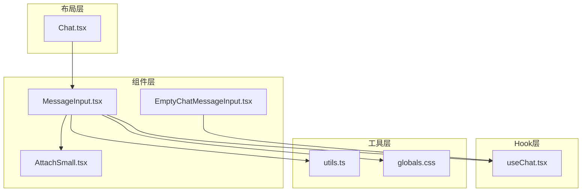
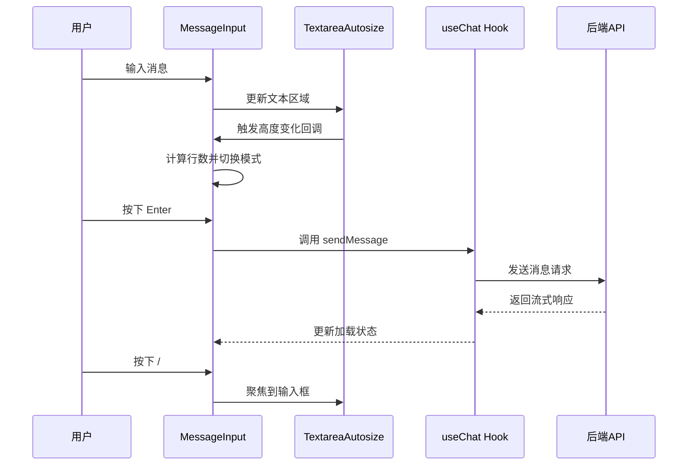
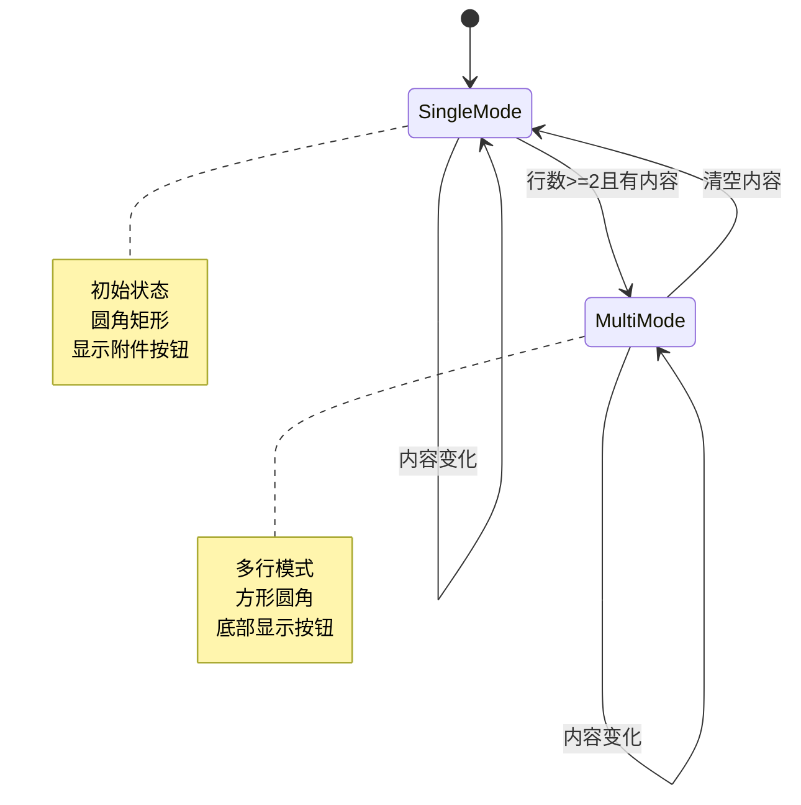
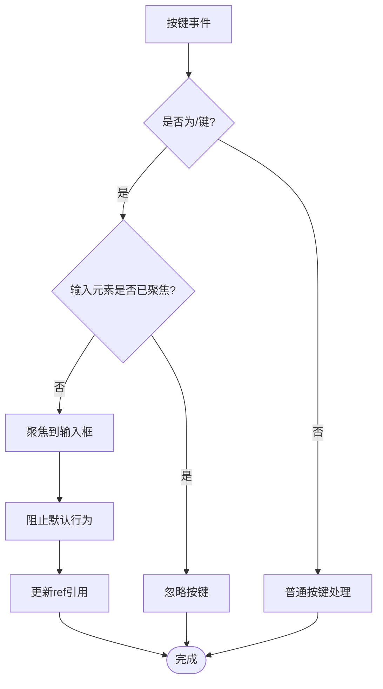
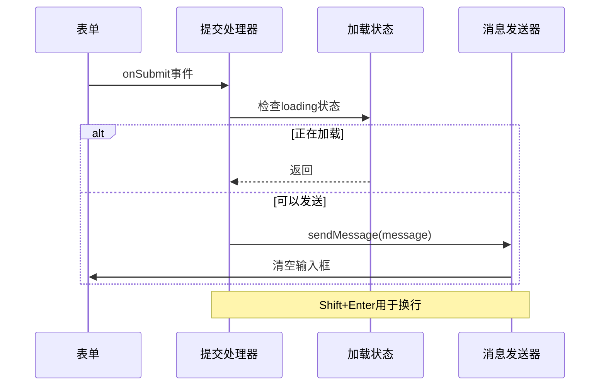
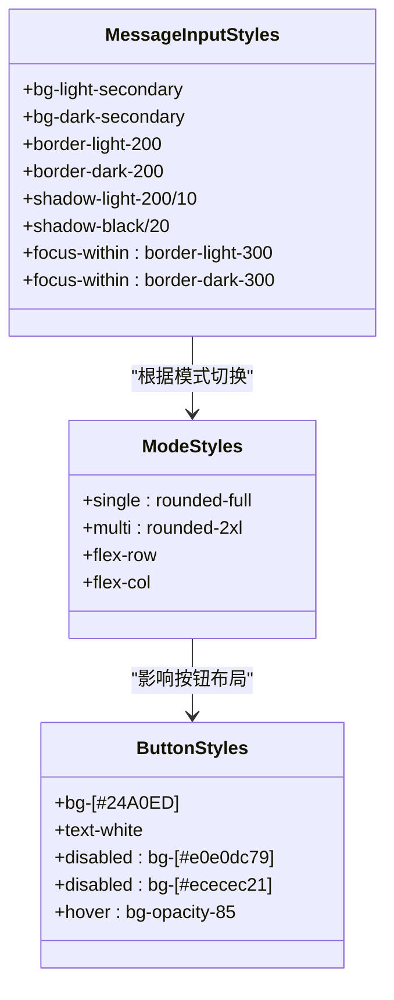
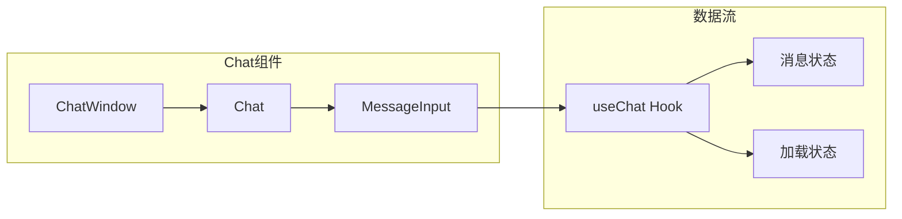
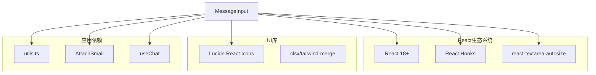
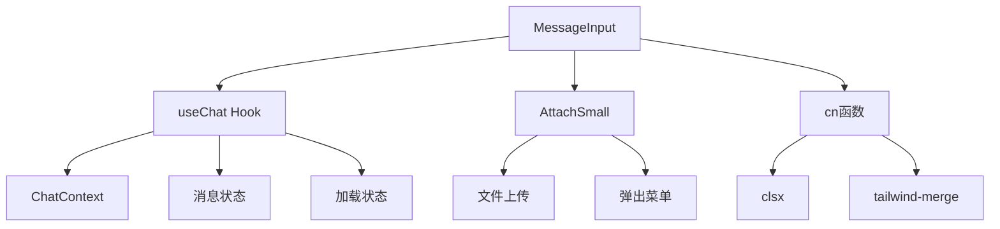

# 主消息输入框

<cite>
**本文档引用的文件**
- [MessageInput.tsx](file://src/components/MessageInput.tsx)
- [useChat.tsx](file://src/lib/hooks/useChat.tsx)
- [AttachSmall.tsx](file://src/components/MessageInputActions/AttachSmall.tsx)
- [utils.ts](file://src/lib/utils.ts)
- [globals.css](file://src/app/globals.css)
- [Chat.tsx](file://src/components/Chat.tsx)
- [EmptyChatMessageInput.tsx](file://src/components/EmptyChatMessageInput.tsx)
</cite>

## 目录
1. [简介](#简介)
2. [项目结构](#项目结构)
3. [核心组件](#核心组件)
4. [架构概览](#架构概览)
5. [详细组件分析](#详细组件分析)
6. [依赖关系分析](#依赖关系分析)
7. [性能考虑](#性能考虑)
8. [故障排除指南](#故障排除指南)
9. [结论](#结论)
10. [附录](#附录)

## 简介

主消息输入框（MessageInput）是 Perplexica 应用中的核心交互组件，负责处理用户的消息输入、自动调整高度、多行与单行模式切换、键盘快捷键处理以及加载状态管理。该组件提供了流畅的用户体验，支持智能的文本区域扩展，并集成了文件附件功能。

## 项目结构

MessageInput 组件位于应用的组件目录中，采用模块化设计，与其他组件协同工作：



**图表来源**
- [MessageInput.tsx](file://src/components/MessageInput.tsx#L1-L103)
- [useChat.tsx](file://src/lib/hooks/useChat.tsx#L1-L848)
- [AttachSmall.tsx](file://src/components/MessageInputActions/AttachSmall.tsx#L1-L159)

**章节来源**
- [MessageInput.tsx](file://src/components/MessageInput.tsx#L1-L103)
- [Chat.tsx](file://src/components/Chat.tsx#L66-L108)

## 核心组件

MessageInput 组件实现了以下核心功能：

### 自动调整高度的文本区域
- 使用 `react-textarea-autosize` 实现智能高度调整
- 支持最大高度限制（sm: 24, lg: 36, xl: 48）
- 基于行高计算动态调整文本区域大小

### 多行与单行模式切换
- 初始模式为单行（rounded-full）
- 当文本超过一行时自动切换到多行模式（rounded-2xl）
- 基于行数计算和消息状态进行智能切换

### 键盘快捷键处理
- `/` 键：在任何元素未聚焦时自动聚焦到输入框
- `Enter` 键：发送消息（Shift+Enter 用于换行）
- 防止重复提交和无效操作

### 加载状态管理
- 集成全局加载状态（loading）
- 按钮禁用状态与消息内容和加载状态同步
- 提供视觉反馈和用户体验优化

**章节来源**
- [MessageInput.tsx](file://src/components/MessageInput.tsx#L8-L103)

## 架构概览

MessageInput 组件采用 React Hooks 和 Context API 的现代架构设计：



**图表来源**
- [MessageInput.tsx](file://src/components/MessageInput.tsx#L26-L46)
- [useChat.tsx](file://src/lib/hooks/useChat.tsx#L714-L806)

## 详细组件分析

### 状态管理系统

MessageInput 组件维护以下关键状态：



**图表来源**
- [MessageInput.tsx](file://src/components/MessageInput.tsx#L16-L22)

#### 状态定义与初始化

组件使用四个主要状态变量：
- `message`: 当前输入的消息内容
- `textareaRows`: 文本区域的当前行数
- `mode`: 当前模式（single/multi）
- `copilotEnabled`: Copilot 功能开关（预留状态）

#### 行数计算算法

```mermaid
flowchart TD
Start([开始计算]) --> GetHeight[获取当前高度]
GetHeight --> GetRowHeight[获取行高]
GetRowHeight --> CalcRows[计算行数<br/>Math.ceil(height/rowHeight)]
CalcRows --> CheckMode{检查模式}
CheckMode --> |单行模式| CheckThreshold{行数>=2且有内容?}
CheckMode --> |多行模式| CheckEmpty{内容为空?}
CheckThreshold --> |是| SetMulti[设置为多行模式]
CheckThreshold --> |否| StaySingle[保持单行模式]
CheckEmpty --> |是| SetSingle[设置为单行模式]
CheckEmpty --> |否| StayMulti[保持多行模式]
SetMulti --> End([结束])
StaySingle --> End
SetSingle --> End
StayMulti --> End
```

**图表来源**
- [MessageInput.tsx](file://src/components/MessageInput.tsx#L16-L22)
- [MessageInput.tsx](file://src/components/MessageInput.tsx#L73-L75)

### 事件处理机制

#### 键盘事件处理



**图表来源**
- [MessageInput.tsx](file://src/components/MessageInput.tsx#L26-L46)

#### 表单提交处理



**图表来源**
- [MessageInput.tsx](file://src/components/MessageInput.tsx#L49-L62)

### 样式系统与主题适配

MessageInput 组件采用 Tailwind CSS 和暗色/亮色主题支持：

#### 主题类系统



**图表来源**
- [MessageInput.tsx](file://src/components/MessageInput.tsx#L63-L66)
- [MessageInput.tsx](file://src/components/MessageInput.tsx#L80-L96)

#### 响应式设计

组件支持多种屏幕尺寸的自适应设计：
- 移动端：紧凑布局，圆形边角
- 桌面端：扩展布局，方形边角
- 大屏设备：最大高度限制（xl: 48）

### 组件集成与使用

#### 在聊天界面中的集成



**图表来源**
- [Chat.tsx](file://src/components/Chat.tsx#L101)
- [useChat.tsx](file://src/lib/hooks/useChat.tsx#L808-L842)

**章节来源**
- [MessageInput.tsx](file://src/components/MessageInput.tsx#L1-L103)
- [Chat.tsx](file://src/components/Chat.tsx#L66-L108)

## 依赖关系分析

### 外部依赖

MessageInput 组件依赖以下外部库：



**图表来源**
- [MessageInput.tsx](file://src/components/MessageInput.tsx#L1-L6)
- [utils.ts](file://src/lib/utils.ts#L1-L4)

### 内部依赖关系



**图表来源**
- [MessageInput.tsx](file://src/components/MessageInput.tsx#L1-L6)
- [useChat.tsx](file://src/lib/hooks/useChat.tsx#L241-L268)

**章节来源**
- [MessageInput.tsx](file://src/components/MessageInput.tsx#L1-L103)
- [useChat.tsx](file://src/lib/hooks/useChat.tsx#L1-L848)

## 性能考虑

### 优化策略

1. **状态最小化**：仅维护必要的状态变量，避免不必要的重渲染
2. **事件节流**：键盘事件处理使用防抖机制
3. **条件渲染**：根据模式动态渲染不同的UI元素
4. **内存管理**：正确清理键盘事件监听器

### 性能监控

组件在开发环境中会输出调试信息：
- 状态变化日志
- 模式切换记录
- 键盘事件处理统计

## 故障排除指南

### 常见问题及解决方案

#### 文本区域无法自动调整高度

**症状**：文本区域固定高度，不随内容变化

**可能原因**：
- `react-textarea-autosize` 未正确安装
- 样式冲突导致高度计算异常
- 浏览器兼容性问题

**解决方案**：
1. 检查依赖安装状态
2. 验证样式优先级
3. 测试不同浏览器兼容性

#### 模式切换不生效

**症状**：文本区域不会从单行切换到多行

**可能原因**：
- 行数计算逻辑错误
- 状态更新时机问题
- 条件判断逻辑异常

**解决方案**：
1. 检查 `onHeightChange` 回调
2. 验证 `textareaRows` 状态更新
3. 确认模式切换条件

#### 键盘快捷键失效

**症状**：`/` 键和 `Enter` 键无法正常工作

**可能原因**：
- 事件监听器未正确绑定
- 元素焦点状态检测错误
- 事件冒泡问题

**解决方案**：
1. 检查 `useEffect` 中的事件绑定
2. 验证 `activeElement` 检测逻辑
3. 确认事件监听器的清理

**章节来源**
- [MessageInput.tsx](file://src/components/MessageInput.tsx#L26-L46)
- [MessageInput.tsx](file://src/components/MessageInput.tsx#L73-L75)

## 结论

MessageInput 组件是一个功能完整、设计精良的消息输入组件，具备以下特点：

1. **智能化的用户体验**：自动调整高度、智能模式切换、便捷的键盘快捷键
2. **现代化的技术架构**：基于 React Hooks 和 Context API，良好的状态管理
3. **优秀的可维护性**：清晰的代码结构、完善的类型定义、模块化的组件设计
4. **全面的主题支持**：完整的暗色/亮色主题适配，响应式设计

该组件为 Perplexica 应用提供了稳定可靠的消息输入功能，是聊天界面的重要组成部分。

## 附录

### 最佳实践建议

1. **代码组织**：保持组件职责单一，避免过度复杂化
2. **状态管理**：合理使用 React Hooks，避免不必要的状态提升
3. **性能优化**：使用 `useMemo` 和 `useCallback` 优化昂贵计算
4. **可访问性**：确保键盘导航和屏幕阅读器支持
5. **测试覆盖**：为关键功能编写单元测试和集成测试

### 扩展功能建议

1. **撤销/重做功能**：添加消息历史管理
2. **草稿保存**：本地存储未完成的消息
3. **表情符号支持**：集成表情符号选择器
4. **文件预览**：增强文件附件的预览功能
5. **实时协作**：支持多人同时编辑