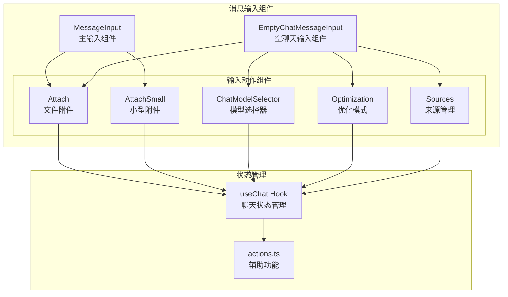
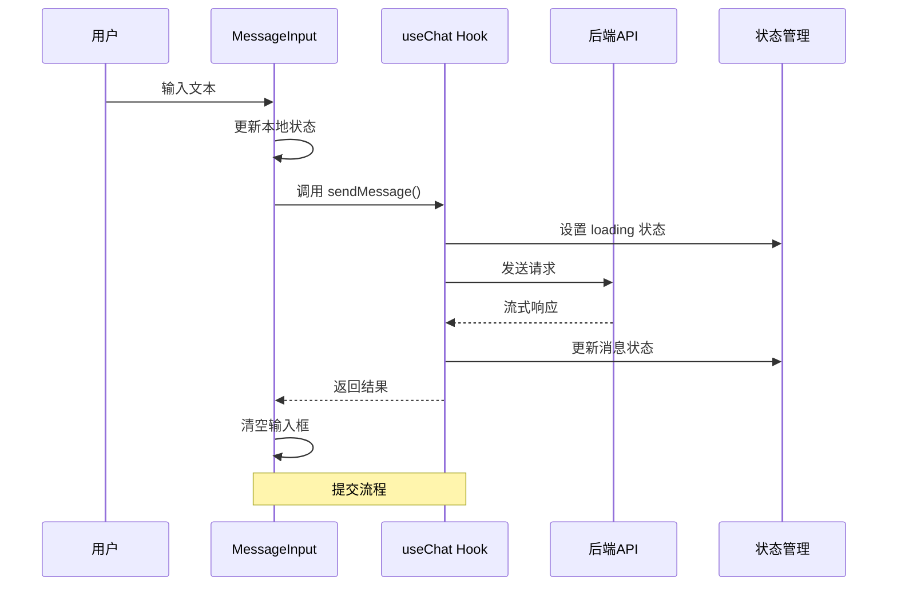
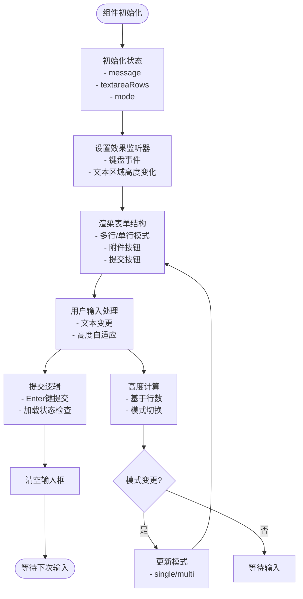
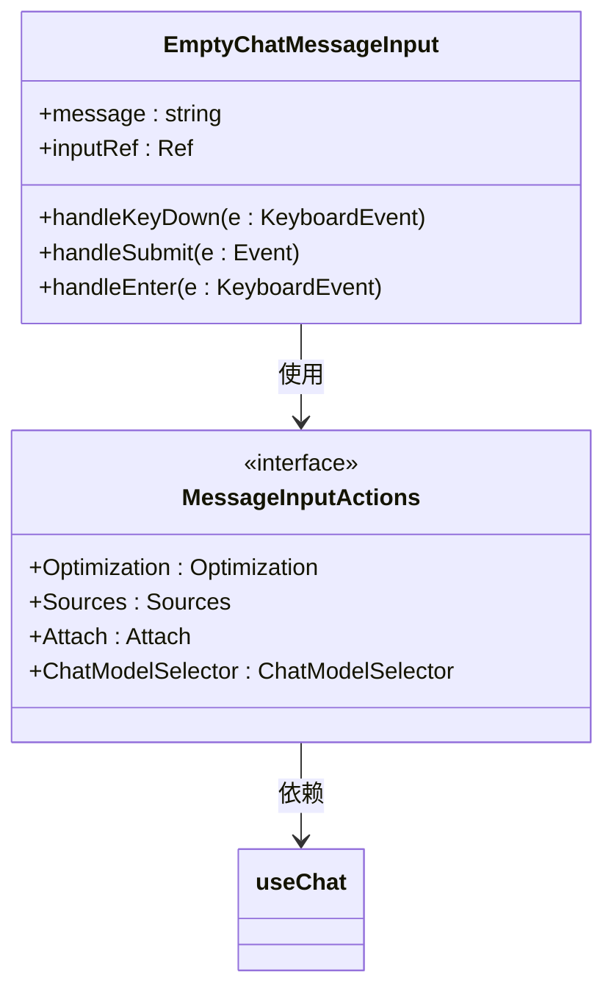
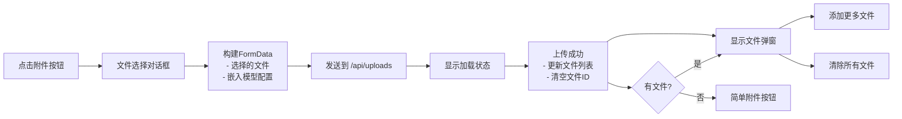
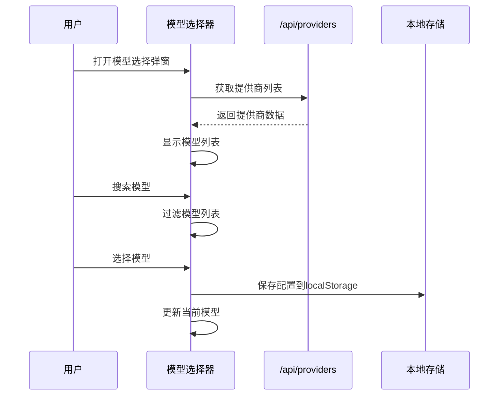
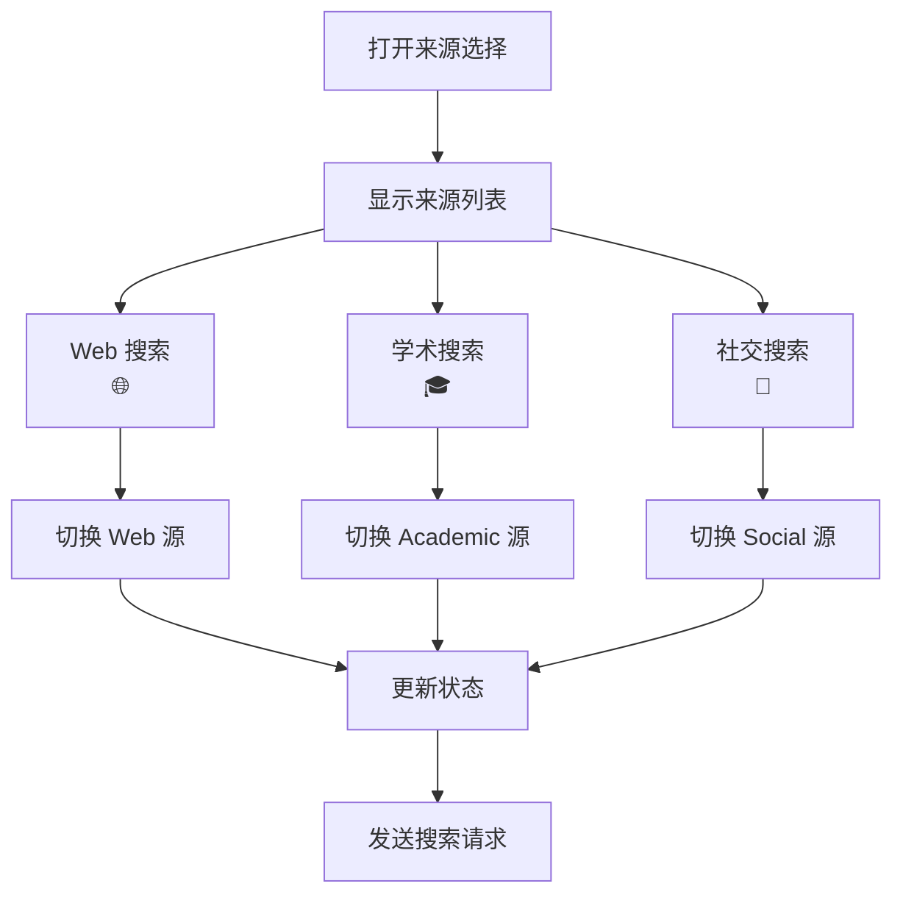
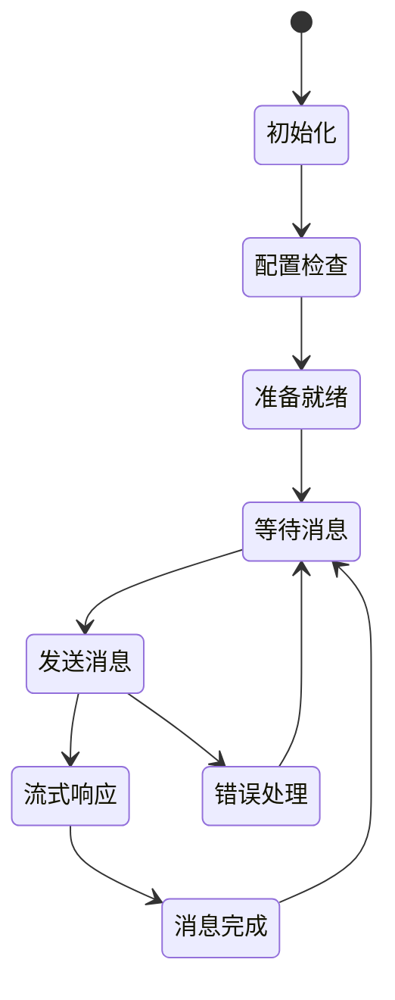
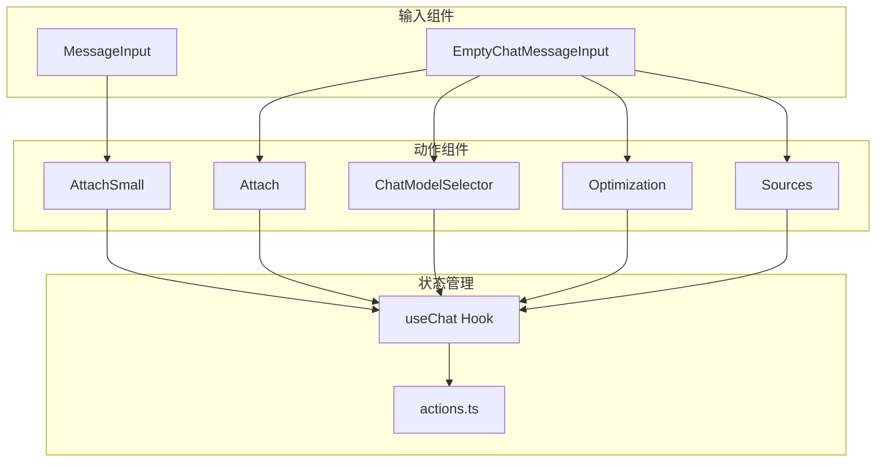

# 消息输入组件

<cite>
**本文档引用的文件**
- [MessageInput.tsx](file://src/components/MessageInput.tsx)
- [EmptyChatMessageInput.tsx](file://src/components/EmptyChatMessageInput.tsx)
- [Attach.tsx](file://src/components/MessageInputActions/Attach.tsx)
- [AttachSmall.tsx](file://src/components/MessageInputActions/AttachSmall.tsx)
- [ChatModelSelector.tsx](file://src/components/MessageInputActions/ChatModelSelector.tsx)
- [Optimization.tsx](file://src/components/MessageInputActions/Optimization.tsx)
- [Sources.tsx](file://src/components/MessageInputActions/Sources.tsx)
- [useChat.tsx](file://src/lib/hooks/useChat.tsx)
- [actions.ts](file://src/lib/actions.ts)
- [layout.tsx](file://src/app/layout.tsx)
- [globals.css](file://src/app/globals.css)
- [tailwind.config.ts](file://src/tailwind.config.ts)
</cite>

## 目录
1. [简介](#简介)
2. [项目结构](#项目结构)
3. [核心组件](#核心组件)
4. [架构概览](#架构概览)
5. [详细组件分析](#详细组件分析)
6. [依赖关系分析](#依赖关系分析)
7. [性能考虑](#性能考虑)
8. [故障排除指南](#故障排除指南)
9. [结论](#结论)

## 简介
本文档深入介绍了 Perplexica 项目中的消息输入相关组件，包括 MessageInput 和 EmptyChatMessageInput 两个核心输入组件，以及它们的子组件 MessageInputActions。这些组件提供了完整的消息输入体验，包括文本输入、快捷键支持、文件附件上传、模型选择、优化选项和来源管理等功能。

## 项目结构
消息输入组件位于 `src/components` 目录下，采用模块化设计，将输入功能分解为独立的可复用组件：

**图表来源**
- [MessageInput.tsx](file://src/components/MessageInput.tsx#L1-L103)
- [EmptyChatMessageInput.tsx](file://src/components/EmptyChatMessageInput.tsx#L1-L89)
- [Attach.tsx](file://src/components/MessageInputActions/Attach.tsx#L1-L170)
- [ChatModelSelector.tsx](file://src/components/MessageInputActions/ChatModelSelector.tsx#L1-L204)

**章节来源**
- [MessageInput.tsx](file://src/components/MessageInput.tsx#L1-L103)
- [EmptyChatMessageInput.tsx](file://src/components/EmptyChatMessageInput.tsx#L1-L89)

## 核心组件
消息输入系统由两个主要组件构成：MessageInput（用于现有聊天）和 EmptyChatMessageInput（用于新聊天或空状态）。

### MessageInput 组件
MessageInput 是聊天界面中的主要输入组件，提供智能的多行输入支持和快捷键处理：

- **自适应布局**：根据输入内容自动在单行和多行模式间切换
- **智能高度调整**：使用 TextareaAutosize 实现动态高度调整
- **快捷键支持**：支持 "/" 键快速聚焦输入框
- **提交逻辑**：支持 Enter 键提交，Shift+Enter 进行换行
- **加载状态管理**：防止重复提交

### EmptyChatMessageInput 组件
EmptyChatMessageInput 专为空聊天状态设计，提供完整的配置选项：

- **完整配置面板**：包含优化模式、模型选择、文件附件等所有配置选项
- **自动焦点管理**：页面加载时自动聚焦到输入框
- **简洁的提交界面**：提供清晰的提交按钮和配置选项
- **响应式设计**：适配不同屏幕尺寸

**章节来源**
- [MessageInput.tsx](file://src/components/MessageInput.tsx#L8-L103)
- [EmptyChatMessageInput.tsx](file://src/components/EmptyChatMessageInput.tsx#L10-L89)

## 架构概览
消息输入组件采用分层架构设计，通过 useChat Hook 实现状态共享和数据流管理：

**图表来源**
- [MessageInput.tsx](file://src/components/MessageInput.tsx#L49-L62)
- [useChat.tsx](file://src/lib/hooks/useChat.tsx#L714-L806)

**章节来源**
- [useChat.tsx](file://src/lib/hooks/useChat.tsx#L31-L62)
- [layout.tsx](file://src/app/layout.tsx#L35-L55)

## 详细组件分析

### MessageInput 组件深度分析

MessageInput 组件实现了智能的输入处理机制：

**图表来源**
- [MessageInput.tsx](file://src/components/MessageInput.tsx#L16-L22)
- [MessageInput.tsx](file://src/components/MessageInput.tsx#L69-L78)

#### 快捷键支持机制
组件实现了全局快捷键监听，提供无缝的键盘导航体验：

- **"/" 键支持**：当焦点不在输入元素时，按下 "/" 自动聚焦到输入框
- **Enter 键提交**：标准的 Enter 键提交行为，Shift+Enter 进行换行
- **加载状态保护**：防止在请求进行时重复提交

#### 文本输入处理
- **实时状态管理**：使用 useState 管理输入内容
- **高度自适应**：通过 onHeightChange 回调实现动态高度调整
- **占位符提示**：提供上下文相关的输入提示

**章节来源**
- [MessageInput.tsx](file://src/components/MessageInput.tsx#L26-L46)
- [MessageInput.tsx](file://src/components/MessageInput.tsx#L72-L75)

### EmptyChatMessageInput 组件分析

EmptyChatMessageInput 专为空聊天状态设计，提供完整的配置选项面板：

**图表来源**
- [EmptyChatMessageInput.tsx](file://src/components/EmptyChatMessageInput.tsx#L10-L89)

#### 空状态特殊处理
- **自动焦点**：组件挂载时自动聚焦到输入框
- **完整配置**：提供所有必要的配置选项
- **简化布局**：专注于核心输入功能

**章节来源**
- [EmptyChatMessageInput.tsx](file://src/components/EmptyChatMessageInput.tsx#L18-L40)
- [EmptyChatMessageInput.tsx](file://src/components/EmptyChatMessageInput.tsx#L58-L84)

### MessageInputActions 子组件详解

#### 文件附件上传组件 (Attach/AttachSmall)
这两个组件提供了相似但略有不同的文件上传功能：

**图表来源**
- [Attach.tsx](file://src/components/MessageInputActions/Attach.tsx#L28-L54)
- [AttachSmall.tsx](file://src/components/MessageInputActions/AttachSmall.tsx#L19-L45)

##### 功能特性
- **批量文件上传**：支持同时选择多个文件
- **嵌入模型集成**：自动附加嵌入模型配置信息
- **文件管理**：提供文件列表显示和管理功能
- **加载状态反馈**：上传过程中的视觉反馈

##### 支持的文件格式
- PDF 文档
- DOCX 文档  
- TXT 文本文件

**章节来源**
- [Attach.tsx](file://src/components/MessageInputActions/Attach.tsx#L28-L54)
- [AttachSmall.tsx](file://src/components/MessageInputActions/AttachSmall.tsx#L19-L45)

#### 模型选择器组件 (ChatModelSelector)
模型选择器提供了智能的模型配置功能：

**图表来源**
- [ChatModelSelector.tsx](file://src/components/MessageInputActions/ChatModelSelector.tsx#L18-L38)
- [ChatModelSelector.tsx](file://src/components/MessageInputActions/ChatModelSelector.tsx#L59-L63)

##### 核心功能
- **动态提供商加载**：从 /api/providers 获取可用模型
- **智能排序**：当前选中模型优先显示
- **搜索过滤**：支持按模型名称和提供商名称搜索
- **配置持久化**：自动保存到 localStorage

##### 优化模式管理
组件维护以下优化模式配置：

| 模式 | 描述 | 图标 |
|------|------|------|
| speed | 优先速度，获得最快可能的答案 | ⚡️ |
| balanced | 在速度和准确性之间找到平衡 | 🔄 |
| quality | 获得最全面和准确的答案 | ✨ |

**章节来源**
- [ChatModelSelector.tsx](file://src/components/MessageInputActions/ChatModelSelector.tsx#L18-L38)
- [ChatModelSelector.tsx](file://src/components/MessageInputActions/ChatModelSelector.tsx#L13-L37)

#### 来源管理组件 (Sources)
来源管理组件允许用户控制搜索来源：

**图表来源**
- [Sources.tsx](file://src/components/MessageInputActions/Sources.tsx#L15-L31)

##### 支持的搜索来源
- **Web**：通用网络搜索
- **Academic**：学术论文和研究
- **Discussions**：社交讨论和论坛

**章节来源**
- [Sources.tsx](file://src/components/MessageInputActions/Sources.tsx#L33-L94)

### 状态管理与事件处理

#### useChat Hook 状态管理
useChat Hook 提供了完整的聊天状态管理：

**图表来源**
- [useChat.tsx](file://src/lib/hooks/useChat.tsx#L270-L842)

#### 事件处理机制
组件采用了多层次的事件处理机制：

1. **本地事件处理**：组件内部的状态更新和 UI 交互
2. **全局键盘事件**：文档级别的快捷键支持
3. **状态同步**：通过 useChat Hook 实现跨组件状态共享
4. **流式响应**：后端的实时数据流处理

**章节来源**
- [useChat.tsx](file://src/lib/hooks/useChat.tsx#L550-L806)

## 依赖关系分析

### 组件依赖图
消息输入组件之间的依赖关系如下：

**图表来源**
- [MessageInput.tsx](file://src/components/MessageInput.tsx#L1-L6)
- [EmptyChatMessageInput.tsx](file://src/components/EmptyChatMessageInput.tsx#L1-L8)

### 外部依赖
组件依赖的主要外部库和工具：

- **Lucide React**：图标库，提供统一的视觉元素
- **Headless UI**：无样式 UI 组件库，提供可访问性友好的组件
- **Framer Motion**：动画库，提供流畅的过渡效果
- **React Textarea Autosize**：文本区域自适应高度库

**章节来源**
- [Attach.tsx](file://src/components/MessageInputActions/Attach.tsx#L1-L21)
- [ChatModelSelector.tsx](file://src/components/MessageInputActions/ChatModelSelector.tsx#L1-L9)

## 性能考虑
消息输入组件在设计时充分考虑了性能优化：

### 渲染优化
- **条件渲染**：根据模式和状态动态渲染组件
- **懒加载**：弹窗组件仅在需要时加载
- **虚拟滚动**：长列表使用虚拟滚动优化

### 网络优化
- **流式传输**：后端使用流式响应减少延迟
- **缓存策略**：提供商配置信息本地缓存
- **防抖处理**：搜索和过滤操作的防抖优化

### 内存管理
- **引用清理**：及时清理事件监听器和定时器
- **状态最小化**：只存储必要的状态信息
- **垃圾回收**：避免内存泄漏的资源管理

## 故障排除指南

### 常见问题诊断
1. **输入框无法聚焦**
   - 检查全局键盘事件是否正确绑定
   - 验证焦点管理逻辑

2. **文件上传失败**
   - 检查 /api/uploads 端点状态
   - 验证文件大小和格式限制

3. **模型选择器无响应**
   - 确认 /api/providers 端点可用性
   - 检查网络连接状态

### 调试建议
- 使用浏览器开发者工具监控网络请求
- 检查控制台错误日志
- 验证状态更新的时序关系

**章节来源**
- [useChat.tsx](file://src/lib/hooks/useChat.tsx#L554-L565)

## 结论
消息输入组件系统展现了现代 React 应用的最佳实践，通过模块化设计、状态管理和事件处理实现了完整的用户输入体验。组件架构清晰，功能丰富，同时保持了良好的性能和可维护性。通过 useChat Hook 的状态管理，各个输入组件能够高效协作，为用户提供流畅的消息输入体验。