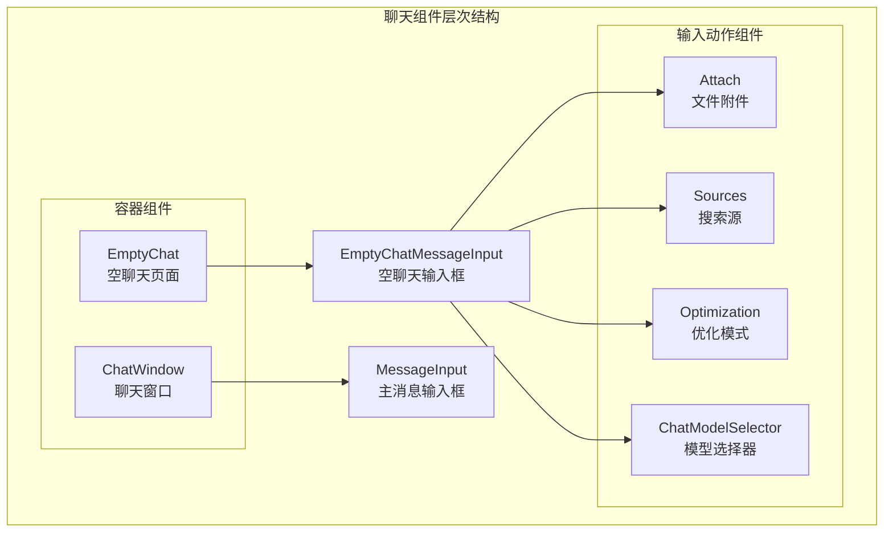
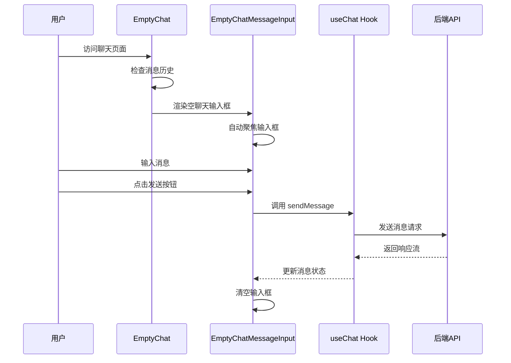
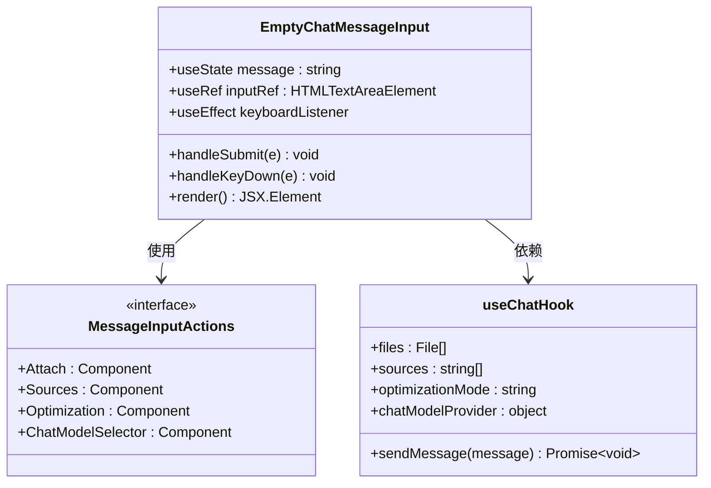
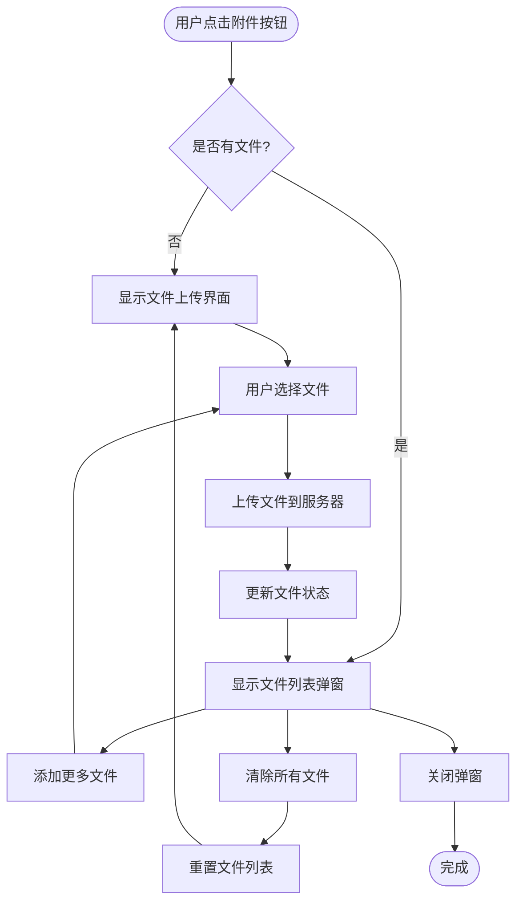
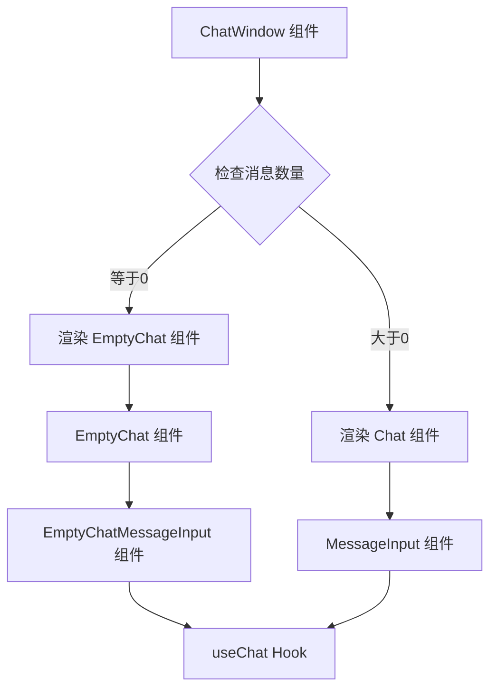
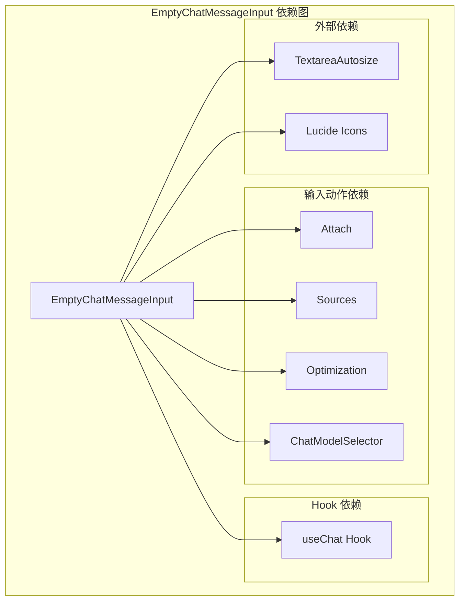
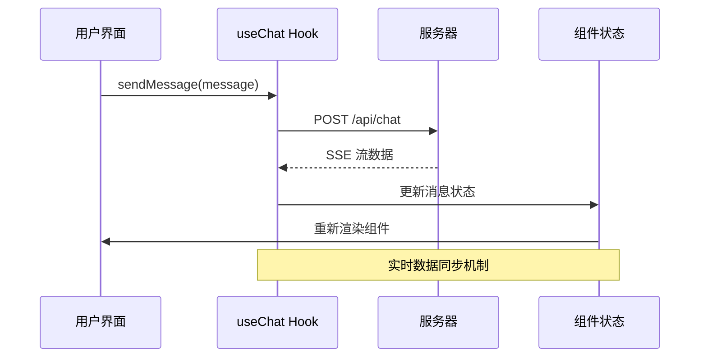

# 空聊天输入框

<cite>
**本文档引用的文件**
- [src/components/EmptyChatMessageInput.tsx](file://src/components/EmptyChatMessageInput.tsx)
- [src/components/EmptyChat.tsx](file://src/components/EmptyChat.tsx)
- [src/components/MessageInput.tsx](file://src/components/MessageInput.tsx)
- [src/components/ChatWindow.tsx](file://src/components/ChatWindow.tsx)
- [src/components/MessageInputActions/Attach.tsx](file://src/components/MessageInputActions/Attach.tsx)
- [src/components/MessageInputActions/Sources.tsx](file://src/components/MessageInputActions/Sources.tsx)
- [src/components/MessageInputActions/Optimization.tsx](file://src/components/MessageInputActions/Optimization.tsx)
- [src/components/MessageInputActions/ChatModelSelector.tsx](file://src/components/MessageInputActions/ChatModelSelector.tsx)
- [src/lib/hooks/useChat.tsx](file://src/lib/hooks/useChat.tsx)
- [src/app/c/[chatId]/page.tsx](file://src/app/c/[chatId]/page.tsx)
- [src/app/globals.css](file://src/app/globals.css)
</cite>

## 目录
1. [简介](#简介)
2. [项目结构](#项目结构)
3. [核心组件](#核心组件)
4. [架构概览](#架构概览)
5. [详细组件分析](#详细组件分析)
6. [依赖关系分析](#依赖关系分析)
7. [性能考虑](#性能考虑)
8. [故障排除指南](#故障排除指南)
9. [结论](#结论)

## 简介

EmptyChatMessageInput 是 Perplexica 应用中的一个专门组件，用于处理没有历史记录时的聊天消息输入场景。该组件在用户首次进入聊天界面或聊天历史为空时显示，提供简化的输入体验，与主消息输入框（MessageInput）形成差异化设计。

该组件的核心特点包括：
- 专为空聊天场景设计的简化布局
- 集成多种输入辅助功能（文件附件、搜索源、模型选择等）
- 自动焦点管理和键盘快捷键支持
- 与主消息输入框的差异化样式设计

## 项目结构

EmptyChatMessageInput 组件位于组件目录中，与其它聊天相关组件共同构成完整的聊天界面生态系统：

**图表来源**
- [src/components/EmptyChatMessageInput.tsx](file://src/components/EmptyChatMessageInput.tsx#L1-L89)
- [src/components/EmptyChat.tsx](file://src/components/EmptyChat.tsx#L1-L76)
- [src/components/MessageInput.tsx](file://src/components/MessageInput.tsx#L1-L103)

**章节来源**
- [src/components/EmptyChatMessageInput.tsx](file://src/components/EmptyChatMessageInput.tsx#L1-L89)
- [src/components/EmptyChat.tsx](file://src/components/EmptyChat.tsx#L1-L76)
- [src/components/MessageInput.tsx](file://src/components/MessageInput.tsx#L1-L103)

## 核心组件

EmptyChatMessageInput 组件是专门为无历史记录场景设计的消息输入组件，具有以下核心特性：

### 主要功能特性
- **自动焦点管理**：组件挂载时自动聚焦到输入框
- **键盘快捷键支持**：支持 "/" 键快速激活输入
- **简化布局设计**：采用圆角矩形背景和内边距设计
- **集成输入辅助**：包含文件附件、搜索源、模型选择等功能
- **禁用状态控制**：当输入为空时发送按钮禁用

### 样式设计特点
- 使用浅色和深色主题的二级背景色
- 圆角矩形设计，提供柔和的视觉效果
- 内边距和外边距的精心调整
- 边框和阴影效果增强层次感

**章节来源**
- [src/components/EmptyChatMessageInput.tsx](file://src/components/EmptyChatMessageInput.tsx#L10-L89)

## 架构概览

EmptyChatMessageInput 在整个聊天系统中的位置和作用：

**图表来源**
- [src/components/EmptyChat.tsx](file://src/components/EmptyChat.tsx#L36-L73)
- [src/components/EmptyChatMessageInput.tsx](file://src/components/EmptyChatMessageInput.tsx#L42-L85)
- [src/lib/hooks/useChat.tsx](file://src/lib/hooks/useChat.tsx#L714-L800)

## 详细组件分析

### EmptyChatMessageInput 组件详解

#### 组件结构分析

**图表来源**
- [src/components/EmptyChatMessageInput.tsx](file://src/components/EmptyChatMessageInput.tsx#L10-L89)
- [src/lib/hooks/useChat.tsx](file://src/lib/hooks/useChat.tsx#L54-L62)

#### 关键实现细节

**键盘事件处理机制**：
- 监听全局键盘事件，检测 "/" 键按下
- 检查当前是否有输入元素获得焦点
- 自动聚焦到输入框，提供无缝的键盘导航体验

**表单提交逻辑**：
- 支持标准表单提交和 Enter 键提交
- 防止重复提交和空消息发送
- 提交后清空输入内容

**样式系统集成**：
- 使用 Tailwind CSS 类名系统
- 支持深色和浅色主题切换
- 响应式设计适配不同屏幕尺寸

#### 与主消息输入框的差异化设计

| 特性 | EmptyChatMessageInput | MessageInput |
|------|----------------------|--------------|
| **布局** | 圆角矩形背景，内边距设计 | 圆形输入框，动态高度调整 |
| **功能** | 集成完整输入辅助功能 | 简化输入辅助功能 |
| **触发方式** | 自动聚焦，键盘快捷键 | 点击或 Tab 切换 |
| **样式** | 大号字体，强调占位符 | 小号字体，简洁设计 |
| **使用场景** | 新聊天开始，无历史记录 | 聊天进行中 |

**章节来源**
- [src/components/EmptyChatMessageInput.tsx](file://src/components/EmptyChatMessageInput.tsx#L18-L85)
- [src/components/MessageInput.tsx](file://src/components/MessageInput.tsx#L16-L99)

### 输入辅助组件分析

#### 文件附件组件（Attach）

文件附件组件提供了完整的文件上传和管理功能：

**图表来源**
- [src/components/MessageInputActions/Attach.tsx](file://src/components/MessageInputActions/Attach.tsx#L28-L54)

#### 搜索源组件（Sources）

搜索源组件允许用户选择不同的搜索来源：

| 搜索源类型 | 图标 | 功能描述 |
|------------|------|----------|
| Web | 🌐 | 网络搜索，获取公开信息 |
| Academic | 📚 | 学术资源，专业文献数据库 |
| Social | 🌍 | 社交媒体，讨论和观点分享 |

#### 优化模式组件（Optimization）

提供三种不同的搜索优化模式：

| 模式 | 图标 | 描述 | 适用场景 |
|------|------|------|----------|
| Speed | ⚡ | 优先速度，快速响应 | 需要即时答案的场景 |
| Balanced | ✅ | 平衡速度和准确性 | 一般查询需求 |
| Quality | 🌟 | 最高准确性，详细分析 | 重要决策或深度研究 |

**章节来源**
- [src/components/MessageInputActions/Attach.tsx](file://src/components/MessageInputActions/Attach.tsx#L28-L166)
- [src/components/MessageInputActions/Sources.tsx](file://src/components/MessageInputActions/Sources.tsx#L15-L31)
- [src/components/MessageInputActions/Optimization.tsx](file://src/components/MessageInputActions/Optimization.tsx#L13-L37)

### 使用场景和时机

#### 何时使用 EmptyChatMessageInput

1. **新聊天开始**：用户首次访问聊天功能
2. **聊天历史清空**：用户删除所有聊天记录
3. **错误恢复**：聊天连接失败后的重试场景
4. **初始化状态**：应用启动时的默认状态

#### 与 ChatWindow 的集成

**图表来源**
- [src/components/ChatWindow.tsx](file://src/components/ChatWindow.tsx#L54-L68)

**章节来源**
- [src/components/ChatWindow.tsx](file://src/components/ChatWindow.tsx#L36-L73)

## 依赖关系分析

### 组件间依赖关系

**图表来源**
- [src/components/EmptyChatMessageInput.tsx](file://src/components/EmptyChatMessageInput.tsx#L1-L8)
- [src/lib/hooks/useChat.tsx](file://src/lib/hooks/useChat.tsx#L1-L20)

### 数据流分析

**图表来源**
- [src/lib/hooks/useChat.tsx](file://src/lib/hooks/useChat.tsx#L714-L800)

**章节来源**
- [src/components/EmptyChatMessageInput.tsx](file://src/components/EmptyChatMessageInput.tsx#L1-L8)
- [src/lib/hooks/useChat.tsx](file://src/lib/hooks/useChat.tsx#L1-L20)

## 性能考虑

### 优化策略

1. **懒加载设计**：仅在需要时加载相关组件
2. **内存管理**：及时清理事件监听器和定时器
3. **渲染优化**：使用 React.memo 和 useMemo 优化重渲染
4. **网络优化**：实现智能缓存和错误重试机制

### 键盘交互优化

- **防抖处理**：避免频繁的键盘事件触发
- **焦点管理**：智能的焦点切换和恢复
- **无障碍支持**：完整的键盘导航支持

## 故障排除指南

### 常见问题及解决方案

**问题1：输入框无法自动聚焦**
- 检查浏览器权限设置
- 确认组件已正确挂载
- 验证 useEffect 依赖数组配置

**问题2：键盘快捷键无效**
- 确认全局键盘事件监听器正常工作
- 检查 activeElement 的正确性
- 验证输入元素的 contenteditable 属性

**问题3：发送按钮始终禁用**
- 检查 message 状态的更新逻辑
- 确认 trim() 方法的正确使用
- 验证条件渲染逻辑

**章节来源**
- [src/components/EmptyChatMessageInput.tsx](file://src/components/EmptyChatMessageInput.tsx#L18-L40)

## 结论

EmptyChatMessageInput 组件通过其专门化的设计和丰富的功能集，为无历史记录的聊天场景提供了优秀的用户体验。该组件与主消息输入框形成了清晰的功能分层，确保了在不同使用场景下都能提供最佳的交互体验。

组件的主要优势包括：
- **场景特定设计**：针对空聊天场景的专门优化
- **功能完整性**：集成多种输入辅助功能
- **用户体验优化**：自动焦点管理和键盘快捷键支持
- **可扩展性**：模块化的组件设计便于维护和扩展

通过合理使用该组件，开发者可以为用户提供更加直观和高效的聊天体验，特别是在应用的初始使用阶段。