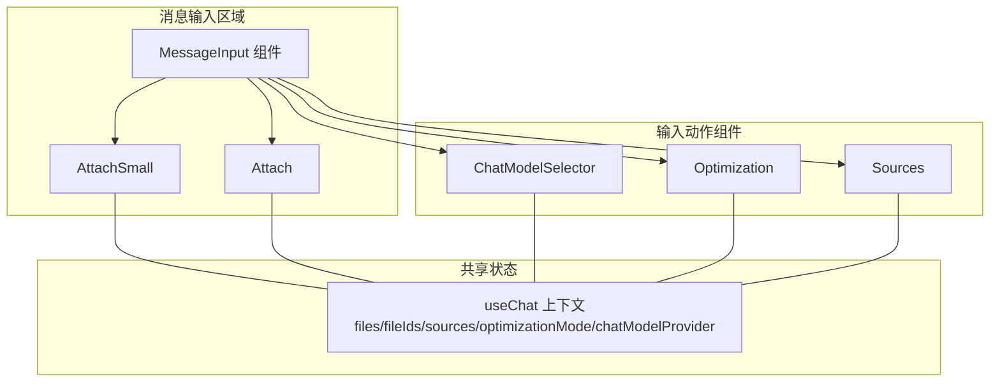
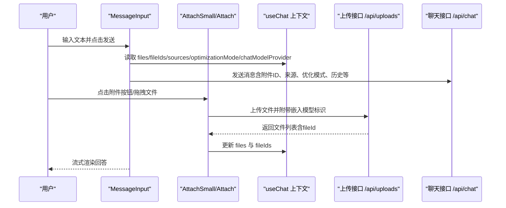
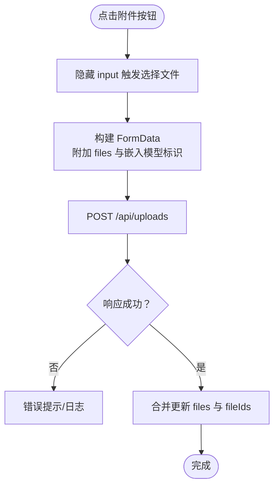
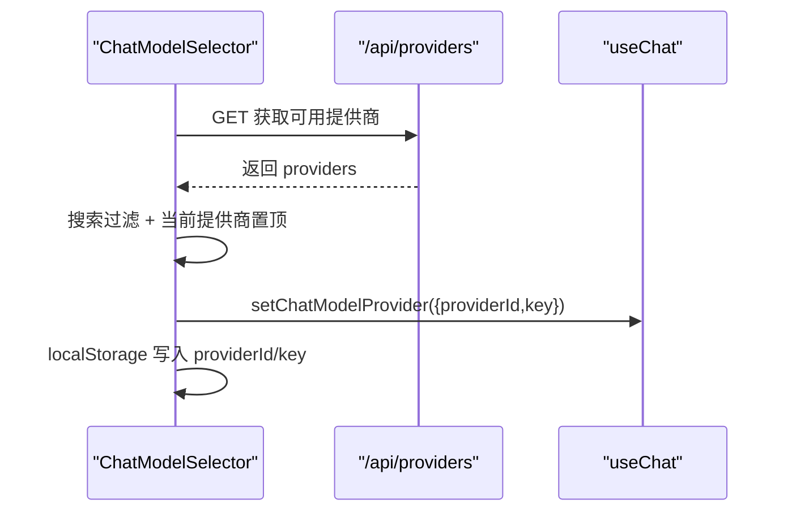
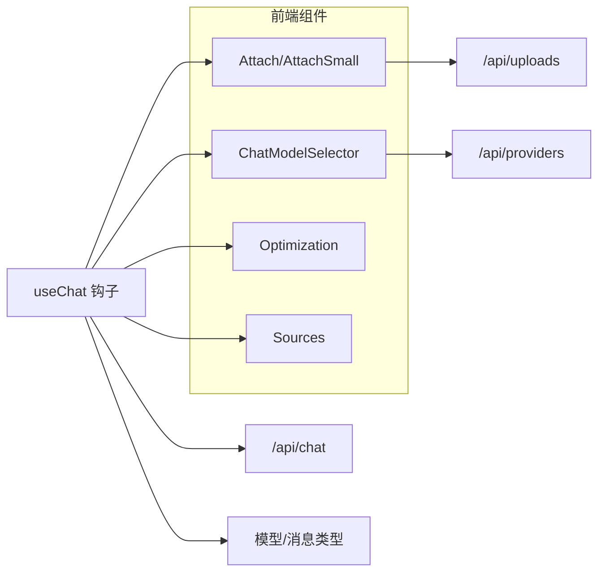

# 输入动作组件

<cite>
**本文引用的文件**
- [src/components/MessageInputActions/Attach.tsx](file://src/components/MessageInputActions/Attach.tsx)
- [src/components/MessageInputActions/AttachSmall.tsx](file://src/components/MessageInputActions/AttachSmall.tsx)
- [src/components/MessageInputActions/ChatModelSelector.tsx](file://src/components/MessageInputActions/ChatModelSelector.tsx)
- [src/components/MessageInputActions/Optimization.tsx](file://src/components/MessageInputActions/Optimization.tsx)
- [src/components/MessageInputActions/Sources.tsx](file://src/components/MessageInputActions/Sources.tsx)
- [src/components/MessageInput.tsx](file://src/components/MessageInput.tsx)
- [src/lib/hooks/useChat.tsx](file://src/lib/hooks/useChat.tsx)
- [src/lib/models/types.ts](file://src/lib/models/types.ts)
- [src/lib/types.ts](file://src/lib/types.ts)
- [src/app/api/uploads/route.ts](file://src/app/api/uploads/route.ts)
- [src/app/api/providers/route.ts](file://src/app/api/providers/route.ts)
- [src/lib/uploads/manager.ts](file://src/lib/uploads/manager.ts)
- [src/lib/uploads/store.ts](file://src/lib/uploads/store.ts)
</cite>

## 目录
1. [简介](#简介)
2. [项目结构](#项目结构)
3. [核心组件](#核心组件)
4. [架构总览](#架构总览)
5. [组件详细分析](#组件详细分析)
6. [依赖关系分析](#依赖关系分析)
7. [性能与可扩展性](#性能与可扩展性)
8. [故障排查](#故障排查)
9. [结论](#结论)
10. [附录：配置与集成指南](#附录配置与集成指南)

## 简介
本文件系统化梳理“消息输入动作组件集合”，涵盖以下功能组件：
- 文件附件上传组件：Attach（大按钮风格）与 AttachSmall（紧凑风格）
- 聊天模型选择器：ChatModelSelector
- 优化模式：Optimization（速度/平衡/质量）
- 来源管理：Sources（Web/学术/社交）

文档从架构、状态管理、事件处理、组件间协作、数据流、样式与扩展、以及实际使用与集成角度进行深入说明，帮助开发者快速理解与扩展。

## 项目结构
输入动作组件位于组件层，围绕消息输入区域布局；它们通过共享的聊天上下文钩子 useChat 进行状态同步与事件分发。

图表来源
- [src/components/MessageInput.tsx](file://src/components/MessageInput.tsx#L1-L103)
- [src/components/MessageInputActions/AttachSmall.tsx](file://src/components/MessageInputActions/AttachSmall.tsx#L1-L159)
- [src/components/MessageInputActions/Attach.tsx](file://src/components/MessageInputActions/Attach.tsx#L1-L170)
- [src/components/MessageInputActions/ChatModelSelector.tsx](file://src/components/MessageInputActions/ChatModelSelector.tsx#L1-L204)
- [src/components/MessageInputActions/Optimization.tsx](file://src/components/MessageInputActions/Optimization.tsx#L1-L115)
- [src/components/MessageInputActions/Sources.tsx](file://src/components/MessageInputActions/Sources.tsx#L1-L94)
- [src/lib/hooks/useChat.tsx](file://src/lib/hooks/useChat.tsx#L31-L62)

章节来源
- [src/components/MessageInput.tsx](file://src/components/MessageInput.tsx#L1-L103)
- [src/lib/hooks/useChat.tsx](file://src/lib/hooks/useChat.tsx#L31-L62)

## 核心组件
- 文件附件上传（Attach/AttachSmall）
  - 支持多文件选择、上传、嵌入向量化、本地记录与展示
  - 通过表单数据携带嵌入模型标识，调用上传接口
- 聊天模型选择器（ChatModelSelector）
  - 拉取可用模型提供者列表，支持搜索过滤，持久化到本地存储
- 优化模式（Optimization）
  - 提供三种优化策略：速度、平衡、质量
- 来源管理（Sources）
  - 切换 Web、学术、社交三类信息来源

章节来源
- [src/components/MessageInputActions/Attach.tsx](file://src/components/MessageInputActions/Attach.tsx#L1-L170)
- [src/components/MessageInputActions/AttachSmall.tsx](file://src/components/MessageInputActions/AttachSmall.tsx#L1-L159)
- [src/components/MessageInputActions/ChatModelSelector.tsx](file://src/components/MessageInputActions/ChatModelSelector.tsx#L1-L204)
- [src/components/MessageInputActions/Optimization.tsx](file://src/components/MessageInputActions/Optimization.tsx#L1-L115)
- [src/components/MessageInputActions/Sources.tsx](file://src/components/MessageInputActions/Sources.tsx#L1-L94)

## 架构总览
输入动作组件通过 useChat 共享状态驱动，消息发送时将附件文件ID、来源、优化模式、模型提供者等参数一并提交至后端流式对话接口。

图表来源
- [src/components/MessageInput.tsx](file://src/components/MessageInput.tsx#L48-L99)
- [src/components/MessageInputActions/Attach.tsx](file://src/components/MessageInputActions/Attach.tsx#L28-L54)
- [src/components/MessageInputActions/AttachSmall.tsx](file://src/components/MessageInputActions/AttachSmall.tsx#L19-L45)
- [src/lib/hooks/useChat.tsx](file://src/lib/hooks/useChat.tsx#L714-L777)
- [src/app/api/uploads/route.ts](file://src/app/api/uploads/route.ts#L5-L40)

## 组件详细分析

### 文件附件上传组件（Attach 与 AttachSmall）
- 功能要点
  - 多文件选择与隐藏 input 触发
  - 上传时附带嵌入模型提供者与键值
  - 上传成功后合并更新 files 与 fileIds
  - 支持弹出面板查看已附加文件、追加或清空
- 用户交互
  - 未加载：显示“回形针”按钮
  - 加载中：显示旋转指示器
  - 已有文件：展开 Popover 展示文件列表与操作
- 数据流
  - 前端：选择文件 → FormData → fetch → 更新 files/fileIds
  - 后端：解析表单 → 加载嵌入模型 → 处理文件 → 返回文件数组（含 fileId）
- 错误处理
  - 缺少嵌入模型标识时返回 400
  - 其他异常返回 500 并记录日志

图表来源
- [src/components/MessageInputActions/Attach.tsx](file://src/components/MessageInputActions/Attach.tsx#L28-L54)
- [src/components/MessageInputActions/AttachSmall.tsx](file://src/components/MessageInputActions/AttachSmall.tsx#L19-L45)
- [src/app/api/uploads/route.ts](file://src/app/api/uploads/route.ts#L5-L40)
- [src/lib/uploads/manager.ts](file://src/lib/uploads/manager.ts#L177-L218)

章节来源
- [src/components/MessageInputActions/Attach.tsx](file://src/components/MessageInputActions/Attach.tsx#L1-L170)
- [src/components/MessageInputActions/AttachSmall.tsx](file://src/components/MessageInputActions/AttachSmall.tsx#L1-L159)
- [src/app/api/uploads/route.ts](file://src/app/api/uploads/route.ts#L1-L41)
- [src/lib/uploads/manager.ts](file://src/lib/uploads/manager.ts#L1-L218)

### 聊天模型选择器（ChatModelSelector）
- 功能要点
  - 首次加载拉取 /api/providers，过滤不可用模型
  - 支持搜索框按模型名/提供商名过滤
  - 选中后写入本地存储并更新 useChat 的 chatModelProvider
  - 优先展示当前已选提供商
- 用户交互
  - 打开 Popover 展示提供商与模型列表
  - 输入搜索关键词实时过滤
  - 点击模型即刻切换并持久化
- 数据流
  - 前端：useEffect 初始化 → fetch → setProviders → useMemo 排序
  - 选择回调：setChatModelProvider + localStorage

图表来源
- [src/components/MessageInputActions/ChatModelSelector.tsx](file://src/components/MessageInputActions/ChatModelSelector.tsx#L18-L75)
- [src/app/api/providers/route.ts](file://src/app/api/providers/route.ts#L5-L34)
- [src/lib/models/types.ts](file://src/lib/models/types.ts#L19-L24)

章节来源
- [src/components/MessageInputActions/ChatModelSelector.tsx](file://src/components/MessageInputActions/ChatModelSelector.tsx#L1-L204)
- [src/app/api/providers/route.ts](file://src/app/api/providers/route.ts#L1-L78)
- [src/lib/models/types.ts](file://src/lib/models/types.ts#L1-L104)

### 优化选项（Optimization）
- 功能要点
  - 三种模式：速度（优先快）、平衡（兼顾）、质量（更详尽）
  - 通过 Popover 列表切换，当前项高亮
- 用户交互
  - 点击图标打开面板，选择对应模式
- 数据流
  - setOptimizationMode 写入 useChat，随消息发送

章节来源
- [src/components/MessageInputActions/Optimization.tsx](file://src/components/MessageInputActions/Optimization.tsx#L1-L115)
- [src/lib/hooks/useChat.tsx](file://src/lib/hooks/useChat.tsx#L291)

### 来源管理（Sources）
- 功能要点
  - 三类来源：Web、学术、社交
  - 使用 Switch 控制开关，动态增删 sources 列表
- 用户交互
  - 打开面板，逐项切换
- 数据流
  - setSources 更新 useChat，随消息发送

章节来源
- [src/components/MessageInputActions/Sources.tsx](file://src/components/MessageInputActions/Sources.tsx#L1-L94)
- [src/lib/hooks/useChat.tsx](file://src/lib/hooks/useChat.tsx#L290)

## 依赖关系分析
- 组件耦合
  - 所有输入动作组件均依赖 useChat 提供的状态与 setter
  - 与后端接口存在直接依赖：/api/uploads、/api/providers、/api/chat
- 外部依赖
  - Headless UI（Popover/PopoverButton/PopoverPanel/Switch）
  - Motion（AnimatePresence/motion）
  - Lucide/PPhosphor Icons（UI 图标）
- 类型与数据模型
  - MinimalProvider、Model、ChatModelProvider、EmbeddingModelProvider 定义于模型类型文件
  - Message、Block、SourceBlock 等定义于通用类型文件

图表来源
- [src/components/MessageInputActions/Attach.tsx](file://src/components/MessageInputActions/Attach.tsx#L1-L170)
- [src/components/MessageInputActions/AttachSmall.tsx](file://src/components/MessageInputActions/AttachSmall.tsx#L1-L159)
- [src/components/MessageInputActions/ChatModelSelector.tsx](file://src/components/MessageInputActions/ChatModelSelector.tsx#L1-L204)
- [src/components/MessageInputActions/Optimization.tsx](file://src/components/MessageInputActions/Optimization.tsx#L1-L115)
- [src/components/MessageInputActions/Sources.tsx](file://src/components/MessageInputActions/Sources.tsx#L1-L94)
- [src/lib/hooks/useChat.tsx](file://src/lib/hooks/useChat.tsx#L31-L62)
- [src/lib/models/types.ts](file://src/lib/models/types.ts#L19-L29)
- [src/lib/types.ts](file://src/lib/types.ts#L28-L124)

章节来源
- [src/lib/models/types.ts](file://src/lib/models/types.ts#L1-L104)
- [src/lib/types.ts](file://src/lib/types.ts#L1-L124)

## 性能与可扩展性
- 上传性能
  - 采用并行处理与分块嵌入，建议限制单次上传文件数量与大小
  - 可在前端增加进度反馈与取消上传能力
- 模型选择
  - 提供商列表缓存与本地存储，减少重复请求
  - 支持搜索过滤，避免长列表滚动
- 优化模式
  - 不同模式可映射到不同的生成参数（温度、最大令牌等），可在后端统一管理
- 来源管理
  - 来源开关影响检索范围，建议结合业务场景默认启用常用来源

[本节为通用指导，不直接分析具体文件]

## 故障排查
- 上传失败
  - 确认嵌入模型提供者与键值是否正确写入 localStorage
  - 检查 /api/uploads 是否返回 400（缺少嵌入模型标识）或 500（其他异常）
- 模型选择无效
  - 确认 /api/providers 返回的提供商列表有效且不含错误标记
  - 检查本地存储的 providerId/key 是否一致
- 无法发送消息
  - 检查 useChat 的 isReady 与 isConfigReady 状态
  - 确认 /api/chat 请求体包含 files、sources、optimizationMode、chatModel、embeddingModel 等字段

章节来源
- [src/app/api/uploads/route.ts](file://src/app/api/uploads/route.ts#L13-L18)
- [src/app/api/providers/route.ts](file://src/app/api/providers/route.ts#L5-L34)
- [src/lib/hooks/useChat.tsx](file://src/lib/hooks/useChat.tsx#L464-L471)

## 结论
输入动作组件通过统一的 useChat 上下文实现低耦合、高内聚的状态管理与事件处理，配合后端上传与模型提供者接口，形成完整的“输入-选择-优化-来源-发送”的闭环。组件具备良好的可扩展性，便于新增动作或调整交互细节。

[本节为总结，不直接分析具体文件]

## 附录：配置与集成指南

### 配置选项
- 附件上传
  - 支持文件类型：PDF、DOCX、TXT
  - 上传参数：embedding_model_provider_id、embedding_model_key
- 模型选择
  - 本地存储键：chatModelProviderId、chatModelKey
  - 默认行为：若本地无配置则自动选择首个可用提供商与模型
- 优化模式
  - 默认值：speed
  - 可扩展：映射到温度、最大令牌、topP 等生成参数
- 来源管理
  - 默认来源：web
  - 可扩展：新增来源类型并在前端面板中注册

章节来源
- [src/components/MessageInputActions/Attach.tsx](file://src/components/MessageInputActions/Attach.tsx#L36-L42)
- [src/components/MessageInputActions/AttachSmall.tsx](file://src/components/MessageInputActions/AttachSmall.tsx#L27-L33)
- [src/components/MessageInputActions/ChatModelSelector.tsx](file://src/components/MessageInputActions/ChatModelSelector.tsx#L61-L63)
- [src/lib/hooks/useChat.tsx](file://src/lib/hooks/useChat.tsx#L290-L291)
- [src/lib/hooks/useChat.tsx](file://src/lib/hooks/useChat.tsx#L87-L153)

### 样式定制
- 组件均使用 Tailwind 类名控制外观，可通过覆盖类名或主题变量进行定制
- Popover 面板尺寸与定位可通过 className 调整（如宽度、最大高度、位置）

章节来源
- [src/components/MessageInputActions/Attach.tsx](file://src/components/MessageInputActions/Attach.tsx#L61-L81)
- [src/components/MessageInputActions/AttachSmall.tsx](file://src/components/MessageInputActions/AttachSmall.tsx#L63-L72)
- [src/components/MessageInputActions/ChatModelSelector.tsx](file://src/components/MessageInputActions/ChatModelSelector.tsx#L88-L97)
- [src/components/MessageInputActions/Optimization.tsx](file://src/components/MessageInputActions/Optimization.tsx#L66-L75)
- [src/components/MessageInputActions/Sources.tsx](file://src/components/MessageInputActions/Sources.tsx#L47-L54)

### 扩展方法
- 新增动作组件
  - 在 MessageInputActions 目录下新建组件，使用 useChat 读取/更新状态
  - 在 MessageInput 中按需渲染
- 新增来源
  - 在 Sources 组件 sourcesList 中添加条目，确保后端检索逻辑支持该来源
- 新增优化模式
  - 在 Optimization 组件中扩展模式列表，映射到生成参数
- 新增模型提供者
  - 通过 /api/providers 的 POST 接口注册新提供者，前端会自动拉取

章节来源
- [src/components/MessageInputActions/Sources.tsx](file://src/components/MessageInputActions/Sources.tsx#L15-L31)
- [src/components/MessageInputActions/Optimization.tsx](file://src/components/MessageInputActions/Optimization.tsx#L13-L37)
- [src/app/api/providers/route.ts](file://src/app/api/providers/route.ts#L36-L77)

### 实际使用示例
- 在消息输入区域集成
  - 将 AttachSmall/Attach 与 ChatModelSelector、Optimization、Sources 渲染在 MessageInput 内
  - 通过 useChat 的 setter 实现状态联动
- 发送消息时携带附件与来源
  - useChat 在 sendMessage 中将 files/fileIds、sources、optimizationMode、chatModel、embeddingModel 等打包发送

章节来源
- [src/components/MessageInput.tsx](file://src/components/MessageInput.tsx#L48-L99)
- [src/lib/hooks/useChat.tsx](file://src/lib/hooks/useChat.tsx#L714-L777)