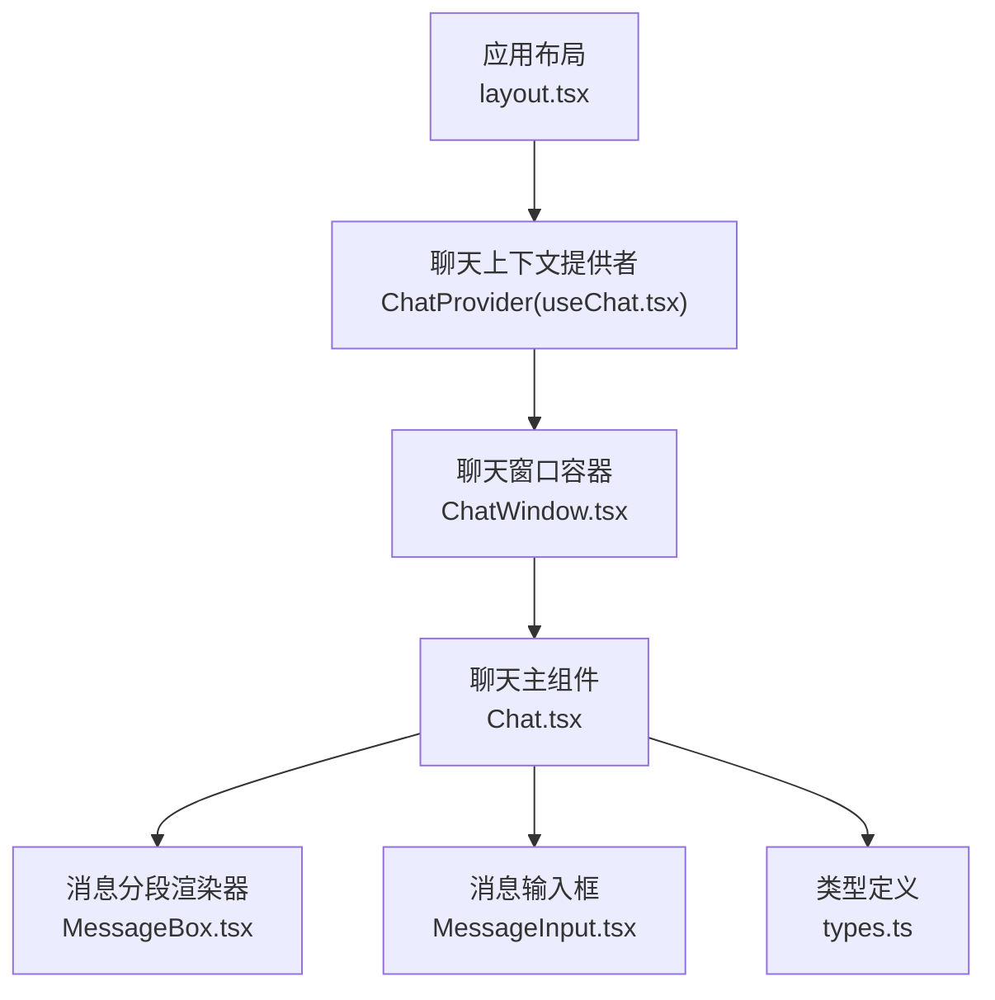
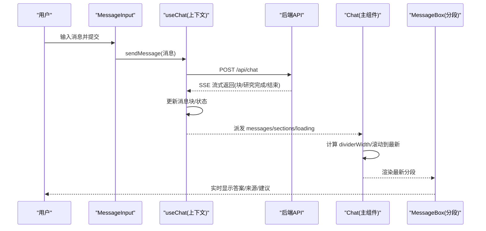
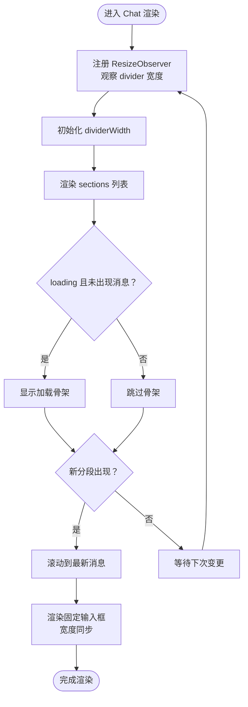
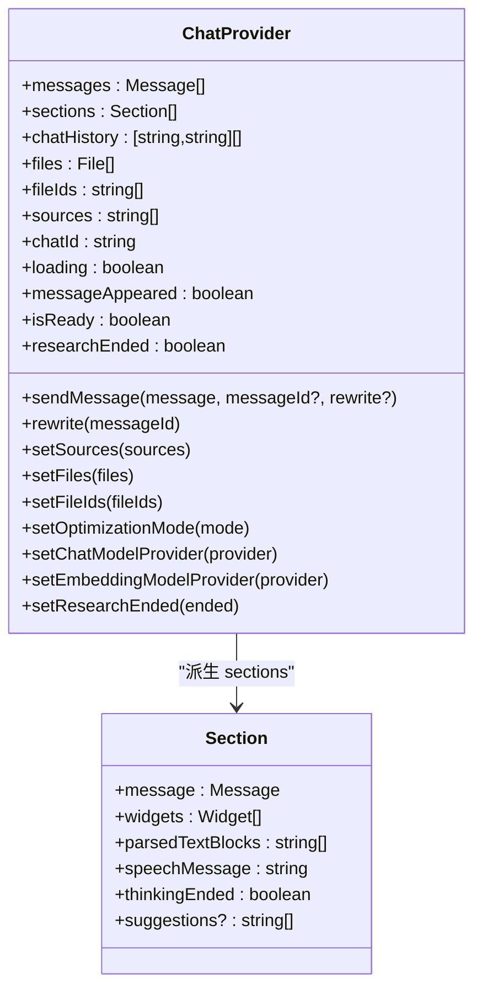
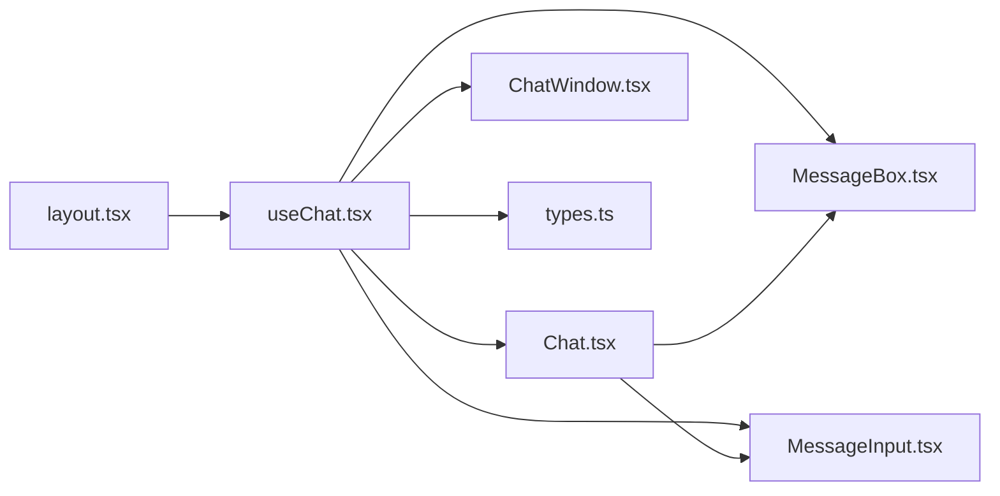
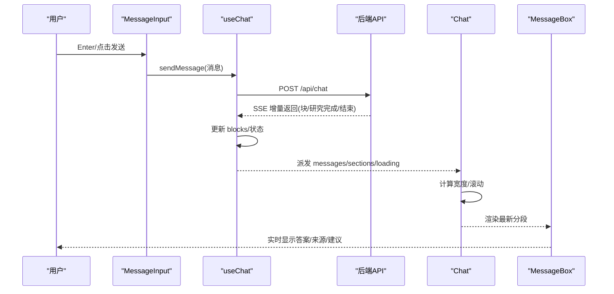

# 聊天主组件

<cite>
**本文档引用的文件**
- [Chat.tsx](file://src/components/Chat.tsx)
- [useChat.tsx](file://src/lib/hooks/useChat.tsx)
- [ChatWindow.tsx](file://src/components/ChatWindow.tsx)
- [types.ts](file://src/lib/types.ts)
- [layout.tsx](file://src/app/layout.tsx)
- [page.tsx](file://src/app/c/[chatId]/page.tsx)
- [MessageBox.tsx](file://src/components/MessageBox.tsx)
- [MessageInput.tsx](file://src/components/MessageInput.tsx)
- [globals.css](file://src/app/globals.css)
</cite>

## 目录
1. [简介](#简介)
2. [项目结构](#项目结构)
3. [核心组件](#核心组件)
4. [架构总览](#架构总览)
5. [详细组件分析](#详细组件分析)
6. [依赖关系分析](#依赖关系分析)
7. [性能考虑](#性能考虑)
8. [故障排除指南](#故障排除指南)
9. [结论](#结论)
10. [附录](#附录)

## 简介
本文件面向“聊天主组件”（Chat 组件）的深度技术文档，聚焦于以下关键能力：
- 聊天会话管理：通过上下文 Hook 管理消息与分段状态，支持重连、重写、建议生成等。
- 消息流式渲染：基于服务端事件流（SSE）增量更新消息块，实时呈现答案与来源。
- 滚动行为控制：自动滚动至最新消息，避免频繁滚动抖动。
- 响应式布局：使用 ResizeObserver 动态计算输入框宽度，适配不同屏幕尺寸。
- 状态协调：sections、loading、messageAppeared、messages 等状态协同工作，确保渲染一致性与用户体验。

## 项目结构
聊天功能由多层组件与上下文协作完成：
- 应用根布局提供 ChatProvider，注入全局聊天状态与方法。
- ChatWindow 根据状态决定渲染 EmptyChat 或 Chat。
- Chat 渲染消息分段、输入框与加载占位，并负责滚动与响应式宽度。
- MessageBox 渲染单条消息的文本、来源、研究步骤、小部件与建议。
- MessageInput 提供输入框与快捷键交互，支持多行自适应高度。

图表来源
- [layout.tsx](file://src/app/layout.tsx#L12-L51)
- [useChat.tsx](file://src/lib/hooks/useChat.tsx#L270-L842)
- [ChatWindow.tsx](file://src/components/ChatWindow.tsx#L36-L74)
- [Chat.tsx](file://src/components/Chat.tsx#L9-L106)
- [MessageBox.tsx](file://src/components/MessageBox.tsx#L42-L288)
- [MessageInput.tsx](file://src/components/MessageInput.tsx#L8-L102)
- [types.ts](file://src/lib/types.ts#L28-L124)

章节来源
- [layout.tsx](file://src/app/layout.tsx#L12-L51)
- [ChatWindow.tsx](file://src/components/ChatWindow.tsx#L36-L74)
- [Chat.tsx](file://src/components/Chat.tsx#L9-L106)

## 核心组件
- Chat 主组件：负责消息列表渲染、输入框固定定位与宽度同步、滚动行为与加载占位。
- useChat 上下文 Hook：集中管理消息、分段、历史、模型配置、发送消息、重连、重写等。
- MessageBox 分段渲染器：解析文本块、处理思考标签、渲染来源、研究步骤、小部件与建议。
- MessageInput 输入框：多行自适应高度、快捷键支持、提交逻辑。
- ChatWindow 容器：根据状态切换 EmptyChat、Chat 或错误页。

章节来源
- [Chat.tsx](file://src/components/Chat.tsx#L9-L106)
- [useChat.tsx](file://src/lib/hooks/useChat.tsx#L270-L842)
- [MessageBox.tsx](file://src/components/MessageBox.tsx#L42-L288)
- [MessageInput.tsx](file://src/components/MessageInput.tsx#L8-L102)
- [ChatWindow.tsx](file://src/components/ChatWindow.tsx#L36-L74)

## 架构总览
聊天系统采用“上下文驱动 + 流式渲染”的架构模式：
- 上下文层：统一管理消息、分段、历史、配置与操作方法。
- 渲染层：按消息分段渲染，支持文本、来源、研究步骤、小部件与建议。
- 交互层：输入框支持多行自适应与快捷键；底部固定输入框随内容宽度变化。
- 状态层：loading、messageAppeared、sections、messages 协同控制渲染与滚动。

图表来源
- [MessageInput.tsx](file://src/components/MessageInput.tsx#L50-L62)
- [useChat.tsx](file://src/lib/hooks/useChat.tsx#L714-L806)
- [Chat.tsx](file://src/components/Chat.tsx#L17-L44)
- [MessageBox.tsx](file://src/components/MessageBox.tsx#L106-L287)

## 详细组件分析

### Chat 主组件
职责与特性：
- 会话管理：从 useChat 获取 sections、loading、messageAppeared、messages。
- 响应式宽度：使用 ResizeObserver 观察分段容器宽度，动态设置输入框宽度，保证输入框与内容宽度一致。
- 滚动控制：监听 messages 变化，仅在新增分段时滚动至最新消息，避免重复滚动。
- 加载占位：当 loading 且 messageAppeared 未出现时显示加载骨架。
- 固定输入框：在页面底部固定输入框，配合宽度同步与渐变遮罩提升视觉体验。

关键实现要点：
- 使用 useRef 存储 dividerRef、messageEnd、lastScrolledRef。
- 在 useEffect 中注册 ResizeObserver 与 window.resize 事件，并在卸载时清理。
- 滚动逻辑：比较 sections.length 与 lastScrolledRef，触发 scrollIntoView。
- 条件渲染：dividerWidth > 0 时才渲染输入框，避免首次测量前的闪烁。

图表来源
- [Chat.tsx](file://src/components/Chat.tsx#L17-L59)
- [Chat.tsx](file://src/components/Chat.tsx#L61-L105)

章节来源
- [Chat.tsx](file://src/components/Chat.tsx#L9-L106)

### useChat 上下文 Hook（聊天状态与流程）
职责与特性：
- 状态管理：messages、sections、chatHistory、files、fileIds、sources、chatId、loading、messageAppeared、isReady、researchEnded 等。
- 分段解析：将消息中的 responseBlocks 解析为可渲染的 sections，处理思考标签、引用替换、语音文本、小部件与建议。
- 发送消息：构建请求体，调用 /api/chat，读取 SSE 流，逐块更新消息状态。
- 重连机制：若最后一条消息状态为 answering，则发起 /api/reconnect，恢复流式输出。
- 重写：删除指定消息之后的历史，重新发送该消息。
- 建议生成：在研究完成后，若存在来源但无建议，调用 getSuggestions 生成建议块。

状态协调机制：
- sections 由 messages useMemo 派生，确保渲染稳定。
- messageAppeared 控制是否已出现第一条消息内容，影响加载骨架显示。
- loading 控制输入框禁用与加载骨架显示。
- researchEnded 控制研究阶段的 UI 展示。
- handledMessageEndRef 防止 messageEnd 事件重复处理。

图表来源
- [useChat.tsx](file://src/lib/hooks/useChat.tsx#L22-L62)
- [useChat.tsx](file://src/lib/hooks/useChat.tsx#L316-L403)

章节来源
- [useChat.tsx](file://src/lib/hooks/useChat.tsx#L270-L842)
- [types.ts](file://src/lib/types.ts#L28-L124)

### MessageBox 分段渲染器
职责与特性：
- 文本渲染：解析 parsedTextBlocks，支持内联代码、代码块、思考标签与引用链接。
- 来源与研究步骤：渲染来源列表与研究步骤可视化。
- 小部件：渲染各类小部件（如天气、股票等）。
- 建议：在最后一条消息且非加载中时，渲染相关建议列表。
- 语音与操作：支持语音播放/停止、复制、重写等操作。

渲染流程：
- 从 useChat 获取 loading、sendMessage、rewrite、messages、researchEnded、chatHistory。
- 使用 Markdown 渲染器与自定义规则处理 think 标签与 citation 标签。
- 根据 isLast 与 loading 控制“思考中”提示与研究步骤展示。

章节来源
- [MessageBox.tsx](file://src/components/MessageBox.tsx#L42-L288)
- [types.ts](file://src/lib/types.ts#L45-L124)

### MessageInput 输入框
职责与特性：
- 多行自适应：使用 react-textarea-autosize，根据高度变化切换单行/多行模式。
- 快捷键：支持 '/' 键聚焦输入框；Enter 提交消息。
- 提交逻辑：阻止无效提交（loading 或空消息），调用 sendMessage 并清空输入。
- 行为模式：单行模式显示附件按钮与发送按钮；多行模式在底部显示按钮组。

章节来源
- [MessageInput.tsx](file://src/components/MessageInput.tsx#L8-L102)

### ChatWindow 容器
职责与特性：
- 状态判断：根据 hasError、notFound、messages、isReady 决定渲染错误页、EmptyChat 或 Chat。
- 导航栏：在有消息时渲染顶部导航栏。

章节来源
- [ChatWindow.tsx](file://src/components/ChatWindow.tsx#L36-L74)

## 依赖关系分析
- Chat 依赖 useChat 提供的状态与方法，渲染 MessageBox 列表与 MessageInput。
- MessageBox 依赖 useChat 的上下文，渲染文本、来源、研究步骤、小部件与建议。
- MessageInput 依赖 useChat 的 sendMessage 方法与 loading 状态。
- ChatProvider 在根布局中注入，为整个聊天树提供上下文。
- types.ts 定义了消息、块、研究步骤等类型，被 useChat 与 MessageBox 使用。

图表来源
- [useChat.tsx](file://src/lib/hooks/useChat.tsx#L270-L842)
- [Chat.tsx](file://src/components/Chat.tsx#L9-L106)
- [MessageBox.tsx](file://src/components/MessageBox.tsx#L42-L288)
- [MessageInput.tsx](file://src/components/MessageInput.tsx#L8-L102)
- [ChatWindow.tsx](file://src/components/ChatWindow.tsx#L36-L74)
- [types.ts](file://src/lib/types.ts#L28-L124)
- [layout.tsx](file://src/app/layout.tsx#L12-L51)

章节来源
- [useChat.tsx](file://src/lib/hooks/useChat.tsx#L270-L842)
- [Chat.tsx](file://src/components/Chat.tsx#L9-L106)
- [MessageBox.tsx](file://src/components/MessageBox.tsx#L42-L288)
- [MessageInput.tsx](file://src/components/MessageInput.tsx#L8-L102)
- [ChatWindow.tsx](file://src/components/ChatWindow.tsx#L36-L74)
- [layout.tsx](file://src/app/layout.tsx#L12-L51)

## 性能考虑
- 渲染优化
  - sections 通过 useMemo 从 messages 派生，避免每次渲染都重新计算。
  - MessageBox 仅渲染当前分段所需内容，减少不必要的子组件重渲染。
- 流式渲染
  - 使用 TextDecoder 与流式读取，按块更新消息，避免一次性渲染大文本。
  - handledMessageEndRef 防止 messageEnd 事件重复处理，降低副作用。
- 滚动优化
  - 仅在新增分段时滚动，避免频繁 scrollIntoView 导致的性能问题。
  - 使用 lastScrolledRef 记录上次滚动的分段数量，防止重复滚动。
- 响应式宽度
  - ResizeObserver 仅观察分段容器宽度，避免对全屏或复杂布局造成压力。
  - 在 window.resize 时统一更新，减少多次观测开销。
- 内存管理
  - 在 Chat 组件卸载时清理 ResizeObserver、移除 window 事件监听。
  - 使用 useRef 存储 DOM 引用与计数器，避免闭包泄漏。
- 状态最小化
  - 将消息块解析为轻量级 parsedTextBlocks，减少渲染层的数据负担。
  - 仅在必要时更新 messageAppeared 与 researchEnded，避免不必要重渲染。

[本节为通用性能指导，无需特定文件来源]

## 故障排除指南
- 无法连接服务器
  - ChatWindow 会在 hasError 时显示错误提示，检查网络与后端服务状态。
- 无消息显示
  - 确认 isReady 为 true 且 messages 非空；检查 ChatProvider 是否正确包裹。
- 输入框不响应
  - 检查 loading 状态与 MessageInput 的禁用条件；确认键盘事件未被其他元素拦截。
- 滚动异常
  - 确认 sections.length 与 lastScrolledRef 的比较逻辑；避免在非新增分段时触发滚动。
- 宽度不同步
  - 确认 ResizeObserver 已正确注册与清理；检查 dividerRef 是否挂载成功。
- 建议未出现
  - 确认研究完成后 messageAppeared 为 true 且存在来源块；检查 getSuggestions 返回值。

章节来源
- [ChatWindow.tsx](file://src/components/ChatWindow.tsx#L39-L51)
- [Chat.tsx](file://src/components/Chat.tsx#L17-L44)
- [MessageInput.tsx](file://src/components/MessageInput.tsx#L50-L62)
- [useChat.tsx](file://src/lib/hooks/useChat.tsx#L567-L710)

## 结论
聊天主组件通过上下文驱动与流式渲染实现了高性能、高可用的对话体验。其关键优势在于：
- 状态与渲染解耦：useChat 负责状态与流程，Chat/MessageBox 负责渲染，职责清晰。
- 流式增量更新：SSE 流式数据驱动实时渲染，提升交互流畅度。
- 响应式与滚动优化：ResizeObserver 与滚动控制共同保障良好体验。
- 可扩展性：通过 Block 类型与 Widget 机制，便于扩展新的内容类型与交互。

[本节为总结性内容，无需特定文件来源]

## 附录

### 使用示例与最佳实践
- 集成步骤
  - 在根布局中使用 ChatProvider 包裹应用。
  - 在页面中渲染 ChatWindow，它会根据状态选择 EmptyChat 或 Chat。
  - 在需要的地方使用 useChat 获取状态与方法。
- 最佳实践
  - 使用 useMemo 派生 sections，避免重复计算。
  - 在 Chat 中仅在新增分段时滚动，避免频繁滚动。
  - 使用 ResizeObserver 观察分段容器，确保输入框宽度与内容一致。
  - 在重连场景中，确保 handledMessageEndRef 防止重复处理。
  - 合理使用 messageAppeared 与 researchEnded 控制 UI 展示时机。

章节来源
- [layout.tsx](file://src/app/layout.tsx#L38-L51)
- [ChatWindow.tsx](file://src/components/ChatWindow.tsx#L36-L74)
- [useChat.tsx](file://src/lib/hooks/useChat.tsx#L316-L403)
- [Chat.tsx](file://src/components/Chat.tsx#L17-L59)

### 关键流程图：消息发送与流式渲染

图表来源
- [MessageInput.tsx](file://src/components/MessageInput.tsx#L50-L62)
- [useChat.tsx](file://src/lib/hooks/useChat.tsx#L714-L806)
- [Chat.tsx](file://src/components/Chat.tsx#L17-L59)
- [MessageBox.tsx](file://src/components/MessageBox.tsx#L106-L287)