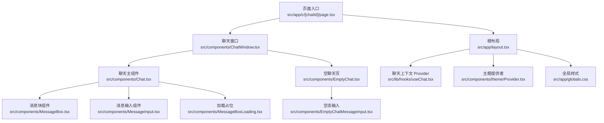
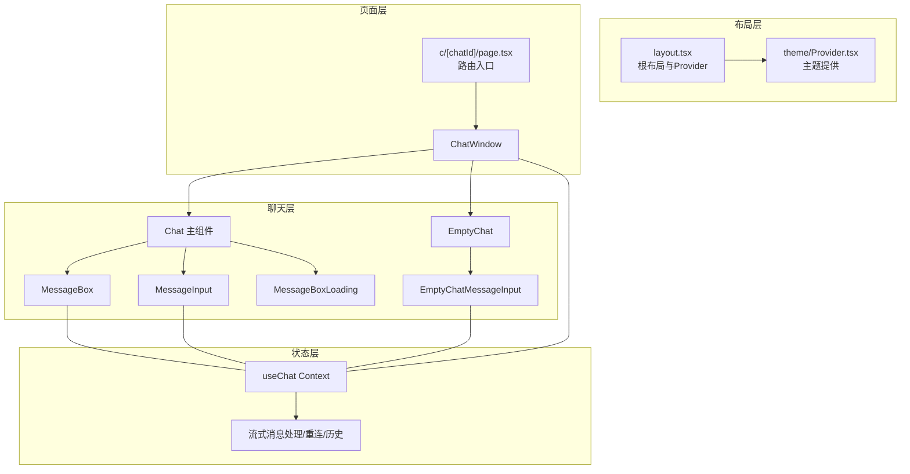
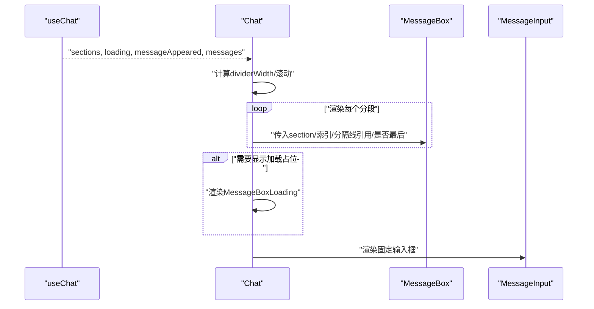
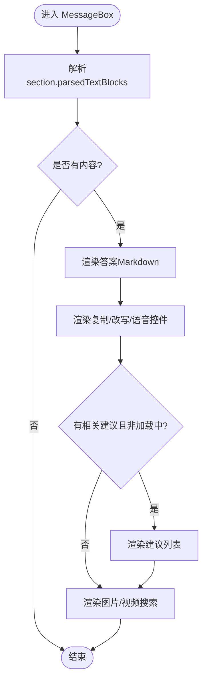
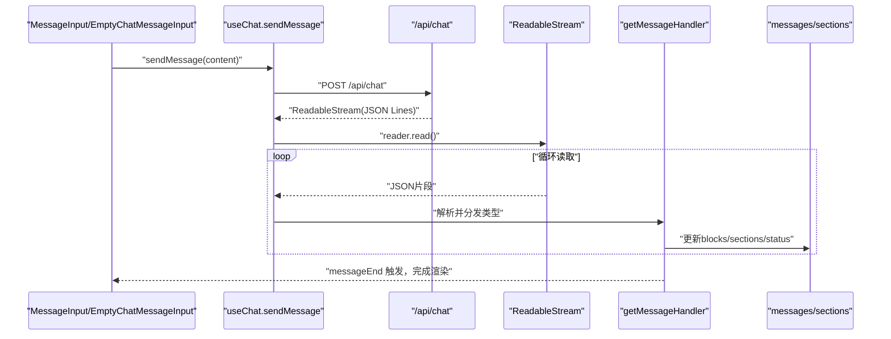
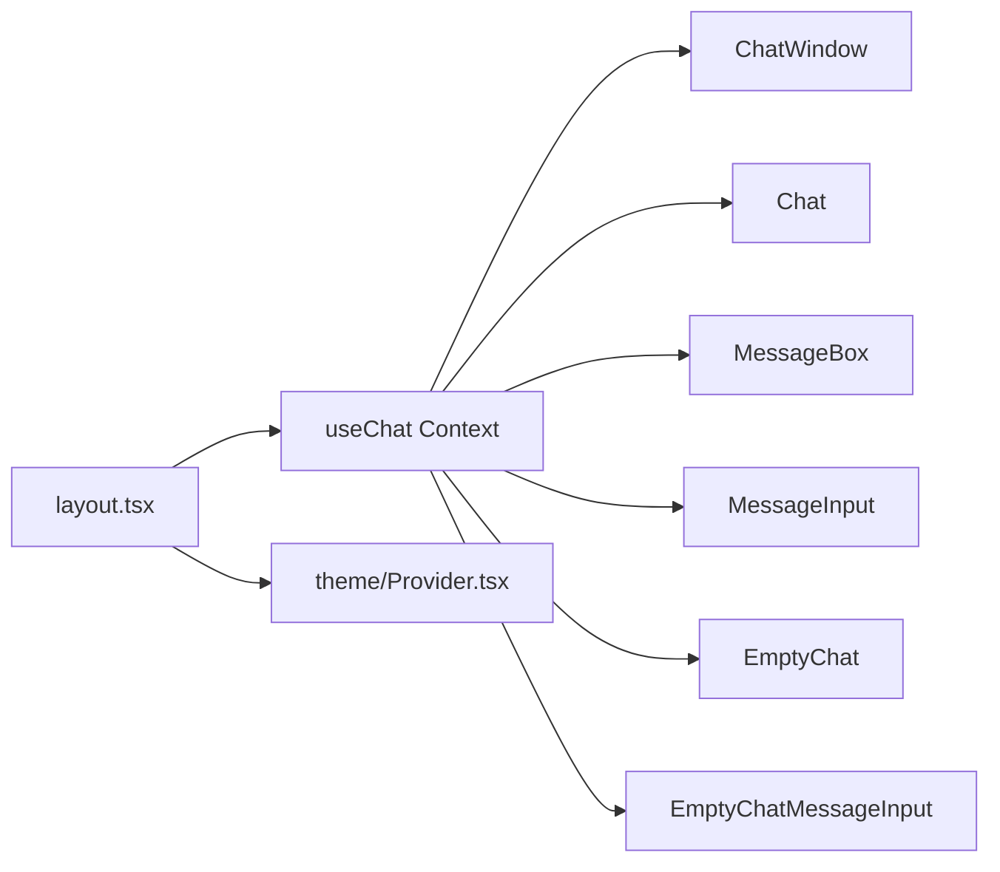

# 聊天界面组件

<cite>
**本文引用的文件**
- [src/app/c/[chatId]/page.tsx](file://src/app/c/[chatId]/page.tsx)
- [src/app/layout.tsx](file://src/app/layout.tsx)
- [src/components/ChatWindow.tsx](file://src/components/ChatWindow.tsx)
- [src/components/Chat.tsx](file://src/components/Chat.tsx)
- [src/components/MessageBox.tsx](file://src/components/MessageBox.tsx)
- [src/components/MessageInput.tsx](file://src/components/MessageInput.tsx)
- [src/components/EmptyChat.tsx](file://src/components/EmptyChat.tsx)
- [src/components/EmptyChatMessageInput.tsx](file://src/components/EmptyChatMessageInput.tsx)
- [src/components/MessageBoxLoading.tsx](file://src/components/MessageBoxLoading.tsx)
- [src/lib/hooks/useChat.tsx](file://src/lib/hooks/useChat.tsx)
- [src/lib/types.ts](file://src/lib/types.ts)
- [src/app/globals.css](file://src/app/globals.css)
- [src/components/theme/Provider.tsx](file://src/components/theme/Provider.tsx)
- [src/components/MessageRenderer/CodeBlock/CodeBlockLightTheme.ts](file://src/components/MessageRenderer/CodeBlock/CodeBlockLightTheme.ts)
- [src/components/MessageRenderer/CodeBlock/CodeBlockDarkTheme.ts](file://src/components/MessageRenderer/CodeBlock/CodeBlockDarkTheme.ts)
</cite>

## 目录
1. [简介](#简介)
2. [项目结构](#项目结构)
3. [核心组件](#核心组件)
4. [架构总览](#架构总览)
5. [组件详解](#组件详解)
6. [依赖关系分析](#依赖关系分析)
7. [性能与体验优化](#性能与体验优化)
8. [故障排查指南](#故障排查指南)
9. [结论](#结论)
10. [附录：使用示例与集成模式](#附录使用示例与集成模式)

## 简介
本文件系统性梳理 Perplexica 的聊天界面组件体系，覆盖聊天主组件、聊天窗口、消息显示、消息输入、空聊天状态等核心模块。重点阐述各组件的属性接口、事件处理、状态管理与数据绑定机制；解释实时聊天的实现原理（消息流式传输、加载状态管理、错误处理）；给出组件间通信与数据流转图；并提供响应式设计与用户体验优化细节，以及可定制与扩展建议。

## 项目结构
聊天界面位于应用的客户端页面层，通过路由入口渲染聊天窗口，并由全局布局提供主题与上下文容器。核心聊天逻辑集中在自定义 Hook 中，组件通过 Hook 暴露的状态与方法进行交互。

**图表来源**
- [src/app/c/[chatId]/page.tsx](file://src/app/c/[chatId]/page.tsx#L1-L6)
- [src/app/layout.tsx](file://src/app/layout.tsx#L27-L55)
- [src/components/ChatWindow.tsx](file://src/components/ChatWindow.tsx#L36-L74)
- [src/components/Chat.tsx](file://src/components/Chat.tsx#L9-L106)
- [src/components/MessageBox.tsx](file://src/components/MessageBox.tsx#L42-L288)
- [src/components/MessageInput.tsx](file://src/components/MessageInput.tsx#L8-L102)
- [src/components/MessageBoxLoading.tsx](file://src/components/MessageBoxLoading.tsx#L1-L12)
- [src/components/EmptyChat.tsx](file://src/components/EmptyChat.tsx#L16-L73)
- [src/components/EmptyChatMessageInput.tsx](file://src/components/EmptyChatMessageInput.tsx#L10-L88)
- [src/lib/hooks/useChat.tsx](file://src/lib/hooks/useChat.tsx#L270-L524)
- [src/components/theme/Provider.tsx](file://src/components/theme/Provider.tsx#L1-L16)
- [src/app/globals.css](file://src/app/globals.css#L1-L100)

**章节来源**
- [src/app/c/[chatId]/page.tsx](file://src/app/c/[chatId]/page.tsx#L1-L6)
- [src/app/layout.tsx](file://src/app/layout.tsx#L27-L55)

## 核心组件
- 聊天窗口 ChatWindow：负责整体页面骨架、错误与空态处理、就绪状态判断与内容渲染。
- 聊天主组件 Chat：负责消息列表渲染、输入框固定定位、滚动行为与分隔线宽度计算。
- 消息块组件 MessageBox：负责单条消息的渲染、思考过程可视化、来源与研究步骤展示、语音播放控制、相关问题建议。
- 消息输入组件 MessageInput：负责输入框自适应高度、快捷键聚焦、发送按钮与多行/单行模式切换。
- 空聊天 EmptyChat：负责新会话引导、天气/新闻小部件展示、空态输入。
- 空态输入 EmptyChatMessageInput：负责首次提问的输入表单与快捷操作。
- 加载占位 MessageBoxLoading：负责回答前的骨架屏展示。
- 聊天上下文 Hook useChat：负责模型配置检查、历史加载、消息流式接收、状态管理与业务方法。

**章节来源**
- [src/components/ChatWindow.tsx](file://src/components/ChatWindow.tsx#L36-L74)
- [src/components/Chat.tsx](file://src/components/Chat.tsx#L9-L106)
- [src/components/MessageBox.tsx](file://src/components/MessageBox.tsx#L42-L288)
- [src/components/MessageInput.tsx](file://src/components/MessageInput.tsx#L8-L102)
- [src/components/EmptyChat.tsx](file://src/components/EmptyChat.tsx#L16-L73)
- [src/components/EmptyChatMessageInput.tsx](file://src/components/EmptyChatMessageInput.tsx#L10-L88)
- [src/components/MessageBoxLoading.tsx](file://src/components/MessageBoxLoading.tsx#L1-L12)
- [src/lib/hooks/useChat.tsx](file://src/lib/hooks/useChat.tsx#L241-L268)

## 架构总览
聊天界面采用“布局-窗口-主组件-子组件”的层次化组织，状态集中于 useChat 提供的 Context，组件通过订阅状态与调用方法完成交互。

**图表来源**
- [src/app/layout.tsx](file://src/app/layout.tsx#L27-L55)
- [src/app/c/[chatId]/page.tsx](file://src/app/c/[chatId]/page.tsx#L1-L6)
- [src/components/ChatWindow.tsx](file://src/components/ChatWindow.tsx#L36-L74)
- [src/components/Chat.tsx](file://src/components/Chat.tsx#L9-L106)
- [src/components/MessageBox.tsx](file://src/components/MessageBox.tsx#L42-L288)
- [src/components/MessageInput.tsx](file://src/components/MessageInput.tsx#L8-L102)
- [src/components/EmptyChat.tsx](file://src/components/EmptyChat.tsx#L16-L73)
- [src/components/EmptyChatMessageInput.tsx](file://src/components/EmptyChatMessageInput.tsx#L10-L88)
- [src/lib/hooks/useChat.tsx](file://src/lib/hooks/useChat.tsx#L270-L524)

## 组件详解

### 聊天窗口 ChatWindow
- 职责：根据上下文状态决定渲染聊天主组件或空态，处理错误与未找到场景，控制加载态。
- 关键状态：
  - hasError：网络或配置错误时显示错误提示。
  - isReady：配置与消息加载完成后才进入聊天态。
  - notFound：当请求的聊天不存在时显示 404。
  - messages：消息数组长度决定是否渲染聊天主组件。
- 数据绑定：直接从 useChat 上下文读取上述状态。
- 错误处理：错误时返回居中的错误信息提示。
- 空态处理：无消息时渲染 EmptyChat。

**章节来源**
- [src/components/ChatWindow.tsx](file://src/components/ChatWindow.tsx#L36-L74)

### 聊天主组件 Chat
- 职责：渲染消息列表、固定输入框、计算分隔线宽度以适配输入框宽度、自动滚动到最新消息。
- 关键状态与方法：
  - sections：由 useChat 计算出的消息分段集合。
  - loading/messageAppeared：控制加载占位显示时机。
  - messages：用于触发滚动与标题更新。
- 渲染策略：
  - 遍历 sections 渲染 MessageBox，并在非最后一项后添加分割线。
  - loading 且未出现消息内容时显示加载占位。
  - 固定输入框区域，背景渐变遮罩提升可读性。
- 响应式与滚动：
  - 使用 ResizeObserver 动态计算分隔线宽度。
  - 新消息到达时自动滚动到底部。

**图表来源**
- [src/components/Chat.tsx](file://src/components/Chat.tsx#L9-L106)
- [src/lib/hooks/useChat.tsx](file://src/lib/hooks/useChat.tsx#L316-L403)

**章节来源**
- [src/components/Chat.tsx](file://src/components/Chat.tsx#L9-L106)

### 消息块组件 MessageBox
- 职责：渲染单条消息的查询、来源、研究步骤、答案正文、相关建议、图片/视频搜索、语音播放控制。
- 关键数据：
  - section：包含消息、解析后的文本块、语音文本、思考结束标记、建议等。
  - sources：来自消息的来源块集合。
  - widgets：消息中嵌入的小部件块。
- 渲染要点：
  - Markdown 解析与自定义规则（内联代码、代码块、自定义 think/citation 标签）。
  - 思考过程可视化 ThinkBox。
  - 来源与研究步骤分组展示。
  - 语音播放：基于 react-text-to-speech 控制。
  - 相关建议：点击建议触发 sendMessage。
- 交互：
  - 复制、改写、语音播放按钮。
  - 图片/视频搜索组件按需渲染。

**图表来源**
- [src/components/MessageBox.tsx](file://src/components/MessageBox.tsx#L42-L288)

**章节来源**
- [src/components/MessageBox.tsx](file://src/components/MessageBox.tsx#L42-L288)

### 消息输入组件 MessageInput
- 职责：提供用户输入、发送消息、自适应高度、快捷键支持、多行/单行模式切换。
- 关键状态：
  - message：当前输入值。
  - mode：single/multi，依据行数与内容切换。
  - textareaRows：用于动态计算行数。
- 行为：
  - Enter 发送（Shift+Enter 换行）。
  - 快捷键 “/” 聚焦输入框。
  - disabled 状态随 loading 与输入内容变化。
- 视觉：
  - 单行模式横向布局，多行模式纵向布局，圆角过渡。

**章节来源**
- [src/components/MessageInput.tsx](file://src/components/MessageInput.tsx#L8-L102)

### 空聊天 EmptyChat 与空态输入 EmptyChatMessageInput
- EmptyChat：
  - 展示引导语与空态输入。
  - 可选展示天气/新闻小部件，监听客户端配置变更以动态显示隐藏。
- EmptyChatMessageInput：
  - 首次提问的输入表单，支持优化、来源选择、模型选择、附件等操作。
  - Enter 发送，禁用态随输入内容变化。

**章节来源**
- [src/components/EmptyChat.tsx](file://src/components/EmptyChat.tsx#L16-L73)
- [src/components/EmptyChatMessageInput.tsx](file://src/components/EmptyChatMessageInput.tsx#L10-L88)

### 加载占位 MessageBoxLoading
- 职责：在回答开始但尚未出现具体内容时显示骨架屏，提升感知速度。
- 特点：使用动画脉冲与多段不等长矩形模拟真实内容。

**章节来源**
- [src/components/MessageBoxLoading.tsx](file://src/components/MessageBoxLoading.tsx#L1-L12)

### 聊天上下文 Hook useChat
- 职责：集中管理聊天状态、历史、文件、来源、模型配置、消息发送与流式处理。
- 关键状态：
  - messages：消息数组。
  - sections：消息分段（含解析文本、语音文本、思考结束标记、建议、小部件）。
  - chatHistory：对话历史（用于后续建议生成与媒体搜索触发）。
  - files/fileIds/sources：上传文件与来源过滤。
  - loading/messageAppeared/isReady/notFound/hasError：控制页面状态。
  - researchEnded：研究阶段结束标志。
  - chatModelProvider/embeddingModelProvider：模型配置。
- 关键方法：
  - sendMessage(message, messageId?, rewrite?)：发起新消息或重写消息。
  - rewrite(messageId)：删除该消息之后的所有消息并重新发送。
  - setSources/setFiles/setFileIds/setOptimizationMode/setResearchEnded 等设置器。
- 流式传输与重连：
  - sendMessage 内部通过 fetch 获取可读流，逐段解析 JSON 并更新消息块。
  - 支持断线重连：若最后一条消息状态为 answering，则向 /api/reconnect/[backendId] 推送继续接收。
  - messageEnd 事件触发后，更新历史、状态为 completed，并按需生成相关建议。
- 错误处理：
  - 服务端返回 error 类型时，toast 提示并标记消息为 error 状态。
- 配置检查：
  - 首次启动检查可用模型与提供方，缺失时弹出错误并标记 hasError。

**图表来源**
- [src/lib/hooks/useChat.tsx](file://src/lib/hooks/useChat.tsx#L714-L800)
- [src/lib/hooks/useChat.tsx](file://src/lib/hooks/useChat.tsx#L550-L712)
- [src/components/MessageInput.tsx](file://src/components/MessageInput.tsx#L8-L102)
- [src/components/EmptyChatMessageInput.tsx](file://src/components/EmptyChatMessageInput.tsx#L10-L88)

**章节来源**
- [src/lib/hooks/useChat.tsx](file://src/lib/hooks/useChat.tsx#L241-L268)
- [src/lib/hooks/useChat.tsx](file://src/lib/hooks/useChat.tsx#L270-L524)
- [src/lib/hooks/useChat.tsx](file://src/lib/hooks/useChat.tsx#L550-L712)
- [src/lib/hooks/useChat.tsx](file://src/lib/hooks/useChat.tsx#L714-L800)

## 依赖关系分析
- 组件依赖 useChat Context：所有聊天相关组件均通过 useChat 订阅状态与调用方法。
- ChatWindow 作为门面，决定渲染路径（聊天/空态/错误/加载）。
- Chat 负责布局与滚动，MessageBox 负责内容渲染，MessageInput 负责输入交互。
- 全局布局提供主题与 Provider，确保上下文在整个应用生效。

**图表来源**
- [src/app/layout.tsx](file://src/app/layout.tsx#L27-L55)
- [src/lib/hooks/useChat.tsx](file://src/lib/hooks/useChat.tsx#L270-L524)
- [src/components/ChatWindow.tsx](file://src/components/ChatWindow.tsx#L36-L74)
- [src/components/Chat.tsx](file://src/components/Chat.tsx#L9-L106)
- [src/components/MessageBox.tsx](file://src/components/MessageBox.tsx#L42-L288)
- [src/components/MessageInput.tsx](file://src/components/MessageInput.tsx#L8-L102)
- [src/components/EmptyChat.tsx](file://src/components/EmptyChat.tsx#L16-L73)
- [src/components/EmptyChatMessageInput.tsx](file://src/components/EmptyChatMessageInput.tsx#L10-L88)

**章节来源**
- [src/app/layout.tsx](file://src/app/layout.tsx#L27-L55)
- [src/lib/hooks/useChat.tsx](file://src/lib/hooks/useChat.tsx#L270-L524)

## 性能与体验优化
- 流式渲染：通过 JSON Lines 逐步更新消息块，避免一次性渲染大段内容导致卡顿。
- 自动滚动：仅在新增分段时滚动，减少不必要的 DOM 操作。
- 分隔线宽度：使用 ResizeObserver 动态计算，保证输入框与内容宽度一致。
- 骨架屏：在回答开始但内容未出现时显示加载占位，改善感知速度。
- 无障碍与键盘：支持 “/” 快捷键聚焦输入框，提升效率。
- 主题与滚动条：深浅色主题下的滚动条颜色与样式统一，提升一致性。
- 代码高亮主题：内置明暗两套 CodeBlock 主题，适配不同主题。

**章节来源**
- [src/components/Chat.tsx](file://src/components/Chat.tsx#L17-L44)
- [src/components/MessageBoxLoading.tsx](file://src/components/MessageBoxLoading.tsx#L1-L12)
- [src/components/MessageInput.tsx](file://src/components/MessageInput.tsx#L26-L46)
- [src/app/globals.css](file://src/app/globals.css#L13-L81)
- [src/components/MessageRenderer/CodeBlock/CodeBlockLightTheme.ts](file://src/components/MessageRenderer/CodeBlock/CodeBlockLightTheme.ts#L1-L102)
- [src/components/MessageRenderer/CodeBlock/CodeBlockDarkTheme.ts](file://src/components/MessageRenderer/CodeBlock/CodeBlockDarkTheme.ts#L1-L102)

## 故障排查指南
- 无法连接服务器：
  - 现象：ChatWindow 显示错误提示。
  - 排查：确认网络连通、后端 /api/chat 与 /api/reconnect 是否可达；查看浏览器控制台与 toast 提示。
- 模型配置缺失：
  - 现象：初始化时报错并标记 hasError。
  - 排查：前往设置页配置至少一个聊天模型与嵌入模型。
- 消息未显示：
  - 现象：发送后无内容出现。
  - 排查：确认流式响应是否正常，检查 messageAppeared 标志；查看 messageEnd 是否触发。
- 输入框不可用：
  - 现象：发送按钮禁用或无法输入。
  - 排查：loading 状态与输入内容为空会导致禁用；确认快捷键与焦点状态。

**章节来源**
- [src/components/ChatWindow.tsx](file://src/components/ChatWindow.tsx#L39-L51)
- [src/lib/hooks/useChat.tsx](file://src/lib/hooks/useChat.tsx#L80-L172)
- [src/lib/hooks/useChat.tsx](file://src/lib/hooks/useChat.tsx#L554-L565)
- [src/components/MessageInput.tsx](file://src/components/MessageInput.tsx#L80-L98)

## 结论
Perplexica 的聊天界面通过清晰的分层与集中状态管理，实现了流畅的实时聊天体验。组件职责明确、数据流可追踪，结合流式传输与骨架屏优化，兼顾了性能与用户体验。开发者可在现有 Hook 之上扩展消息块类型、增加新的输入动作或小部件，保持良好的可维护性。

## 附录：使用示例与集成模式
- 在页面中渲染聊天窗口
  - 将 ChatWindow 作为页面默认导出组件，即可在路由 /c/[chatId] 下渲染完整聊天界面。
  - 示例路径参考：[src/app/c/[chatId]/page.tsx](file://src/app/c/[chatId]/page.tsx#L1-L6)
- 在空态引导用户输入
  - 当没有历史消息时，EmptyChat 会展示引导语与 EmptyChatMessageInput，用户可直接输入并发送。
  - 示例路径参考：[src/components/EmptyChat.tsx](file://src/components/EmptyChat.tsx#L16-L73)，[src/components/EmptyChatMessageInput.tsx](file://src/components/EmptyChatMessageInput.tsx#L10-L88)
- 发送消息与流式接收
  - 通过 MessageInput 或 EmptyChatMessageInput 的表单提交，内部调用 useChat.sendMessage，随后通过流式响应逐步更新消息块。
  - 示例路径参考：[src/components/MessageInput.tsx](file://src/components/MessageInput.tsx#L8-L102)，[src/lib/hooks/useChat.tsx](file://src/lib/hooks/useChat.tsx#L714-L800)
- 自定义消息块类型
  - 在 Block 类型中扩展新的块类型（如 widget、research 等），并在 MessageBox 中增加对应渲染逻辑。
  - 类型定义参考：[src/lib/types.ts](file://src/lib/types.ts#L118-L124)
- 定制主题与样式
  - 通过 Tailwind 配置与全局样式调整颜色与滚动条；代码高亮主题分别提供明暗两套。
  - 样式参考：[src/app/globals.css](file://src/app/globals.css#L13-L81)，[src/components/MessageRenderer/CodeBlock/CodeBlockLightTheme.ts](file://src/components/MessageRenderer/CodeBlock/CodeBlockLightTheme.ts#L1-L102)，[src/components/MessageRenderer/CodeBlock/CodeBlockDarkTheme.ts](file://src/components/MessageRenderer/CodeBlock/CodeBlockDarkTheme.ts#L1-L102)