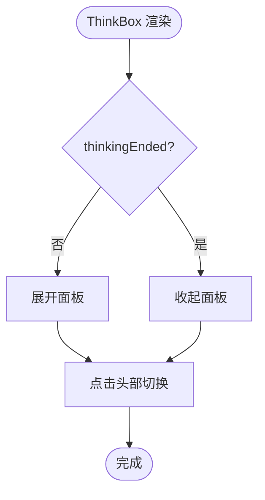

# 聊天窗口布局

<cite>
**本文档引用的文件**
- [src/components/ChatWindow.tsx](file://src/components/ChatWindow.tsx)
- [src/components/EmptyChat.tsx](file://src/components/EmptyChat.tsx)
- [src/components/DeleteChat.tsx](file://src/components/DeleteChat.tsx)
- [src/components/ThinkBox.tsx](file://src/components/ThinkBox.tsx)
- [src/components/Chat.tsx](file://src/components/Chat.tsx)
- [src/components/EmptyChatMessageInput.tsx](file://src/components/EmptyChatMessageInput.tsx)
- [src/components/MessageBox.tsx](file://src/components/MessageBox.tsx)
- [src/components/MessageBoxLoading.tsx](file://src/components/MessageBoxLoading.tsx)
- [src/components/MessageInput.tsx](file://src/components/MessageInput.tsx)
- [src/components/MessageSources.tsx](file://src/components/MessageSources.tsx)
- [src/lib/hooks/useChat.tsx](file://src/lib/hooks/useChat.tsx)
- [src/lib/types.ts](file://src/lib/types.ts)
- [src/app/layout.tsx](file://src/app/layout.tsx)
- [src/components/Layout.tsx](file://src/components/Layout.tsx)
</cite>

## 目录
1. [简介](#简介)
2. [项目结构](#项目结构)
3. [核心组件](#核心组件)
4. [架构总览](#架构总览)
5. [详细组件分析](#详细组件分析)
6. [依赖关系分析](#依赖关系分析)
7. [性能考虑](#性能考虑)
8. [故障排除指南](#故障排除指南)
9. [结论](#结论)
10. [附录](#附录)

## 简介
本文件聚焦于聊天窗口布局相关组件，系统性梳理 ChatWindow、EmptyChat、DeleteChat、ThinkBox 的整体布局结构、响应式设计与交互逻辑，并结合 Chat、MessageBox、MessageInput 等子组件，给出样式定制、动画效果与用户体验优化策略，同时覆盖移动端适配与无障碍支持。

## 项目结构
聊天窗口布局相关的核心文件组织如下：
- 布局容器与入口：ChatWindow、Chat、Layout
- 空状态与输入：EmptyChat、EmptyChatMessageInput
- 消息渲染与输入：MessageBox、MessageInput、MessageBoxLoading、MessageSources
- 思考过程展示：ThinkBox
- 会话删除确认：DeleteChat
- 全局上下文与类型：useChat、types

图表来源
- [src/components/ChatWindow.tsx](file://src/components/ChatWindow.tsx#L36-L74)
- [src/components/Chat.tsx](file://src/components/Chat.tsx#L9-L108)
- [src/components/Layout.tsx](file://src/components/Layout.tsx#L1-L10)
- [src/components/EmptyChat.tsx](file://src/components/EmptyChat.tsx#L16-L73)
- [src/components/EmptyChatMessageInput.tsx](file://src/components/EmptyChatMessageInput.tsx#L10-L88)
- [src/components/MessageBox.tsx](file://src/components/MessageBox.tsx#L42-L290)
- [src/components/MessageInput.tsx](file://src/components/MessageInput.tsx#L8-L102)
- [src/components/MessageBoxLoading.tsx](file://src/components/MessageBoxLoading.tsx#L1-L12)
- [src/components/MessageSources.tsx](file://src/components/MessageSources.tsx#L13-L165)
- [src/components/ThinkBox.tsx](file://src/components/ThinkBox.tsx#L11-L51)
- [src/components/DeleteChat.tsx](file://src/components/DeleteChat.tsx#L15-L125)
- [src/lib/hooks/useChat.tsx](file://src/lib/hooks/useChat.tsx#L241-L268)
- [src/lib/types.ts](file://src/lib/types.ts#L118-L124)

章节来源
- [src/components/ChatWindow.tsx](file://src/components/ChatWindow.tsx#L36-L74)
- [src/components/Chat.tsx](file://src/components/Chat.tsx#L61-L105)
- [src/components/Layout.tsx](file://src/components/Layout.tsx#L1-L10)

## 核心组件
- ChatWindow：根据聊天上下文状态决定渲染 Chat 或 EmptyChat；错误时显示连接失败提示；加载中显示中心化加载器。
- Chat：负责消息分段渲染、输入框固定定位、滚动行为与响应式宽度计算；在有消息时渲染 MessageBox 列表。
- EmptyChat：空状态页，包含标题、输入框、天气/新闻小部件区域；监听配置变化动态更新可见性。
- MessageBox：单条消息的渲染容器，处理思考标签、引用、研究步骤、建议、语音朗读等；右侧附带图片/视频搜索入口。
- MessageInput：可伸缩输入框，支持快捷键聚焦、多行模式切换、发送消息。
- ThinkBox：思考过程折叠面板，随思考结束自动收起。
- DeleteChat：删除会话确认对话框，调用后端接口并更新本地列表。
- useChat：全局聊天上下文，管理消息流、分段解析、重连、建议生成、模型配置等。
- types：消息块类型定义（文本、来源、建议、小部件、研究等）。

章节来源
- [src/components/ChatWindow.tsx](file://src/components/ChatWindow.tsx#L36-L74)
- [src/components/Chat.tsx](file://src/components/Chat.tsx#L9-L108)
- [src/components/EmptyChat.tsx](file://src/components/EmptyChat.tsx#L16-L73)
- [src/components/MessageBox.tsx](file://src/components/MessageBox.tsx#L42-L290)
- [src/components/MessageInput.tsx](file://src/components/MessageInput.tsx#L8-L102)
- [src/components/ThinkBox.tsx](file://src/components/ThinkBox.tsx#L11-L51)
- [src/components/DeleteChat.tsx](file://src/components/DeleteChat.tsx#L15-L125)
- [src/lib/hooks/useChat.tsx](file://src/lib/hooks/useChat.tsx#L241-L268)
- [src/lib/types.ts](file://src/lib/types.ts#L118-L124)

## 架构总览
聊天窗口采用“容器-子组件”分层结构，通过 useChat 提供统一的状态与事件流，各子组件按职责解耦协作。

图表来源
- [src/components/ChatWindow.tsx](file://src/components/ChatWindow.tsx#L36-L74)
- [src/components/Chat.tsx](file://src/components/Chat.tsx#L9-L108)
- [src/lib/hooks/useChat.tsx](file://src/lib/hooks/useChat.tsx#L714-L800)

## 详细组件分析

### ChatWindow 组件
- 功能要点
  - 错误态：当 hasError 为真时，显示居中错误提示与设置按钮。
  - 加载态：isReady 未就绪时显示全屏加载器。
  - 内容态：messages 长度大于 0 时渲染 Navbar 与 Chat；否则渲染 EmptyChat。
  - 404：notFound 为真时使用 NextError 渲染 404。
- 响应式设计
  - 使用 flex 布局与 min-h-screen 确保占满视口。
  - 设置按钮绝对定位在右上角，保证不参与主内容流。
- 无障碍与可访问性
  - 文本颜色使用明暗对比度类名，确保在深浅色主题下可读。
  - 错误信息为纯文本，便于屏幕阅读器识别。

图表来源
- [src/components/ChatWindow.tsx](file://src/components/ChatWindow.tsx#L36-L74)

章节来源
- [src/components/ChatWindow.tsx](file://src/components/ChatWindow.tsx#L36-L74)

### EmptyChat 组件
- 功能要点
  - 标题与输入：顶部展示引导语，下方嵌入 EmptyChatMessageInput。
  - 小部件区域：根据客户端配置动态显示天气或新闻小部件，支持响应式两列布局。
  - 配置监听：监听 client-config-changed 与 storage 事件，实时更新可见性。
- 响应式设计
  - 使用 max-w-screen-sm 限制最大宽度，mx-auto 居中。
  - sm:flex-row 在小屏时纵向堆叠，大屏横向并排。
- 无障碍与可访问性
  - 标题语义化为 h2，输入框具备占位符与键盘快捷键支持。
  - 小部件卡片具备链接与图标，便于点击与识别。

图表来源
- [src/components/EmptyChat.tsx](file://src/components/EmptyChat.tsx#L16-L73)

章节来源
- [src/components/EmptyChat.tsx](file://src/components/EmptyChat.tsx#L16-L73)

### DeleteChat 组件
- 功能要点
  - 触发：点击垃圾桶图标弹出确认对话框。
  - 删除流程：调用 DELETE /api/chats/:id，成功后从父组件传入的 chats 列表中移除对应项；可选重定向首页。
  - 安全控制：在 loading 期间禁用关闭与删除按钮，避免重复请求。
  - 反馈：异常时通过 toast 显示错误信息。
- 用户体验
  - 过渡动画：使用 Transition/TransitionChild 实现淡入淡出与缩放过渡。
  - 对话框样式：使用深浅主题边框与背景，提升可读性。

图表来源
- [src/components/DeleteChat.tsx](file://src/components/DeleteChat.tsx#L15-L125)

章节来源
- [src/components/DeleteChat.tsx](file://src/components/DeleteChat.tsx#L15-L125)

### ThinkBox 组件
- 功能要点
  - 折叠面板：默认展开，当 thinkingEnded 为真时自动收起。
  - 交互：点击头部切换展开/收起，显示思考过程内容。
  - 视觉：使用渐变色图标与主题色，区分不同状态。
- 用户体验
  - 动画：展开/收起使用过渡动画，提升反馈感。
  - 可读性：内容区使用白色/深色背景与边框，突出文本。

图表来源
- [src/components/ThinkBox.tsx](file://src/components/ThinkBox.tsx#L11-L51)

章节来源
- [src/components/ThinkBox.tsx](file://src/components/ThinkBox.tsx#L11-L51)

### Chat 组件
- 功能要点
  - 分段渲染：基于 useChat 的 sections 逐条渲染 MessageBox。
  - 固定输入：在消息区域底部固定 MessageInput，使用 ResizeObserver 动态计算宽度以适配侧边栏。
  - 自动滚动：新消息到达时滚动到底部，首条消息时更新浏览器标题。
  - 加载占位：loading 且首次出现时显示 MessageBoxLoading。
- 响应式设计
  - 使用 lg:pb、sm:mx 等 Tailwind 断点类实现桌面端与移动端间距差异。
  - 固定定位 bottom-24/lg:bottom-6 适配不同设备底部安全区。
- 无障碍与可访问性
  - 滚动行为为自动，确保新消息可见。
  - 按钮与交互元素具备 hover 状态，便于触控设备反馈。

图表来源
- [src/components/Chat.tsx](file://src/components/Chat.tsx#L9-L108)

章节来源
- [src/components/Chat.tsx](file://src/components/Chat.tsx#L9-L108)

### MessageBox 组件
- 功能要点
  - 内容渲染：Markdown 解析，支持内联代码、代码块、思考标签与引用。
  - 思考过程：通过 ThinkBox 渲染 think 标签包裹的内容。
  - 研究步骤：当存在 research 块时渲染 AssistantSteps。
  - 源头与建议：根据 sources 与 suggestions 渲染来源与相关建议。
  - 语音朗读：集成 react-text-to-speech 控制播放/停止。
  - 右侧媒体：在有内容时显示图片/视频搜索入口。
- 用户体验
  - 交互：复制、改写、语音播放按钮具备 hover 效果。
  - 建议列表：使用分隔线与图标增强可读性与点击反馈。

图表来源
- [src/components/MessageBox.tsx](file://src/components/MessageBox.tsx#L42-L290)

章节来源
- [src/components/MessageBox.tsx](file://src/components/MessageBox.tsx#L42-L290)

### MessageInput 与 EmptyChatMessageInput
- 功能要点
  - 快捷键：未聚焦输入时按 / 自动聚焦输入框。
  - 多行模式：根据高度变化自动在单行与多行之间切换。
  - 发送：支持回车发送，禁用无效状态。
- 用户体验
  - 占位符与禁用态视觉反馈明确。
  - 附件按钮与发送按钮布局合理，移动端紧凑适配。

章节来源
- [src/components/MessageInput.tsx](file://src/components/MessageInput.tsx#L8-L102)
- [src/components/EmptyChatMessageInput.tsx](file://src/components/EmptyChatMessageInput.tsx#L10-L88)

### MessageBoxLoading 与 MessageSources
- MessageBoxLoading：骨架屏动画，提升加载感知。
- MessageSources：来源卡片网格，超过阈值时弹窗展示完整列表，支持滚动与无障碍链接。

章节来源
- [src/components/MessageBoxLoading.tsx](file://src/components/MessageBoxLoading.tsx#L1-L12)
- [src/components/MessageSources.tsx](file://src/components/MessageSources.tsx#L13-L165)

## 依赖关系分析
- ChatWindow 依赖 useChat 提供的 isReady、messages、notFound、hasError 等状态。
- Chat 依赖 useChat 的 sections、loading、messageAppeared、messages，以及 MessageInput、MessageBox、MessageBoxLoading。
- MessageBox 依赖 useChat 的 sendMessage、rewrite、messages、researchEnded、chatHistory，以及 ThinkBox、MessageSources、Widgets Renderer、AssistantSteps。
- EmptyChat 依赖 EmptyChatMessageInput 与天气/新闻小部件，监听客户端配置事件。
- DeleteChat 依赖父组件传递的 chats 与 setChats，调用后端接口。
- 类型系统由 useChat 中的 Section 与 lib/types 中的 Block 定义支撑。

图表来源
- [src/lib/hooks/useChat.tsx](file://src/lib/hooks/useChat.tsx#L241-L268)
- [src/lib/types.ts](file://src/lib/types.ts#L118-L124)
- [src/components/ChatWindow.tsx](file://src/components/ChatWindow.tsx#L36-L74)
- [src/components/Chat.tsx](file://src/components/Chat.tsx#L9-L108)
- [src/components/MessageBox.tsx](file://src/components/MessageBox.tsx#L42-L290)
- [src/components/MessageInput.tsx](file://src/components/MessageInput.tsx#L8-L102)
- [src/components/EmptyChatMessageInput.tsx](file://src/components/EmptyChatMessageInput.tsx#L10-L88)
- [src/components/EmptyChat.tsx](file://src/components/EmptyChat.tsx#L16-L73)
- [src/components/DeleteChat.tsx](file://src/components/DeleteChat.tsx#L15-L125)
- [src/components/ThinkBox.tsx](file://src/components/ThinkBox.tsx#L11-L51)
- [src/components/MessageSources.tsx](file://src/components/MessageSources.tsx#L13-L165)

章节来源
- [src/lib/hooks/useChat.tsx](file://src/lib/hooks/useChat.tsx#L241-L268)
- [src/lib/types.ts](file://src/lib/types.ts#L118-L124)

## 性能考虑
- 流式渲染：useChat 通过流式事件增量更新消息块，减少重绘与回流。
- ResizeObserver：Chat 中对容器宽度进行观测，避免频繁计算导致的性能损耗。
- 条件渲染：仅在需要时渲染研究步骤、来源与建议，降低 DOM 负担。
- 动画与过渡：适度使用过渡与骨架屏，平衡流畅度与资源占用。
- 图片与视频搜索：延迟触发与条件判断，避免不必要的网络请求。

## 故障排除指南
- 服务器连接失败
  - 现象：ChatWindow 显示错误提示。
  - 处理：检查网络与后端服务状态，稍后重试。
- 会话删除失败
  - 现象：DeleteChat 弹窗内显示错误提示。
  - 处理：确认会话 ID 正确、权限有效；查看后端日志。
- 输入无响应
  - 现象：MessageInput/EmptyChatMessageInput 无法发送。
  - 处理：检查 loading 状态、禁用态条件与快捷键冲突。
- 思考面板不展开/不收起
  - 现象：ThinkBox 不随思考结束自动收起。
  - 处理：确认 thinkingEnded 状态正确传递至 ThinkBox。

章节来源
- [src/components/ChatWindow.tsx](file://src/components/ChatWindow.tsx#L36-L74)
- [src/components/DeleteChat.tsx](file://src/components/DeleteChat.tsx#L15-L125)
- [src/components/MessageInput.tsx](file://src/components/MessageInput.tsx#L8-L102)
- [src/components/EmptyChatMessageInput.tsx](file://src/components/EmptyChatMessageInput.tsx#L10-L88)
- [src/components/ThinkBox.tsx](file://src/components/ThinkBox.tsx#L11-L51)

## 结论
聊天窗口布局通过清晰的分层与解耦设计，实现了从空状态到消息流的完整体验。借助 useChat 的上下文能力与响应式布局策略，组件在桌面与移动端均具备良好的可用性与可访问性。建议在后续迭代中进一步完善无障碍标签与键盘导航，持续优化流式渲染与骨架屏的交互细节。

## 附录
- 样式定制选项
  - 主题：通过深浅色主题类名统一风格，支持自定义颜色变量。
  - 布局：使用断点类实现响应式间距与宽度，适配不同屏幕尺寸。
  - 动画：过渡与骨架屏动画提升交互感知，需注意性能影响。
- 移动端适配
  - 输入框：单行/多行模式自动切换，避免遮挡与溢出。
  - 固定输入：底部安全区适配，使用 lg:bottom-6 等断点类。
  - 小部件：sm:flex-row 控制两列布局，避免横向滚动。
- 无障碍支持
  - 文本对比度：使用明暗对比度类名确保可读性。
  - 键盘导航：快捷键聚焦与表单提交，提升键盘友好性。
  - 语义化标签：标题、按钮与列表具备清晰语义，利于屏幕阅读器。