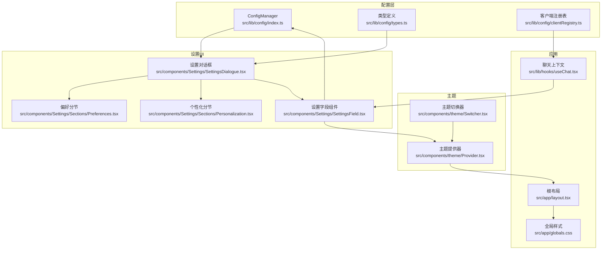
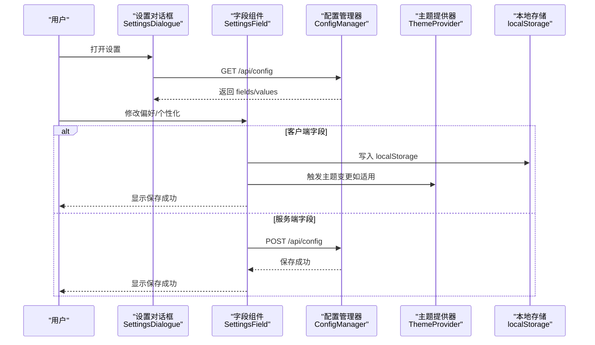
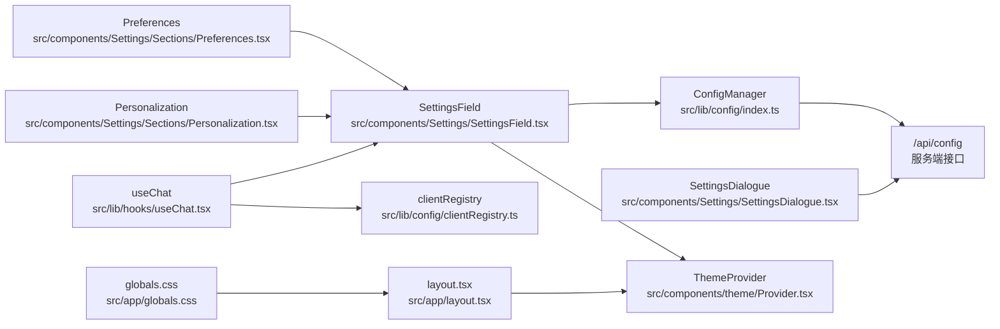

# 个性化设置

<cite>
**本文引用的文件**
- [src/lib/config/index.ts](file://src/lib/config/index.ts)
- [src/lib/config/types.ts](file://src/lib/config/types.ts)
- [src/lib/config/clientRegistry.ts](file://src/lib/config/clientRegistry.ts)
- [src/components/Settings/SettingsDialogue.tsx](file://src/components/Settings/SettingsDialogue.tsx)
- [src/components/Settings/Sections/Preferences.tsx](file://src/components/Settings/Sections/Preferences.tsx)
- [src/components/Settings/Sections/Personalization.tsx](file://src/components/Settings/Sections/Personalization.tsx)
- [src/components/Settings/SettingsField.tsx](file://src/components/Settings/SettingsField.tsx)
- [src/components/theme/Provider.tsx](file://src/components/theme/Provider.tsx)
- [src/components/theme/Switcher.tsx](file://src/components/theme/Switcher.tsx)
- [src/app/layout.tsx](file://src/app/layout.tsx)
- [src/app/globals.css](file://src/app/globals.css)
- [src/lib/hooks/useChat.tsx](file://src/lib/hooks/useChat.tsx)
- [tailwind.config.ts](file://tailwind.config.ts)
</cite>

## 目录
1. [简介](#简介)
2. [项目结构](#项目结构)
3. [核心组件](#核心组件)
4. [架构总览](#架构总览)
5. [详细组件分析](#详细组件分析)
6. [依赖关系分析](#依赖关系分析)
7. [性能考量](#性能考量)
8. [故障排查指南](#故障排查指南)
9. [结论](#结论)
10. [附录](#附录)

## 简介
本文件系统性梳理 Perplexica 的“个性化设置”功能，覆盖用户界面定制、主题选择、偏好配置与行为个性化等模块。内容包括：
- 功能范围：主题切换、测量单位、自动媒体搜索、天气/新闻小部件显示、模型系统提示词等
- 存储机制：客户端本地存储（localStorage）与服务端持久化（文件系统）
- 同步方式：设置对话框通过 API 拉取/保存配置；主题变更即时生效
- 默认值管理：UI 配置字段定义默认值，客户端读取时回退至默认
- 集成方式：与全局状态（聊天上下文、主题提供器）协同工作
- 响应式与无障碍：移动端适配、可访问性交互与视觉层次

## 项目结构
个性化设置相关代码主要分布在以下位置：
- 配置与类型定义：src/lib/config/*
- 设置对话框与分节：src/components/Settings/*
- 主题提供与切换：src/components/theme/*
- 应用布局与样式：src/app/*
- 聊天上下文与个性化联动：src/lib/hooks/useChat.tsx

图表来源
- [src/lib/config/index.ts](file://src/lib/config/index.ts#L1-L391)
- [src/lib/config/types.ts](file://src/lib/config/types.ts#L1-L110)
- [src/lib/config/clientRegistry.ts](file://src/lib/config/clientRegistry.ts#L1-L30)
- [src/components/Settings/SettingsDialogue.tsx](file://src/components/Settings/SettingsDialogue.tsx#L1-L294)
- [src/components/Settings/Sections/Preferences.tsx](file://src/components/Settings/Sections/Preferences.tsx#L1-L30)
- [src/components/Settings/Sections/Personalization.tsx](file://src/components/Settings/Sections/Personalization.tsx#L1-L30)
- [src/components/Settings/SettingsField.tsx](file://src/components/Settings/SettingsField.tsx#L1-L379)
- [src/components/theme/Provider.tsx](file://src/components/theme/Provider.tsx#L1-L17)
- [src/components/theme/Switcher.tsx](file://src/components/theme/Switcher.tsx#L1-L61)
- [src/app/layout.tsx](file://src/app/layout.tsx#L1-L60)
- [src/app/globals.css](file://src/app/globals.css#L1-L100)
- [src/lib/hooks/useChat.tsx](file://src/lib/hooks/useChat.tsx#L1-L848)

章节来源
- [src/lib/config/index.ts](file://src/lib/config/index.ts#L1-L391)
- [src/components/Settings/SettingsDialogue.tsx](file://src/components/Settings/SettingsDialogue.tsx#L1-L294)
- [src/components/theme/Provider.tsx](file://src/components/theme/Provider.tsx#L1-L17)
- [src/app/layout.tsx](file://src/app/layout.tsx#L1-L60)

## 核心组件
- 配置管理器（ConfigManager）
  - 负责配置文件初始化、迁移、读取与更新
  - 定义 UI 配置分组（preferences/personalization/modelProviders/search）
  - 支持从环境变量注入服务器端配置
- 设置对话框（SettingsDialogue）
  - 提供偏好、个性化、模型、搜索四个分节
  - 按管理员权限动态显示/隐藏高级分节
  - 拉取/保存配置，支持客户端与服务端字段
- 分节组件（Preferences/Personalization）
  - 渲染对应分组下的字段列表
  - 从 localStorage 或服务端值中读取当前值
- 字段组件（SettingsField）
  - 统一处理 select/string/textarea/switch 四类输入
  - 客户端字段写入 localStorage 并触发事件
  - 服务端字段通过 /api/config 保存
- 主题系统（ThemeProvider/ThemeSwitcher）
  - 使用 next-themes 实现明暗主题与系统跟随
  - 切换时即时更新 DOM 属性与类名
- 客户端注册表（clientRegistry）
  - 封装 localStorage 读取，提供主题、测量单位、系统提示等便捷函数
- 聊天上下文（useChat）
  - 在发送消息时读取系统提示词与自动媒体搜索开关
  - 与个性化设置形成运行时联动

章节来源
- [src/lib/config/index.ts](file://src/lib/config/index.ts#L1-L391)
- [src/components/Settings/SettingsDialogue.tsx](file://src/components/Settings/SettingsDialogue.tsx#L1-L294)
- [src/components/Settings/Sections/Preferences.tsx](file://src/components/Settings/Sections/Preferences.tsx#L1-L30)
- [src/components/Settings/Sections/Personalization.tsx](file://src/components/Settings/Sections/Personalization.tsx#L1-L30)
- [src/components/Settings/SettingsField.tsx](file://src/components/Settings/SettingsField.tsx#L1-L379)
- [src/components/theme/Provider.tsx](file://src/components/theme/Provider.tsx#L1-L17)
- [src/components/theme/Switcher.tsx](file://src/components/theme/Switcher.tsx#L1-L61)
- [src/lib/config/clientRegistry.ts](file://src/lib/config/clientRegistry.ts#L1-L30)
- [src/lib/hooks/useChat.tsx](file://src/lib/hooks/useChat.tsx#L1-L848)

## 架构总览
个性化设置的端到端流程如下：

图表来源
- [src/components/Settings/SettingsDialogue.tsx](file://src/components/Settings/SettingsDialogue.tsx#L90-L122)
- [src/components/Settings/SettingsField.tsx](file://src/components/Settings/SettingsField.tsx#L35-L68)
- [src/lib/config/index.ts](file://src/lib/config/index.ts#L240-L272)
- [src/components/theme/Provider.tsx](file://src/components/theme/Provider.tsx#L1-L17)

## 详细组件分析

### 配置管理器（ConfigManager）
- 职责
  - 初始化配置文件（不存在则生成默认配置）
  - 从环境变量注入模型提供商与搜索配置
  - 提供读取/更新配置的方法
  - 暴露 UI 配置分组（preferences/personalization 等）
- 数据结构
  - Config 结构包含版本、设置完成标记、preferences、personalization、模型提供商、search 等
  - UIConfigSections 定义各分组的字段集合与默认值
- 关键方法
  - getConfig(key, default?)：按点号路径读取嵌套配置
  - updateConfig(key, val)：按路径写入并持久化
  - getUIConfigSections()：返回 UI 字段定义
- 运行时影响
  - 设置对话框通过 /api/config 获取 fields/values
  - 字段组件在客户端/服务端两种模式下分别写入 localStorage 或调用后端接口

章节来源
- [src/lib/config/index.ts](file://src/lib/config/index.ts#L1-L391)
- [src/lib/config/types.ts](file://src/lib/config/types.ts#L63-L96)

### 设置对话框（SettingsDialogue）
- 功能
  - 分节导航：偏好、个性化、模型、搜索
  - 权限控制：仅管理员可见模型与搜索分节
  - 加载与保存：GET /api/config 拉取；POST /api/config 保存
  - 移动端适配：底部选择器与抽屉式布局
- 与配置管理器协作
  - 通过 /api/config 读取 fields/values
  - 服务端字段写入由 ConfigManager.updateConfig 处理

章节来源
- [src/components/Settings/SettingsDialogue.tsx](file://src/components/Settings/SettingsDialogue.tsx#L1-L294)
- [src/lib/config/index.ts](file://src/lib/config/index.ts#L240-L272)

### 分节组件（Preferences/Personalization）
- 行为
  - 遍历 fields，渲染对应字段
  - 读取值策略：客户端字段优先从 localStorage 读取，否则回退到默认值；服务端字段从 values 中取
- 作用域
  - Preferences：主题、测量单位、自动媒体搜索、天气/新闻小部件显示等
  - Personalization：系统提示词等行为个性化

章节来源
- [src/components/Settings/Sections/Preferences.tsx](file://src/components/Settings/Sections/Preferences.tsx#L1-L30)
- [src/components/Settings/Sections/Personalization.tsx](file://src/components/Settings/Sections/Personalization.tsx#L1-L30)

### 字段组件（SettingsField）
- 输入类型统一处理
  - Select：下拉选择，支持主题即时切换
  - String/Textarea：文本输入，失焦保存
  - Switch：开关，布尔值序列化为字符串存储
- 保存逻辑
  - 客户端字段：写入 localStorage，并触发“client-config-changed”事件
  - 服务端字段：POST /api/config，由 ConfigManager.updateConfig 持久化
- 主题联动
  - 当字段为 theme 时，保存后立即调用 setTheme 更新主题

章节来源
- [src/components/Settings/SettingsField.tsx](file://src/components/Settings/SettingsField.tsx#L1-L379)

### 主题系统（ThemeProvider/ThemeSwitcher）
- Provider
  - 使用 next-themes，启用系统主题但禁用系统默认主题
  - 默认深色主题
- Switcher
  - 读取当前主题，监听系统主题变化（prefers-color-scheme）
  - 避免水合不匹配（SSR/CSR）导致的闪烁
- 与设置联动
  - 设置对话框中的主题选择会通过 SettingsField 写入 localStorage 并触发 setTheme

章节来源
- [src/components/theme/Provider.tsx](file://src/components/theme/Provider.tsx#L1-L17)
- [src/components/theme/Switcher.tsx](file://src/components/theme/Switcher.tsx#L1-L61)
- [src/components/Settings/SettingsField.tsx](file://src/components/Settings/SettingsField.tsx#L35-L44)

### 客户端注册表（clientRegistry）
- 作用
  - 从 localStorage 读取配置并提供默认值
  - 提供 getTheme、getMeasurementUnit、getSystemInstructions 等便捷函数
- 与聊天上下文联动
  - useChat 在发送消息时读取系统提示词与自动媒体搜索开关

章节来源
- [src/lib/config/clientRegistry.ts](file://src/lib/config/clientRegistry.ts#L1-L30)
- [src/lib/hooks/useChat.tsx](file://src/lib/hooks/useChat.tsx#L775-L776)

### 应用布局与样式（layout/globals.css）
- 布局
  - 根布局包裹 ThemeProvider，确保主题系统生效
  - 根据设置向导完成状态决定渲染聊天或引导页
- 样式
  - Tailwind 自定义明暗色阶，支持平滑滚动与自定义滚动条
  - 适配移动端字体大小与交互体验

章节来源
- [src/app/layout.tsx](file://src/app/layout.tsx#L1-L60)
- [src/app/globals.css](file://src/app/globals.css#L1-L100)
- [tailwind.config.ts](file://tailwind.config.ts#L1-L58)

## 依赖关系分析
个性化设置涉及的关键依赖与耦合如下：

图表来源
- [src/lib/config/index.ts](file://src/lib/config/index.ts#L240-L272)
- [src/components/Settings/SettingsDialogue.tsx](file://src/components/Settings/SettingsDialogue.tsx#L104-L117)
- [src/components/Settings/SettingsField.tsx](file://src/components/Settings/SettingsField.tsx#L35-L68)
- [src/components/theme/Provider.tsx](file://src/components/theme/Provider.tsx#L1-L17)
- [src/components/Settings/Sections/Preferences.tsx](file://src/components/Settings/Sections/Preferences.tsx#L1-L30)
- [src/components/Settings/Sections/Personalization.tsx](file://src/components/Settings/Sections/Personalization.tsx#L1-L30)
- [src/lib/config/clientRegistry.ts](file://src/lib/config/clientRegistry.ts#L1-L30)
- [src/lib/hooks/useChat.tsx](file://src/lib/hooks/useChat.tsx#L775-L776)
- [src/app/layout.tsx](file://src/app/layout.tsx#L38-L55)
- [src/app/globals.css](file://src/app/globals.css#L1-L100)

章节来源
- [src/lib/config/index.ts](file://src/lib/config/index.ts#L1-L391)
- [src/components/Settings/SettingsDialogue.tsx](file://src/components/Settings/SettingsDialogue.tsx#L1-L294)
- [src/components/Settings/SettingsField.tsx](file://src/components/Settings/SettingsField.tsx#L1-L379)
- [src/components/theme/Provider.tsx](file://src/components/theme/Provider.tsx#L1-L17)
- [src/lib/config/clientRegistry.ts](file://src/lib/config/clientRegistry.ts#L1-L30)
- [src/lib/hooks/useChat.tsx](file://src/lib/hooks/useChat.tsx#L1-L848)
- [src/app/layout.tsx](file://src/app/layout.tsx#L1-L60)
- [src/app/globals.css](file://src/app/globals.css#L1-L100)

## 性能考量
- 客户端字段写入
  - localStorage 写入为本地操作，延迟极低；建议批量修改时减少多次重绘
- 服务端字段保存
  - 每次变更均发起网络请求，建议在高频场景下合并保存或增加防抖
- 主题切换
  - 通过 setTheme 更新 DOM 类名，避免全量重渲染；注意 SSR/CSR 水合期间的闪烁规避
- 样式与滚动
  - 自定义滚动条与平滑滚动提升体验，但需关注低端设备性能

## 故障排查指南
- 无法保存服务端字段
  - 检查 /api/config 接口是否可达，确认返回状态码与错误信息
  - 查看浏览器控制台网络面板与后端日志
- 主题切换无效
  - 确认 ThemeProvider 已包裹根组件
  - 检查浏览器是否禁用类名切换或存在样式冲突
- 个性化设置未生效
  - 确认 localStorage 中对应键值已更新
  - 对于聊天上下文，检查 useChat 是否正确读取系统提示词
- 配置文件损坏
  - ConfigManager 在解析失败时会回退到默认配置并覆盖原文件，检查 data/config.json 内容

章节来源
- [src/components/Settings/SettingsField.tsx](file://src/components/Settings/SettingsField.tsx#L57-L60)
- [src/components/theme/Provider.tsx](file://src/components/theme/Provider.tsx#L1-L17)
- [src/lib/config/index.ts](file://src/lib/config/index.ts#L148-L164)
- [src/lib/hooks/useChat.tsx](file://src/lib/hooks/useChat.tsx#L775-L776)

## 结论
Perplexica 的个性化设置以 ConfigManager 为核心，结合 SettingsDialogue 与 SettingsField 实现了“客户端/服务端双轨”的配置体系。主题系统与聊天上下文紧密集成，既保证了用户体验的一致性，又提供了灵活的行为定制能力。通过 localStorage 与文件系统的配合，实现了跨会话持久化与默认值回退。未来可在高频保存场景引入防抖与批处理，进一步优化性能。

## 附录

### 个性化设置功能清单与默认值
- 主题（preferences.theme）
  - 可选：light/dark
  - 默认：dark
  - 作用：切换明暗主题
- 测量单位（preferences.measureUnit）
  - 可选：Metric/Imperial
  - 默认：Metric
  - 作用：影响天气/新闻等小部件数值显示
- 自动媒体搜索（preferences.autoMediaSearch）
  - 类型：开关
  - 默认：true
  - 作用：回答完成后自动触发图片/视频搜索
- 天气小部件（preferences.showWeatherWidget）
  - 类型：开关
  - 默认：true
- 新闻小部件（preferences.showNewsWidget）
  - 类型：开关
  - 默认：true
- 系统提示词（personalization.systemInstructions）
  - 类型：多行文本
  - 默认：空字符串
  - 作用：定制模型行为与语气

章节来源
- [src/lib/config/index.ts](file://src/lib/config/index.ts#L24-L116)
- [src/components/Settings/Sections/Preferences.tsx](file://src/components/Settings/Sections/Preferences.tsx#L1-L30)
- [src/components/Settings/Sections/Personalization.tsx](file://src/components/Settings/Sections/Personalization.tsx#L1-L30)

### 使用示例（如何根据用户喜好定制界面）
- 切换主题
  - 在“偏好”分节选择“主题”，设置将即时写入 localStorage 并触发主题切换
- 调整测量单位
  - 在“偏好”分节选择“测量单位”，影响天气/新闻小部件显示
- 开启/关闭自动媒体搜索
  - 在“偏好”分节切换“自动媒体搜索”，聊天结束后自动触发图片/视频搜索
- 自定义系统提示词
  - 在“个性化”分节填写“系统提示词”，发送消息时将作为系统指令传入模型

章节来源
- [src/components/Settings/SettingsDialogue.tsx](file://src/components/Settings/SettingsDialogue.tsx#L26-L63)
- [src/components/Settings/SettingsField.tsx](file://src/components/Settings/SettingsField.tsx#L35-L68)
- [src/lib/hooks/useChat.tsx](file://src/lib/hooks/useChat.tsx#L775-L776)

### 与全局状态管理的集成
- 聊天上下文读取个性化设置
  - useChat 在发送消息时读取 systemInstructions 与 autoMediaSearch
- 主题提供器驱动 UI
  - ThemeProvider 与 ThemeSwitcher 通过 setTheme 控制明暗主题
- 设置变更事件
  - SettingsField 在客户端字段保存后触发“client-config-changed”，可用于订阅刷新

章节来源
- [src/lib/hooks/useChat.tsx](file://src/lib/hooks/useChat.tsx#L667-L679)
- [src/components/theme/Provider.tsx](file://src/components/theme/Provider.tsx#L1-L17)
- [src/components/Settings/SettingsField.tsx](file://src/components/Settings/SettingsField.tsx#L15-L19)

### 响应式设计与无障碍访问
- 响应式
  - 设置对话框在移动端采用抽屉式布局与底部选择器
  - Tailwind 自定义颜色与滚动条，适配不同设备
- 无障碍
  - 使用语义化标签与键盘可访问性
  - 主题切换与开关组件具备清晰的状态反馈

章节来源
- [src/components/Settings/SettingsDialogue.tsx](file://src/components/Settings/SettingsDialogue.tsx#L224-L248)
- [src/app/globals.css](file://src/app/globals.css#L1-L100)
- [tailwind.config.ts](file://tailwind.config.ts#L1-L58)