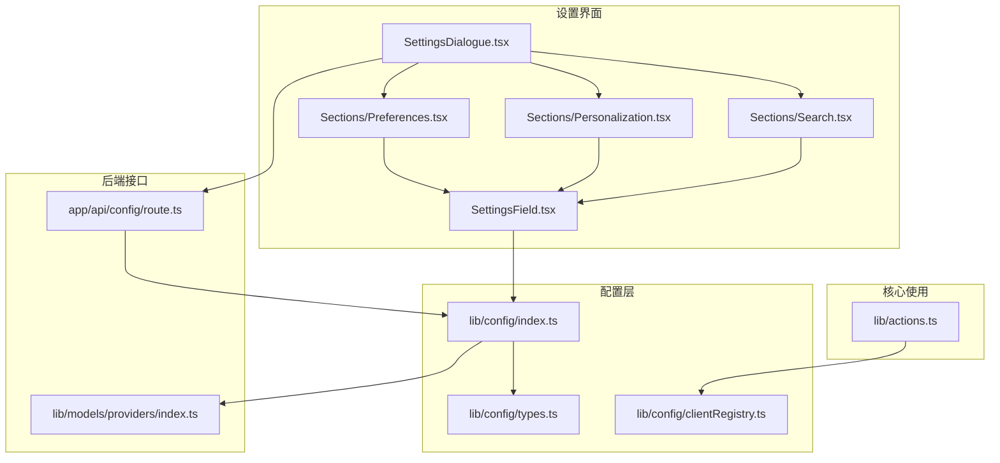
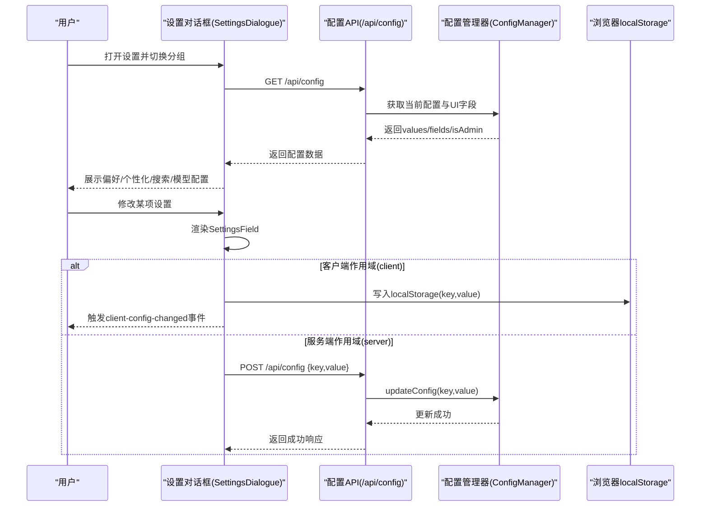
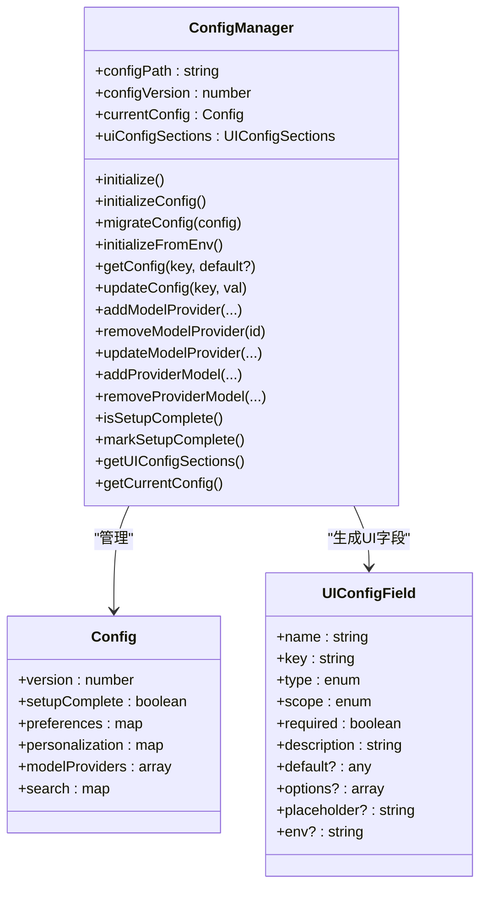
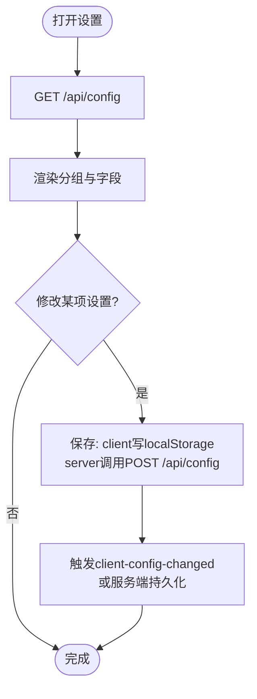
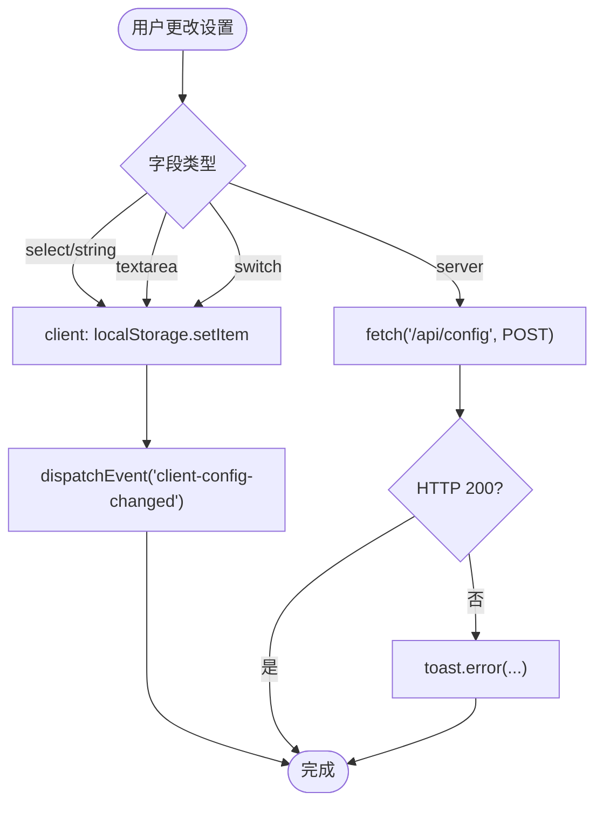
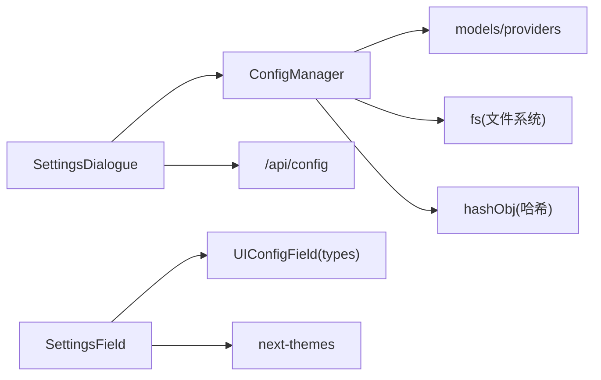

# 偏好设置

<cite>
**本文引用的文件**
- [src/lib/config/index.ts](file://src/lib/config/index.ts)
- [src/lib/config/types.ts](file://src/lib/config/types.ts)
- [src/lib/config/clientRegistry.ts](file://src/lib/config/clientRegistry.ts)
- [src/components/Settings/SettingsDialogue.tsx](file://src/components/Settings/SettingsDialogue.tsx)
- [src/components/Settings/Sections/Preferences.tsx](file://src/components/Settings/Sections/Preferences.tsx)
- [src/components/Settings/Sections/Personalization.tsx](file://src/components/Settings/Sections/Personalization.tsx)
- [src/components/Settings/Sections/Search.tsx](file://src/components/Settings/Sections/Search.tsx)
- [src/components/Settings/SettingsField.tsx](file://src/components/Settings/SettingsField.tsx)
- [src/app/api/config/route.ts](file://src/app/api/config/route.ts)
- [src/lib/models/providers/index.ts](file://src/lib/models/providers/index.ts)
- [src/lib/actions.ts](file://src/lib/actions.ts)
</cite>

## 目录
1. [简介](#简介)
2. [项目结构](#项目结构)
3. [核心组件](#核心组件)
4. [架构总览](#架构总览)
5. [详细组件分析](#详细组件分析)
6. [依赖关系分析](#依赖关系分析)
7. [性能考虑](#性能考虑)
8. [故障排除指南](#故障排除指南)
9. [结论](#结论)
10. [附录](#附录)

## 简介
本文件系统性阐述 Perplexica 的偏好设置功能，覆盖设计与实现、用户行为偏好与默认配置、存储机制与同步方式、数据迁移策略，以及与核心功能模块的集成方式。重点包括：
- 偏好设置的分类：界面主题、度量单位、自动媒体搜索、天气/新闻小部件显示等（偏好）；系统指令（个性化）；搜索服务配置（搜索）。
- 存储与同步：客户端本地存储（localStorage）用于“客户端作用域”偏好；服务端配置用于“服务端作用域”偏好，并通过 /api/config 接口进行读取与更新。
- 数据持久化：首次运行初始化配置文件；支持配置迁移（预留接口）。
- 与核心模块集成：主题切换、系统指令、SearXNG 搜索入口、模型提供者配置等。

## 项目结构
偏好设置相关的代码主要分布在以下位置：
- 配置管理与类型定义：src/lib/config
- 设置对话框与分节组件：src/components/Settings
- 设置项渲染与保存逻辑：src/components/Settings/SettingsField.tsx
- API 路由：src/app/api/config/route.ts
- 客户端配置读取工具：src/lib/config/clientRegistry.ts
- 模型提供者 UI 配置注入：src/lib/models/providers/index.ts
- 行为偏好使用示例：src/lib/actions.ts

图表来源
- [src/components/Settings/SettingsDialogue.tsx](file://src/components/Settings/SettingsDialogue.tsx#L1-L294)
- [src/components/Settings/Sections/Preferences.tsx](file://src/components/Settings/Sections/Preferences.tsx#L1-L30)
- [src/components/Settings/Sections/Personalization.tsx](file://src/components/Settings/Sections/Personalization.tsx#L1-L30)
- [src/components/Settings/Sections/Search.tsx](file://src/components/Settings/Sections/Search.tsx#L1-L30)
- [src/components/Settings/SettingsField.tsx](file://src/components/Settings/SettingsField.tsx#L1-L379)
- [src/lib/config/index.ts](file://src/lib/config/index.ts#L1-L391)
- [src/lib/config/types.ts](file://src/lib/config/types.ts#L1-L110)
- [src/lib/config/clientRegistry.ts](file://src/lib/config/clientRegistry.ts#L1-L30)
- [src/app/api/config/route.ts](file://src/app/api/config/route.ts#L1-L111)
- [src/lib/models/providers/index.ts](file://src/lib/models/providers/index.ts#L1-L36)
- [src/lib/actions.ts](file://src/lib/actions.ts#L1-L23)

章节来源
- [src/lib/config/index.ts](file://src/lib/config/index.ts#L1-L391)
- [src/lib/config/types.ts](file://src/lib/config/types.ts#L1-L110)
- [src/components/Settings/SettingsDialogue.tsx](file://src/components/Settings/SettingsDialogue.tsx#L1-L294)
- [src/components/Settings/SettingsField.tsx](file://src/components/Settings/SettingsField.tsx#L1-L379)
- [src/app/api/config/route.ts](file://src/app/api/config/route.ts#L1-L111)
- [src/lib/config/clientRegistry.ts](file://src/lib/config/clientRegistry.ts#L1-L30)
- [src/lib/models/providers/index.ts](file://src/lib/models/providers/index.ts#L1-L36)
- [src/lib/actions.ts](file://src/lib/actions.ts#L1-L23)

## 核心组件
- 配置管理器（ConfigManager）
  - 负责配置文件的初始化、读取、更新、迁移与导出。
  - 支持“客户端作用域”（client）与“服务端作用域”（server）两类配置字段。
  - 提供获取 UI 配置分组（preferences/personalization/search/modelProviders）与当前配置快照。
- UI 配置类型（UIConfigField）
  - 支持字符串、下拉选择、密码、文本域、开关五种输入类型。
  - 每个字段包含名称、键、是否必填、描述、作用域、环境变量映射等元信息。
- 设置对话框（SettingsDialogue）
  - 加载并展示配置分组，区分公开配置与管理员配置。
  - 支持移动端下拉切换分组。
- 设置项组件（SettingsField）
  - 根据字段类型渲染对应输入控件。
  - 客户端作用域写入 localStorage 并触发“client-config-changed”事件；服务端作用域通过 /api/config 写入服务器配置。
- 客户端配置读取工具（clientRegistry）
  - 封装从 localStorage 读取偏好值的便捷函数，含默认值处理与类型转换。
- API 路由（/api/config）
  - GET：返回当前配置与 UI 字段定义；管理员模式下返回完整值，否则过滤敏感配置。
  - POST：在管理员认证通过后更新指定键的配置值。

章节来源
- [src/lib/config/index.ts](file://src/lib/config/index.ts#L7-L391)
- [src/lib/config/types.ts](file://src/lib/config/types.ts#L3-L110)
- [src/components/Settings/SettingsDialogue.tsx](file://src/components/Settings/SettingsDialogue.tsx#L26-L122)
- [src/components/Settings/SettingsField.tsx](file://src/components/Settings/SettingsField.tsx#L15-L379)
- [src/lib/config/clientRegistry.ts](file://src/lib/config/clientRegistry.ts#L3-L29)
- [src/app/api/config/route.ts](file://src/app/api/config/route.ts#L12-L111)

## 架构总览
偏好设置的读取与更新流程如下：

图表来源
- [src/components/Settings/SettingsDialogue.tsx](file://src/components/Settings/SettingsDialogue.tsx#L90-L122)
- [src/app/api/config/route.ts](file://src/app/api/config/route.ts#L12-L111)
- [src/components/Settings/SettingsField.tsx](file://src/components/Settings/SettingsField.tsx#L35-L140)
- [src/lib/config/index.ts](file://src/lib/config/index.ts#L240-L272)

## 详细组件分析

### 配置管理器（ConfigManager）
- 初始化与迁移
  - 首次运行时创建默认配置文件；若存在旧文件则解析并迁移（当前预留迁移逻辑）。
  - 从环境变量注入模型提供者配置，校验必填项并去重（基于哈希）。
- 配置读取与更新
  - 支持点号路径读取与更新（如 preferences.theme）。
  - 服务端作用域字段通过环境变量回填默认值。
- 模型提供者注入
  - 动态生成模型提供者的 UI 配置分组，结合各提供者的配置字段与元数据。

图表来源
- [src/lib/config/index.ts](file://src/lib/config/index.ts#L7-L391)
- [src/lib/config/types.ts](file://src/lib/config/types.ts#L63-L110)

章节来源
- [src/lib/config/index.ts](file://src/lib/config/index.ts#L119-L238)
- [src/lib/config/types.ts](file://src/lib/config/types.ts#L46-L110)

### 设置对话框与分节组件
- 设置对话框（SettingsDialogue）
  - 维护可见分组列表（公开/管理员），加载配置并按分组渲染对应组件。
  - 支持管理员登录/登出，动态刷新配置。
- 分节组件（Preferences/Personalization/Search）
  - 读取 UI 字段与当前值，按字段作用域决定来源：客户端从 localStorage 读取，服务端从 values 中读取。
  - 使用 SettingsField 渲染具体输入控件。

图表来源
- [src/components/Settings/SettingsDialogue.tsx](file://src/components/Settings/SettingsDialogue.tsx#L90-L122)
- [src/components/Settings/Sections/Preferences.tsx](file://src/components/Settings/Sections/Preferences.tsx#L11-L26)
- [src/components/Settings/Sections/Personalization.tsx](file://src/components/Settings/Sections/Personalization.tsx#L11-L26)
- [src/components/Settings/Sections/Search.tsx](file://src/components/Settings/Sections/Search.tsx#L11-L26)
- [src/components/Settings/SettingsField.tsx](file://src/components/Settings/SettingsField.tsx#L35-L140)
- [src/app/api/config/route.ts](file://src/app/api/config/route.ts#L66-L111)

章节来源
- [src/components/Settings/SettingsDialogue.tsx](file://src/components/Settings/SettingsDialogue.tsx#L26-L122)
- [src/components/Settings/Sections/Preferences.tsx](file://src/components/Settings/Sections/Preferences.tsx#L4-L26)
- [src/components/Settings/Sections/Personalization.tsx](file://src/components/Settings/Sections/Personalization.tsx#L4-L26)
- [src/components/Settings/Sections/Search.tsx](file://src/components/Settings/Sections/Search.tsx#L4-L26)

### 设置项组件（SettingsField）
- 输入类型与保存逻辑
  - 下拉选择、字符串、文本域、开关分别渲染对应控件。
  - 客户端作用域：写入 localStorage 并触发“client-config-changed”事件；若涉及主题变更，同步更新主题。
  - 服务端作用域：调用 /api/config POST，传入 dataAdd.field.key 与新值。
- 错误处理与加载态
  - 统一使用加载态与错误提示，失败时弹出通知并回滚 UI。

图表来源
- [src/components/Settings/SettingsField.tsx](file://src/components/Settings/SettingsField.tsx#L35-L140)
- [src/components/Settings/SettingsField.tsx](file://src/components/Settings/SettingsField.tsx#L174-L294)

章节来源
- [src/components/Settings/SettingsField.tsx](file://src/components/Settings/SettingsField.tsx#L15-L379)

### 客户端配置读取工具（clientRegistry）
- 提供统一的客户端偏好读取方法，包含默认值与类型转换（布尔、字符串、单位）。
- 与 SettingsField 的客户端保存配合，确保主题、自动媒体搜索、系统指令、天气/新闻小部件显示、度量单位等偏好即时生效。

章节来源
- [src/lib/config/clientRegistry.ts](file://src/lib/config/clientRegistry.ts#L3-L29)

### API 路由（/api/config）
- GET
  - 返回 values/fields/isAdmin；管理员模式下返回完整值，非管理员模式过滤敏感配置（清空 provider 配置与 search 配置）。
- POST
  - 管理员认证后更新指定键的配置值；记录日志并返回结果。

章节来源
- [src/app/api/config/route.ts](file://src/app/api/config/route.ts#L12-L111)

### 与核心功能模块的集成
- 主题与外观
  - SettingsField 在客户端作用域保存主题时，同步调用主题库更新；clientRegistry 提供统一读取入口。
- 系统指令（个性化）
  - 个性化分组中的“系统指令”作为模型行为定制，可被聊天流程使用。
- 搜索偏好
  - 搜索分组包含 SearXNG URL 字段，支持服务端作用域配置并通过环境变量注入默认值。
- 模型提供者
  - UI 配置分组由模型提供者动态生成，支持管理员模式下查看与编辑敏感配置。

章节来源
- [src/components/Settings/SettingsField.tsx](file://src/components/Settings/SettingsField.tsx#L35-L68)
- [src/lib/config/clientRegistry.ts](file://src/lib/config/clientRegistry.ts#L7-L13)
- [src/lib/config/index.ts](file://src/lib/config/index.ts#L104-L116)
- [src/lib/models/providers/index.ts](file://src/lib/models/providers/index.ts#L23-L35)

## 依赖关系分析
- 组件耦合
  - SettingsDialogue 依赖 ConfigManager 的 UI 字段与当前配置；依赖管理员鉴权钩子。
  - SettingsField 依赖 UI 类型定义与主题库；根据作用域选择本地或远程保存。
  - ConfigManager 依赖模型提供者注册表生成 UI 分组。
- 外部依赖
  - 浏览器 localStorage（客户端偏好）。
  - Next.js API 路由（服务端配置）。
  - 主题库（主题切换）。

图表来源
- [src/components/Settings/SettingsDialogue.tsx](file://src/components/Settings/SettingsDialogue.tsx#L1-L294)
- [src/components/Settings/SettingsField.tsx](file://src/components/Settings/SettingsField.tsx#L1-L379)
- [src/lib/config/index.ts](file://src/lib/config/index.ts#L1-L391)
- [src/lib/config/types.ts](file://src/lib/config/types.ts#L1-L110)
- [src/lib/models/providers/index.ts](file://src/lib/models/providers/index.ts#L1-L36)

章节来源
- [src/components/Settings/SettingsDialogue.tsx](file://src/components/Settings/SettingsDialogue.tsx#L1-L294)
- [src/components/Settings/SettingsField.tsx](file://src/components/Settings/SettingsField.tsx#L1-L379)
- [src/lib/config/index.ts](file://src/lib/config/index.ts#L1-L391)
- [src/lib/config/types.ts](file://src/lib/config/types.ts#L1-L110)
- [src/lib/models/providers/index.ts](file://src/lib/models/providers/index.ts#L1-L36)

## 性能考虑
- 客户端保存（localStorage）
  - 写入操作为 O(1)，仅在字段作用域为 client 时触发；避免频繁网络请求。
  - 通过“client-config-changed”事件通知订阅者，减少全局重渲染。
- 服务端保存（/api/config）
  - 仅在字段作用域为 server 时发起请求；建议批量更新或节流保存。
- 配置加载
  - SettingsDialogue 仅在打开设置时加载一次配置；管理员切换后可刷新。
- 迁移与容错
  - 配置文件解析失败时回退默认配置并覆盖原文件，保证可用性。

[本节为通用性能建议，不直接分析具体文件]

## 故障排除指南
- 无法保存服务端配置
  - 确认已通过管理员模式登录；检查 /api/config POST 是否返回 200。
  - 若返回 403，请确认管理员令牌有效。
- 客户端配置未生效
  - 确认字段作用域为 client；检查 localStorage 中是否存在对应键。
  - 确认“client-config-changed”事件是否被监听并触发相应逻辑。
- 配置文件损坏
  - 首次运行会创建默认配置；若解析失败，将回退默认配置并覆盖原文件。
- 模型提供者配置缺失
  - 确认环境变量已正确设置；必要时在管理员模式下手动补充。

章节来源
- [src/app/api/config/route.ts](file://src/app/api/config/route.ts#L66-L111)
- [src/components/Settings/SettingsField.tsx](file://src/components/Settings/SettingsField.tsx#L35-L140)
- [src/lib/config/index.ts](file://src/lib/config/index.ts#L143-L167)

## 结论
Perplexica 的偏好设置采用“客户端/服务端双轨制”设计：客户端作用域偏好通过 localStorage 实现即时持久化与低延迟更新；服务端作用域偏好通过 /api/config 接口进行集中管理与安全控制。配置管理器负责初始化、迁移与注入模型提供者 UI，设置对话框与分节组件提供直观的交互体验，SettingsField 统一处理保存逻辑与错误反馈。该方案兼顾易用性与安全性，同时为后续扩展（如配置迁移、多租户隔离）预留空间。

[本节为总结性内容，不直接分析具体文件]

## 附录

### 偏好设置功能清单与默认行为
- 偏好（preferences）
  - 主题：深色/浅色/系统；默认深色。
  - 度量单位：公制/英制；默认公制。
  - 自动媒体搜索：开启时自动搜索图片与视频。
  - 显示天气小部件：首页显示天气卡片。
  - 显示新闻小部件：首页显示新闻卡片。
- 个性化（personalization）
  - 系统指令：自定义模型行为或语气。
- 搜索（search）
  - SearXNG URL：服务端作用域，可通过环境变量注入默认值。

章节来源
- [src/lib/config/index.ts](file://src/lib/config/index.ts#L24-L116)
- [src/lib/config/types.ts](file://src/lib/config/types.ts#L46-L110)

### 使用示例
- 配置个人使用偏好
  - 在“偏好”分组中选择主题、度量单位、是否自动媒体搜索、是否显示天气/新闻小部件。
  - 在“个性化”分组中填写系统指令，定制模型行为。
- 配置默认搜索服务
  - 在“搜索”分组中设置 SearXNG 地址；需管理员权限。
- 配置模型提供者
  - 在“模型”分组中连接第三方 AI 服务（需管理员权限）。

章节来源
- [src/components/Settings/SettingsDialogue.tsx](file://src/components/Settings/SettingsDialogue.tsx#L26-L63)
- [src/components/Settings/Sections/Preferences.tsx](file://src/components/Settings/Sections/Preferences.tsx#L4-L26)
- [src/components/Settings/Sections/Personalization.tsx](file://src/components/Settings/Sections/Personalization.tsx#L4-L26)
- [src/components/Settings/Sections/Search.tsx](file://src/components/Settings/Sections/Search.tsx#L4-L26)

### 与核心功能模块的集成细节
- 主题切换
  - SettingsField 在保存主题时同步调用主题库；clientRegistry 提供统一读取。
- 系统指令
  - 个性化指令可用于聊天流程，影响模型输出风格与行为。
- 搜索入口
  - SearXNG URL 作为搜索服务地址，影响搜索结果来源。
- 模型提供者
  - UI 配置分组由模型提供者动态生成，支持管理员模式下查看与编辑敏感配置。

章节来源
- [src/components/Settings/SettingsField.tsx](file://src/components/Settings/SettingsField.tsx#L35-L68)
- [src/lib/config/clientRegistry.ts](file://src/lib/config/clientRegistry.ts#L7-L13)
- [src/lib/config/index.ts](file://src/lib/config/index.ts#L104-L116)
- [src/lib/models/providers/index.ts](file://src/lib/models/providers/index.ts#L23-L35)