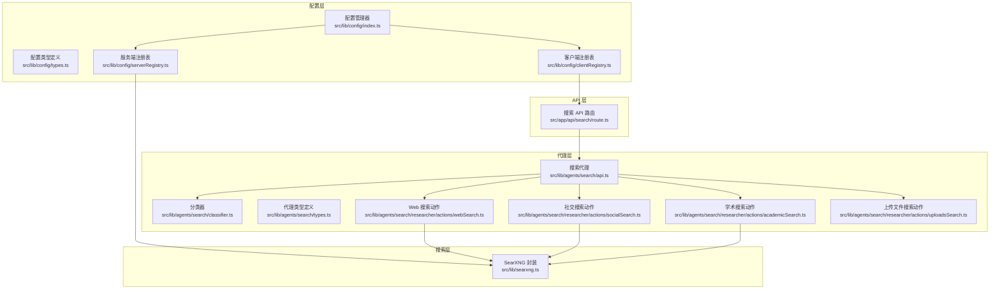
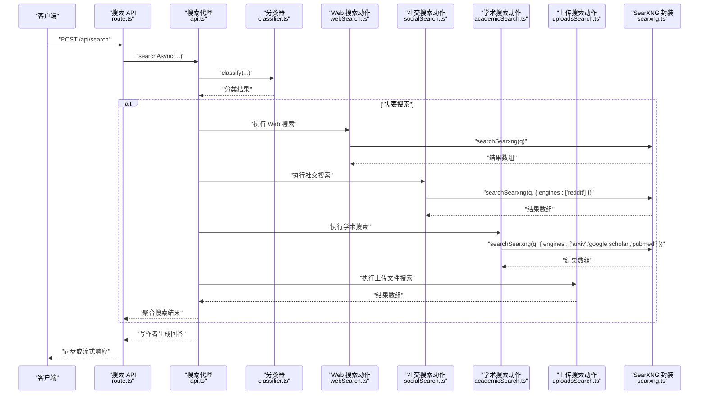
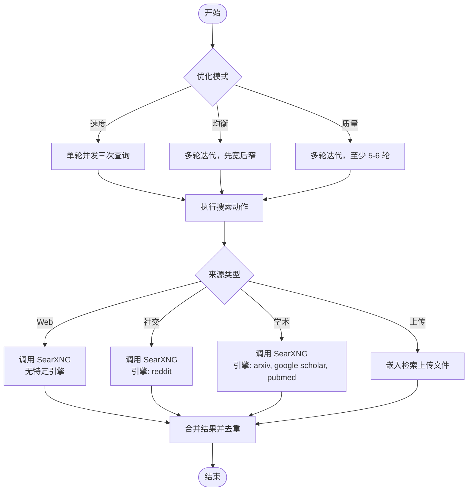
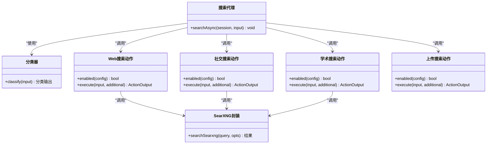
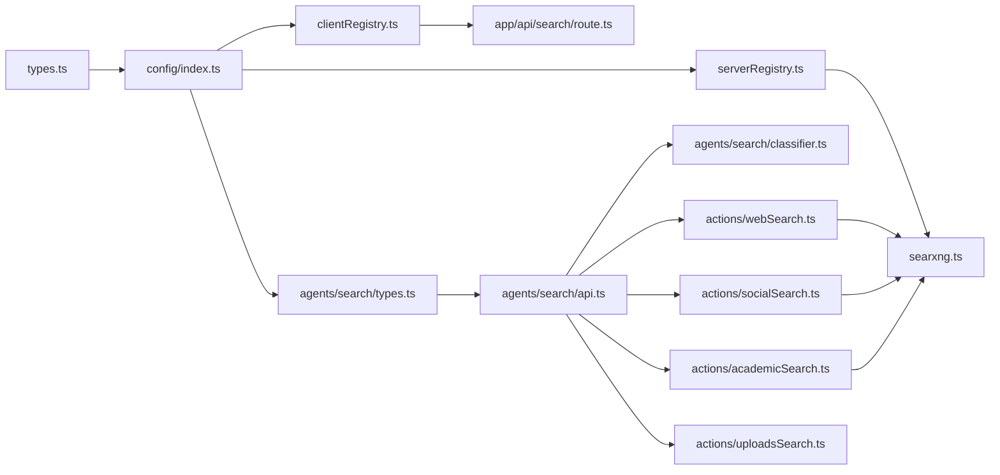

# 搜索设置

<cite>
**本文引用的文件**
- [src/components/Settings/Sections/Search.tsx](file://src/components/Settings/Sections/Search.tsx)
- [src/lib/config/types.ts](file://src/lib/config/types.ts)
- [src/lib/config/index.ts](file://src/lib/config/index.ts)
- [src/lib/config/serverRegistry.ts](file://src/lib/config/serverRegistry.ts)
- [src/lib/config/clientRegistry.ts](file://src/lib/config/clientRegistry.ts)
- [src/lib/searxng.ts](file://src/lib/searxng.ts)
- [src/app/api/search/route.ts](file://src/app/api/search/route.ts)
- [src/lib/agents/search/types.ts](file://src/lib/agents/search/types.ts)
- [src/lib/agents/search/api.ts](file://src/lib/agents/search/api.ts)
- [src/lib/agents/search/classifier.ts](file://src/lib/agents/search/classifier.ts)
- [src/lib/agents/search/researcher/actions/webSearch.ts](file://src/lib/agents/search/researcher/actions/webSearch.ts)
- [src/lib/agents/search/researcher/actions/socialSearch.ts](file://src/lib/agents/search/researcher/actions/socialSearch.ts)
- [src/lib/agents/search/researcher/actions/academicSearch.ts](file://src/lib/agents/search/researcher/actions/academicSearch.ts)
- [src/lib/agents/search/researcher/actions/uploadsSearch.ts](file://src/lib/agents/search/researcher/actions/uploadsSearch.ts)
</cite>

## 目录
1. [简介](#简介)
2. [项目结构](#项目结构)
3. [核心组件](#核心组件)
4. [架构总览](#架构总览)
5. [详细组件分析](#详细组件分析)
6. [依赖关系分析](#依赖关系分析)
7. [性能考虑](#性能考虑)
8. [故障排查指南](#故障排查指南)
9. [结论](#结论)
10. [附录：使用示例与最佳实践](#附录使用示例与最佳实践)

## 简介
本章节面向 Perplexica 的“搜索设置”功能，系统性阐述其设计与实现，覆盖以下方面：
- 搜索范围与来源：Web、学术、讨论（社交）、上传文件等来源的选择与启用。
- 过滤与排序：通过 SearXNG 引擎参数进行来源过滤、语言与分页控制。
- 结果数量与质量：不同优化模式下的查询策略与结果聚合。
- 存储与缓存：客户端与服务端配置的持久化、环境变量注入与迁移策略。
- 性能优化：并发搜索、流式响应、会话状态管理与去重合并。
- 与搜索代理系统的集成：分类器、研究者、工具链与写作者的协作流程。

## 项目结构
围绕“搜索设置”的关键代码分布在以下模块：
- 配置层：定义配置字段类型、默认值、环境映射与读取/更新逻辑。
- 搜索层：封装对 SearXNG 的调用，支持多引擎、多参数。
- 代理层：分类器决定是否搜索与显示小部件；研究者按来源执行搜索动作；写作者整合上下文生成最终回答。
- API 层：统一入口，负责模型加载、会话管理、事件流输出。

图表来源
- [src/lib/config/index.ts](file://src/lib/config/index.ts#L1-L391)
- [src/lib/config/types.ts](file://src/lib/config/types.ts#L1-L110)
- [src/lib/config/serverRegistry.ts](file://src/lib/config/serverRegistry.ts#L1-L16)
- [src/lib/config/clientRegistry.ts](file://src/lib/config/clientRegistry.ts#L1-L30)
- [src/lib/searxng.ts](file://src/lib/searxng.ts#L1-L54)
- [src/lib/agents/search/classifier.ts](file://src/lib/agents/search/classifier.ts#L1-L54)
- [src/lib/agents/search/api.ts](file://src/lib/agents/search/api.ts#L1-L100)
- [src/lib/agents/search/types.ts](file://src/lib/agents/search/types.ts#L1-L123)
- [src/lib/agents/search/researcher/actions/webSearch.ts](file://src/lib/agents/search/researcher/actions/webSearch.ts#L1-L183)
- [src/lib/agents/search/researcher/actions/socialSearch.ts](file://src/lib/agents/search/researcher/actions/socialSearch.ts#L1-L130)
- [src/lib/agents/search/researcher/actions/academicSearch.ts](file://src/lib/agents/search/researcher/actions/academicSearch.ts#L1-L130)
- [src/lib/agents/search/researcher/actions/uploadsSearch.ts](file://src/lib/agents/search/researcher/actions/uploadsSearch.ts#L1-L103)
- [src/app/api/search/route.ts](file://src/app/api/search/route.ts#L1-L209)

章节来源
- [src/lib/config/index.ts](file://src/lib/config/index.ts#L1-L391)
- [src/lib/config/types.ts](file://src/lib/config/types.ts#L1-L110)
- [src/lib/config/serverRegistry.ts](file://src/lib/config/serverRegistry.ts#L1-L16)
- [src/lib/config/clientRegistry.ts](file://src/lib/config/clientRegistry.ts#L1-L30)
- [src/lib/searxng.ts](file://src/lib/searxng.ts#L1-L54)
- [src/lib/agents/search/classifier.ts](file://src/lib/agents/search/classifier.ts#L1-L54)
- [src/lib/agents/search/api.ts](file://src/lib/agents/search/api.ts#L1-L100)
- [src/lib/agents/search/types.ts](file://src/lib/agents/search/types.ts#L1-L123)
- [src/lib/agents/search/researcher/actions/webSearch.ts](file://src/lib/agents/search/researcher/actions/webSearch.ts#L1-L183)
- [src/lib/agents/search/researcher/actions/socialSearch.ts](file://src/lib/agents/search/researcher/actions/socialSearch.ts#L1-L130)
- [src/lib/agents/search/researcher/actions/academicSearch.ts](file://src/lib/agents/search/researcher/actions/academicSearch.ts#L1-L130)
- [src/lib/agents/search/researcher/actions/uploadsSearch.ts](file://src/lib/agents/search/researcher/actions/uploadsSearch.ts#L1-L103)
- [src/app/api/search/route.ts](file://src/app/api/search/route.ts#L1-L209)

## 核心组件
- 配置类型与 UI 字段
  - 定义了通用 UI 配置字段类型（字符串、选择、密码、文本域、开关）以及配置对象结构，其中 search 分区用于存放搜索相关键值。
  - UI 配置 sections 中包含 preferences、personalization、modelProviders 与 search 四个分区，search 分区用于声明搜索设置项。
- 配置管理器
  - 负责初始化配置文件、从环境变量注入配置、迁移与持久化；提供读取与更新方法；维护 search 分区的键值。
  - 支持从环境变量注入 SearXNG URL，并将其写入配置文件。
- 服务端/客户端注册表
  - 服务端注册表：提供读取已配置搜索实例地址的能力。
  - 客户端注册表：提供读取客户端偏好（主题、单位、自动媒体搜索、天气/新闻小部件显示等）的能力。
- SearXNG 封装
  - 统一封装对 SearXNG 的搜索请求，支持附加参数（类别、引擎、语言、页码等），并返回结果与建议。
- 搜索代理与动作
  - 分类器根据对话历史与用户问题判断是否需要搜索及显示哪些小部件。
  - 研究者按来源执行搜索动作（Web、学术、讨论、上传文件），并将结果聚合到会话中。
  - 写作者基于聚合上下文生成最终回答，同时通过事件流向客户端推送实时内容与来源列表。
- API 路由
  - 接收前端请求，加载模型与嵌入，创建会话，启动搜索代理，支持同步与流式两种响应模式。

章节来源
- [src/lib/config/types.ts](file://src/lib/config/types.ts#L1-L110)
- [src/lib/config/index.ts](file://src/lib/config/index.ts#L1-L391)
- [src/lib/config/serverRegistry.ts](file://src/lib/config/serverRegistry.ts#L1-L16)
- [src/lib/config/clientRegistry.ts](file://src/lib/config/clientRegistry.ts#L1-L30)
- [src/lib/searxng.ts](file://src/lib/searxng.ts#L1-L54)
- [src/lib/agents/search/types.ts](file://src/lib/agents/search/types.ts#L1-L123)
- [src/lib/agents/search/api.ts](file://src/lib/agents/search/api.ts#L1-L100)
- [src/lib/agents/search/classifier.ts](file://src/lib/agents/search/classifier.ts#L1-L54)
- [src/app/api/search/route.ts](file://src/app/api/search/route.ts#L1-L209)

## 架构总览
下图展示了从 API 请求到搜索结果与最终回答的完整链路，以及搜索设置在其中的关键位置。

图表来源
- [src/app/api/search/route.ts](file://src/app/api/search/route.ts#L1-L209)
- [src/lib/agents/search/api.ts](file://src/lib/agents/search/api.ts#L1-L100)
- [src/lib/agents/search/classifier.ts](file://src/lib/agents/search/classifier.ts#L1-L54)
- [src/lib/agents/search/researcher/actions/webSearch.ts](file://src/lib/agents/search/researcher/actions/webSearch.ts#L1-L183)
- [src/lib/agents/search/researcher/actions/socialSearch.ts](file://src/lib/agents/search/researcher/actions/socialSearch.ts#L1-L130)
- [src/lib/agents/search/researcher/actions/academicSearch.ts](file://src/lib/agents/search/researcher/actions/academicSearch.ts#L1-L130)
- [src/lib/agents/search/researcher/actions/uploadsSearch.ts](file://src/lib/agents/search/researcher/actions/uploadsSearch.ts#L1-L103)
- [src/lib/searxng.ts](file://src/lib/searxng.ts#L1-L54)

## 详细组件分析

### 配置与设置界面
- 设置界面组件会遍历 search 分区的 UI 字段，依据字段作用域（客户端/服务端）从本地存储或后端值中读取当前值，并渲染对应的设置项。
- 客户端设置项通常保存在本地存储中，服务端设置项（如 SearXNG 地址）保存在服务端配置文件中，并可由环境变量注入。

章节来源
- [src/components/Settings/Sections/Search.tsx](file://src/components/Settings/Sections/Search.tsx#L1-L30)
- [src/lib/config/types.ts](file://src/lib/config/types.ts#L1-L110)
- [src/lib/config/index.ts](file://src/lib/config/index.ts#L1-L391)
- [src/lib/config/clientRegistry.ts](file://src/lib/config/clientRegistry.ts#L1-L30)
- [src/lib/config/serverRegistry.ts](file://src/lib/config/serverRegistry.ts#L1-L16)

### 配置管理器与存储机制
- 初始化：若配置文件不存在则创建默认配置；若存在则解析并迁移；随后从环境变量注入模型提供商与搜索设置。
- 注入逻辑：遍历 UI 配置 sections 中的 modelProviders 与 search，检查对应环境变量是否存在，若存在则写入配置。
- 读取与更新：提供 getConfig 与 updateConfig 方法，支持点号路径访问与嵌套更新；每次更新后持久化到数据目录。
- 迁移：预留迁移函数，当前为空实现，便于后续版本演进。

章节来源
- [src/lib/config/index.ts](file://src/lib/config/index.ts#L1-L391)

### SearXNG 集成与过滤条件
- 参数支持：查询字符串、类别、引擎列表、语言、页码等；引擎列表通过逗号拼接传参。
- 错误处理：非 OK 响应抛出异常，便于上层捕获与反馈。
- 结果结构：返回 results 数组与 suggestions 列表，供上层进一步处理。

章节来源
- [src/lib/searxng.ts](file://src/lib/searxng.ts#L1-L54)

### 搜索来源与过滤策略
- Web 搜索：按优化模式（速度/均衡/质量）生成查询策略，最多并发三次查询，结果合并。
- 社交搜索：限定引擎为 Reddit，聚焦讨论与趋势。
- 学术搜索：限定引擎为 arXiv、Google Scholar、PubMed，聚焦学术论文。
- 上传文件搜索：基于嵌入检索用户上传文件，按 URL 去重合并，避免重复来源。

图表来源
- [src/lib/agents/search/researcher/actions/webSearch.ts](file://src/lib/agents/search/researcher/actions/webSearch.ts#L1-L183)
- [src/lib/agents/search/researcher/actions/socialSearch.ts](file://src/lib/agents/search/researcher/actions/socialSearch.ts#L1-L130)
- [src/lib/agents/search/researcher/actions/academicSearch.ts](file://src/lib/agents/search/researcher/actions/academicSearch.ts#L1-L130)
- [src/lib/agents/search/researcher/actions/uploadsSearch.ts](file://src/lib/agents/search/researcher/actions/uploadsSearch.ts#L1-L103)
- [src/lib/searxng.ts](file://src/lib/searxng.ts#L1-L54)

章节来源
- [src/lib/agents/search/researcher/actions/webSearch.ts](file://src/lib/agents/search/researcher/actions/webSearch.ts#L1-L183)
- [src/lib/agents/search/researcher/actions/socialSearch.ts](file://src/lib/agents/search/researcher/actions/socialSearch.ts#L1-L130)
- [src/lib/agents/search/researcher/actions/academicSearch.ts](file://src/lib/agents/search/researcher/actions/academicSearch.ts#L1-L130)
- [src/lib/agents/search/researcher/actions/uploadsSearch.ts](file://src/lib/agents/search/researcher/actions/uploadsSearch.ts#L1-L103)

### 优化模式与结果质量
- 速度模式：强调一次性获取关键信息，查询更精准但次数较少。
- 均衡模式：先宽后窄，逐步细化，兼顾覆盖面与深度。
- 质量模式：尽可能多次搜索，确保覆盖全面，适合复杂或专业问题。

章节来源
- [src/lib/agents/search/researcher/actions/webSearch.ts](file://src/lib/agents/search/researcher/actions/webSearch.ts#L13-L57)

### 与搜索代理系统的集成
- 分类器：基于对话历史与用户问题生成分类输出，决定是否跳过搜索、是否执行个人/学术/讨论搜索以及是否显示小部件。
- 搜索代理：并行执行小部件与搜索任务，将搜索结果与小部件结果合并为最终上下文，驱动写作者生成回答。
- 事件流：通过会话管理器向客户端推送实时响应片段与搜索来源列表，支持断开重连与错误处理。

图表来源
- [src/lib/agents/search/classifier.ts](file://src/lib/agents/search/classifier.ts#L1-L54)
- [src/lib/agents/search/api.ts](file://src/lib/agents/search/api.ts#L1-L100)
- [src/lib/agents/search/researcher/actions/webSearch.ts](file://src/lib/agents/search/researcher/actions/webSearch.ts#L1-L183)
- [src/lib/agents/search/researcher/actions/socialSearch.ts](file://src/lib/agents/search/researcher/actions/socialSearch.ts#L1-L130)
- [src/lib/agents/search/researcher/actions/academicSearch.ts](file://src/lib/agents/search/researcher/actions/academicSearch.ts#L1-L130)
- [src/lib/agents/search/researcher/actions/uploadsSearch.ts](file://src/lib/agents/search/researcher/actions/uploadsSearch.ts#L1-L103)
- [src/lib/searxng.ts](file://src/lib/searxng.ts#L1-L54)

章节来源
- [src/lib/agents/search/classifier.ts](file://src/lib/agents/search/classifier.ts#L1-L54)
- [src/lib/agents/search/api.ts](file://src/lib/agents/search/api.ts#L1-L100)
- [src/lib/agents/search/types.ts](file://src/lib/agents/search/types.ts#L1-L123)

## 依赖关系分析
- 配置层依赖
  - 配置管理器依赖类型定义与模型提供商 UI 配置段，以构建完整的 UI sections。
  - 服务端注册表依赖配置管理器读取搜索实例地址。
  - 客户端注册表依赖本地存储读取偏好。
- 搜索层依赖
  - SearXNG 封装被多种搜索动作共享，作为统一的数据源。
- 代理层依赖
  - 搜索代理依赖分类器与多种搜索动作；动作依赖 SearXNG 封装或上传存储。
- API 层依赖
  - API 路由依赖模型注册表、会话管理器与搜索代理，负责流式输出与错误处理。

图表来源
- [src/lib/config/types.ts](file://src/lib/config/types.ts#L1-L110)
- [src/lib/config/index.ts](file://src/lib/config/index.ts#L1-L391)
- [src/lib/config/serverRegistry.ts](file://src/lib/config/serverRegistry.ts#L1-L16)
- [src/lib/config/clientRegistry.ts](file://src/lib/config/clientRegistry.ts#L1-L30)
- [src/lib/agents/search/types.ts](file://src/lib/agents/search/types.ts#L1-L123)
- [src/lib/agents/search/api.ts](file://src/lib/agents/search/api.ts#L1-L100)
- [src/lib/agents/search/classifier.ts](file://src/lib/agents/search/classifier.ts#L1-L54)
- [src/lib/agents/search/researcher/actions/webSearch.ts](file://src/lib/agents/search/researcher/actions/webSearch.ts#L1-L183)
- [src/lib/agents/search/researcher/actions/socialSearch.ts](file://src/lib/agents/search/researcher/actions/socialSearch.ts#L1-L130)
- [src/lib/agents/search/researcher/actions/academicSearch.ts](file://src/lib/agents/search/researcher/actions/academicSearch.ts#L1-L130)
- [src/lib/agents/search/researcher/actions/uploadsSearch.ts](file://src/lib/agents/search/researcher/actions/uploadsSearch.ts#L1-L103)
- [src/lib/searxng.ts](file://src/lib/searxng.ts#L1-L54)
- [src/app/api/search/route.ts](file://src/app/api/search/route.ts#L1-L209)

章节来源
- [src/lib/config/index.ts](file://src/lib/config/index.ts#L1-L391)
- [src/lib/agents/search/api.ts](file://src/lib/agents/search/api.ts#L1-L100)
- [src/lib/agents/search/researcher/actions/webSearch.ts](file://src/lib/agents/search/researcher/actions/webSearch.ts#L1-L183)

## 性能考虑
- 并发搜索：Web/社交/学术搜索动作在单次调用内并发执行三次查询，减少整体等待时间。
- 流式响应：API 路由支持 SSE 流式输出，边生成边推送，降低首包延迟。
- 结果去重与合并：上传文件搜索按 URL 去重并合并相同来源的内容，避免重复与冗余。
- 优化模式：根据模式调整查询策略与迭代次数，平衡速度与质量。
- 缓存策略：当前未发现显式的搜索结果缓存实现；可通过在 SearXNG 侧配置缓存或在应用层增加内存/磁盘缓存（建议）。

[本节为通用性能指导，不直接分析具体文件]

## 故障排查指南
- SearXNG 连接失败
  - 现象：HTTP 非 OK 响应时抛出异常。
  - 排查：确认服务端配置中的 SearXNG 地址正确，网络可达，且格式为 JSON 返回。
- 配置文件损坏
  - 现象：解析配置文件时报错，系统回退到默认配置并覆盖原文件。
  - 排查：检查配置文件语法，必要时删除后重启以重建默认配置。
- 代理执行异常
  - 现象：事件流中出现 error 事件或最终响应为空。
  - 排查：查看分类器输出是否正确，确认启用的搜索来源与模式匹配预期；检查模型加载与会话状态。

章节来源
- [src/lib/searxng.ts](file://src/lib/searxng.ts#L43-L45)
- [src/lib/config/index.ts](file://src/lib/config/index.ts#L144-L167)
- [src/app/api/search/route.ts](file://src/app/api/search/route.ts#L182-L186)

## 结论
Perplexica 的搜索设置通过“配置层 + 搜索层 + 代理层 + API 层”的清晰分层，实现了灵活的搜索来源选择、参数化过滤与多模式优化。配置管理器负责持久化与环境注入，SearXNG 封装提供统一的数据接入，代理系统通过分类器与动作链路完成高质量结果聚合与回答生成。未来可在搜索结果缓存、更细粒度的排序与过滤、以及客户端侧的动态设置联动等方面持续优化。

[本节为总结性内容，不直接分析具体文件]

## 附录：使用示例与最佳实践
- 自定义 SearXNG 实例
  - 在服务端配置中设置 SearXNG URL，或通过环境变量注入；确保返回格式为 JSON。
- 启用/禁用搜索来源
  - 在代理配置中指定 sources 列表，如包含 web、discussions、academic；仅启用需要的来源以减少等待。
- 调整优化模式
  - 对简单问题使用速度模式，复杂问题使用质量模式；均衡模式适用于大多数场景。
- 控制结果数量
  - 通过上传文件搜索的动作参数限制每查询返回条目数，结合去重策略避免重复来源。
- 客户端偏好
  - 使用客户端注册表读取主题、单位、自动媒体搜索等偏好，改善用户体验。

章节来源
- [src/lib/config/serverRegistry.ts](file://src/lib/config/serverRegistry.ts#L14-L16)
- [src/lib/config/clientRegistry.ts](file://src/lib/config/clientRegistry.ts#L1-L30)
- [src/lib/agents/search/types.ts](file://src/lib/agents/search/types.ts#L7-L16)
- [src/lib/agents/search/researcher/actions/uploadsSearch.ts](file://src/lib/agents/search/researcher/actions/uploadsSearch.ts#L57-L77)
- [src/app/api/search/route.ts](file://src/app/api/search/route.ts#L54-L67)