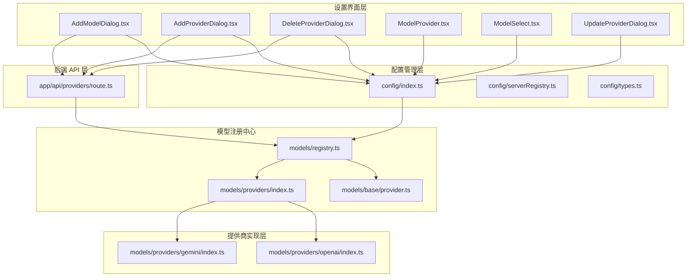
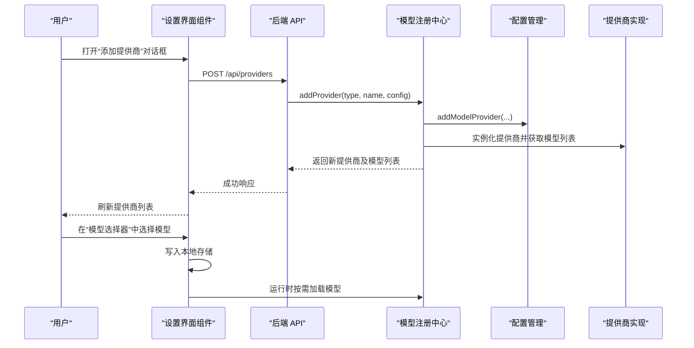
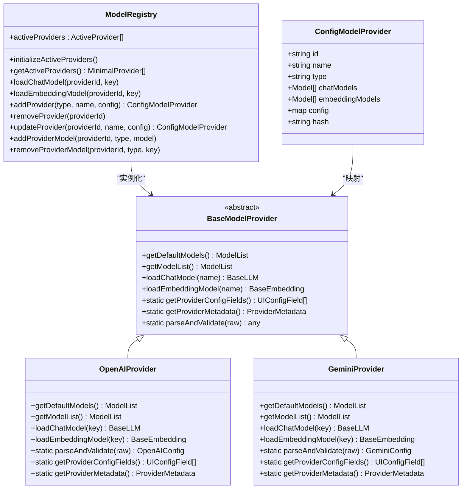
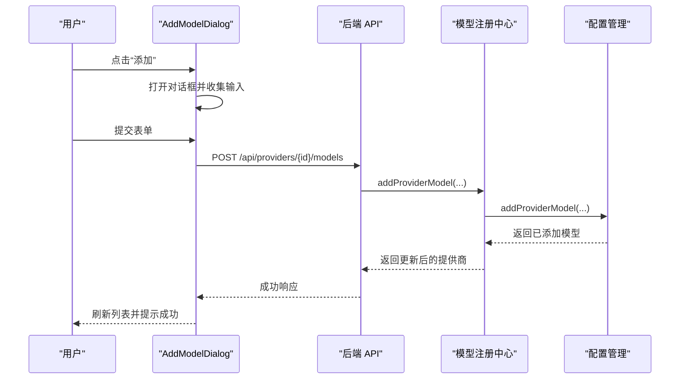
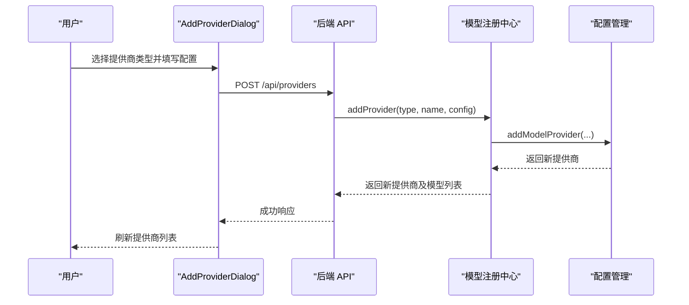
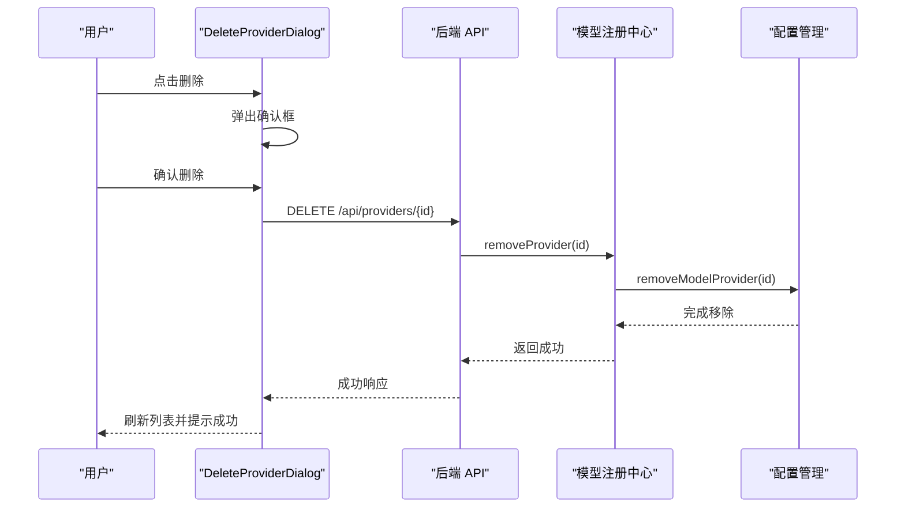
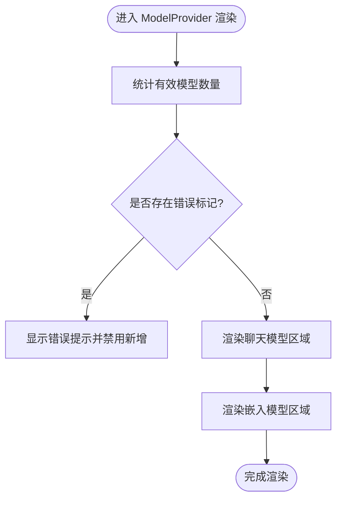
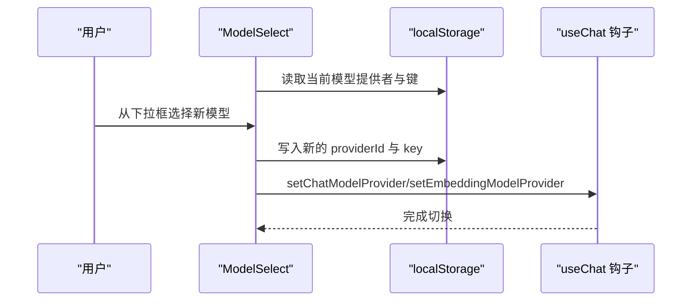
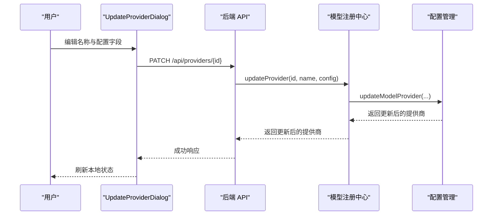
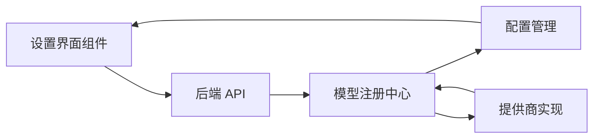

# 模型设置

<cite>
**本文引用的文件**
- [src/components/Settings/Sections/Models/AddModelDialog.tsx](file://src/components/Settings/Sections/Models/AddModelDialog.tsx)
- [src/components/Settings/Sections/Models/AddProviderDialog.tsx](file://src/components/Settings/Sections/Models/AddProviderDialog.tsx)
- [src/components/Settings/Sections/Models/DeleteProviderDialog.tsx](file://src/components/Settings/Sections/Models/DeleteProviderDialog.tsx)
- [src/components/Settings/Sections/Models/ModelProvider.tsx](file://src/components/Settings/Sections/Models/ModelProvider.tsx)
- [src/components/Settings/Sections/Models/ModelSelect.tsx](file://src/components/Settings/Sections/Models/ModelSelect.tsx)
- [src/components/Settings/Sections/Models/UpdateProviderDialog.tsx](file://src/components/Settings/Sections/Models/UpdateProviderDialog.tsx)
- [src/lib/config/types.ts](file://src/lib/config/types.ts)
- [src/lib/config/serverRegistry.ts](file://src/lib/config/serverRegistry.ts)
- [src/lib/config/index.ts](file://src/lib/config/index.ts)
- [src/lib/models/registry.ts](file://src/lib/models/registry.ts)
- [src/lib/models/base/provider.ts](file://src/lib/models/base/provider.ts)
- [src/lib/models/providers/index.ts](file://src/lib/models/providers/index.ts)
- [src/lib/models/types.ts](file://src/lib/models/types.ts)
- [src/lib/models/providers/openai/index.ts](file://src/lib/models/providers/openai/index.ts)
- [src/lib/models/providers/gemini/index.ts](file://src/lib/models/providers/gemini/index.ts)
- [src/app/api/providers/route.ts](file://src/app/api/providers/route.ts)
</cite>

## 目录
1. [简介](#简介)
2. [项目结构](#项目结构)
3. [核心组件](#核心组件)
4. [架构总览](#架构总览)
5. [详细组件分析](#详细组件分析)
6. [依赖关系分析](#依赖关系分析)
7. [性能考虑](#性能考虑)
8. [故障排查指南](#故障排查指南)
9. [结论](#结论)
10. [附录：使用示例与最佳实践](#附录使用示例与最佳实践)

## 简介
本章节面向 Perplexica 的“模型设置”功能，系统性阐述其架构设计与实现细节，覆盖模型提供商管理、模型选择与配置选项、对话框组件、注册机制、配置管理与动态加载等。文档同时提供可视化图示、流程与时序图以及可操作的使用示例，帮助开发者与运维人员快速理解并扩展该功能。

## 项目结构
模型设置功能主要由以下层次构成：
- 设置界面层：负责用户交互（新增/更新/删除提供商与模型、选择当前使用的模型）。
- 配置管理层：负责持久化配置、环境变量注入、UI 配置字段生成与迁移。
- 模型注册中心：负责动态加载与实例化具体模型提供商、拉取可用模型列表、执行模型加载。
- 提供商实现层：各具体提供商（如 OpenAI、Gemini 等）的适配逻辑与默认模型清单。
- 后端 API 层：提供提供商与模型的增删改查接口，配合管理员鉴权。

图表来源
- [src/components/Settings/Sections/Models/AddModelDialog.tsx](file://src/components/Settings/Sections/Models/AddModelDialog.tsx#L1-L160)
- [src/components/Settings/Sections/Models/AddProviderDialog.tsx](file://src/components/Settings/Sections/Models/AddProviderDialog.tsx#L1-L213)
- [src/components/Settings/Sections/Models/DeleteProviderDialog.tsx](file://src/components/Settings/Sections/Models/DeleteProviderDialog.tsx#L1-L117)
- [src/components/Settings/Sections/Models/ModelProvider.tsx](file://src/components/Settings/Sections/Models/ModelProvider.tsx#L1-L225)
- [src/components/Settings/Sections/Models/ModelSelect.tsx](file://src/components/Settings/Sections/Models/ModelSelect.tsx#L1-L99)
- [src/components/Settings/Sections/Models/UpdateProviderDialog.tsx](file://src/components/Settings/Sections/Models/UpdateProviderDialog.tsx#L1-L185)
- [src/lib/config/index.ts](file://src/lib/config/index.ts#L1-L391)
- [src/lib/config/serverRegistry.ts](file://src/lib/config/serverRegistry.ts#L1-L16)
- [src/lib/config/types.ts](file://src/lib/config/types.ts#L1-L110)
- [src/lib/models/registry.ts](file://src/lib/models/registry.ts#L1-L222)
- [src/lib/models/base/provider.ts](file://src/lib/models/base/provider.ts#L1-L46)
- [src/lib/models/providers/index.ts](file://src/lib/models/providers/index.ts#L1-L36)
- [src/lib/models/providers/openai/index.ts](file://src/lib/models/providers/openai/index.ts#L1-L227)
- [src/lib/models/providers/gemini/index.ts](file://src/lib/models/providers/gemini/index.ts#L1-L145)
- [src/app/api/providers/route.ts](file://src/app/api/providers/route.ts#L1-L78)

章节来源
- [src/lib/config/types.ts](file://src/lib/config/types.ts#L1-L110)
- [src/lib/config/index.ts](file://src/lib/config/index.ts#L1-L391)
- [src/lib/models/registry.ts](file://src/lib/models/registry.ts#L1-L222)
- [src/lib/models/providers/index.ts](file://src/lib/models/providers/index.ts#L1-L36)

## 核心组件
- 添加模型对话框：用于向指定提供商添加聊天或嵌入模型，并即时更新本地状态与后端配置。
- 添加提供商对话框：从可用提供商类型中选择，填写所需配置字段，创建新的提供商连接。
- 删除提供商确认框：删除提供商及其关联的所有模型，支持二次确认与错误提示。
- 模型提供商组件：展示单个提供商的名称、已配置模型数量、错误状态，支持更新与删除。
- 模型选择器：在所有已配置提供商的模型中进行选择，保存到本地存储并在运行时生效。
- 更新提供商对话框：编辑提供商名称与配置字段，提交后刷新本地状态与后端配置。

章节来源
- [src/components/Settings/Sections/Models/AddModelDialog.tsx](file://src/components/Settings/Sections/Models/AddModelDialog.tsx#L1-L160)
- [src/components/Settings/Sections/Models/AddProviderDialog.tsx](file://src/components/Settings/Sections/Models/AddProviderDialog.tsx#L1-L213)
- [src/components/Settings/Sections/Models/DeleteProviderDialog.tsx](file://src/components/Settings/Sections/Models/DeleteProviderDialog.tsx#L1-L117)
- [src/components/Settings/Sections/Models/ModelProvider.tsx](file://src/components/Settings/Sections/Models/ModelProvider.tsx#L1-L225)
- [src/components/Settings/Sections/Models/ModelSelect.tsx](file://src/components/Settings/Sections/Models/ModelSelect.tsx#L1-L99)
- [src/components/Settings/Sections/Models/UpdateProviderDialog.tsx](file://src/components/Settings/Sections/Models/UpdateProviderDialog.tsx#L1-L185)

## 架构总览
模型设置的架构围绕“配置管理 + 注册中心 + 提供商实现 + 界面组件 + 后端 API”展开。前端通过对话框组件与后端 API 交互，后端通过注册中心调用具体提供商实现以获取模型列表并加载模型；配置管理负责持久化与环境变量注入。

图表来源
- [src/app/api/providers/route.ts](file://src/app/api/providers/route.ts#L36-L77)
- [src/lib/models/registry.ts](file://src/lib/models/registry.ts#L94-L141)
- [src/lib/config/index.ts](file://src/lib/config/index.ts#L274-L289)
- [src/components/Settings/Sections/Models/ModelSelect.tsx](file://src/components/Settings/Sections/Models/ModelSelect.tsx#L22-L56)

## 详细组件分析

### 组件类图（代码级）

图表来源
- [src/lib/config/types.ts](file://src/lib/config/types.ts#L53-L61)
- [src/lib/models/base/provider.ts](file://src/lib/models/base/provider.ts#L6-L26)
- [src/lib/models/registry.ts](file://src/lib/models/registry.ts#L8-L35)
- [src/lib/models/providers/openai/index.ts](file://src/lib/models/providers/openai/index.ts#L133-L227)
- [src/lib/models/providers/gemini/index.ts](file://src/lib/models/providers/gemini/index.ts#L27-L145)

章节来源
- [src/lib/config/types.ts](file://src/lib/config/types.ts#L1-L110)
- [src/lib/models/base/provider.ts](file://src/lib/models/base/provider.ts#L1-L46)
- [src/lib/models/registry.ts](file://src/lib/models/registry.ts#L1-L222)
- [src/lib/models/providers/openai/index.ts](file://src/lib/models/providers/openai/index.ts#L1-L227)
- [src/lib/models/providers/gemini/index.ts](file://src/lib/models/providers/gemini/index.ts#L1-L145)

### 添加模型对话框（AddModelDialog）
- 功能要点
  - 支持为指定提供商添加聊天或嵌入模型。
  - 表单包含模型名称与键值，必填校验。
  - 调用后端接口创建模型，成功后更新本地状态并提示成功。
- 关键流程
  - 用户点击“添加”，打开对话框。
  - 提交表单后，调用后端接口，接收响应并更新本地 providers 状态。
  - 失败时捕获错误并提示失败信息。

图表来源
- [src/components/Settings/Sections/Models/AddModelDialog.tsx](file://src/components/Settings/Sections/Models/AddModelDialog.tsx#L23-L68)
- [src/app/api/providers/route.ts](file://src/app/api/providers/route.ts#L36-L77)
- [src/lib/models/registry.ts](file://src/lib/models/registry.ts#L202-L209)
- [src/lib/config/index.ts](file://src/lib/config/index.ts#L319-L341)

章节来源
- [src/components/Settings/Sections/Models/AddModelDialog.tsx](file://src/components/Settings/Sections/Models/AddModelDialog.tsx#L1-L160)

### 添加提供商对话框（AddProviderDialog）
- 功能要点
  - 从可用提供商 UI 配置中选择类型，动态渲染对应配置字段。
  - 收集连接名称与配置项，提交后创建新提供商并加入本地列表。
- 关键流程
  - 读取 UI 配置字段，生成表单。
  - 提交后调用后端接口，成功后将返回的提供商加入本地状态。

图表来源
- [src/components/Settings/Sections/Models/AddProviderDialog.tsx](file://src/components/Settings/Sections/Models/AddProviderDialog.tsx#L62-L89)
- [src/app/api/providers/route.ts](file://src/app/api/providers/route.ts#L36-L77)
- [src/lib/models/registry.ts](file://src/lib/models/registry.ts#L94-L141)
- [src/lib/config/index.ts](file://src/lib/config/index.ts#L274-L289)

章节来源
- [src/components/Settings/Sections/Models/AddProviderDialog.tsx](file://src/components/Settings/Sections/Models/AddProviderDialog.tsx#L1-L213)

### 删除提供商确认框（DeleteProviderDialog）
- 功能要点
  - 删除提供商及其关联模型，二次确认防止误操作。
  - 成功后从本地状态移除并提示成功。
- 关键流程
  - 用户点击删除，弹出确认框。
  - 确认后调用后端接口删除，成功后更新本地状态。

图表来源
- [src/components/Settings/Sections/Models/DeleteProviderDialog.tsx](file://src/components/Settings/Sections/Models/DeleteProviderDialog.tsx#L19-L41)
- [src/app/api/providers/route.ts](file://src/app/api/providers/route.ts#L36-L77)
- [src/lib/models/registry.ts](file://src/lib/models/registry.ts#L143-L150)
- [src/lib/config/index.ts](file://src/lib/config/index.ts#L291-L302)

章节来源
- [src/components/Settings/Sections/Models/DeleteProviderDialog.tsx](file://src/components/Settings/Sections/Models/DeleteProviderDialog.tsx#L1-L117)

### 模型提供商组件（ModelProvider）
- 功能要点
  - 展示提供商名称、模型数量与错误状态。
  - 支持为聊天与嵌入模型分别添加与删除。
  - 提供更新与删除入口。
- 错误处理
  - 当模型列表包含错误标记时，显示错误提示并禁用新增按钮。

图表来源
- [src/components/Settings/Sections/Models/ModelProvider.tsx](file://src/components/Settings/Sections/Models/ModelProvider.tsx#L69-L75)
- [src/components/Settings/Sections/Models/ModelProvider.tsx](file://src/components/Settings/Sections/Models/ModelProvider.tsx#L124-L134)
- [src/components/Settings/Sections/Models/ModelProvider.tsx](file://src/components/Settings/Sections/Models/ModelProvider.tsx#L179-L189)

章节来源
- [src/components/Settings/Sections/Models/ModelProvider.tsx](file://src/components/Settings/Sections/Models/ModelProvider.tsx#L1-L225)

### 模型选择器（ModelSelect）
- 功能要点
  - 基于本地存储初始化当前选中的模型。
  - 将选择结果写入本地存储，并通过钩子更新运行时模型提供者。
- 性能与体验
  - 使用本地存储避免每次刷新丢失选择。
  - 选择过程包含加载状态反馈。

图表来源
- [src/components/Settings/Sections/Models/ModelSelect.tsx](file://src/components/Settings/Sections/Models/ModelSelect.tsx#L14-L56)

章节来源
- [src/components/Settings/Sections/Models/ModelSelect.tsx](file://src/components/Settings/Sections/Models/ModelSelect.tsx#L1-L99)

### 更新提供商对话框（UpdateProviderDialog）
- 功能要点
  - 读取当前提供商配置，动态渲染字段。
  - 提交后调用后端接口更新提供商，并刷新本地状态。
- 错误处理
  - 失败时捕获错误并提示。

图表来源
- [src/components/Settings/Sections/Models/UpdateProviderDialog.tsx](file://src/components/Settings/Sections/Models/UpdateProviderDialog.tsx#L40-L74)
- [src/app/api/providers/route.ts](file://src/app/api/providers/route.ts#L36-L77)
- [src/lib/models/registry.ts](file://src/lib/models/registry.ts#L152-L199)
- [src/lib/config/index.ts](file://src/lib/config/index.ts#L304-L317)

章节来源
- [src/components/Settings/Sections/Models/UpdateProviderDialog.tsx](file://src/components/Settings/Sections/Models/UpdateProviderDialog.tsx#L1-L185)

## 依赖关系分析
- 组件与配置管理
  - 对话框组件通过后端 API 与配置管理交互，新增/更新/删除提供商与模型均持久化到配置文件。
- 注册中心与提供商实现
  - 注册中心根据配置实例化具体提供商，调用其模型列表与加载方法。
- UI 配置字段
  - 提供商实现通过静态方法暴露 UI 配置字段，配置管理在启动时注入环境变量并生成 UI 配置段。

图表来源
- [src/lib/config/index.ts](file://src/lib/config/index.ts#L175-L238)
- [src/lib/models/registry.ts](file://src/lib/models/registry.ts#L17-L35)
- [src/lib/models/providers/index.ts](file://src/lib/models/providers/index.ts#L23-L35)

章节来源
- [src/lib/config/index.ts](file://src/lib/config/index.ts#L1-L391)
- [src/lib/models/registry.ts](file://src/lib/models/registry.ts#L1-L222)
- [src/lib/models/providers/index.ts](file://src/lib/models/providers/index.ts#L1-L36)

## 性能考虑
- 并发获取模型列表
  - 注册中心在初始化与刷新时并发拉取各提供商的模型列表，减少等待时间。
- 错误降级
  - 当提供商不可用时，注册中心返回带错误标记的模型列表，界面层可立即感知并提示。
- 本地存储缓存
  - 模型选择器使用本地存储缓存当前模型，避免每次请求后端。
- 配置哈希
  - 配置管理对提供商配置进行哈希，避免重复注入相同配置。

章节来源
- [src/lib/models/registry.ts](file://src/lib/models/registry.ts#L40-L72)
- [src/lib/config/index.ts](file://src/lib/config/index.ts#L213-L225)

## 故障排查指南
- 新增提供商失败
  - 检查后端响应状态与错误消息，确认必填字段是否完整。
  - 查看配置管理是否正确写入配置文件。
- 更新提供商失败
  - 确认提供商 ID 是否存在，检查配置字段是否符合提供商解析要求。
- 删除提供商失败
  - 确认后端接口返回状态码，检查本地状态是否同步更新。
- 模型选择无效
  - 检查本地存储中的模型键是否仍存在于当前提供商模型列表中。
  - 若提供商模型列表包含错误标记，需先修复提供商配置。

章节来源
- [src/components/Settings/Sections/Models/AddProviderDialog.tsx](file://src/components/Settings/Sections/Models/AddProviderDialog.tsx#L72-L75)
- [src/components/Settings/Sections/Models/UpdateProviderDialog.tsx](file://src/components/Settings/Sections/Models/UpdateProviderDialog.tsx#L49-L52)
- [src/components/Settings/Sections/Models/DeleteProviderDialog.tsx](file://src/components/Settings/Sections/Models/DeleteProviderDialog.tsx#L25-L28)
- [src/components/Settings/Sections/Models/ModelSelect.tsx](file://src/components/Settings/Sections/Models/ModelSelect.tsx#L50-L52)

## 结论
模型设置功能通过清晰的分层设计实现了“配置管理—注册中心—提供商实现—界面组件—后端 API”的闭环。它支持动态注册新的 AI 模型提供商、灵活配置模型参数、实时选择当前使用的模型，并具备完善的错误处理与性能优化策略。该架构便于扩展新的提供商与模型类型，同时保证了配置的一致性与安全性。

## 附录：使用示例与最佳实践
- 添加新的 AI 模型提供商
  - 在“添加提供商”对话框中选择提供商类型，填写配置字段（如 API Key、Base URL），提交后即可在提供商列表中看到新连接。
  - 参考路径：[src/components/Settings/Sections/Models/AddProviderDialog.tsx](file://src/components/Settings/Sections/Models/AddProviderDialog.tsx#L62-L89)
- 配置模型参数
  - 在提供商详情页，使用“添加模型”对话框为聊天或嵌入模型添加自定义模型键与名称。
  - 参考路径：[src/components/Settings/Sections/Models/AddModelDialog.tsx](file://src/components/Settings/Sections/Models/AddModelDialog.tsx#L23-L68)
- 管理现有模型
  - 在提供商卡片中，点击模型右侧的“×”删除不需要的模型；或使用“更新提供商”对话框修改配置。
  - 参考路径：[src/components/Settings/Sections/Models/ModelProvider.tsx](file://src/components/Settings/Sections/Models/ModelProvider.tsx#L144-L161)
- 选择当前使用的模型
  - 在模型选择器中选择目标模型，系统会自动写入本地存储并更新运行时模型提供者。
  - 参考路径：[src/components/Settings/Sections/Models/ModelSelect.tsx](file://src/components/Settings/Sections/Models/ModelSelect.tsx#L22-L56)
- 模型验证与错误处理
  - 提供商实现包含 parseAndValidate 与 getModelList 等方法，确保配置合法与模型可用；当出现错误时，界面层会显示错误提示并阻止继续使用。
  - 参考路径：[src/lib/models/providers/openai/index.ts](file://src/lib/models/providers/openai/index.ts#L200-L212)
  - 参考路径：[src/lib/models/providers/gemini/index.ts](file://src/lib/models/providers/gemini/index.ts#L121-L130)