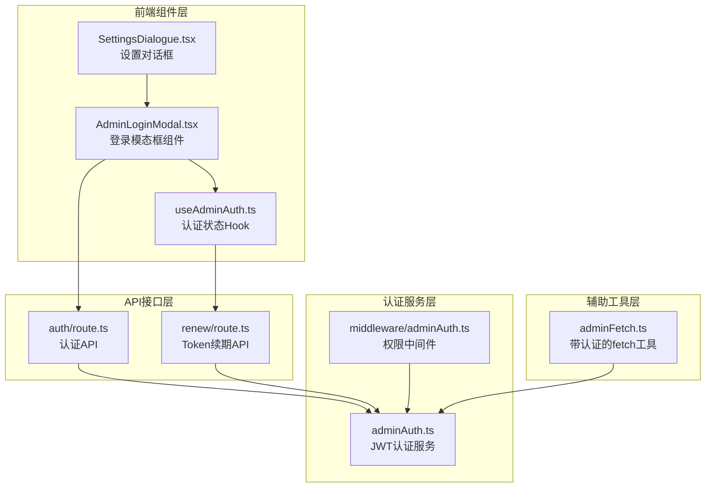
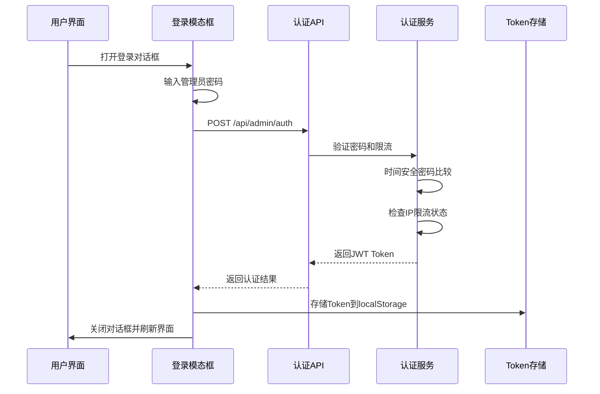
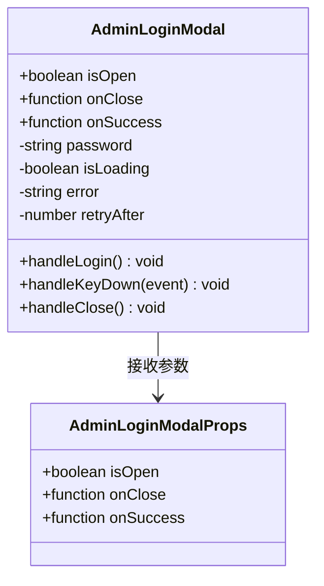
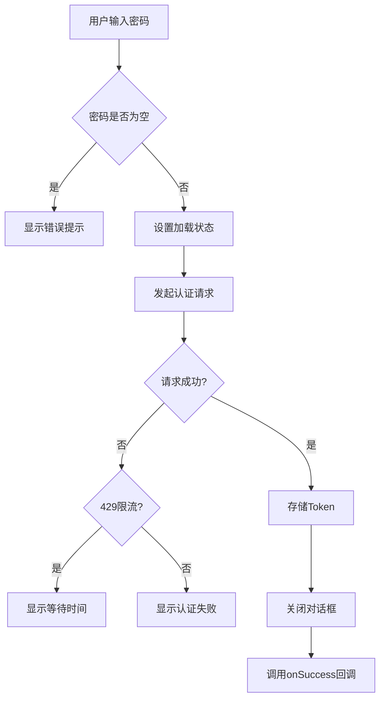
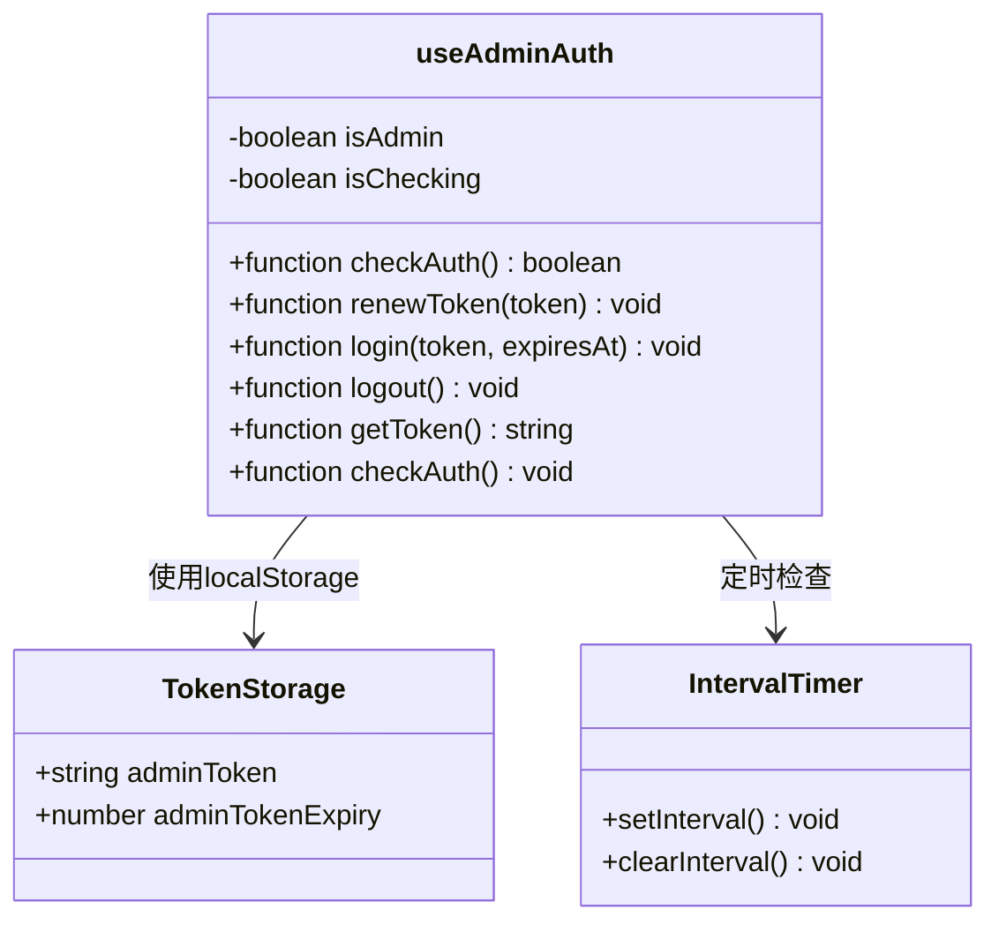
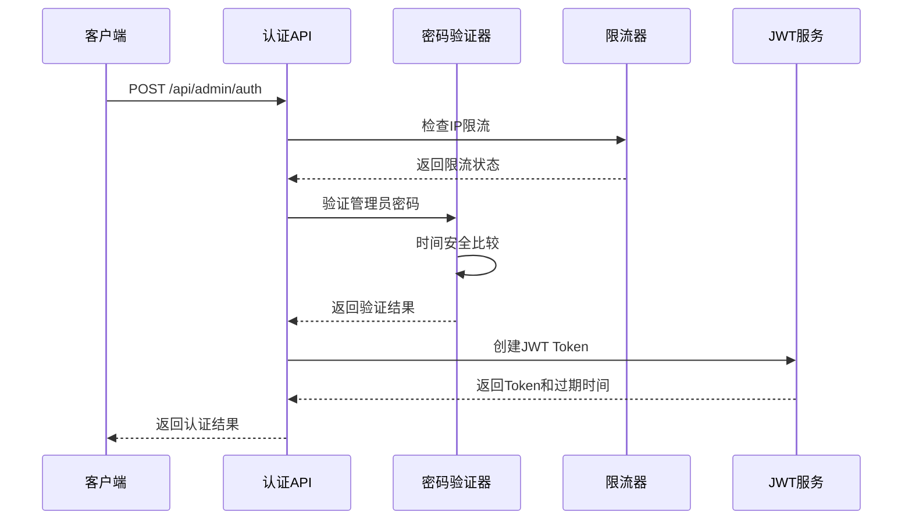
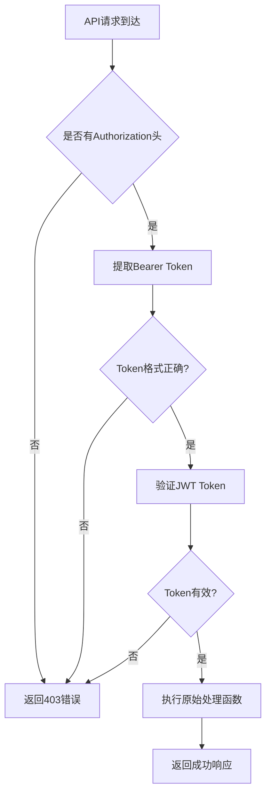
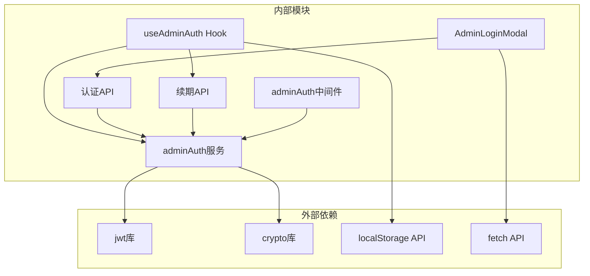

# 管理员登录模态框

<cite>
**本文档引用的文件**
- [src/components/Settings/AdminLoginModal.tsx](file://src/components/Settings/AdminLoginModal.tsx)
- [src/lib/hooks/useAdminAuth.ts](file://src/lib/hooks/useAdminAuth.ts)
- [src/lib/adminAuth.ts](file://src/lib/adminAuth.ts)
- [src/lib/middleware/adminAuth.ts](file://src/lib/middleware/adminAuth.ts)
- [src/app/api/admin/auth/route.ts](file://src/app/api/admin/auth/route.ts)
- [src/app/api/admin/renew/route.ts](file://src/app/api/admin/renew/route.ts)
- [src/components/Settings/SettingsDialogue.tsx](file://src/components/Settings/SettingsDialogue.tsx)
- [.env.example](file://.env.example)
- [src/lib/api/adminFetch.ts](file://src/lib/api/adminFetch.ts)
</cite>

## 目录
1. [简介](#简介)
2. [项目结构](#项目结构)
3. [核心组件](#核心组件)
4. [架构概览](#架构概览)
5. [详细组件分析](#详细组件分析)
6. [依赖关系分析](#依赖关系分析)
7. [性能考虑](#性能考虑)
8. [故障排除指南](#故障排除指南)
9. [结论](#结论)

## 简介

管理员登录模态框是 Perplexica 系统中用于管理员认证的核心组件。该组件提供了安全的管理员登录界面，集成了完整的认证流程、会话管理和权限验证机制。系统采用 JWT（JSON Web Token）技术实现无状态认证，结合限流机制和安全的密码验证来确保系统的安全性。

## 项目结构

管理员登录相关的核心文件分布如下：

**图表来源**
- [src/components/Settings/AdminLoginModal.tsx](file://src/components/Settings/AdminLoginModal.tsx#L1-L169)
- [src/lib/hooks/useAdminAuth.ts](file://src/lib/hooks/useAdminAuth.ts#L1-L125)
- [src/app/api/admin/auth/route.ts](file://src/app/api/admin/auth/route.ts#L1-L103)

**章节来源**
- [src/components/Settings/AdminLoginModal.tsx](file://src/components/Settings/AdminLoginModal.tsx#L1-L169)
- [src/lib/hooks/useAdminAuth.ts](file://src/lib/hooks/useAdminAuth.ts#L1-L125)

## 核心组件

管理员登录系统由以下核心组件构成：

### 1. 登录模态框组件
- **功能**：提供用户友好的登录界面
- **特性**：支持密码输入、错误处理、限流显示、键盘快捷键
- **状态管理**：本地状态管理（密码、加载状态、错误信息）

### 2. 认证状态Hook
- **功能**：管理管理员认证状态和会话生命周期
- **特性**：自动检查token有效性、定时续期、本地存储管理
- **状态管理**：React状态钩子，持久化存储

### 3. JWT认证服务
- **功能**：实现基于JWT的安全认证机制
- **特性**：时间安全的密码比较、IP限流、token续期
- **安全**：使用crypto.timingSafeEqual防止时序攻击

**章节来源**
- [src/components/Settings/AdminLoginModal.tsx](file://src/components/Settings/AdminLoginModal.tsx#L12-L169)
- [src/lib/hooks/useAdminAuth.ts](file://src/lib/hooks/useAdminAuth.ts#L14-L125)
- [src/lib/adminAuth.ts](file://src/lib/adminAuth.ts#L1-L197)

## 架构概览

管理员登录系统采用分层架构设计，确保安全性和可维护性：

**图表来源**
- [src/components/Settings/AdminLoginModal.tsx](file://src/components/Settings/AdminLoginModal.tsx#L28-L63)
- [src/app/api/admin/auth/route.ts](file://src/app/api/admin/auth/route.ts#L25-L102)
- [src/lib/adminAuth.ts](file://src/lib/adminAuth.ts#L51-L74)

## 详细组件分析

### 登录模态框组件分析

#### 组件结构

**图表来源**
- [src/components/Settings/AdminLoginModal.tsx](file://src/components/Settings/AdminLoginModal.tsx#L6-L10)
- [src/components/Settings/AdminLoginModal.tsx](file://src/components/Settings/AdminLoginModal.tsx#L12-L78)

#### 状态管理机制
组件内部维护以下状态：
- **密码状态**：受控输入，实时更新
- **加载状态**：防止重复提交
- **错误状态**：显示认证失败原因
- **限流状态**：显示等待时间

#### 事件处理流程

**图表来源**
- [src/components/Settings/AdminLoginModal.tsx](file://src/components/Settings/AdminLoginModal.tsx#L18-L63)

**章节来源**
- [src/components/Settings/AdminLoginModal.tsx](file://src/components/Settings/AdminLoginModal.tsx#L12-L169)

### 认证状态Hook分析

#### Hook功能架构

**图表来源**
- [src/lib/hooks/useAdminAuth.ts](file://src/lib/hooks/useAdminAuth.ts#L14-L124)

#### 自动续期机制
Hook实现了智能的token续期策略：
- **检查间隔**：每5分钟检查一次token状态
- **续期触发**：当token剩余有效期少于1小时时自动续期
- **失效处理**：检测到过期时自动登出并清除存储

**章节来源**
- [src/lib/hooks/useAdminAuth.ts](file://src/lib/hooks/useAdminAuth.ts#L14-L125)

### JWT认证服务分析

#### 认证流程

**图表来源**
- [src/app/api/admin/auth/route.ts](file://src/app/api/admin/auth/route.ts#L25-L102)
- [src/lib/adminAuth.ts](file://src/lib/adminAuth.ts#L51-L149)

#### 安全特性
- **时间安全密码比较**：使用 `crypto.timingSafeEqual` 防止时序攻击
- **IP限流**：限制同一IP的失败尝试次数
- **JWT签名**：使用环境变量作为密钥进行token签名
- **过期管理**：24小时有效期的token

**章节来源**
- [src/lib/adminAuth.ts](file://src/lib/adminAuth.ts#L51-L197)

### 权限中间件分析

#### 中间件工作原理

**图表来源**
- [src/lib/middleware/adminAuth.ts](file://src/lib/middleware/adminAuth.ts#L13-L40)

**章节来源**
- [src/lib/middleware/adminAuth.ts](file://src/lib/middleware/adminAuth.ts#L1-L55)

## 依赖关系分析

管理员登录系统的依赖关系呈现清晰的分层结构：

**图表来源**
- [src/components/Settings/AdminLoginModal.tsx](file://src/components/Settings/AdminLoginModal.tsx#L1-L5)
- [src/lib/hooks/useAdminAuth.ts](file://src/lib/hooks/useAdminAuth.ts#L1-L3)

**章节来源**
- [src/components/Settings/AdminLoginModal.tsx](file://src/components/Settings/AdminLoginModal.tsx#L1-L10)
- [src/lib/hooks/useAdminAuth.ts](file://src/lib/hooks/useAdminAuth.ts#L1-L4)

## 性能考虑

### 1. 前端性能优化
- **状态最小化**：仅维护必要的组件状态
- **事件节流**：防止重复提交导致的性能问题
- **内存管理**：及时清理定时器和事件监听器

### 2. 后端性能优化
- **JWT无状态**：避免服务器端会话存储开销
- **缓存策略**：使用Map结构存储临时限流状态
- **异步处理**：所有认证操作都是异步非阻塞

### 3. 网络性能
- **请求压缩**：只传输必要的认证数据
- **连接复用**：利用浏览器HTTP/1.1连接池
- **错误快速返回**：限流和验证失败立即响应

## 故障排除指南

### 常见问题及解决方案

#### 1. 管理员密码错误
**症状**：登录失败，显示"无效凭据"
**原因**：密码不正确或环境变量未配置
**解决**：检查 `.env` 文件中的 `ADMIN_PASSWORD` 设置

#### 2. 限流错误
**症状**：显示"尝试过多，请等待X秒"
**原因**：超过5次失败尝试或短时间内多次尝试
**解决**：等待限流期结束后重试（默认60秒）

#### 3. Token过期
**症状**：访问受保护API时403错误
**原因**：JWT token超过24小时有效期
**解决**：重新登录获取新token

#### 4. 环境变量配置错误
**症状**：认证API返回503状态码
**原因**：未设置 `ADMIN_PASSWORD` 或 `JWT_SECRET`
**解决**：在 `.env` 文件中正确配置环境变量

**章节来源**
- [src/app/api/admin/auth/route.ts](file://src/app/api/admin/auth/route.ts#L35-L41)
- [src/lib/adminAuth.ts](file://src/lib/adminAuth.ts#L37-L45)

### 安全最佳实践

#### 1. 环境变量安全
- 使用强密码（至少16位随机字符）
- 定期轮换管理员密码
- 在生产环境中设置适当的文件权限

#### 2. 前端安全
- 使用HTTPS协议传输
- 避免在客户端存储明文密码
- 实施适当的输入验证

#### 3. 后端安全
- 使用时间安全的密码比较
- 实施IP限流机制
- 定期清理过期的认证状态

#### 4. 会话管理
- 合理设置token有效期
- 实现自动续期机制
- 提供手动登出功能

**章节来源**
- [.env.example](file://.env.example#L8-L11)
- [.env.example](file://.env.example#L52-L59)

## 结论

管理员登录模态框组件为 Perplexica 系统提供了完整、安全的管理员认证解决方案。该组件通过以下关键特性确保系统的安全性和可用性：

### 核心优势
- **安全性**：采用JWT无状态认证，结合时间安全密码比较和IP限流
- **用户体验**：直观的登录界面，智能的错误提示和限流显示
- **可靠性**：自动token续期，完善的错误处理机制
- **可维护性**：清晰的分层架构，模块化的代码组织

### 技术亮点
- **时间安全验证**：防止时序攻击的密码比较算法
- **智能限流**：基于IP的动态限流机制
- **自动续期**：无缝的token续期体验
- **错误恢复**：完善的错误处理和用户反馈

该组件为管理员提供了安全可靠的访问入口，同时确保了系统的整体安全性和稳定性。通过合理的配置和使用，可以有效防止未授权访问，保护系统的敏感配置和数据。