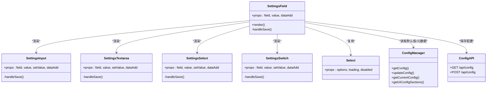

# 设置字段组件

<cite>
**本文档引用的文件**
- [src/components/Settings/SettingsField.tsx](file://src/components/Settings/SettingsField.tsx)
- [src/components/Settings/Sections/Personalization.tsx](file://src/components/Settings/Sections/Personalization.tsx)
- [src/components/Settings/Sections/Preferences.tsx](file://src/components/Settings/Sections/Preferences.tsx)
- [src/components/Settings/Sections/Search.tsx](file://src/components/Settings/Sections/Search.tsx)
- [src/components/Settings/SettingsDialogue.tsx](file://src/components/Settings/SettingsDialogue.tsx)
- [src/components/ui/Select.tsx](file://src/components/ui/Select.tsx)
- [src/lib/config/types.ts](file://src/lib/config/types.ts)
- [src/lib/config/index.ts](file://src/lib/config/index.ts)
- [src/lib/config/clientRegistry.ts](file://src/lib/config/clientRegistry.ts)
- [src/lib/config/serverRegistry.ts](file://src/lib/config/serverRegistry.ts)
- [src/app/api/config/route.ts](file://src/app/api/config/route.ts)
</cite>

## 目录
1. [简介](#简介)
2. [项目结构](#项目结构)
3. [核心组件](#核心组件)
4. [架构总览](#架构总览)
5. [详细组件分析](#详细组件分析)
6. [依赖关系分析](#依赖关系分析)
7. [性能考量](#性能考量)
8. [故障排除指南](#故障排除指南)
9. [结论](#结论)
10. [附录](#附录)

## 简介
本文件系统性梳理 Perplexica 的“设置字段组件”，围绕其设计与实现展开，重点覆盖以下方面：
- 字段输入类型与渲染策略：文本输入、多行文本、下拉选择、开关切换
- 验证机制与错误处理：客户端本地校验、服务端保存校验、失败提示与回滚
- 属性接口与事件处理：字段元数据、变更回调、异步保存流程
- 状态管理：本地状态与全局配置的双向同步
- 数据绑定：字段值来源、默认值、环境变量注入
- 表单验证、实时反馈与用户体验优化：加载态、禁用态、即时主题切换、Toast 提示
- 自定义扩展：如何新增字段类型与自定义输入组件

## 项目结构
设置字段组件位于设置模块中，配合通用 UI 组件与配置管理器共同工作：
- 设置对话框负责分栏导航与内容区域渲染
- 各设置分组页面负责按命名空间聚合字段并传入 SettingsField
- SettingsField 根据字段类型渲染对应输入控件，并在变更时进行保存
- UI Select 组件提供通用下拉选择能力
- 配置类型定义与配置管理器提供字段元数据、默认值与持久化能力
- 服务端 API 负责管理员权限下的配置读取与写入

图表来源
- [src/components/Settings/SettingsDialogue.tsx](file://src/components/Settings/SettingsDialogue.tsx#L26-L63)
- [src/components/Settings/Sections/Preferences.tsx](file://src/components/Settings/Sections/Preferences.tsx#L1-L30)
- [src/components/Settings/Sections/Personalization.tsx](file://src/components/Settings/Sections/Personalization.tsx#L1-L30)
- [src/components/Settings/Sections/Search.tsx](file://src/components/Settings/Sections/Search.tsx#L1-L30)
- [src/components/Settings/SettingsField.tsx](file://src/components/Settings/SettingsField.tsx#L1-L379)
- [src/components/ui/Select.tsx](file://src/components/ui/Select.tsx#L1-L51)
- [src/lib/config/types.ts](file://src/lib/config/types.ts#L1-L110)
- [src/lib/config/index.ts](file://src/lib/config/index.ts#L1-L391)
- [src/app/api/config/route.ts](file://src/app/api/config/route.ts#L1-L111)

章节来源
- [src/components/Settings/SettingsDialogue.tsx](file://src/components/Settings/SettingsDialogue.tsx#L1-L294)
- [src/components/Settings/SettingsField.tsx](file://src/components/Settings/SettingsField.tsx#L1-L379)
- [src/components/ui/Select.tsx](file://src/components/ui/Select.tsx#L1-L51)
- [src/lib/config/types.ts](file://src/lib/config/types.ts#L1-L110)
- [src/lib/config/index.ts](file://src/lib/config/index.ts#L1-L391)
- [src/app/api/config/route.ts](file://src/app/api/config/route.ts#L1-L111)

## 核心组件
- 设置字段组件 SettingsField：根据字段类型动态渲染对应输入控件；统一处理保存逻辑（本地或服务端）、加载态与错误提示；支持主题即时切换与客户端配置变更事件广播。
- 通用下拉选择 Select：封装 select 下拉组件，支持选项列表、加载态与禁用态。
- 设置分组页面：Preferences/Personalization/Search 分别渲染对应命名空间的字段集合。
- 设置对话框 SettingsDialogue：承载侧边导航与移动端选择器，负责拉取配置、过滤可见分组、触发分组渲染。

章节来源
- [src/components/Settings/SettingsField.tsx](file://src/components/Settings/SettingsField.tsx#L1-L379)
- [src/components/ui/Select.tsx](file://src/components/ui/Select.tsx#L1-L51)
- [src/components/Settings/Sections/Preferences.tsx](file://src/components/Settings/Sections/Preferences.tsx#L1-L30)
- [src/components/Settings/Sections/Personalization.tsx](file://src/components/Settings/Sections/Personalization.tsx#L1-L30)
- [src/components/Settings/Sections/Search.tsx](file://src/components/Settings/Sections/Search.tsx#L1-L30)
- [src/components/Settings/SettingsDialogue.tsx](file://src/components/Settings/SettingsDialogue.tsx#L1-L294)

## 架构总览
设置字段组件的运行时交互链路如下：

图表来源
- [src/components/Settings/SettingsField.tsx](file://src/components/Settings/SettingsField.tsx#L35-L68)
- [src/app/api/config/route.ts](file://src/app/api/config/route.ts#L66-L110)
- [src/lib/config/index.ts](file://src/lib/config/index.ts#L254-L272)

## 详细组件分析

### 字段类型与输入控件
- 文本输入（string）：受控输入框，失焦时触发保存；支持占位符与默认值；加载态显示旋转指示器。
- 多行文本（textarea）：受控文本域，失焦时触发保存；支持默认值与占位符。
- 下拉选择（select）：基于通用 Select 组件，选项由字段定义提供；保存时将选中值写入本地或服务端。
- 开关（switch）：Headless UI Switch 控件，布尔值切换；保存时将字符串化后的布尔值写入本地或服务端。

章节来源
- [src/components/Settings/SettingsField.tsx](file://src/components/Settings/SettingsField.tsx#L97-L172)
- [src/components/Settings/SettingsField.tsx](file://src/components/Settings/SettingsField.tsx#L174-L249)
- [src/components/Settings/SettingsField.tsx](file://src/components/Settings/SettingsField.tsx#L21-L95)
- [src/components/Settings/SettingsField.tsx](file://src/components/Settings/SettingsField.tsx#L251-L323)

### 属性接口与事件处理
- 字段元数据（BaseUIConfigField）：包含名称、键名、是否必填、描述、作用域（client/server）、环境变量映射等。
- 字段类型（UIConfigField）：支持 string、textarea、select、switch 等类型，每种类型可附加特定字段（如 placeholder、default、options）。
- 事件处理：
  - 输入类：onChange 更新本地状态；onBlur 或直接 onChange 触发保存。
  - 选择类：onChange 更新本地状态并触发保存。
  - 开关类：onChange 更新本地状态并触发保存。
- 保存策略：
  - 客户端作用域：写入 localStorage 并触发客户端配置变更事件，部分关键键（如 theme）会即时应用主题。
  - 服务端作用域：调用 /api/config POST 接口，由后端更新配置并持久化至 data/config.json。

章节来源
- [src/lib/config/types.ts](file://src/lib/config/types.ts#L3-L51)
- [src/components/Settings/SettingsField.tsx](file://src/components/Settings/SettingsField.tsx#L15-L19)
- [src/components/Settings/SettingsField.tsx](file://src/components/Settings/SettingsField.tsx#L35-L68)
- [src/components/Settings/SettingsField.tsx](file://src/components/Settings/SettingsField.tsx#L110-L140)
- [src/components/Settings/SettingsField.tsx](file://src/components/Settings/SettingsField.tsx#L187-L217)
- [src/components/Settings/SettingsField.tsx](file://src/components/Settings/SettingsField.tsx#L264-L294)

### 状态管理与数据绑定
- 本地状态：每个字段组件内部维护一个受控状态，用于即时反馈与保存前预览。
- 值来源优先级：
  - 客户端作用域：从 localStorage 读取，若不存在则回退到字段默认值。
  - 服务端作用域：从服务端返回的 values 对象中读取，若不存在则回退到字段默认值。
- 默认值与环境变量：
  - 配置管理器在初始化时会从环境变量注入默认值，并生成 UI 配置元数据。
  - 客户端读取工具函数提供便捷的默认值解析（如布尔、单位等）。

章节来源
- [src/components/Settings/SettingsField.tsx](file://src/components/Settings/SettingsField.tsx#L334-L335)
- [src/components/Settings/Sections/Preferences.tsx](file://src/components/Settings/Sections/Preferences.tsx#L17-L21)
- [src/components/Settings/Sections/Personalization.tsx](file://src/components/Settings/Sections/Personalization.tsx#L17-L21)
- [src/components/Settings/Sections/Search.tsx](file://src/components/Settings/Sections/Search.tsx#L17-L21)
- [src/lib/config/index.ts](file://src/lib/config/index.ts#L175-L238)
- [src/lib/config/clientRegistry.ts](file://src/lib/config/clientRegistry.ts#L3-L29)

### 验证机制与错误处理
- 前端保存校验：
  - 本地保存：无额外校验，直接写入 localStorage 或发起网络请求。
  - 服务端保存：在字段 scope 为 server 时，调用 /api/config POST；若响应非 OK，记录错误并显示 Toast 提示。
- 权限控制：
  - 读取配置：GET /api/config 支持管理员鉴权；非管理员时会过滤敏感字段与值。
  - 写入配置：POST /api/config 需要管理员权限，否则返回 403。
- 错误处理：
  - 捕获保存异常，记录日志并提示用户。
  - 加载态：保存期间禁用输入并显示旋转指示器，避免重复提交。
  - 回退策略：保存失败时保持本地状态不变，等待用户重试。

章节来源
- [src/components/Settings/SettingsField.tsx](file://src/components/Settings/SettingsField.tsx#L57-L67)
- [src/app/api/config/route.ts](file://src/app/api/config/route.ts#L66-L110)
- [src/components/Settings/SettingsDialogue.tsx](file://src/components/Settings/SettingsDialogue.tsx#L78-L84)
- [src/components/Settings/SettingsDialogue.tsx](file://src/components/Settings/SettingsDialogue.tsx#L104-L122)

### 实时反馈与用户体验优化
- 加载态与禁用态：保存过程中显示旋转指示器并禁用输入，防止并发修改。
- 即时主题切换：当保存键为 theme 且作用域为 client 时，立即应用新主题。
- 客户端配置变更事件：保存成功后广播事件，便于其他模块感知配置变化。
- Toast 提示：保存失败时通过 toast 提示用户，提升可发现性。

章节来源
- [src/components/Settings/SettingsField.tsx](file://src/components/Settings/SettingsField.tsx#L32-L44)
- [src/components/Settings/SettingsField.tsx](file://src/components/Settings/SettingsField.tsx#L163-L167)
- [src/components/Settings/SettingsField.tsx](file://src/components/Settings/SettingsField.tsx#L241-L244)

### 不同类型设置字段的实现方式
- 文本输入（string）：输入框 + 失焦保存；支持占位符与默认值。
- 多行文本（textarea）：文本域 + 失焦保存；适合较长文本输入。
- 下拉选择（select）：基于通用 Select 组件；选项来源于字段定义的 options 数组。
- 开关（switch）：布尔切换；保存时将值字符串化为 'true'/'false'。

章节来源
- [src/components/Settings/SettingsField.tsx](file://src/components/Settings/SettingsField.tsx#L97-L172)
- [src/components/Settings/SettingsField.tsx](file://src/components/Settings/SettingsField.tsx#L174-L249)
- [src/components/Settings/SettingsField.tsx](file://src/components/Settings/SettingsField.tsx#L21-L95)
- [src/components/Settings/SettingsField.tsx](file://src/components/Settings/SettingsField.tsx#L251-L323)
- [src/components/ui/Select.tsx](file://src/components/ui/Select.tsx#L10-L46)

### 使用示例与定制方法
- 基本使用：在设置分组页面中遍历字段数组，为每个字段传入对应的值与 dataAdd 命名空间，即可渲染完整设置项。
- 自定义输入组件：
  - 新增字段类型：在 UIConfigField 联合类型中添加新类型，并在 SettingsField 中增加对应的渲染分支。
  - 新增输入控件：在 SettingsField 中新增对应组件，遵循相同的保存流程（更新本地状态、scope 判断、调用保存逻辑）。
  - 扩展保存行为：可在保存函数中加入业务校验（如长度限制、正则校验），并在失败时抛出错误并被统一捕获。

章节来源
- [src/components/Settings/Sections/Preferences.tsx](file://src/components/Settings/Sections/Preferences.tsx#L11-L26)
- [src/components/Settings/Sections/Personalization.tsx](file://src/components/Settings/Sections/Personalization.tsx#L11-L26)
- [src/components/Settings/Sections/Search.tsx](file://src/components/Settings/Sections/Search.tsx#L11-L26)
- [src/lib/config/types.ts](file://src/lib/config/types.ts#L46-L51)
- [src/components/Settings/SettingsField.tsx](file://src/components/Settings/SettingsField.tsx#L325-L376)

### 数据绑定与双向同步机制
- 双向绑定：
  - 前端：字段组件内部状态与 props 值双向绑定，onChange 更新本地状态，onBlur 或直接保存。
  - 后端：服务端保存成功后，前端通过重新拉取配置或监听事件实现视图刷新。
- 命名空间与键名：
  - dataAdd 参数用于拼接完整键名（如 preferences.theme），确保不同分组的键不冲突。
- 环境变量注入：
  - 配置管理器在启动时从环境变量读取默认值，保证部署一致性。

章节来源
- [src/components/Settings/SettingsField.tsx](file://src/components/Settings/SettingsField.tsx#L325-L376)
- [src/components/Settings/SettingsField.tsx](file://src/components/Settings/SettingsField.tsx#L51-L55)
- [src/lib/config/index.ts](file://src/lib/config/index.ts#L175-L238)

## 依赖关系分析

图表来源
- [src/components/Settings/SettingsField.tsx](file://src/components/Settings/SettingsField.tsx#L1-L379)
- [src/components/ui/Select.tsx](file://src/components/ui/Select.tsx#L1-L51)
- [src/lib/config/index.ts](file://src/lib/config/index.ts#L240-L272)
- [src/app/api/config/route.ts](file://src/app/api/config/route.ts#L12-L110)

章节来源
- [src/components/Settings/SettingsField.tsx](file://src/components/Settings/SettingsField.tsx#L1-L379)
- [src/components/ui/Select.tsx](file://src/components/ui/Select.tsx#L1-L51)
- [src/lib/config/index.ts](file://src/lib/config/index.ts#L1-L391)
- [src/app/api/config/route.ts](file://src/app/api/config/route.ts#L1-L111)

## 性能考量
- 异步保存节流：保存完成后延迟关闭加载态，避免频繁点击导致的重复请求。
- 本地作用域优先：客户端配置直接写入 localStorage，减少网络往返。
- 服务端批量更新：通过统一的 /api/config 接口更新，避免多次请求。
- 组件懒加载：设置对话框按需打开，减少初始渲染压力。
- 主题即时切换：仅在客户端作用域的 theme 键上即时生效，降低不必要的重绘。

## 故障排除指南
- 保存失败：
  - 检查网络请求是否成功（查看浏览器开发者工具 Network 面板）。
  - 确认字段 scope 是否正确（client/server），避免在错误作用域下保存。
  - 查看服务端返回状态码与错误信息。
- 配置未生效：
  - 确认键名拼接是否正确（dataAdd + '.' + field.key）。
  - 检查客户端配置变更事件是否被监听与处理。
- 管理员权限问题：
  - 确认已登录管理员模式并携带有效 Token。
  - 非管理员访问时，敏感字段会被过滤，无法修改。

章节来源
- [src/components/Settings/SettingsField.tsx](file://src/components/Settings/SettingsField.tsx#L57-L67)
- [src/app/api/config/route.ts](file://src/app/api/config/route.ts#L66-L110)
- [src/components/Settings/SettingsDialogue.tsx](file://src/components/Settings/SettingsDialogue.tsx#L78-L84)

## 结论
设置字段组件通过统一的字段元数据与输入控件抽象，实现了跨多种输入类型的配置管理。其设计强调：
- 明确的作用域划分（client/server）与对应的保存路径
- 一致的事件与状态管理模型
- 可扩展的类型系统与输入控件体系
- 完善的错误处理与用户体验优化

该组件为后续扩展新的字段类型与输入控件提供了清晰的范式，便于团队快速迭代配置界面与功能。

## 附录

### 字段类型定义概览
- 基础字段：name、key、required、description、scope、env
- 文本输入：string（可选 placeholder、default）
- 多行文本：textarea（可选 placeholder、default）
- 下拉选择：select（必须 options 数组，含 name/value）
- 开关：switch（可选 default）
- 联合类型：UIConfigField 包含上述五种类型

章节来源
- [src/lib/config/types.ts](file://src/lib/config/types.ts#L3-L51)

### 配置管理器与 API 关键点
- 初始化：从 data/config.json 读取或创建默认配置；从环境变量注入默认值；生成 UI 配置元数据。
- 读取：GET /api/config 返回 values 与 fields，并根据管理员状态过滤敏感信息。
- 写入：POST /api/config 需管理员权限；服务端调用 updateConfig 持久化。

章节来源
- [src/lib/config/index.ts](file://src/lib/config/index.ts#L119-L238)
- [src/lib/config/index.ts](file://src/lib/config/index.ts#L240-L272)
- [src/app/api/config/route.ts](file://src/app/api/config/route.ts#L12-L110)