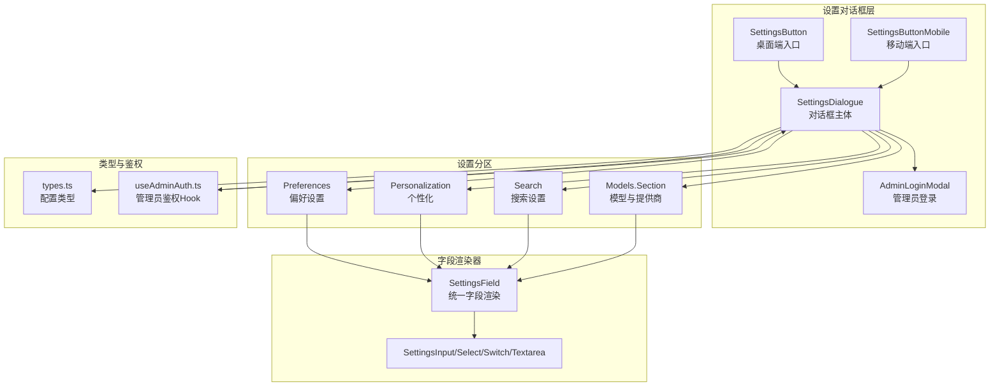
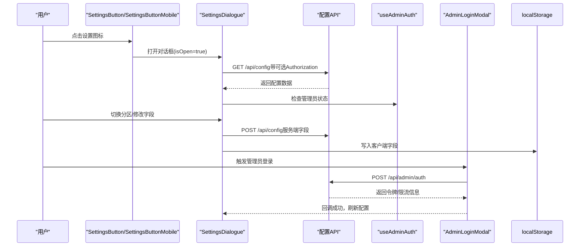
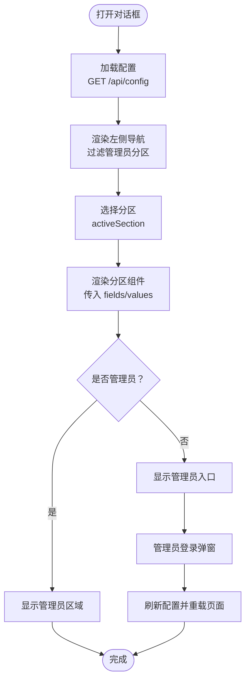
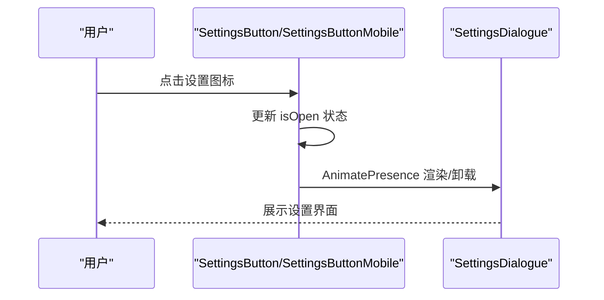
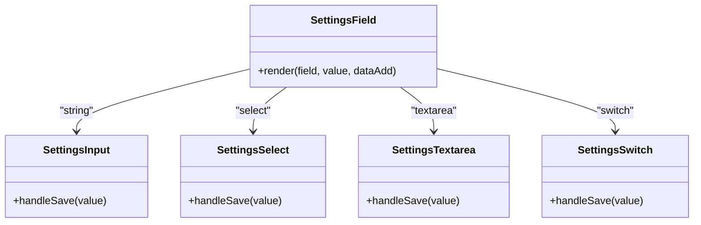
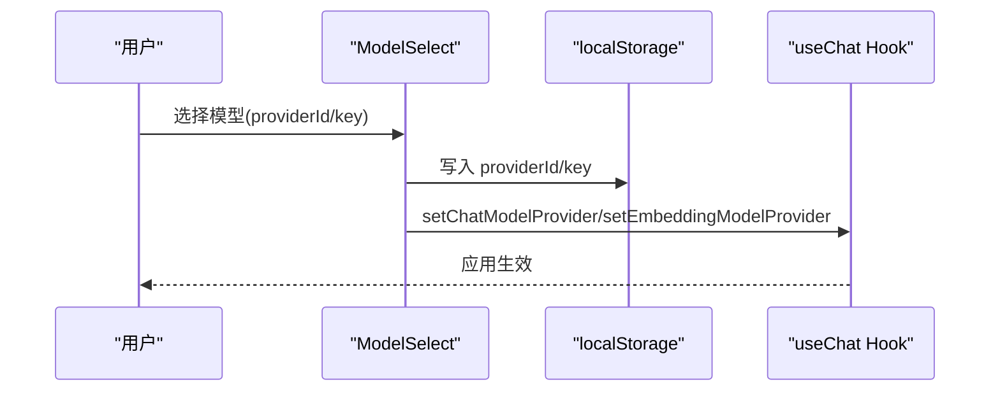
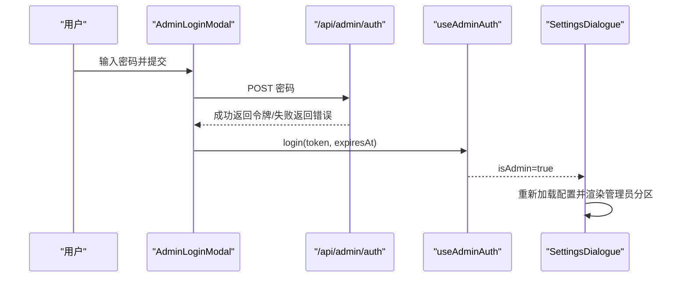
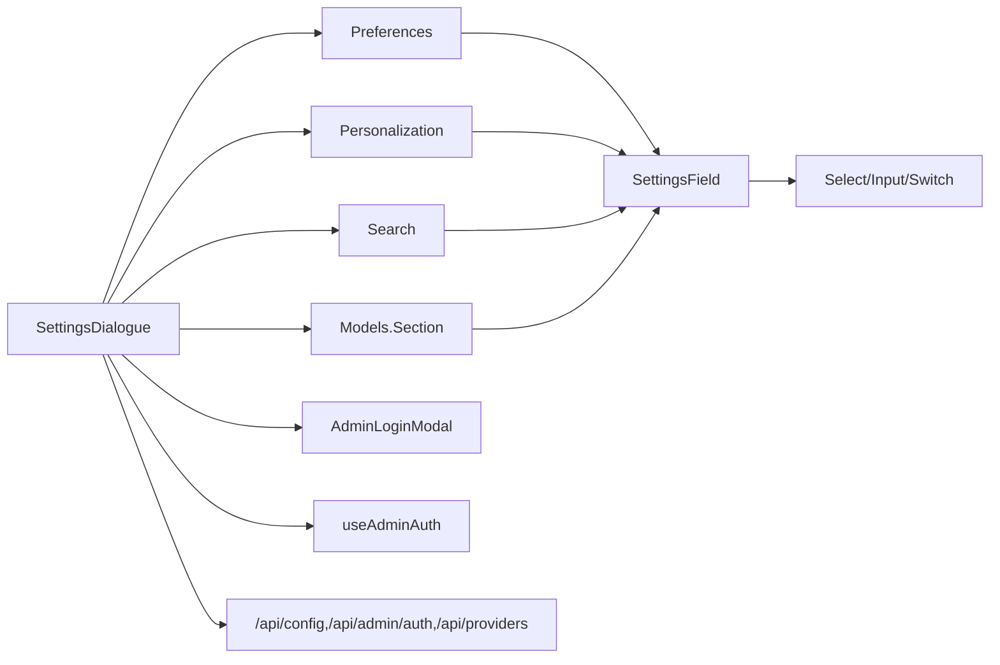

# 设置对话框

<cite>
**本文引用的文件**
- [src/components/Settings/SettingsDialogue.tsx](file://src/components/Settings/SettingsDialogue.tsx)
- [src/components/Settings/SettingsButton.tsx](file://src/components/Settings/SettingsButton.tsx)
- [src/components/Settings/SettingsButtonMobile.tsx](file://src/components/Settings/SettingsButtonMobile.tsx)
- [src/components/Settings/SettingsField.tsx](file://src/components/Settings/SettingsField.tsx)
- [src/components/Settings/Sections/Preferences.tsx](file://src/components/Settings/Sections/Preferences.tsx)
- [src/components/Settings/Sections/Personalization.tsx](file://src/components/Settings/Sections/Personalization.tsx)
- [src/components/Settings/Sections/Search.tsx](file://src/components/Settings/Sections/Search.tsx)
- [src/components/Settings/Sections/Models/Section.tsx](file://src/components/Settings/Sections/Models/Section.tsx)
- [src/components/Settings/Sections/Models/ModelProvider.tsx](file://src/components/Settings/Sections/Models/ModelProvider.tsx)
- [src/components/Settings/Sections/Models/ModelSelect.tsx](file://src/components/Settings/Sections/Models/ModelSelect.tsx)
- [src/components/Settings/Sections/Models/AddProviderDialog.tsx](file://src/components/Settings/Sections/Models/AddProviderDialog.tsx)
- [src/components/Settings/AdminLoginModal.tsx](file://src/components/Settings/AdminLoginModal.tsx)
- [src/lib/config/types.ts](file://src/lib/config/types.ts)
- [src/lib/hooks/useAdminAuth.ts](file://src/lib/hooks/useAdminAuth.ts)
- [src/app/layout.tsx](file://src/app/layout.tsx)
</cite>

## 目录
1. [简介](#简介)
2. [项目结构](#项目结构)
3. [核心组件](#核心组件)
4. [架构总览](#架构总览)
5. [详细组件分析](#详细组件分析)
6. [依赖关系分析](#依赖关系分析)
7. [性能考量](#性能考量)
8. [故障排查指南](#故障排查指南)
9. [结论](#结论)
10. [附录](#附录)

## 简介
本文件为 Perplexica 的“设置对话框”组件提供系统化、可操作的技术文档。内容涵盖对话框的打开/关闭机制、布局结构与响应式适配、设置按钮组件在桌面端与移动端的差异化实现、状态管理与动画体验、使用示例与集成方式、数据传递机制以及无障碍与键盘导航支持。

## 项目结构
设置对话框相关代码主要位于 src/components/Settings 目录下，采用按功能分层的组织方式：
- 顶层对话框与入口：SettingsDialogue.tsx、SettingsButton.tsx、SettingsButtonMobile.tsx
- 配置字段渲染器：SettingsField.tsx 及其子组件（输入、选择、开关、多行文本）
- 各设置分区：Preferences、Personalization、Search、Models/Section
- 管理员登录与鉴权：AdminLoginModal.tsx、useAdminAuth.ts
- 类型定义：lib/config/types.ts
- 主应用集成：app/layout.tsx 中的 Provider 包裹与全局通知

图表来源
- [src/components/Settings/SettingsDialogue.tsx](file://src/components/Settings/SettingsDialogue.tsx#L65-L294)
- [src/components/Settings/SettingsButton.tsx](file://src/components/Settings/SettingsButton.tsx#L6-L22)
- [src/components/Settings/SettingsButtonMobile.tsx](file://src/components/Settings/SettingsButtonMobile.tsx#L6-L19)
- [src/components/Settings/SettingsField.tsx](file://src/components/Settings/SettingsField.tsx#L325-L379)
- [src/components/Settings/Sections/Models/Section.tsx](file://src/components/Settings/Sections/Models/Section.tsx#L11-L92)
- [src/lib/config/types.ts](file://src/lib/config/types.ts#L46-L109)
- [src/lib/hooks/useAdminAuth.ts](file://src/lib/hooks/useAdminAuth.ts#L14-L124)

章节来源
- [src/components/Settings/SettingsDialogue.tsx](file://src/components/Settings/SettingsDialogue.tsx#L65-L294)
- [src/components/Settings/SettingsButton.tsx](file://src/components/Settings/SettingsButton.tsx#L6-L22)
- [src/components/Settings/SettingsButtonMobile.tsx](file://src/components/Settings/SettingsButtonMobile.tsx#L6-L19)
- [src/components/Settings/SettingsField.tsx](file://src/components/Settings/SettingsField.tsx#L325-L379)
- [src/components/Settings/Sections/Models/Section.tsx](file://src/components/Settings/Sections/Models/Section.tsx#L11-L92)
- [src/lib/config/types.ts](file://src/lib/config/types.ts#L46-L109)
- [src/lib/hooks/useAdminAuth.ts](file://src/lib/hooks/useAdminAuth.ts#L14-L124)

## 核心组件
- 设置对话框主体：负责加载配置、渲染侧边栏与当前分区内容、处理管理员模式与登录弹窗、提供移动端下拉切换。
- 设置按钮（桌面）：通过状态控制对话框显隐，并使用动画库提供平滑进入/退出。
- 设置按钮（移动端）：仅在小屏显示，点击即开启对话框。
- 字段渲染器：根据字段类型生成输入控件，支持本地存储与服务端持久化，提供保存反馈与加载态。
- 管理员登录弹窗：提供密码登录、限流提示、键盘回车提交等能力。
- 管理员鉴权 Hook：管理令牌生命周期、自动续期、登录/登出与令牌获取。

章节来源
- [src/components/Settings/SettingsDialogue.tsx](file://src/components/Settings/SettingsDialogue.tsx#L65-L294)
- [src/components/Settings/SettingsButton.tsx](file://src/components/Settings/SettingsButton.tsx#L6-L22)
- [src/components/Settings/SettingsButtonMobile.tsx](file://src/components/Settings/SettingsButtonMobile.tsx#L6-L19)
- [src/components/Settings/SettingsField.tsx](file://src/components/Settings/SettingsField.tsx#L325-L379)
- [src/components/Settings/AdminLoginModal.tsx](file://src/components/Settings/AdminLoginModal.tsx#L12-L169)
- [src/lib/hooks/useAdminAuth.ts](file://src/lib/hooks/useAdminAuth.ts#L14-L124)

## 架构总览
设置对话框采用“入口按钮 + 对话框 + 分区组件 + 字段渲染器”的分层架构，配合类型系统与鉴权 Hook 实现配置项的可视化编辑与持久化。

图表来源
- [src/components/Settings/SettingsDialogue.tsx](file://src/components/Settings/SettingsDialogue.tsx#L86-L122)
- [src/components/Settings/SettingsField.tsx](file://src/components/Settings/SettingsField.tsx#L35-L68)
- [src/components/Settings/AdminLoginModal.tsx](file://src/components/Settings/AdminLoginModal.tsx#L18-L63)
- [src/lib/hooks/useAdminAuth.ts](file://src/lib/hooks/useAdminAuth.ts#L21-L50)

## 详细组件分析

### 设置对话框主体（SettingsDialogue）
- 打开/关闭机制：基于 isOpen/ setIsOpen 状态驱动 Headless UI Dialog；退出时触发 onClose。
- 布局结构：左侧固定导航（桌面端）+ 右侧内容区；移动端顶部提供下拉选择当前分区。
- 响应式适配：桌面端隐藏移动端元素，移动端显示下拉选择与返回按钮；尺寸随视口动态调整。
- 管理员模式：根据 useAdminAuth 的 isAdmin 过滤可见分区；未登录时显示“管理员模式”入口，点击弹出登录弹窗。
- 数据加载：首次打开时通过 fetch 获取配置；若存在管理员令牌则附加 Authorization 请求头；加载完成后关闭 Loading。
- 动画效果：使用 Framer Motion 在背景与面板层面提供淡入淡出过渡。

图表来源
- [src/components/Settings/SettingsDialogue.tsx](file://src/components/Settings/SettingsDialogue.tsx#L86-L122)
- [src/components/Settings/SettingsDialogue.tsx](file://src/components/Settings/SettingsDialogue.tsx#L124-L294)
- [src/components/Settings/AdminLoginModal.tsx](file://src/components/Settings/AdminLoginModal.tsx#L12-L169)

章节来源
- [src/components/Settings/SettingsDialogue.tsx](file://src/components/Settings/SettingsDialogue.tsx#L65-L294)

### 设置按钮组件（桌面端与移动端）
- 桌面端按钮：圆形背景、悬停缩放与过渡动画；点击后通过 AnimatePresence 条件渲染对话框。
- 移动端按钮：仅在小屏显示，点击直接打开对话框，适合移动端触控操作。
- 两者均通过 isOpen/ setIsOpen 控制对话框显隐，保持一致的交互语义。

图表来源
- [src/components/Settings/SettingsButton.tsx](file://src/components/Settings/SettingsButton.tsx#L6-L22)
- [src/components/Settings/SettingsButtonMobile.tsx](file://src/components/Settings/SettingsButtonMobile.tsx#L6-L19)

章节来源
- [src/components/Settings/SettingsButton.tsx](file://src/components/Settings/SettingsButton.tsx#L6-L22)
- [src/components/Settings/SettingsButtonMobile.tsx](file://src/components/Settings/SettingsButtonMobile.tsx#L6-L19)

### 字段渲染器（SettingsField 及子组件）
- 支持类型：字符串、选择、密码、多行文本、开关。
- 客户端/服务端作用域：根据字段 scope 决定写入 localStorage 或调用 /api/config。
- 保存流程：统一在失焦或变更时触发保存；显示加载态与错误提示；成功后触发“client-config-changed”事件以通知应用更新。
- 开关字段：特殊处理布尔值字符串比较，确保 UI 与存储一致。

图表来源
- [src/components/Settings/SettingsField.tsx](file://src/components/Settings/SettingsField.tsx#L325-L379)
- [src/components/Settings/SettingsField.tsx](file://src/components/Settings/SettingsField.tsx#L35-L68)
- [src/components/Settings/SettingsField.tsx](file://src/components/Settings/SettingsField.tsx#L110-L140)
- [src/components/Settings/SettingsField.tsx](file://src/components/Settings/SettingsField.tsx#L187-L217)
- [src/components/Settings/SettingsField.tsx](file://src/components/Settings/SettingsField.tsx#L264-L294)

章节来源
- [src/components/Settings/SettingsField.tsx](file://src/components/Settings/SettingsField.tsx#L325-L379)

### 分区组件（Preferences、Personalization、Search）
- 结构一致：遍历 fields，计算默认值（优先客户端存储或服务端值），交由 SettingsField 渲染。
- 适用范围：偏好设置、个性化参数、搜索相关配置。

章节来源
- [src/components/Settings/Sections/Preferences.tsx](file://src/components/Settings/Sections/Preferences.tsx#L4-L29)
- [src/components/Settings/Sections/Personalization.tsx](file://src/components/Settings/Sections/Personalization.tsx#L4-L29)
- [src/components/Settings/Sections/Search.tsx](file://src/components/Settings/Sections/Search.tsx#L4-L29)

### 模型与提供商分区（Models/Section）
- 选择模型：通过 ModelSelect 组件在聊天/嵌入模型间进行选择，写入 localStorage 并通过 Hook 更新上下文。
- 管理提供商：AddProviderDialog 弹窗收集名称与配置，调用 /api/providers 创建新提供商；更新父级 providers 列表。
- 单个提供商卡片：展示聊天/嵌入模型列表，支持删除单个模型；错误模型会以警示形式呈现。

图表来源
- [src/components/Settings/Sections/Models/ModelSelect.tsx](file://src/components/Settings/Sections/Models/ModelSelect.tsx#L22-L56)
- [src/components/Settings/Sections/Models/AddProviderDialog.tsx](file://src/components/Settings/Sections/Models/AddProviderDialog.tsx#L62-L89)
- [src/components/Settings/Sections/Models/ModelProvider.tsx](file://src/components/Settings/Sections/Models/ModelProvider.tsx#L22-L67)

章节来源
- [src/components/Settings/Sections/Models/Section.tsx](file://src/components/Settings/Sections/Models/Section.tsx#L11-L92)
- [src/components/Settings/Sections/Models/ModelSelect.tsx](file://src/components/Settings/Sections/Models/ModelSelect.tsx#L7-L99)
- [src/components/Settings/Sections/Models/AddProviderDialog.tsx](file://src/components/Settings/Sections/Models/AddProviderDialog.tsx#L20-L213)
- [src/components/Settings/Sections/Models/ModelProvider.tsx](file://src/components/Settings/Sections/Models/ModelProvider.tsx#L11-L225)

### 管理员登录与鉴权
- 登录弹窗：输入密码，回车提交；429 限流时显示等待时间；失败后短暂延迟防止暴力破解。
- 鉴权 Hook：管理本地令牌与过期时间；即将过期时自动续期；提供登录/登出与令牌获取。
- 对话框联动：登录成功后回调刷新配置并重载页面，使管理员专属分区可见。

图表来源
- [src/components/Settings/AdminLoginModal.tsx](file://src/components/Settings/AdminLoginModal.tsx#L18-L63)
- [src/lib/hooks/useAdminAuth.ts](file://src/lib/hooks/useAdminAuth.ts#L80-L95)
- [src/components/Settings/SettingsDialogue.tsx](file://src/components/Settings/SettingsDialogue.tsx#L276-L288)

章节来源
- [src/components/Settings/AdminLoginModal.tsx](file://src/components/Settings/AdminLoginModal.tsx#L12-L169)
- [src/lib/hooks/useAdminAuth.ts](file://src/lib/hooks/useAdminAuth.ts#L14-L124)

## 依赖关系分析
- 组件耦合：SettingsDialogue 依赖各分区组件与 AdminLoginModal；分区组件依赖 SettingsField；字段渲染器依赖 UI 组件与通知库。
- 外部依赖：Headless UI（Dialog）、Framer Motion（动画）、Sonner（通知）、next-themes（主题切换）。
- 数据契约：字段类型定义来自 lib/config/types.ts；配置 API 为 /api/config 与 /api/admin/auth、/api/providers。

图表来源
- [src/components/Settings/SettingsDialogue.tsx](file://src/components/Settings/SettingsDialogue.tsx#L13-L24)
- [src/lib/config/types.ts](file://src/lib/config/types.ts#L46-L109)

章节来源
- [src/components/Settings/SettingsDialogue.tsx](file://src/components/Settings/SettingsDialogue.tsx#L13-L24)
- [src/lib/config/types.ts](file://src/lib/config/types.ts#L46-L109)

## 性能考量
- 按需渲染：使用 AnimatePresence 条件渲染对话框，避免常驻 DOM。
- 加载态：保存字段时显示加载指示，减少无效交互。
- 本地优先：客户端字段直接写入 localStorage，降低网络请求频率。
- 重绘控制：分区切换仅重绘内容区，导航栏复用。

## 故障排查指南
- 对话框无法打开：确认入口按钮状态 isOpen 正确传递；检查 AnimatePresence 使用。
- 配置加载失败：检查 /api/config 是否返回 200；查看控制台错误与 toast 提示。
- 管理员登录失败：检查 /api/admin/auth 返回状态；注意 429 限流与错误消息；确认 ADMIN_PASSWORD 环境变量。
- 字段保存失败：检查服务端返回状态；确认字段 scope 与目标路径；查看控制台错误日志。
- 主题切换无效：确认字段 key 为 theme 且 scope 为 client；检查 next-themes 使用。

章节来源
- [src/components/Settings/SettingsDialogue.tsx](file://src/components/Settings/SettingsDialogue.tsx#L112-L118)
- [src/components/Settings/AdminLoginModal.tsx](file://src/components/Settings/AdminLoginModal.tsx#L39-L47)
- [src/components/Settings/SettingsField.tsx](file://src/components/Settings/SettingsField.tsx#L35-L68)

## 结论
设置对话框通过清晰的分层设计与完善的类型系统，实现了从入口按钮到字段渲染、从客户端到服务端的完整配置编辑链路。配合管理员鉴权与登录弹窗，既保证了易用性也兼顾了安全性。响应式布局与动画优化提升了跨设备体验。

## 附录

### 使用示例与集成方式
- 在桌面端集成：在布局中放置 SettingsButton，它会在点击时打开 SettingsDialogue。
- 在移动端集成：放置 SettingsButtonMobile，仅在小屏显示。
- 在主应用中：RootLayout 已包裹 ThemeProvider 与 ChatProvider，确保主题与模型上下文可用。

章节来源
- [src/app/layout.tsx](file://src/app/layout.tsx#L35-L54)
- [src/components/Settings/SettingsButton.tsx](file://src/components/Settings/SettingsButton.tsx#L6-L22)
- [src/components/Settings/SettingsButtonMobile.tsx](file://src/components/Settings/SettingsButtonMobile.tsx#L6-L19)

### 无障碍与键盘导航
- 对话框：使用 Headless UI Dialog，具备自动焦点管理与键盘关闭（Esc）能力。
- 管理员登录弹窗：输入框自动聚焦；支持回车键提交；禁用状态下按钮不可用。
- 字段控件：输入类控件支持失焦保存；开关控件具备可访问属性（aria-checked）与键盘切换。

章节来源
- [src/components/Settings/AdminLoginModal.tsx](file://src/components/Settings/AdminLoginModal.tsx#L108-L118)
- [src/components/Settings/SettingsField.tsx](file://src/components/Settings/SettingsField.tsx#L299-L322)