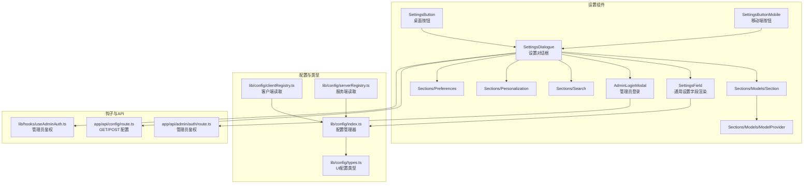
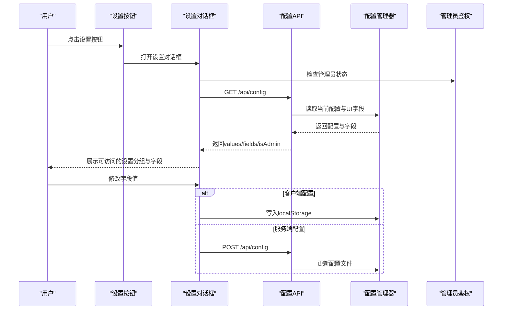
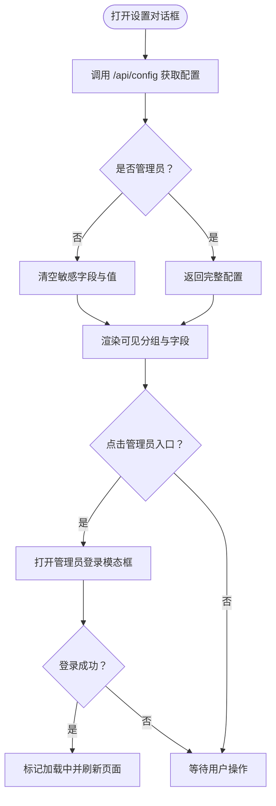
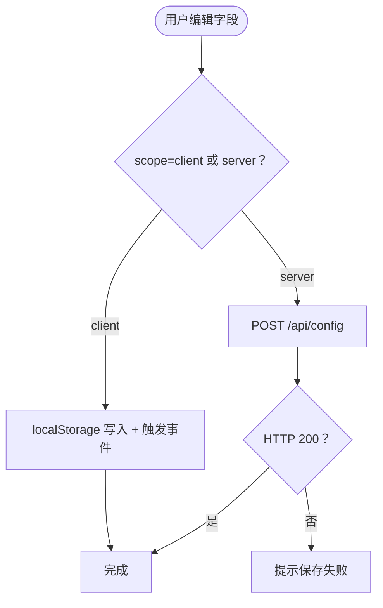
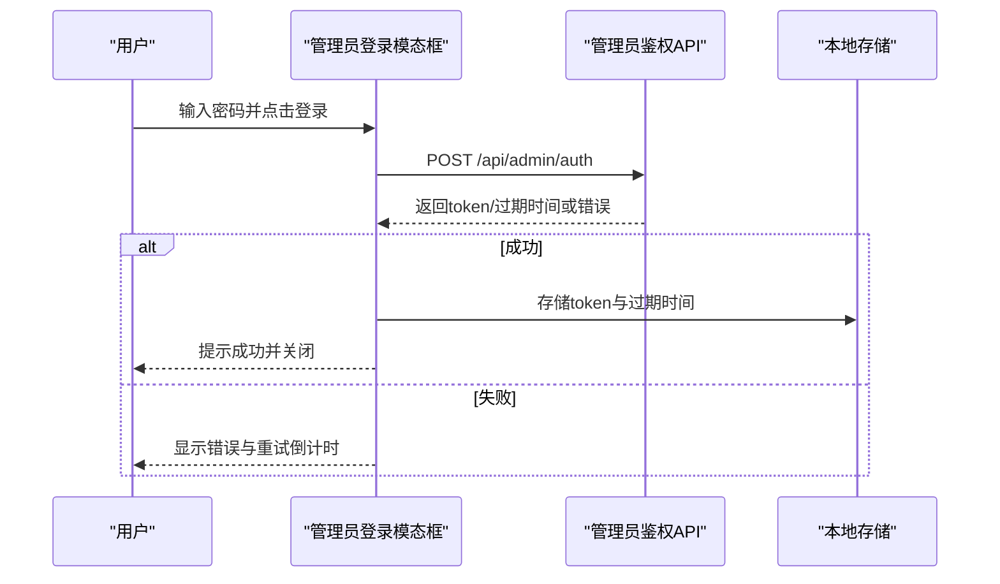
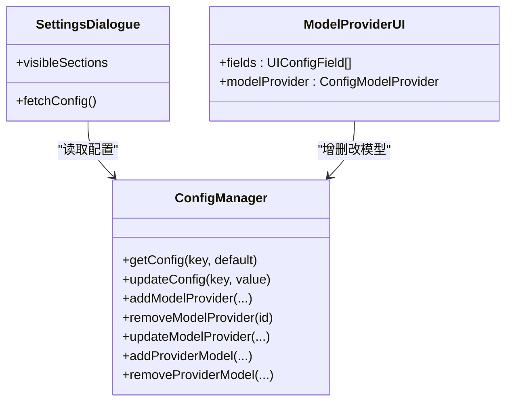
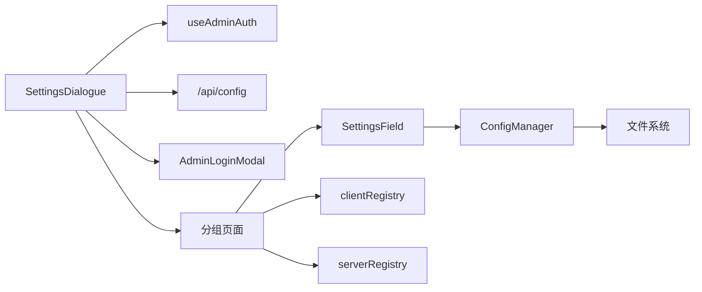
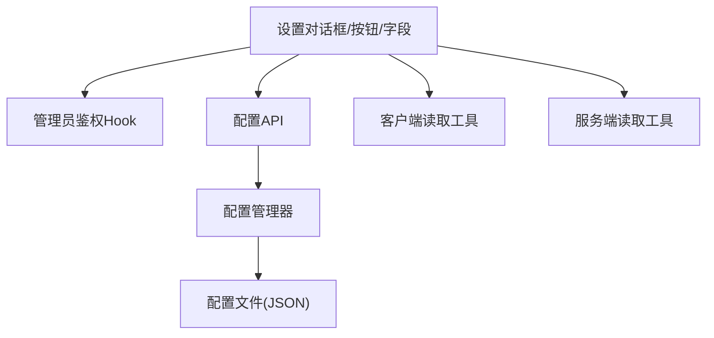

# 设置管理组件

<cite>
**本文引用的文件**
- [src/components/Settings/SettingsDialogue.tsx](file://src/components/Settings/SettingsDialogue.tsx)
- [src/components/Settings/SettingsButton.tsx](file://src/components/Settings/SettingsButton.tsx)
- [src/components/Settings/SettingsField.tsx](file://src/components/Settings/SettingsField.tsx)
- [src/components/Settings/AdminLoginModal.tsx](file://src/components/Settings/AdminLoginModal.tsx)
- [src/components/Settings/SettingsButtonMobile.tsx](file://src/components/Settings/SettingsButtonMobile.tsx)
- [src/components/Settings/Sections/Preferences.tsx](file://src/components/Settings/Sections/Preferences.tsx)
- [src/components/Settings/Sections/Personalization.tsx](file://src/components/Settings/Sections/Personalization.tsx)
- [src/components/Settings/Sections/Search.tsx](file://src/components/Settings/Sections/Search.tsx)
- [src/components/Settings/Sections/Models/Section.tsx](file://src/components/Settings/Sections/Models/Section.tsx)
- [src/components/Settings/Sections/Models/ModelProvider.tsx](file://src/components/Settings/Sections/Models/ModelProvider.tsx)
- [src/lib/config/types.ts](file://src/lib/config/types.ts)
- [src/lib/config/index.ts](file://src/lib/config/index.ts)
- [src/lib/config/clientRegistry.ts](file://src/lib/config/clientRegistry.ts)
- [src/lib/config/serverRegistry.ts](file://src/lib/config/serverRegistry.ts)
- [src/lib/hooks/useAdminAuth.ts](file://src/lib/hooks/useAdminAuth.ts)
- [src/app/api/config/route.ts](file://src/app/api/config/route.ts)
- [src/app/api/admin/auth/route.ts](file://src/app/api/admin/auth/route.ts)
</cite>

## 目录
1. [简介](#简介)
2. [项目结构](#项目结构)
3. [核心组件](#核心组件)
4. [架构总览](#架构总览)
5. [详细组件分析](#详细组件分析)
6. [依赖关系分析](#依赖关系分析)
7. [性能考量](#性能考量)
8. [故障排查指南](#故障排查指南)
9. [结论](#结论)
10. [附录](#附录)

## 简介
本文件系统性梳理 Perplexica 的设置管理组件，覆盖设置对话框、设置按钮、设置字段、管理员登录模态框等核心 UI 组件；阐述设置系统的架构（设置分组、配置项管理与验证）、属性接口、事件处理与状态管理；提供使用示例与配置流程，并解释设置数据的持久化与同步机制，以及移动端适配与响应式设计细节。最后给出扩展与自定义指导，帮助开发者按需新增设置项或调整界面。

## 项目结构
设置相关代码主要位于以下位置：
- 组件层：src/components/Settings 下包含设置对话框、按钮、字段、分组页面与模型管理子模块
- 配置类型与注册表：src/lib/config 下定义 UI 配置字段类型、配置管理器、客户端与服务端读取工具
- 钩子：src/lib/hooks 下提供管理员鉴权状态管理
- API：src/app/api 下提供配置读取/保存与管理员鉴权接口

图表来源
- [src/components/Settings/SettingsButton.tsx](file://src/components/Settings/SettingsButton.tsx#L1-L25)
- [src/components/Settings/SettingsButtonMobile.tsx](file://src/components/Settings/SettingsButtonMobile.tsx#L1-L22)
- [src/components/Settings/SettingsDialogue.tsx](file://src/components/Settings/SettingsDialogue.tsx#L1-L294)
- [src/components/Settings/AdminLoginModal.tsx](file://src/components/Settings/AdminLoginModal.tsx#L1-L169)
- [src/components/Settings/SettingsField.tsx](file://src/components/Settings/SettingsField.tsx#L1-L379)
- [src/components/Settings/Sections/Preferences.tsx](file://src/components/Settings/Sections/Preferences.tsx#L1-L30)
- [src/components/Settings/Sections/Personalization.tsx](file://src/components/Settings/Sections/Personalization.tsx#L1-L30)
- [src/components/Settings/Sections/Search.tsx](file://src/components/Settings/Sections/Search.tsx#L1-L30)
- [src/components/Settings/Sections/Models/Section.tsx](file://src/components/Settings/Sections/Models/Section.tsx#L1-L92)
- [src/components/Settings/Sections/Models/ModelProvider.tsx](file://src/components/Settings/Sections/Models/ModelProvider.tsx#L1-L225)
- [src/lib/config/index.ts](file://src/lib/config/index.ts#L1-L391)
- [src/lib/config/types.ts](file://src/lib/config/types.ts#L1-L110)
- [src/lib/config/clientRegistry.ts](file://src/lib/config/clientRegistry.ts#L1-L30)
- [src/lib/config/serverRegistry.ts](file://src/lib/config/serverRegistry.ts#L1-L16)
- [src/lib/hooks/useAdminAuth.ts](file://src/lib/hooks/useAdminAuth.ts#L1-L125)
- [src/app/api/config/route.ts](file://src/app/api/config/route.ts#L1-L111)
- [src/app/api/admin/auth/route.ts](file://src/app/api/admin/auth/route.ts#L1-L103)

章节来源
- [src/components/Settings/SettingsDialogue.tsx](file://src/components/Settings/SettingsDialogue.tsx#L1-L294)
- [src/components/Settings/SettingsButton.tsx](file://src/components/Settings/SettingsButton.tsx#L1-L25)
- [src/components/Settings/SettingsField.tsx](file://src/components/Settings/SettingsField.tsx#L1-L379)
- [src/components/Settings/AdminLoginModal.tsx](file://src/components/Settings/AdminLoginModal.tsx#L1-L169)
- [src/components/Settings/SettingsButtonMobile.tsx](file://src/components/Settings/SettingsButtonMobile.tsx#L1-L22)
- [src/components/Settings/Sections/Preferences.tsx](file://src/components/Settings/Sections/Preferences.tsx#L1-L30)
- [src/components/Settings/Sections/Personalization.tsx](file://src/components/Settings/Sections/Personalization.tsx#L1-L30)
- [src/components/Settings/Sections/Search.tsx](file://src/components/Settings/Sections/Search.tsx#L1-L30)
- [src/components/Settings/Sections/Models/Section.tsx](file://src/components/Settings/Sections/Models/Section.tsx#L1-L92)
- [src/components/Settings/Sections/Models/ModelProvider.tsx](file://src/components/Settings/Sections/Models/ModelProvider.tsx#L1-L225)
- [src/lib/config/types.ts](file://src/lib/config/types.ts#L1-L110)
- [src/lib/config/index.ts](file://src/lib/config/index.ts#L1-L391)
- [src/lib/config/clientRegistry.ts](file://src/lib/config/clientRegistry.ts#L1-L30)
- [src/lib/config/serverRegistry.ts](file://src/lib/config/serverRegistry.ts#L1-L16)
- [src/lib/hooks/useAdminAuth.ts](file://src/lib/hooks/useAdminAuth.ts#L1-L125)
- [src/app/api/config/route.ts](file://src/app/api/config/route.ts#L1-L111)
- [src/app/api/admin/auth/route.ts](file://src/app/api/admin/auth/route.ts#L1-L103)

## 核心组件
- 设置对话框：负责承载设置分组导航、内容区域、管理员入口与版本信息，支持桌面与移动端布局切换
- 设置按钮：桌面与移动端分别提供入口，点击打开设置对话框
- 设置字段：根据字段类型渲染输入控件，支持本地存储与服务端持久化
- 管理员登录模态框：提供管理员密码登录，集成限流与错误提示
- 设置分组页面：偏好、个性化、搜索、模型连接等分组，按需显示与过滤
- 模型提供者管理：模型选择、添加/更新/删除提供者与模型

章节来源
- [src/components/Settings/SettingsDialogue.tsx](file://src/components/Settings/SettingsDialogue.tsx#L65-L294)
- [src/components/Settings/SettingsButton.tsx](file://src/components/Settings/SettingsButton.tsx#L1-L25)
- [src/components/Settings/SettingsField.tsx](file://src/components/Settings/SettingsField.tsx#L325-L379)
- [src/components/Settings/AdminLoginModal.tsx](file://src/components/Settings/AdminLoginModal.tsx#L1-L169)
- [src/components/Settings/SettingsButtonMobile.tsx](file://src/components/Settings/SettingsButtonMobile.tsx#L1-L22)
- [src/components/Settings/Sections/Preferences.tsx](file://src/components/Settings/Sections/Preferences.tsx#L1-L30)
- [src/components/Settings/Sections/Personalization.tsx](file://src/components/Settings/Sections/Personalization.tsx#L1-L30)
- [src/components/Settings/Sections/Search.tsx](file://src/components/Settings/Sections/Search.tsx#L1-L30)
- [src/components/Settings/Sections/Models/Section.tsx](file://src/components/Settings/Sections/Models/Section.tsx#L1-L92)
- [src/components/Settings/Sections/Models/ModelProvider.tsx](file://src/components/Settings/Sections/Models/ModelProvider.tsx#L1-L225)

## 架构总览
设置系统采用“配置声明 + 动态渲染 + 权限隔离”的架构：
- 配置声明：通过配置管理器集中定义 UI 字段、默认值、作用域（客户端/服务端）与环境映射
- 动态渲染：设置对话框根据当前激活分组动态加载对应分组页面，再由分组页面渲染具体字段
- 权限隔离：非管理员仅可见公开配置，敏感配置（如模型提供者密钥、搜索服务端参数）被隐藏
- 持久化：客户端配置写入 localStorage；服务端配置通过 API 写入本地 JSON 文件

图表来源
- [src/components/Settings/SettingsDialogue.tsx](file://src/components/Settings/SettingsDialogue.tsx#L86-L122)
- [src/app/api/config/route.ts](file://src/app/api/config/route.ts#L12-L64)
- [src/lib/config/index.ts](file://src/lib/config/index.ts#L240-L272)
- [src/lib/hooks/useAdminAuth.ts](file://src/lib/hooks/useAdminAuth.ts#L21-L50)
- [src/app/api/admin/auth/route.ts](file://src/app/api/admin/auth/route.ts#L25-L102)

## 详细组件分析

### 设置对话框（SettingsDialogue）
- 负责：
  - 加载并缓存配置（含 fields 与 values），支持管理员鉴权后的完整配置
  - 分组导航与内容区域渲染，桌面侧固定侧边栏，移动端使用下拉选择
  - 管理员入口：未登录时显示“管理员模式”按钮，登录后显示退出入口
  - 加载态与错误提示
- 关键逻辑：
  - 根据管理员状态过滤可见分组
  - 通过 fetch 读取 /api/config，携带 Authorization 头（若存在）
  - 重新登录后刷新页面以应用管理员权限

图表来源
- [src/components/Settings/SettingsDialogue.tsx](file://src/components/Settings/SettingsDialogue.tsx#L82-L122)
- [src/app/api/config/route.ts](file://src/app/api/config/route.ts#L33-L56)
- [src/components/Settings/AdminLoginModal.tsx](file://src/components/Settings/AdminLoginModal.tsx#L18-L63)

章节来源
- [src/components/Settings/SettingsDialogue.tsx](file://src/components/Settings/SettingsDialogue.tsx#L65-L294)
- [src/app/api/config/route.ts](file://src/app/api/config/route.ts#L12-L64)

### 设置按钮（SettingsButton / SettingsButtonMobile）
- 桌面按钮：悬浮圆形按钮，点击打开设置对话框
- 移动端按钮：底部可见按钮，点击打开设置对话框
- 共同点：使用 AnimatePresence 控制对话框挂载时机，避免不必要的渲染

章节来源
- [src/components/Settings/SettingsButton.tsx](file://src/components/Settings/SettingsButton.tsx#L1-L25)
- [src/components/Settings/SettingsButtonMobile.tsx](file://src/components/Settings/SettingsButtonMobile.tsx#L1-L22)

### 设置字段（SettingsField）
- 支持字段类型：字符串、多行文本、选择、开关
- 保存策略：
  - 客户端作用域：写入 localStorage，触发“client-config-changed”事件，便于应用级订阅
  - 服务端作用域：调用 /api/config POST，将 key 形如 “分组名.字段名” 传给后端
- 交互反馈：保存过程中显示加载态，失败时弹出通知

图表来源
- [src/components/Settings/SettingsField.tsx](file://src/components/Settings/SettingsField.tsx#L35-L68)
- [src/components/Settings/SettingsField.tsx](file://src/components/Settings/SettingsField.tsx#L110-L140)
- [src/components/Settings/SettingsField.tsx](file://src/components/Settings/SettingsField.tsx#L187-L217)
- [src/components/Settings/SettingsField.tsx](file://src/components/Settings/SettingsField.tsx#L264-L294)
- [src/app/api/config/route.ts](file://src/app/api/config/route.ts#L66-L110)

章节来源
- [src/components/Settings/SettingsField.tsx](file://src/components/Settings/SettingsField.tsx#L1-L379)
- [src/app/api/config/route.ts](file://src/app/api/config/route.ts#L66-L110)

### 管理员登录模态框（AdminLoginModal）
- 功能：输入管理员密码，调用 /api/admin/auth 获取 token 并持久化
- 安全：集成限流（429），失败尝试记录与延迟，错误消息通过 toast 提示
- 交互：支持回车提交、取消关闭、重试倒计时提示

图表来源
- [src/components/Settings/AdminLoginModal.tsx](file://src/components/Settings/AdminLoginModal.tsx#L18-L63)
- [src/app/api/admin/auth/route.ts](file://src/app/api/admin/auth/route.ts#L25-L102)
- [src/lib/hooks/useAdminAuth.ts](file://src/lib/hooks/useAdminAuth.ts#L80-L95)

章节来源
- [src/components/Settings/AdminLoginModal.tsx](file://src/components/Settings/AdminLoginModal.tsx#L1-L169)
- [src/app/api/admin/auth/route.ts](file://src/app/api/admin/auth/route.ts#L1-L103)
- [src/lib/hooks/useAdminAuth.ts](file://src/lib/hooks/useAdminAuth.ts#L1-L125)

### 设置分组页面
- 偏好（Preferences）：主题、单位、自动媒体搜索、天气/新闻小部件等
- 个性化（Personalization）：系统指令等
- 搜索（Search）：SearXNG 地址等
- 模型（Models）：模型提供者与模型管理

渲染逻辑：从配置管理器读取 fields 与 values，按字段类型渲染对应控件；客户端字段优先读取 localStorage，否则回退到 values 或默认值。

章节来源
- [src/components/Settings/Sections/Preferences.tsx](file://src/components/Settings/Sections/Preferences.tsx#L1-L30)
- [src/components/Settings/Sections/Personalization.tsx](file://src/components/Settings/Sections/Personalization.tsx#L1-L30)
- [src/components/Settings/Sections/Search.tsx](file://src/components/Settings/Sections/Search.tsx#L1-L30)
- [src/lib/config/types.ts](file://src/lib/config/types.ts#L46-L51)
- [src/lib/config/clientRegistry.ts](file://src/lib/config/clientRegistry.ts#L1-L30)
- [src/lib/config/serverRegistry.ts](file://src/lib/config/serverRegistry.ts#L1-L16)

### 模型提供者管理
- 模块职责：
  - Section：提供模型选择器与“添加提供者”入口，展示已配置提供者列表
  - ModelProvider：展示单个提供者的聊天/嵌入模型，支持增删改
- 数据来源：配置管理器维护 modelProviders 列表，API 在管理员模式下返回完整配置

图表来源
- [src/lib/config/index.ts](file://src/lib/config/index.ts#L240-L385)
- [src/components/Settings/Sections/Models/Section.tsx](file://src/components/Settings/Sections/Models/Section.tsx#L11-L92)
- [src/components/Settings/Sections/Models/ModelProvider.tsx](file://src/components/Settings/Sections/Models/ModelProvider.tsx#L11-L225)

章节来源
- [src/components/Settings/Sections/Models/Section.tsx](file://src/components/Settings/Sections/Models/Section.tsx#L1-L92)
- [src/components/Settings/Sections/Models/ModelProvider.tsx](file://src/components/Settings/Sections/Models/ModelProvider.tsx#L1-L225)
- [src/lib/config/index.ts](file://src/lib/config/index.ts#L274-L365)

## 依赖关系分析
- 组件耦合：
  - SettingsDialogue 依赖 useAdminAuth、API、分组页面与 AdminLoginModal
  - SettingsField 依赖 UI 类型定义与配置管理器（服务端写入）
  - 分组页面依赖 SettingsField 与客户端/服务端读取工具
- 外部依赖：
  - Headless UI（Dialog/DialogPanel）、Framer Motion（动画）、Sonner（通知）、Lucide（图标）

图表来源
- [src/components/Settings/SettingsDialogue.tsx](file://src/components/Settings/SettingsDialogue.tsx#L23-L24)
- [src/lib/hooks/useAdminAuth.ts](file://src/lib/hooks/useAdminAuth.ts#L1-L125)
- [src/app/api/config/route.ts](file://src/app/api/config/route.ts#L1-L111)
- [src/components/Settings/SettingsField.tsx](file://src/components/Settings/SettingsField.tsx#L1-L379)
- [src/lib/config/index.ts](file://src/lib/config/index.ts#L1-L391)
- [src/lib/config/clientRegistry.ts](file://src/lib/config/clientRegistry.ts#L1-L30)
- [src/lib/config/serverRegistry.ts](file://src/lib/config/serverRegistry.ts#L1-L16)

章节来源
- [src/components/Settings/SettingsDialogue.tsx](file://src/components/Settings/SettingsDialogue.tsx#L1-L294)
- [src/lib/config/index.ts](file://src/lib/config/index.ts#L1-L391)

## 性能考量
- 渲染优化：
  - 使用 AnimatePresence 控制设置对话框挂载，减少常驻 DOM
  - 分组页面懒加载，仅在激活时渲染
- 网络与存储：
  - 客户端配置直接写入 localStorage，避免网络往返
  - 服务端配置批量写入，避免频繁 IO
- 主题与事件：
  - 客户端配置变更通过自定义事件广播，避免全局状态风暴

## 故障排查指南
- 无法打开管理员设置
  - 确认已正确输入管理员密码，检查限流提示
  - 查看浏览器控制台是否有 401/429/503 错误
- 配置保存失败
  - 客户端字段：确认 localStorage 可用
  - 服务端字段：检查 /api/config POST 是否返回 200
- 配置未生效
  - 客户端字段：确认“client-config-changed”事件是否被监听
  - 服务端字段：确认配置文件已更新且应用重启

章节来源
- [src/components/Settings/AdminLoginModal.tsx](file://src/components/Settings/AdminLoginModal.tsx#L39-L62)
- [src/app/api/config/route.ts](file://src/app/api/config/route.ts#L66-L110)
- [src/components/Settings/SettingsField.tsx](file://src/components/Settings/SettingsField.tsx#L35-L68)

## 结论
设置管理组件以清晰的分层架构实现了“声明式配置 + 动态渲染 + 权限隔离 + 多端适配”。通过客户端与服务端双通道持久化，既保证了用户体验，又确保了敏感配置的安全性。扩展新设置项只需在配置管理器中声明字段与默认值，并在相应分组页面中渲染即可。

## 附录

### 设置系统架构图（代码级）

图表来源
- [src/components/Settings/SettingsDialogue.tsx](file://src/components/Settings/SettingsDialogue.tsx#L1-L294)
- [src/lib/hooks/useAdminAuth.ts](file://src/lib/hooks/useAdminAuth.ts#L1-L125)
- [src/app/api/config/route.ts](file://src/app/api/config/route.ts#L1-L111)
- [src/lib/config/index.ts](file://src/lib/config/index.ts#L1-L391)
- [src/lib/config/clientRegistry.ts](file://src/lib/config/clientRegistry.ts#L1-L30)
- [src/lib/config/serverRegistry.ts](file://src/lib/config/serverRegistry.ts#L1-L16)

### 设置字段类型与默认值（节选）
- 偏好（preferences）
  - 主题：可选 light/dark，默认 dark
  - 单位：可选 Metric/Imperial，默认 Metric
  - 自动媒体搜索：布尔，默认 true
  - 天气/新闻小部件：布尔，默认 true
- 个性化（personalization）
  - 系统指令：多行文本，默认空
- 搜索（search）
  - SearXNG URL：字符串，默认空，环境变量映射
- 模型提供者（modelProviders）
  - 由各提供者 UI 配置段动态注入

章节来源
- [src/lib/config/index.ts](file://src/lib/config/index.ts#L23-L117)
- [src/lib/config/types.ts](file://src/lib/config/types.ts#L63-L96)

### 移动端适配与响应式设计
- 桌面端：左侧固定分组导航，右侧内容区域滚动
- 移动端：顶部使用下拉选择切换分组，返回按钮与移动端图标尺寸优化
- 通用：统一使用 Tailwind 尺寸类与断点，保障在小屏设备上的可用性

章节来源
- [src/components/Settings/SettingsDialogue.tsx](file://src/components/Settings/SettingsDialogue.tsx#L144-L248)
- [src/components/Settings/SettingsButtonMobile.tsx](file://src/components/Settings/SettingsButtonMobile.tsx#L1-L22)

### 配置持久化与同步机制
- 客户端配置：localStorage
  - 读取：clientRegistry 工具函数
  - 写入：SettingsField 在 scope=client 时直接写入
  - 同步：触发“client-config-changed”事件，供应用订阅
- 服务端配置：JSON 文件
  - 读取：ConfigManager 初始化时从文件读取，API GET 返回
  - 写入：API POST 写入 ConfigManager.updateConfig，再落盘
  - 同步：应用重启后生效

章节来源
- [src/lib/config/clientRegistry.ts](file://src/lib/config/clientRegistry.ts#L1-L30)
- [src/components/Settings/SettingsField.tsx](file://src/components/Settings/SettingsField.tsx#L39-L61)
- [src/lib/config/index.ts](file://src/lib/config/index.ts#L128-L133)
- [src/app/api/config/route.ts](file://src/app/api/config/route.ts#L12-L64)

### 使用示例与配置流程
- 打开设置
  - 桌面：点击右上角齿轮按钮
  - 移动端：点击底部设置按钮
- 浏览设置
  - 桌面：左侧分组导航；移动端：顶部下拉选择
- 修改设置
  - 客户端字段：直接修改即保存至 localStorage
  - 服务端字段：需要管理员权限，输入密码登录后方可保存
- 应用生效
  - 客户端：监听“client-config-changed”事件更新 UI
  - 服务端：重启应用后生效

章节来源
- [src/components/Settings/SettingsButton.tsx](file://src/components/Settings/SettingsButton.tsx#L1-L25)
- [src/components/Settings/SettingsButtonMobile.tsx](file://src/components/Settings/SettingsButtonMobile.tsx#L1-L22)
- [src/components/Settings/SettingsDialogue.tsx](file://src/components/Settings/SettingsDialogue.tsx#L144-L248)
- [src/components/Settings/SettingsField.tsx](file://src/components/Settings/SettingsField.tsx#L35-L68)
- [src/app/api/config/route.ts](file://src/app/api/config/route.ts#L66-L110)

### 扩展与自定义指导
- 新增设置字段
  - 在配置管理器的 UIConfigSections 中添加字段定义（含名称、key、类型、默认值、描述、作用域）
  - 在对应分组页面中渲染该字段（通常无需改动，SettingsField 会自动识别类型）
- 新增设置分组
  - 在设置对话框的 sections 数组中添加新分组条目（key、name、icon、component、requiresAdmin）
  - 在分组页面中渲染字段并处理值的读取与保存
- 自定义字段行为
  - 若字段需要特殊校验或副作用，可在对应分组页面中自行封装控件，而非修改 SettingsField
- 管理员权限
  - 将 requiresAdmin 设为 true，使该分组仅在管理员模式下可见与可编辑

章节来源
- [src/lib/config/index.ts](file://src/lib/config/index.ts#L23-L117)
- [src/components/Settings/SettingsDialogue.tsx](file://src/components/Settings/SettingsDialogue.tsx#L26-L63)
- [src/components/Settings/Sections/Preferences.tsx](file://src/components/Settings/Sections/Preferences.tsx#L1-L30)
- [src/components/Settings/Sections/Personalization.tsx](file://src/components/Settings/Sections/Personalization.tsx#L1-L30)
- [src/components/Settings/Sections/Search.tsx](file://src/components/Settings/Sections/Search.tsx#L1-L30)