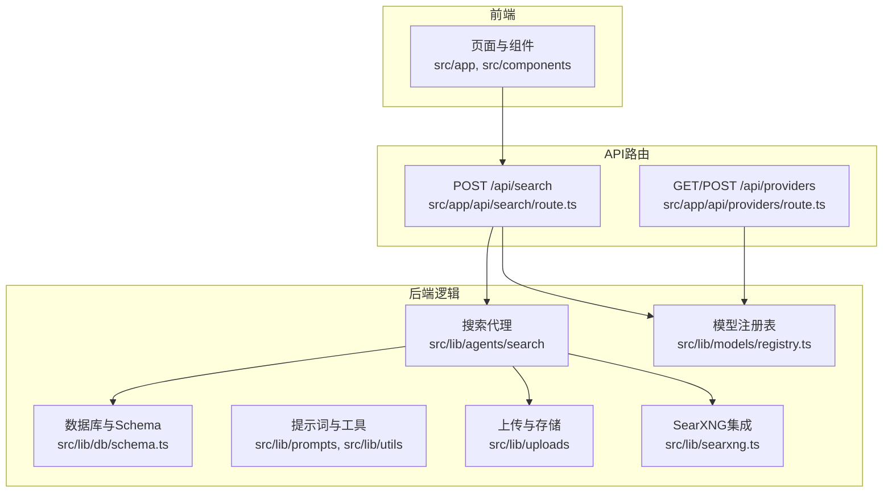
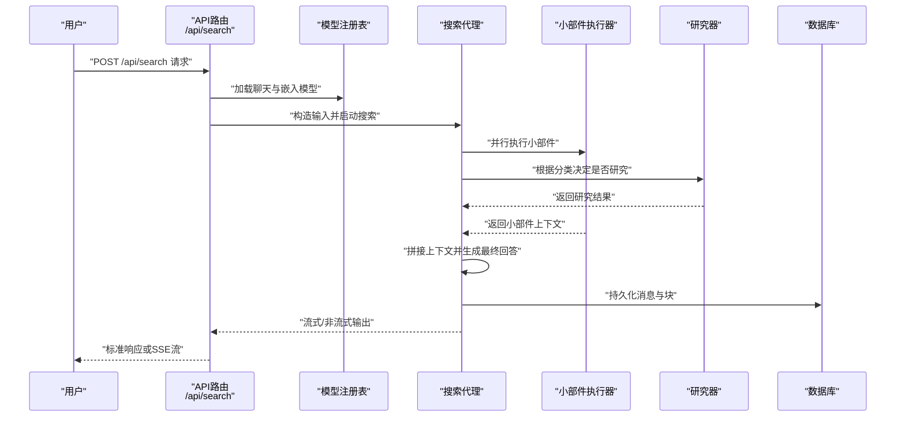
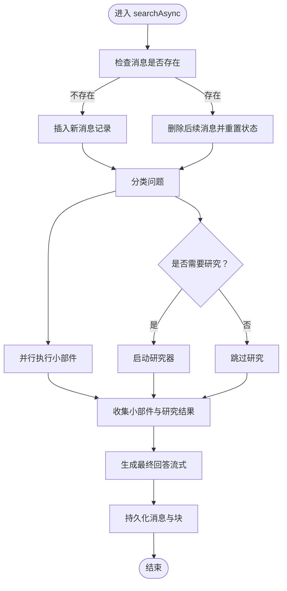
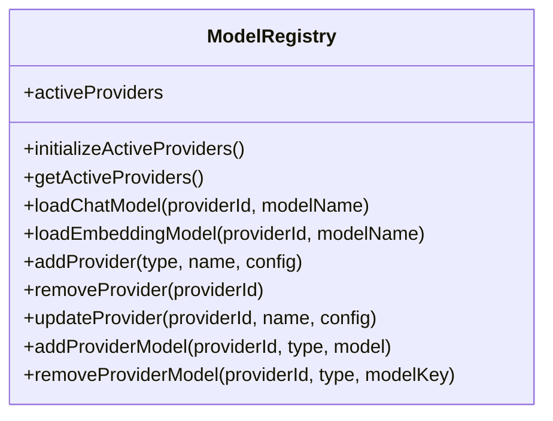
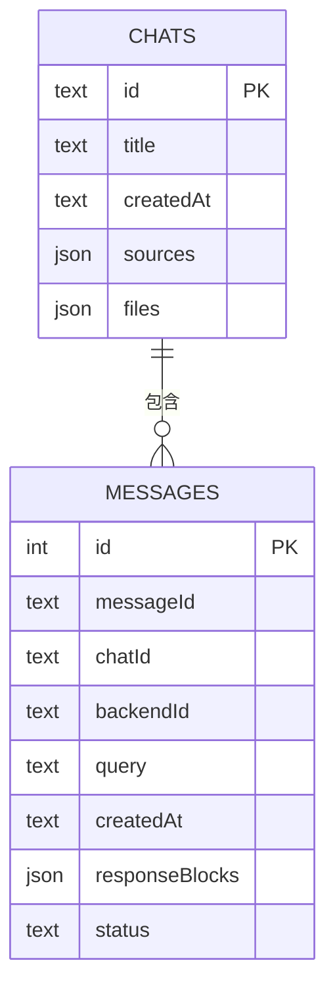
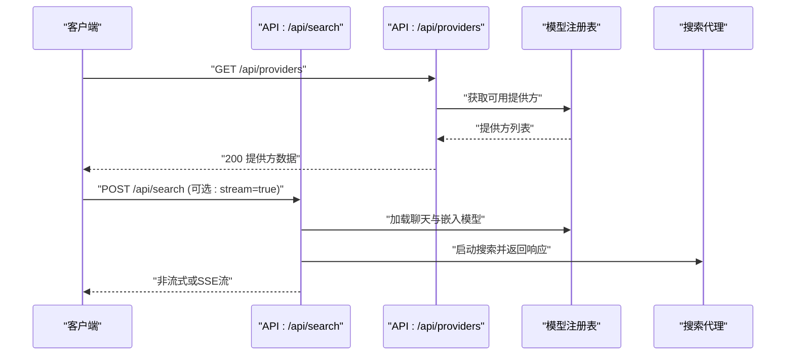
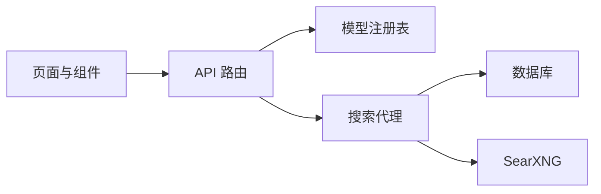

# 贡献指南

<cite>
**本文引用的文件**
- [CONTRIBUTING.md](file://CONTRIBUTING.md)
- [README.md](file://README.md)
- [package.json](file://package.json)
- [.eslintrc.json](file://.eslintrc.json)
- [.prettierrc.js](file://.prettierrc.js)
- [docs/API/SEARCH.md](file://docs/API/SEARCH.md)
- [docs/architecture/README.md](file://docs/architecture/README.md)
- [docs/architecture/WORKING.md](file://docs/architecture/WORKING.md)
- [src/lib/agents/search/index.ts](file://src/lib/agents/search/index.ts)
- [src/lib/models/registry.ts](file://src/lib/models/registry.ts)
- [src/lib/db/schema.ts](file://src/lib/db/schema.ts)
- [src/app/api/search/route.ts](file://src/app/api/search/route.ts)
- [src/app/api/providers/route.ts](file://src/app/api/providers/route.ts)
</cite>

## 目录
1. [引言](#引言)
2. [项目结构](#项目结构)
3. [核心组件](#核心组件)
4. [架构总览](#架构总览)
5. [详细组件分析](#详细组件分析)
6. [依赖关系分析](#依赖关系分析)
7. [性能与质量要求](#性能与质量要求)
8. [开发流程与协作规范](#开发流程与协作规范)
9. [治理结构与决策流程](#治理结构与决策流程)
10. [新贡献者入门与学习资源](#新贡献者入门与学习资源)
11. [社区参与与技术支持](#社区参与与技术支持)
12. [认可机制与贡献者权益](#认可机制与贡献者权益)
13. [故障排查与常见问题](#故障排查与常见问题)
14. [结语](#结语)

## 引言
本指南面向所有希望参与 Perplexica 开发的贡献者，涵盖从环境搭建到代码提交、从文档改进到问题反馈的全流程。我们鼓励各类贡献：功能增强、缺陷修复、文档完善、测试覆盖、设计优化、社区支持等。请在开始前先通读本指南，并结合仓库中的现有文档与代码实现，确保你的贡献与项目目标一致。

## 项目结构
Perplexica 是一个基于 Next.js 的应用，前端页面与 UI 组件位于 src/app 与 src/components；后端逻辑集中在 src/lib，包含搜索代理、模型注册表、数据库与提示词等模块；API 路由位于 src/app/api 下，提供对外接口（如搜索、提供商列表、聊天等）。

- 前端与页面
  - 页面与路由：src/app（Next.js App Router）
  - 可复用组件：src/components
- 后端与业务逻辑
  - 搜索代理与管线：src/lib/agents/search
  - 模型注册与提供方：src/lib/models
  - 数据库与迁移：src/lib/db
  - 提示词模板：src/lib/prompts
  - 文件上传与处理：src/lib/uploads
  - SearXNG 集成：src/lib/searxng.ts
- API 路由
  - 搜索、提供商、聊天、发现、图片/视频搜索、天气等：src/app/api/*

图表来源
- [src/app/api/search/route.ts](file://src/app/api/search/route.ts#L1-L209)
- [src/app/api/providers/route.ts](file://src/app/api/providers/route.ts#L1-L78)
- [src/lib/agents/search/index.ts](file://src/lib/agents/search/index.ts#L1-L187)
- [src/lib/models/registry.ts](file://src/lib/models/registry.ts#L1-L222)
- [src/lib/db/schema.ts](file://src/lib/db/schema.ts#L1-L39)

章节来源
- [CONTRIBUTING.md](file://CONTRIBUTING.md#L7-L53)
- [docs/architecture/README.md](file://docs/architecture/README.md#L1-L39)

## 核心组件
- 搜索代理（SearchAgent）
  - 负责分类问题、并行执行小部件与研究、生成最终答案并写入会话与数据库。
  - 关键职责：消息持久化、并行任务调度、流式输出、最终答案生成。
- 模型注册表（ModelRegistry）
  - 管理已配置的模型提供方，加载聊天与嵌入模型，支持增删改查与动态更新。
- 数据库 Schema
  - 定义消息与对话表结构，支持 JSON 字段存储块化响应内容与文件信息。
- API 路由
  - /api/search：接收请求体参数，加载模型，启动搜索代理，返回标准或流式响应。
  - /api/providers：列出可用提供方与模型，支持管理员新增提供方。

章节来源
- [src/lib/agents/search/index.ts](file://src/lib/agents/search/index.ts#L12-L187)
- [src/lib/models/registry.ts](file://src/lib/models/registry.ts#L8-L222)
- [src/lib/db/schema.ts](file://src/lib/db/schema.ts#L6-L39)
- [src/app/api/search/route.ts](file://src/app/api/search/route.ts#L19-L209)
- [src/app/api/providers/route.ts](file://src/app/api/providers/route.ts#L5-L78)

## 架构总览
下图展示了从用户发起查询到返回结果的关键交互路径，包括分类、并行小部件与研究、最终写作与引用生成。

图表来源
- [src/app/api/search/route.ts](file://src/app/api/search/route.ts#L19-L209)
- [src/lib/agents/search/index.ts](file://src/lib/agents/search/index.ts#L54-L183)
- [src/lib/models/registry.ts](file://src/lib/models/registry.ts#L74-L92)
- [src/lib/db/schema.ts](file://src/lib/db/schema.ts#L6-L19)

## 详细组件分析

### 搜索代理（SearchAgent）工作流
- 输入校验与消息持久化：检查消息是否存在，不存在则插入，存在则清理后续消息并重置状态。
- 分类阶段：根据聊天历史、启用的来源与查询，判断是否需要研究、是否显示小部件以及如何改写问题。
- 并行执行：小部件与研究并行进行，小部件结果通过会话事件实时推送到前端。
- 上下文拼接：将研究结果与小部件上下文合并，作为最终写作的系统提示。
- 流式回答：逐块生成文本，实时更新会话块并持久化。

图表来源
- [src/lib/agents/search/index.ts](file://src/lib/agents/search/index.ts#L13-L183)

章节来源
- [src/lib/agents/search/index.ts](file://src/lib/agents/search/index.ts#L12-L187)

### 模型注册表（ModelRegistry）交互
- 初始化：读取已配置提供方，实例化对应提供方并缓存。
- 查询：异步获取各提供方的模型清单，过滤错误状态。
- 加载：按提供方 ID 与模型键加载聊天与嵌入模型。
- 管理：支持新增、删除、更新提供方及模型项。

图表来源
- [src/lib/models/registry.ts](file://src/lib/models/registry.ts#L8-L222)

章节来源
- [src/lib/models/registry.ts](file://src/lib/models/registry.ts#L1-L222)

### 数据库 Schema 与会话块
- messages 表：保存每条消息的块序列、状态、关联会话与后端会话 ID。
- chats 表：保存对话标题、创建时间、启用的搜索来源与文件列表。

图表来源
- [src/lib/db/schema.ts](file://src/lib/db/schema.ts#L6-L39)

章节来源
- [src/lib/db/schema.ts](file://src/lib/db/schema.ts#L1-L39)

### API：搜索与提供商
- /api/search
  - 支持非流式与 SSE 流式两种响应模式。
  - 参数：优化模式、来源、聊天/嵌入模型、查询、历史、系统指令、是否流式。
  - 返回：最终消息与引用来源；或分片的 SSE 事件。
- /api/providers
  - GET：返回可用提供方与模型清单（过滤错误模型）。
  - POST：管理员新增提供方，返回新建提供方详情。

图表来源
- [src/app/api/search/route.ts](file://src/app/api/search/route.ts#L19-L209)
- [src/app/api/providers/route.ts](file://src/app/api/providers/route.ts#L5-L78)
- [src/lib/models/registry.ts](file://src/lib/models/registry.ts#L37-L72)

章节来源
- [docs/API/SEARCH.md](file://docs/API/SEARCH.md#L1-L191)
- [src/app/api/search/route.ts](file://src/app/api/search/route.ts#L8-L209)
- [src/app/api/providers/route.ts](file://src/app/api/providers/route.ts#L1-L78)

## 依赖关系分析
- 前端页面与组件依赖 Next.js App Router 与 TailwindCSS 生态。
- 搜索代理依赖模型注册表加载 LLM 与嵌入模型，依赖数据库持久化消息，依赖 SearXNG 进行网络检索。
- API 路由负责参数解析、并发加载模型、串接搜索代理与会话管理，同时处理流式输出。

图表来源
- [src/app/api/search/route.ts](file://src/app/api/search/route.ts#L19-L67)
- [src/lib/agents/search/index.ts](file://src/lib/agents/search/index.ts#L1-L11)
- [src/lib/db/schema.ts](file://src/lib/db/schema.ts#L1-L39)

章节来源
- [package.json](file://package.json#L1-L77)

## 性能与质量要求
- 代码风格与格式化
  - 使用 Prettier 统一格式化，遵循项目配置（缩进宽度、单引号、尾随逗号、换行符策略等）。
  - 提交前务必运行格式化脚本，确保一致性。
- 代码质量与规范
  - ESLint 规则继承 Next.js Core Web Vitals 推荐规则，建议在本地 IDE 中启用 ESLint 实时检查。
- 测试与覆盖率
  - 当前仓库未包含测试脚本与覆盖率统计配置。建议新增功能时补充单元/集成测试，并在 CI 中引入测试与覆盖率检查（可在后续迭代中逐步完善）。
- 性能建议
  - 并行执行小部件与研究，减少端到端等待时间。
  - 对流式输出使用 SSE，提升用户体验。
  - 控制优化模式（speed/balanced/quality）以平衡速度与质量。

章节来源
- [.prettierrc.js](file://.prettierrc.js#L1-L12)
- [.eslintrc.json](file://.eslintrc.json#L1-L4)
- [package.json](file://package.json#L6-L11)

## 开发流程与协作规范
- 环境准备
  - 安装依赖并启动开发服务器，完成初始化设置（API 密钥、模型、搜索后端等）。
  - 数据库迁移在启动时自动应用。
- 提交流程
  - Fork 仓库 -> 新建特性分支 -> 编写代码与格式化 -> 提交并推送 -> 在 GitHub 创建 Pull Request -> 等待审查与合并。
- 代码规范
  - 遵循 ESLint 与 Prettier 规范；提交前运行格式化脚本。
  - 保持变更聚焦、提交信息清晰、PR 描述完整。
- 文档与 API
  - 如涉及 API 或行为变更，请同步更新相关文档与 API 文档。

章节来源
- [CONTRIBUTING.md](file://CONTRIBUTING.md#L60-L82)
- [README.md](file://README.md#L77-L164)

## 治理结构与决策流程
- 仓库未提供正式的治理文档或明确的决策流程。当前以维护者主导为主，贡献者可通过 Issue 与 PR 参与讨论。
- 建议在后续迭代中补充治理文档，明确角色权限、决策机制与升级路径，以保障长期可持续发展。

章节来源
- [CONTRIBUTING.md](file://CONTRIBUTING.md#L74-L82)

## 新贡献者入门与学习资源
- 快速上手
  - 阅读项目简介与特性概览，了解核心能力与使用场景。
  - 查看安装与部署指南，选择 Docker 或非 Docker 方式快速运行。
- 架构与实现
  - 阅读架构文档与工作原理，理解搜索代理、模型注册表与数据库的关系。
  - 参考 API 文档，掌握搜索与提供商接口的使用方法。
- 入门建议
  - 从最小可行改动入手（如修复拼写、完善注释、优化样式）。
  - 阅读现有组件与路由实现，熟悉代码组织与调用链路。

章节来源
- [README.md](file://README.md#L1-L267)
- [docs/architecture/README.md](file://docs/architecture/README.md#L1-L39)
- [docs/architecture/WORKING.md](file://docs/architecture/WORKING.md#L1-L73)
- [docs/API/SEARCH.md](file://docs/API/SEARCH.md#L1-L191)

## 社区参与与技术支持
- 讨论渠道
  - GitHub Issues：用于报告问题与提出需求。
  - Discord：用于日常交流、经验分享与个性化帮助。
- 技术支持
  - 参考安装与故障排查章节，定位常见连接与配置问题。
  - 若遇到模型或搜索后端异常，优先核对配置与网络连通性。

章节来源
- [README.md](file://README.md#L262-L267)

## 认可机制与贡献者权益
- 当前仓库未提供正式的认可机制或贡献者权益说明。建议在后续迭代中建立贡献榜单、致谢页或贡献证书等机制，以激励持续参与。

章节来源
- [CONTRIBUTING.md](file://CONTRIBUTING.md#L74-L82)

## 故障排查与常见问题
- Docker 与本地部署
  - 使用 Docker 时，确保容器映射了数据卷并正确暴露端口。
  - 非 Docker 场景需自行构建与启动应用，并在浏览器完成初始化设置。
- 模型与提供方
  - 若提示未配置任何聊天模型，请检查提供方 URL、模型名称与密钥。
  - 对于本地/私有 LLM（如 Ollama、Lemonade），确保监听地址与端口正确且未被防火墙阻断。
- SearXNG 集成
  - 确保 SearXNG 已启用 JSON 输出与必要搜索引擎（如 Wolfram Alpha）。

章节来源
- [README.md](file://README.md#L166-L213)

## 结语
感谢你对 Perplexica 的关注与支持。我们鼓励任何形式的贡献，无论是代码、文档还是社区建设。请在提交前确保遵循本文档中的规范与流程，让我们一起把 Perplexica 做得更好。