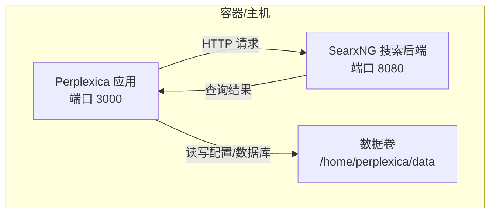
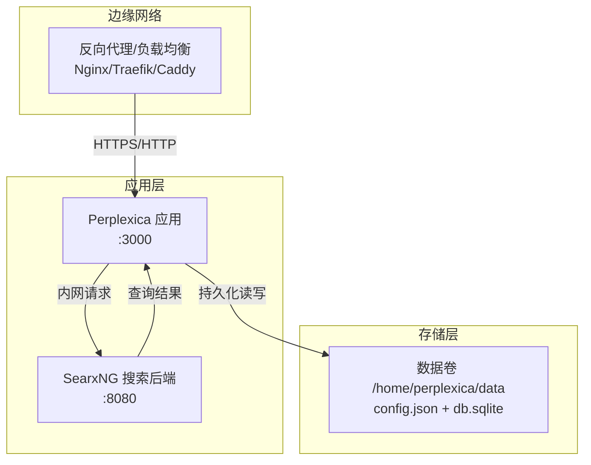
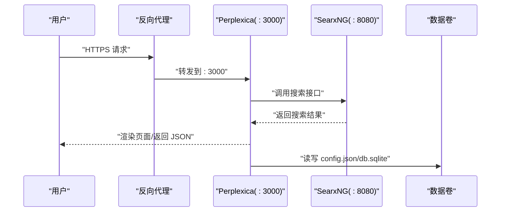
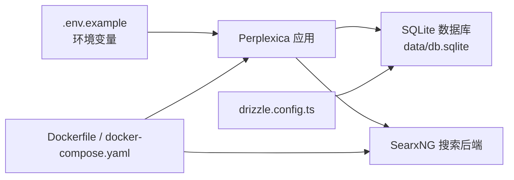

# 部署指南

<cite>
**本文引用的文件**
- [README.md](file://README.md)
- [docker-compose.yaml](file://docker-compose.yaml)
- [Dockerfile](file://Dockerfile)
- [Dockerfile.slim](file://Dockerfile.slim)
- [entrypoint.sh](file://entrypoint.sh)
- [.env.example](file://.env.example)
- [package.json](file://package.json)
- [next.config.mjs](file://next.config.mjs)
- [SEARXNG-SETUP.md](file://SEARXNG-SETUP.md)
- [docs/architecture/README.md](file://docs/architecture/README.md)
- [docs/installation/UPDATING.md](file://docs/installation/UPDATING.md)
- [data/config.json](file://data/config.json)
- [drizzle.config.ts](file://drizzle.config.ts)
</cite>

## 目录
1. [简介](#简介)
2. [项目结构](#项目结构)
3. [核心组件](#核心组件)
4. [架构总览](#架构总览)
5. [详细组件分析](#详细组件分析)
6. [依赖关系分析](#依赖关系分析)
7. [性能考量](#性能考量)
8. [故障排除指南](#故障排除指南)
9. [结论](#结论)
10. [附录](#附录)

## 简介
本指南面向不同规模与类型的部署场景，提供 Perplexica 的生产级部署方案，涵盖 Docker 部署、传统服务器部署与云平台一键部署，并重点说明容器化优势与注意事项（数据持久化、网络与安全）、负载均衡与反向代理、SSL 证书配置、监控与日志管理、备份与恢复策略以及常见问题排查。

Perplexica 是一个隐私优先的 AI 回答引擎，结合互联网知识与本地/云端大模型，提供带来源引用的答案；其前端基于 Next.js，后端通过 API 路由与搜索后端协作，内置 SearxNG 以保障搜索隐私与可扩展性。

章节来源
- file://README.md#L11-L16
- file://docs/architecture/README.md#L1-L39

## 项目结构
- 应用层：Next.js 前端与 API 路由，负责聊天、搜索、提供商配置、发现与媒体检索等。
- 搜索后端：默认内置 SearxNG（通过 Dockerfile 构建并随应用启动），或可连接外部 SearxNG 实例（Slim 镜像）。
- 数据层：SQLite（Drizzle ORM）配合本地数据目录，支持持久化聊天历史与配置。
- 运行时：Docker 多阶段构建，入口脚本统一启动 SearxNG 与 Node 应用。

图表来源
- [Dockerfile](file://Dockerfile#L18-L75)
- [docker-compose.yaml](file://docker-compose.yaml#L1-L25)
- [entrypoint.sh](file://entrypoint.sh#L1-L32)

章节来源
- file://docker-compose.yaml#L1-L25
- file://Dockerfile#L1-L75
- file://Dockerfile.slim#L1-L36
- file://entrypoint.sh#L1-L32
- file://drizzle.config.ts#L1-L12

## 核心组件
- 应用服务（Perplexica）
  - Next.js 应用，输出为独立可执行（standalone），监听 3000 端口。
  - 支持多提供商（OpenAI、Anthropic、Gemini、Groq、DeepSeek、Lemonade 等）与本地 LLM（如 Ollama）。
  - 内置 SQLite 存储与 Drizzle 迁移。
- 搜索后端（SearxNG）
  - 默认随镜像内置并由入口脚本启动；也可使用 Slim 镜像连接外部 SearxNG。
  - 默认暴露 8080 端口，可通过环境变量或外部映射调整。
- 数据与配置
  - 数据目录挂载至 /home/perplexica/data，包含 config.json 与 SQLite 数据库文件。
  - .env.example 提供管理员密码、各提供商密钥、SearxNG 地址与数据目录等关键变量。

章节来源
- file://package.json#L6-L12
- file://next.config.mjs#L4-L24
- file://data/config.json#L1-L41
- file://drizzle.config.ts#L1-L12
- file://.env.example#L1-L59

## 架构总览
下图展示 Perplexica 生产部署的典型拓扑：反向代理（Nginx/Traefik/Caddy）统一入口，Perplexica 作为应用服务，SearxNG 作为搜索后端，二者通过内网通信；数据卷持久化配置与数据库。

图表来源
- [docker-compose.yaml](file://docker-compose.yaml#L1-L25)
- [Dockerfile](file://Dockerfile#L70-L75)
- [entrypoint.sh](file://entrypoint.sh#L4-L32)
- [data/config.json](file://data/config.json#L38-L41)

## 详细组件分析

### Docker 部署（推荐）
- 单容器模式（内置 SearxNG）
  - 使用官方镜像或本地构建镜像运行，映射 3000:3000，挂载数据卷。
  - 入口脚本先启动 SearxNG，等待健康检查，再启动 Perplexica。
- 外部 SearxNG（Slim 镜像）
  - 使用 slim 镜像，通过环境变量指定 SEARXNG_API_URL 指向外部实例。
  - 适合已有 SearxNG 集群或需要独立扩缩容的场景。
- Docker Compose
  - 同时编排 Perplexica 与 SearxNG，自动挂载配置与数据卷，便于一键启停与日志追踪。

图表来源
- [docker-compose.yaml](file://docker-compose.yaml#L1-L25)
- [entrypoint.sh](file://entrypoint.sh#L4-L32)
- [data/config.json](file://data/config.json#L38-L41)

章节来源
- file://README.md#L81-L107
- file://docker-compose.yaml#L1-L25
- file://Dockerfile#L18-L75
- file://Dockerfile.slim#L1-L36
- file://entrypoint.sh#L1-L32
- file://SEARXNG-SETUP.md#L15-L31

### 传统服务器部署
- 前置条件
  - 已有 SearxNG 实例（启用 JSON 格式与 Wolfram Alpha），并允许从 Perplexica 访问。
  - 安装 Node.js、Yarn、Python3、SQLite3 等依赖。
- 步骤
  - 克隆仓库，安装依赖，构建应用，启动服务。
  - 在浏览器访问 http://localhost:3000 完成初始化与配置。
- 注意事项
  - 与 Docker 部署相同，需正确配置 SearxNG 地址与各提供商密钥。
  - 若使用本地 LLM（如 Ollama），需确保其监听在可被容器/主机访问的地址。

章节来源
- file://README.md#L132-L162
- file://SEARXNG-SETUP.md#L15-L31

### 云平台一键部署
- 支持通过 Sealos、RepoCloud、ClawCloud、Hostinger 等平台一键部署。
- Hostinger 提供一键 docker-compose 链接，简化部署流程。

章节来源
- file://README.md#L233-L238

### Docker Compose 配置详解与自定义选项
- 服务与端口
  - Perplexica 映射宿主 3000:3000，SearxNG 映射 4000:8080（Compose 中的 4000 为宿主映射，容器内仍为 8080）。
- 数据持久化
  - 使用命名卷 perplexcia-data 挂载到 /home/perplexica/data，确保配置与数据库持久化。
- 环境变量
  - 可通过环境变量覆盖默认行为（如 SEARXNG_API_URL）。
- 依赖与启动顺序
  - Perplexica 依赖 searxng 服务，Compose 会按依赖顺序启动。

章节来源
- file://docker-compose.yaml#L1-L25
- file://entrypoint.sh#L4-L32
- file://data/config.json#L38-L41

### 容器化部署的优势与注意事项
- 优势
  - 依赖隔离、版本一致、易于复制与回滚。
  - 内置 SearxNG，降低外部依赖复杂度；Slim 镜像可灵活对接现有 SearxNG。
- 注意事项
  - 数据持久化：必须挂载 /home/perplexica/data。
  - 网络：容器间通过内网通信；若使用外部 SearxNG，需确保可达性与端口开放。
  - 安全：限制容器权限、最小化暴露端口、使用只读根文件系统与非 root 用户（当前镜像以 root 启动，建议在自定义镜像中优化）。

章节来源
- file://Dockerfile#L18-L75
- file://Dockerfile.slim#L1-L36
- file://entrypoint.sh#L1-L32
- file://.env.example#L52-L59

### 负载均衡、反向代理与 SSL 证书
- 反向代理
  - 建议在 Perplexica 前放置 Nginx/Traefik/Caddy，统一处理 TLS 终止、压缩、缓存与健康检查。
- SSL 证书
  - 使用 Let’s Encrypt 自动签发与续期；将证书与私钥路径配置到反向代理。
- 端口与域名
  - 将外网流量转发至 Perplexica 的 3000 端口；SearxNG 仅在内网访问即可。
- WebSocket/长连接
  - 如需实时消息，请确保反向代理开启相应协议支持（如 Nginx 的 proxy_http_version 1.1 与 upgrade）。

（本节为通用实践说明，未直接分析具体文件）

### 监控与日志管理
- 日志采集
  - Docker 环境：使用 Docker 日志驱动或集中式日志（如 Fluent Bit/Fluentd/Elastic Stack）收集容器日志。
  - 传统部署：将 Next.js 与 SearxNG 输出重定向到文件或 syslog。
- 健康检查
  - Perplexica：对外提供 API 接口，可在反向代理中配置健康检查路径。
  - SearxNG：可使用 /search?q=health&format=json 或 /stats 进行探测。
- 指标监控
  - CPU/内存/磁盘：通过系统监控工具（Prometheus/Grafana）采集。
  - 应用指标：可接入 Next.js 的健康端点或自定义指标端口。

章节来源
- file://SEARXNG-SETUP.md#L53-L61
- file://entrypoint.sh#L12-L27

### 备份与恢复策略
- 备份对象
  - 数据卷 /home/perplexica/data 下的 config.json 与 db.sqlite。
- 备份频率
  - 增量与全量结合：数据库可采用 SQLite WAL/快照策略，配置文件定期快照。
- 恢复步骤
  - 停止服务，替换对应文件，启动服务并验证功能。
- 版本升级
  - Docker 预构建镜像：拉取新镜像并重启容器。
  - 自建镜像：重新构建并替换旧容器。
  - 非 Docker：拉取代码、安装依赖、重建并启动。

章节来源
- file://docs/installation/UPDATING.md#L5-L25
- file://docs/installation/UPDATING.md#L27-L51
- file://docs/installation/UPDATING.md#L52-L82

## 依赖关系分析
- 应用与搜索后端
  - Perplexica 通过 API 调用 SearxNG 获取搜索结果；SearxNG 的配置与可用性直接影响应用体验。
- 数据与迁移
  - Drizzle 配置指向 data/db.sqlite，迁移脚本与应用启动时的数据库初始化密切相关。
- 运行时与打包
  - Next.js 输出为 standalone，入口脚本负责启动 SearxNG 与 Node 应用；Dockerfile 多阶段构建减少镜像体积。

图表来源
- [.env.example](file://.env.example#L1-L59)
- [Dockerfile](file://Dockerfile#L18-L75)
- [docker-compose.yaml](file://docker-compose.yaml#L1-L25)
- [drizzle.config.ts](file://drizzle.config.ts#L1-L12)

章节来源
- file://package.json#L6-L12
- file://next.config.mjs#L4-L24
- file://drizzle.config.ts#L1-L12

## 性能考量
- 资源规划
  - 根据并发与模型选择分配 CPU/内存；SearxNG 与模型推理对资源消耗影响较大。
- 缓存与静态资源
  - 利用反向代理缓存静态资源与搜索结果（需评估隐私与准确性）。
- 数据库优化
  - SQLite 在高并发写入场景可能受限，建议结合只读副本或迁移至更合适的数据库（需评估部署复杂度）。
- 模型与嵌入
  - 本地模型（如 Ollama）需考虑 GPU/TPU 加速与内存占用；云端模型需关注网络延迟与成本。

（本节为通用指导，未直接分析具体文件）

## 故障排除指南
- SearxNG 无法访问
  - 检查容器状态与日志；确认端口映射与防火墙规则；验证 JSON 格式与 Wolfram Alpha 引擎已启用。
- Perplexica 无法连接 SearxNG
  - 确认 SEARXNG_API_URL 配置正确；若使用外部 SearxNG，确保网络连通与端口开放。
- 本地 LLM（Ollama/Lemonade）连接失败
  - 按操作系统设置正确的 API URL；Linux 需确保服务监听在 0.0.0.0 并放通端口。
- 更新后功能异常
  - 按更新文档拉取镜像或重建应用，确认数据卷未丢失。

章节来源
- file://SEARXNG-SETUP.md#L75-L91
- file://README.md#L166-L213
- file://docs/installation/UPDATING.md#L5-L25

## 结论
Perplexica 提供了高度可移植的容器化部署方案，默认内置 SearxNG，极大降低了部署门槛。生产部署建议结合反向代理与 SSL 终止、完善的日志与监控体系、严格的权限与网络隔离，以及可靠的备份与恢复流程。根据业务规模与合规要求，可选择单机、集群或云平台一键部署路径。

（本节为总结性内容，未直接分析具体文件）

## 附录

### 关键配置清单
- 环境变量（示例）
  - 管理员密码、各提供商密钥、SearxNG 地址、数据目录等。
- 数据目录
  - config.json：应用配置（含 SearxNG 地址）。
  - db.sqlite：SQLite 数据库文件。
- Docker 端口
  - Perplexica: 3000；SearxNG: 8080（Compose 中映射 4000:8080）。

章节来源
- file://.env.example#L1-L59
- file://data/config.json#L1-L41
- file://drizzle.config.ts#L1-L12
- file://docker-compose.yaml#L6-L17