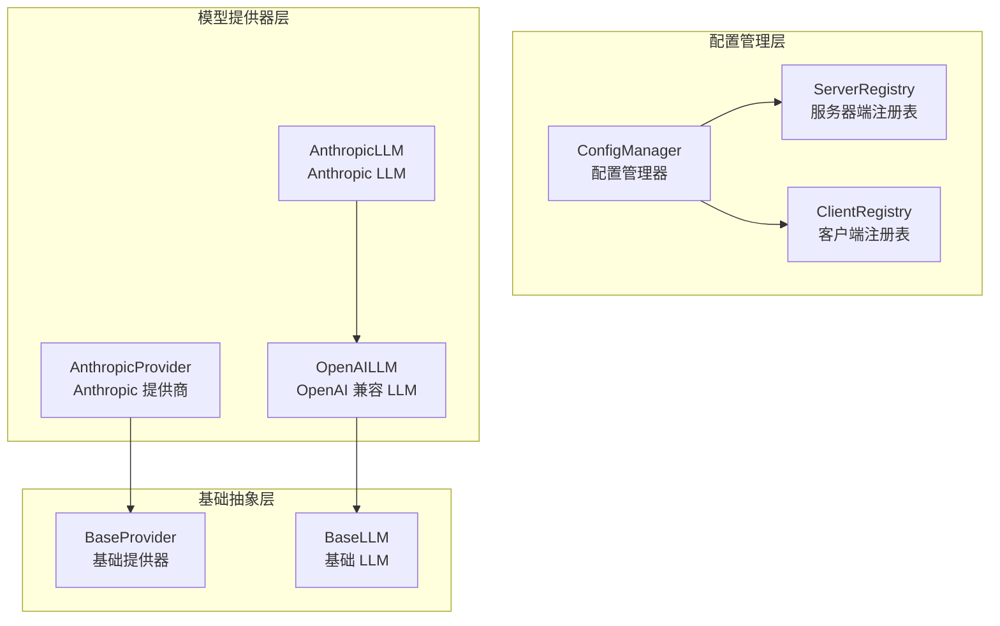
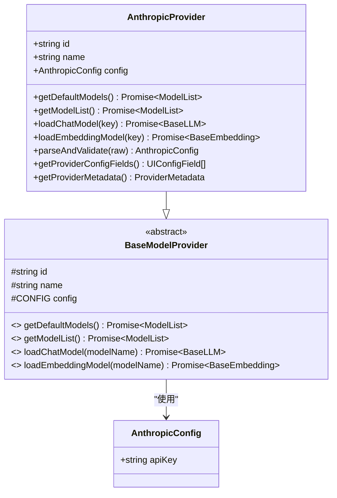
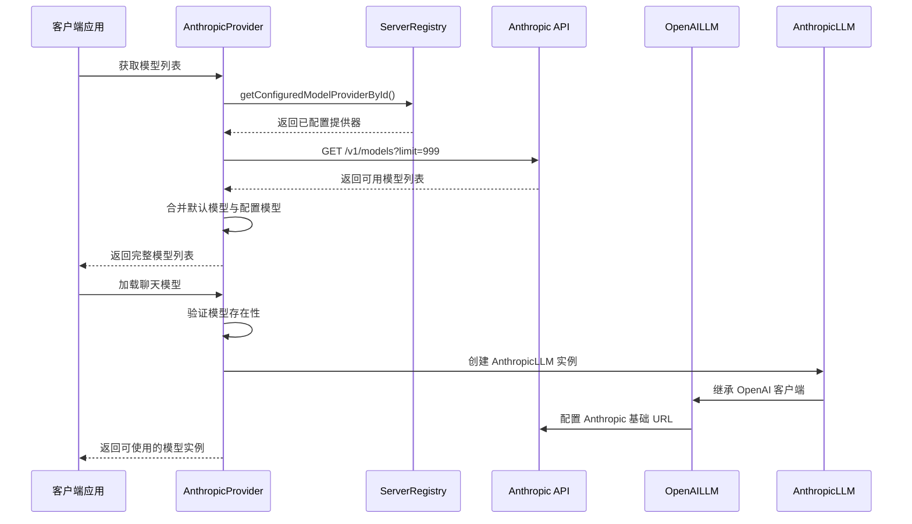
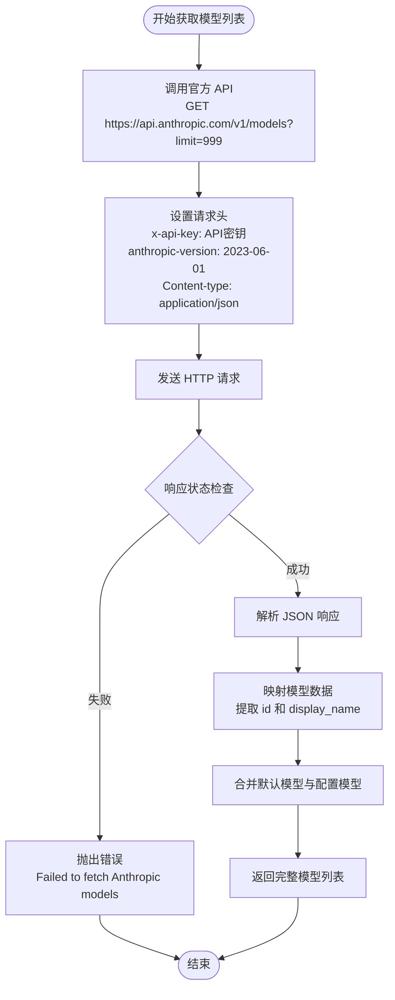
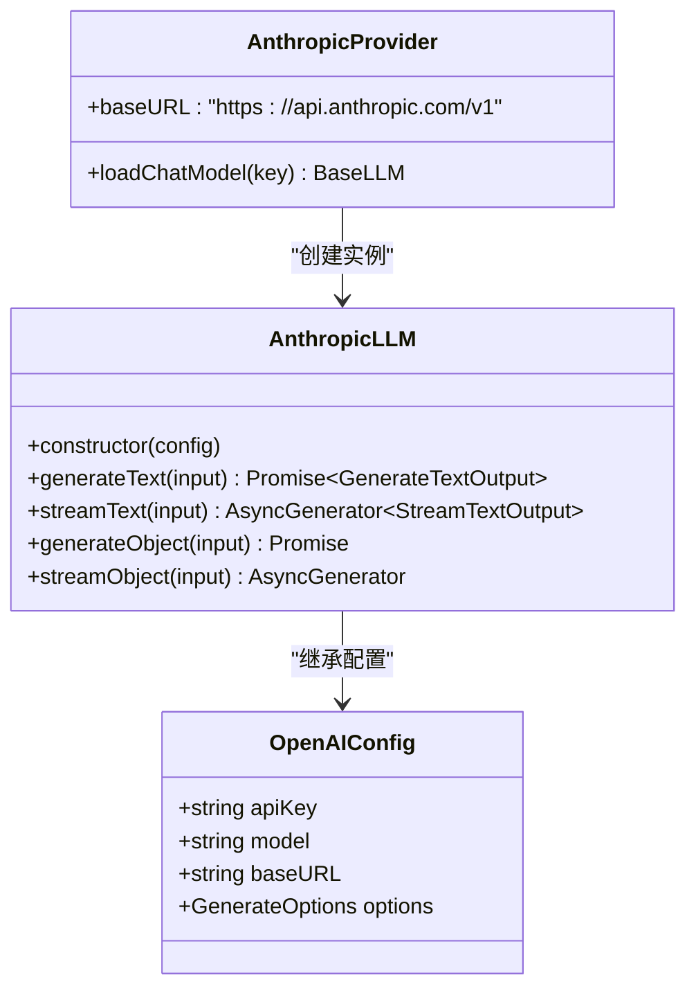
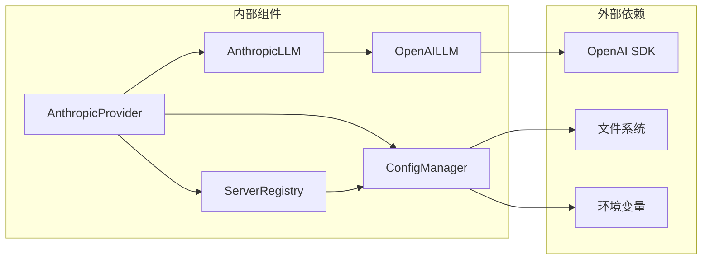

# Anthropic 提供商配置

<cite>
**本文档引用的文件**
- [src/lib/models/providers/anthropic/index.ts](file://src/lib/models/providers/anthropic/index.ts)
- [src/lib/models/providers/anthropic/anthropicLLM.ts](file://src/lib/models/providers/anthropic/anthropicLLM.ts)
- [src/lib/models/providers/openai/openaiLLM.ts](file://src/lib/models/providers/openai/openaiLLM.ts)
- [src/lib/models/base/llm.ts](file://src/lib/models/base/llm.ts)
- [src/lib/models/base/provider.ts](file://src/lib/models/base/provider.ts)
- [src/lib/models/types.ts](file://src/lib/models/types.ts)
- [src/lib/config/types.ts](file://src/lib/config/types.ts)
- [src/lib/config/serverRegistry.ts](file://src/lib/config/serverRegistry.ts)
- [src/lib/config/clientRegistry.ts](file://src/lib/config/clientRegistry.ts)
- [src/lib/config/index.ts](file://src/lib/config/index.ts)
- [.env.example](file://.env.example)
</cite>

## 目录
1. [简介](#简介)
2. [项目结构](#项目结构)
3. [核心组件](#核心组件)
4. [架构概览](#架构概览)
5. [详细组件分析](#详细组件分析)
6. [依赖关系分析](#依赖关系分析)
7. [性能考虑](#性能考虑)
8. [故障排除指南](#故障排除指南)
9. [结论](#结论)

## 简介

本文档为 Anthropic Claude 模型提供商提供了详细的配置说明。内容涵盖 API 密钥配置与安全存储、支持的 Claude 模型版本及配置参数、基础 URL 自定义配置、完整的配置示例以及模型列表获取和版本管理机制。同时提供了常见配置错误的诊断和解决方法。

## 项目结构

Perplexica 项目采用模块化架构设计，Anthropic 提供商位于模型提供器子系统中，通过统一的配置管理和模型注册机制进行集成。



**图表来源**
- [src/lib/config/index.ts](file://src/lib/config/index.ts#L1-L391)
- [src/lib/models/providers/anthropic/index.ts](file://src/lib/models/providers/anthropic/index.ts#L1-L116)
- [src/lib/models/providers/openai/openaiLLM.ts](file://src/lib/models/providers/openai/openaiLLM.ts#L1-L276)

**章节来源**
- [src/lib/config/index.ts](file://src/lib/config/index.ts#L1-L391)
- [src/lib/models/providers/anthropic/index.ts](file://src/lib/models/providers/anthropic/index.ts#L1-L116)

## 核心组件

### Anthropic 提供商配置

Anthropic 提供商实现了完整的配置字段定义，支持通过环境变量进行安全配置：



**图表来源**
- [src/lib/models/providers/anthropic/index.ts](file://src/lib/models/providers/anthropic/index.ts#L9-L116)
- [src/lib/models/base/provider.ts](file://src/lib/models/base/provider.ts#L6-L26)

### 配置字段定义

Anthropic 提供商的配置字段通过 UIConfigField 接口定义，支持密码类型的安全输入：

| 字段名称 | 键名 | 类型 | 必填 | 描述 | 环境变量 |
|---------|------|------|------|------|----------|
| API 密钥 | apiKey | password | 是 | Anthropic API 密钥 | ANTHROPIC_API_KEY |
| 显示名称 | API Key | string | 否 | 用户界面显示名称 | - |
| 占位符 | - | string | - | 输入提示文本 | - |
| 作用域 | - | string | - | 服务器端配置 (server) | - |

**章节来源**
- [src/lib/models/providers/anthropic/index.ts](file://src/lib/models/providers/anthropic/index.ts#L13-L24)
- [src/lib/config/types.ts](file://src/lib/config/types.ts#L29-L33)

## 架构概览

Anthropic 提供商采用基于 OpenAI 兼容接口的架构设计，通过继承 OpenAILLM 实现 Anthropic 模型的统一调用。



**图表来源**
- [src/lib/models/providers/anthropic/index.ts](file://src/lib/models/providers/anthropic/index.ts#L31-L86)
- [src/lib/config/serverRegistry.ts](file://src/lib/config/serverRegistry.ts#L8-L12)
- [src/lib/models/providers/openai/openaiLLM.ts](file://src/lib/models/providers/openai/openaiLLM.ts#L33-L40)

## 详细组件分析

### 模型列表获取机制

Anthropic 提供商实现了动态模型列表获取功能，通过官方 API 获取所有可用模型：



**图表来源**
- [src/lib/models/providers/anthropic/index.ts](file://src/lib/models/providers/anthropic/index.ts#L31-L68)

### 配置验证与安全存储

配置验证通过 parseAndValidate 方法确保 API 密钥的有效性：

| 验证规则 | 条件 | 错误信息 |
|---------|------|----------|
| 配置对象检查 | raw 存在且为对象 | Invalid config provided. Expected object |
| API 密钥检查 | raw.apiKey 存在 | Invalid config provided. API key must be provided |
| 类型转换 | 将原始值转换为字符串 | - |

**章节来源**
- [src/lib/models/providers/anthropic/index.ts](file://src/lib/models/providers/anthropic/index.ts#L92-L101)

### 基础 URL 自定义配置

Anthropic 提供商支持通过 baseURL 参数自定义 API 基础地址，默认使用官方地址：



**图表来源**
- [src/lib/models/providers/openai/openaiLLM.ts](file://src/lib/models/providers/openai/openaiLLM.ts#L23-L28)
- [src/lib/models/providers/anthropic/anthropicLLM.ts](file://src/lib/models/providers/anthropic/anthropicLLM.ts#L1-L6)
- [src/lib/models/providers/anthropic/index.ts](file://src/lib/models/providers/anthropic/index.ts#L81-L85)

**章节来源**
- [src/lib/models/providers/anthropic/index.ts](file://src/lib/models/providers/anthropic/index.ts#L81-L85)
- [src/lib/models/providers/openai/openaiLLM.ts](file://src/lib/models/providers/openai/openaiLLM.ts#L23-L40)

### 支持的 Claude 模型版本

通过官方 API 获取的模型列表包含以下 Claude 模型系列：

| 模型系列 | 版本标识 | 描述 |
|---------|----------|------|
| Claude 3 | claude-3-* | 最新一代 Claude 3 系列模型 |
| Claude 3.5 | claude-3.5-* | Claude 3.5 系列增强模型 |
| Claude 2 | claude-2.* | Claude 2.x 系列模型 |

**章节来源**
- [src/lib/models/providers/anthropic/index.ts](file://src/lib/models/providers/anthropic/index.ts#L47-L52)

## 依赖关系分析

### 组件耦合度分析



**图表来源**
- [src/lib/models/providers/anthropic/index.ts](file://src/lib/models/providers/anthropic/index.ts#L1-L7)
- [src/lib/config/index.ts](file://src/lib/config/index.ts#L1-L10)

### 配置管理集成

配置管理系统通过环境变量初始化 Anthropic 提供商：

| 环境变量 | 用途 | 必需性 | 默认值 |
|---------|------|--------|--------|
| ANTHROPIC_API_KEY | Anthropic API 密钥 | 必需 | - |
| DATA_DIR | 数据存储目录 | 可选 | 应用根目录 |
| NODE_ENV | 运行环境 | 可选 | development |

**章节来源**
- [src/lib/config/index.ts](file://src/lib/config/index.ts#L175-L238)
- [.env.example](file://.env.example#L20-L21)

## 性能考虑

### 模型列表缓存策略

当前实现直接从官方 API 获取模型列表，建议在生产环境中实现缓存机制：

1. **缓存时间**：模型列表变更频率较低，建议缓存 24 小时
2. **失效策略**：提供手动刷新接口和定时更新任务
3. **降级处理**：API 不可用时使用本地缓存或默认模型列表

### 并发请求管理

OpenAI SDK 内置了合理的并发控制，但建议：

1. **请求超时**：设置合理的超时时间（5-10 秒）
2. **重试机制**：对临时性错误实现指数退避重试
3. **连接池**：复用 HTTP 连接减少握手开销

## 故障排除指南

### 常见配置错误及解决方案

#### 1. API 密钥无效错误

**错误信息**：`Invalid config provided. API key must be provided`

**可能原因**：
- ANTHROPIC_API_KEY 环境变量未设置
- API 密钥格式不正确
- API 密钥权限不足

**解决方案**：
1. 验证 .env 文件中 ANTHROPIC_API_KEY 设置
2. 确认 API 密钥以 `sk-ant-` 开头
3. 检查 API 密钥是否在 Anthropic 控制台有效

#### 2. 模型获取失败

**错误信息**：`Failed to fetch Anthropic models: [statusText]`

**可能原因**：
- 网络连接问题
- API 服务不可用
- 认证失败

**解决方案**：
1. 检查网络连接和防火墙设置
2. 验证 Anthropic API 可访问性
3. 确认 API 密钥具有模型查询权限

#### 3. 模型加载错误

**错误信息**：`Error Loading Anthropic Chat Model. Invalid Model Selected`

**可能原因**：
- 选择的模型不在可用列表中
- 模型名称拼写错误

**解决方案**：
1. 调用 getModelList() 获取最新模型列表
2. 验证模型名称的准确性
3. 检查模型是否仍在 Anthropic 平台上可用

#### 4. 嵌入模型不支持

**错误信息**：`Anthropic provider does not support embedding models.`

**说明**：Anthropic Claude 模型目前仅支持聊天功能，不支持嵌入模型。

**解决方案**：
1. 使用其他支持嵌入模型的提供商（如 OpenAI、Gemini）
2. 在应用层面实现自定义嵌入逻辑

### 调试和监控

#### 日志记录

建议在关键节点添加日志记录：

```typescript
// 模型列表获取日志
console.log(`获取 Anthropic 模型列表: ${models.length} 个模型`);

// 模型加载日志  
console.log(`加载模型: ${modelName}`);

// 错误处理日志
console.error(`Anthropic 配置错误: ${error.message}`);
```

#### 健康检查

实现简单的健康检查接口：

```typescript
// 检查 API 密钥有效性
const checkApiKey = async () => {
  try {
    const response = await fetch('https://api.anthropic.com/v1/models', {
      headers: {
        'x-api-key': process.env.ANTHROPIC_API_KEY,
        'anthropic-version': '2023-06-01'
      }
    });
    return response.ok;
  } catch {
    return false;
  }
};
```

**章节来源**
- [src/lib/models/providers/anthropic/index.ts](file://src/lib/models/providers/anthropic/index.ts#L41-L43)
- [src/lib/models/providers/anthropic/index.ts](file://src/lib/models/providers/anthropic/index.ts#L75-L79)
- [src/lib/models/providers/anthropic/index.ts](file://src/lib/models/providers/anthropic/index.ts#L88-L90)

## 结论

Anthropic Claude 模型提供商在 Perplexica 中实现了完整的配置管理、模型发现和调用机制。通过基于 OpenAI 兼容接口的设计，实现了与现有模型系统的无缝集成。主要特点包括：

1. **安全配置**：通过环境变量管理 API 密钥，支持服务器端配置
2. **动态模型发现**：自动从官方 API 获取可用模型列表
3. **统一接口**：继承 OpenAI 兼容接口，简化模型调用
4. **错误处理**：完善的错误处理和用户友好的错误信息

建议在生产环境中实施适当的缓存策略、监控机制和安全措施，以确保系统的稳定性和安全性。