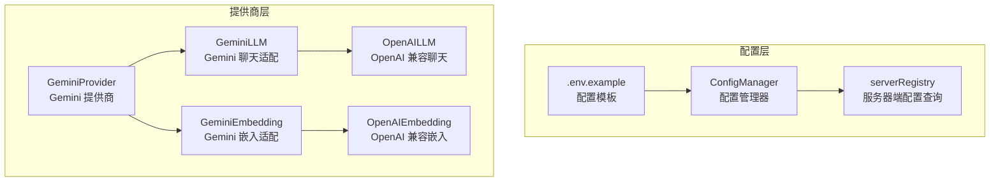
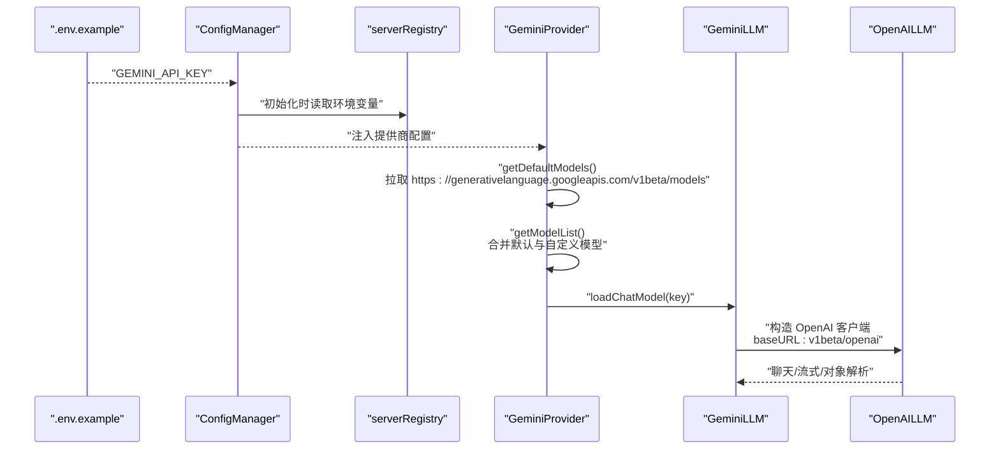
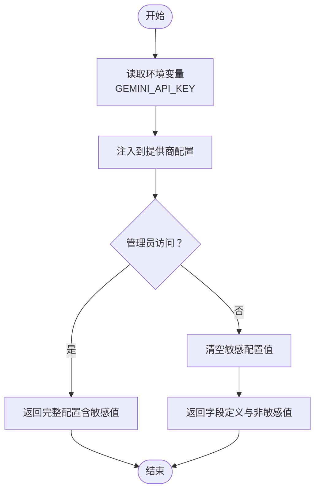
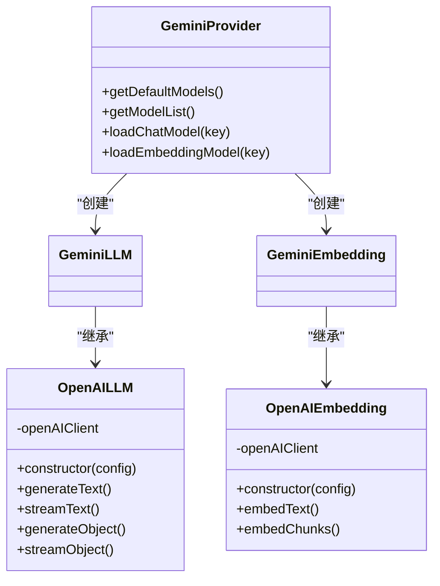
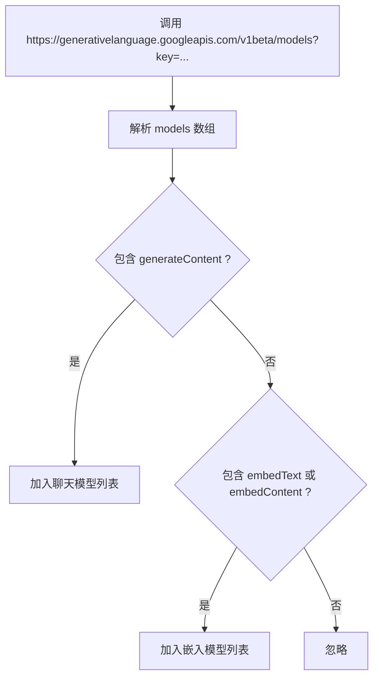
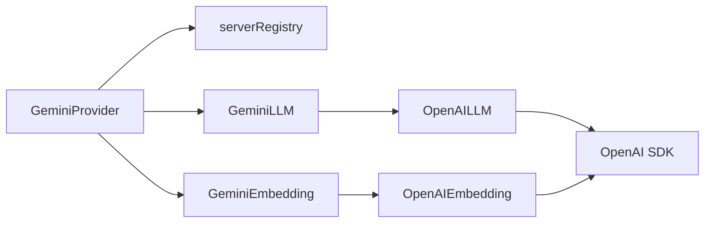

# Google Gemini 提供商配置

<cite>
**本文档引用的文件**
- [src/lib/models/providers/gemini/index.ts](file://src/lib/models/providers/gemini/index.ts)
- [src/lib/models/providers/gemini/geminiLLM.ts](file://src/lib/models/providers/gemini/geminiLLM.ts)
- [src/lib/models/providers/gemini/geminiEmbedding.ts](file://src/lib/models/providers/gemini/geminiEmbedding.ts)
- [src/lib/models/providers/openai/openaiLLM.ts](file://src/lib/models/providers/openai/openaiLLM.ts)
- [src/lib/models/providers/openai/openaiEmbedding.ts](file://src/lib/models/providers/openai/openaiEmbedding.ts)
- [src/lib/config/types.ts](file://src/lib/config/types.ts)
- [src/lib/models/types.ts](file://src/lib/models/types.ts)
- [src/lib/config/serverRegistry.ts](file://src/lib/config/serverRegistry.ts)
- [src/lib/config/index.ts](file://src/lib/config/index.ts)
- [src/app/api/config/route.ts](file://src/app/api/config/route.ts)
- [.env.example](file://.env.example)
</cite>

## 目录
1. [简介](#简介)
2. [项目结构](#项目结构)
3. [核心组件](#核心组件)
4. [架构总览](#架构总览)
5. [详细组件分析](#详细组件分析)
6. [依赖关系分析](#依赖关系分析)
7. [性能考虑](#性能考虑)
8. [故障排除指南](#故障排除指南)
9. [结论](#结论)
10. [附录](#附录)

## 简介
本文件面向使用 Google Gemini 模型提供商的用户与运维人员，提供从环境变量配置、安全存储、模型类型支持、基础 URL 自定义与代理设置，到模型列表获取与多模态能力适配的完整配置说明。同时给出与 Google AI Studio API 密钥相关的安全最佳实践，并提供与最新 Gemini API 兼容性的迁移指引。

## 项目结构
围绕 Google Gemini 的配置与实现主要分布在以下模块：
- 提供商注册与加载：Gemini 提供商类负责读取配置、拉取默认模型列表、按需加载聊天与嵌入模型。
- OpenAI 兼容层：Gemini 通过 OpenAI 兼容接口进行调用，统一了聊天、流式输出与对象解析等能力。
- 配置系统：基于本地 JSON 文件与环境变量初始化配置，支持敏感字段在非管理员视角下的隐藏。
- 环境变量模板：提供 .env.example 中的 GEMINI_API_KEY 示例。

**图表来源**
- [src/lib/models/providers/gemini/index.ts](file://src/lib/models/providers/gemini/index.ts#L27-L142)
- [src/lib/models/providers/gemini/geminiLLM.ts](file://src/lib/models/providers/gemini/geminiLLM.ts#L1-L5)
- [src/lib/models/providers/gemini/geminiEmbedding.ts](file://src/lib/models/providers/gemini/geminiEmbedding.ts#L1-L5)
- [src/lib/models/providers/openai/openaiLLM.ts](file://src/lib/models/providers/openai/openaiLLM.ts#L30-L40)
- [src/lib/models/providers/openai/openaiEmbedding.ts](file://src/lib/models/providers/openai/openaiEmbedding.ts#L11-L21)
- [src/lib/config/index.ts](file://src/lib/config/index.ts#L175-L238)
- [src/lib/config/serverRegistry.ts](file://src/lib/config/serverRegistry.ts#L1-L15)

**章节来源**
- [src/lib/models/providers/gemini/index.ts](file://src/lib/models/providers/gemini/index.ts#L1-L145)
- [src/lib/config/index.ts](file://src/lib/config/index.ts#L1-L391)
- [.env.example](file://.env.example#L23-L24)

## 核心组件
- GeminiProvider：负责读取 GEMINI_API_KEY，拉取默认模型列表，校验并实例化聊天与嵌入模型；内部通过 OpenAI 兼容接口调用 Google Generative Language API。
- GeminiLLM/GeminiEmbedding：分别继承 OpenAILLM/OpenAIEmbedding，复用 OpenAI SDK 的聊天与嵌入能力，实现与 Google Gemini 的无缝对接。
- ConfigManager：从 .env 初始化配置，自动注入 GEMINI_API_KEY 到模型提供商配置中；在非管理员视角下隐藏敏感配置值。
- serverRegistry：提供已配置模型提供商的查询能力，用于合并默认模型与用户自定义模型。

**章节来源**
- [src/lib/models/providers/gemini/index.ts](file://src/lib/models/providers/gemini/index.ts#L27-L142)
- [src/lib/models/providers/gemini/geminiLLM.ts](file://src/lib/models/providers/gemini/geminiLLM.ts#L1-L5)
- [src/lib/models/providers/gemini/geminiEmbedding.ts](file://src/lib/models/providers/gemini/geminiEmbedding.ts#L1-L5)
- [src/lib/config/index.ts](file://src/lib/config/index.ts#L175-L238)
- [src/lib/config/serverRegistry.ts](file://src/lib/config/serverRegistry.ts#L1-L15)

## 架构总览
下图展示了从环境变量到模型加载的端到端流程，包括模型列表获取、模型选择与实例化、以及 OpenAI 兼容调用链。

**图表来源**
- [.env.example](file://.env.example#L23-L24)
- [src/lib/config/index.ts](file://src/lib/config/index.ts#L175-L238)
- [src/lib/config/serverRegistry.ts](file://src/lib/config/serverRegistry.ts#L1-L15)
- [src/lib/models/providers/gemini/index.ts](file://src/lib/models/providers/gemini/index.ts#L32-L119)
- [src/lib/models/providers/openai/openaiLLM.ts](file://src/lib/models/providers/openai/openaiLLM.ts#L30-L40)

## 详细组件分析

### Google AI Studio API 密钥配置与安全存储
- 环境变量键名：GEMINI_API_KEY
- 配置来源：ConfigManager 在初始化阶段扫描提供商 UI 配置字段，若存在 env 映射则从进程环境变量注入到配置中；GEMINI 提供商字段声明 env 为 GEMINI_API_KEY。
- 安全存储策略：
  - 非管理员访问配置接口时，返回值中的敏感配置会被清空，仅保留字段定义，避免泄露密钥。
  - 建议在生产环境限制 .env 文件权限，定期轮换密钥，并结合外部密管工具管理敏感信息。

**图表来源**
- [src/lib/config/index.ts](file://src/lib/config/index.ts#L175-L238)
- [src/app/api/config/route.ts](file://src/app/api/config/route.ts#L33-L50)

**章节来源**
- [.env.example](file://.env.example#L23-L24)
- [src/lib/config/index.ts](file://src/lib/config/index.ts#L175-L238)
- [src/app/api/config/route.ts](file://src/app/api/config/route.ts#L33-L50)

### 支持的模型类型与配置参数
- 模型类型：
  - 聊天模型：通过 supportedGenerationMethods 包含 generateContent 的模型被识别为聊天模型。
  - 嵌入模型：通过 supportedGenerationMethods 包含 embedText 或 embedContent 的模型被识别为嵌入模型。
- 配置参数：
  - apiKey：必填，来自 GEMINI_API_KEY。
  - model：所选具体模型名称（由默认模型列表或用户自定义模型提供）。
  - baseURL：默认指向 Google 的 OpenAI 兼容端点，用于与 OpenAI SDK 交互。

注意：当前实现未显式暴露温度、最大令牌数等参数的直接配置入口；这些参数可通过 OpenAI 兼容层的通用选项传递，但需在上层调用处传入。

**章节来源**
- [src/lib/models/providers/gemini/index.ts](file://src/lib/models/providers/gemini/index.ts#L32-L119)
- [src/lib/models/types.ts](file://src/lib/models/types.ts#L31-L38)
- [src/lib/models/providers/openai/openaiLLM.ts](file://src/lib/models/providers/openai/openaiLLM.ts#L23-L28)

### 基础 URL 自定义与代理设置
- 默认基础 URL：https://generativelanguage.googleapis.com/v1beta/openai
- 自定义方式：通过 OpenAI 兼容层的 baseURL 参数覆盖默认值，从而实现代理或自定义网关的切换。
- 实现位置：GeminiProvider 在加载模型时传入 baseURL，OpenAILLM 构造函数中使用该 baseURL 初始化 OpenAI 客户端。

**图表来源**
- [src/lib/models/providers/gemini/index.ts](file://src/lib/models/providers/gemini/index.ts#L86-L119)
- [src/lib/models/providers/gemini/geminiLLM.ts](file://src/lib/models/providers/gemini/geminiLLM.ts#L1-L5)
- [src/lib/models/providers/gemini/geminiEmbedding.ts](file://src/lib/models/providers/gemini/geminiEmbedding.ts#L1-L5)
- [src/lib/models/providers/openai/openaiLLM.ts](file://src/lib/models/providers/openai/openaiLLM.ts#L30-L40)
- [src/lib/models/providers/openai/openaiEmbedding.ts](file://src/lib/models/providers/openai/openaiEmbedding.ts#L11-L21)

**章节来源**
- [src/lib/models/providers/gemini/index.ts](file://src/lib/models/providers/gemini/index.ts#L97-L118)
- [src/lib/models/providers/openai/openaiLLM.ts](file://src/lib/models/providers/openai/openaiLLM.ts#L33-L40)
- [src/lib/models/providers/openai/openaiEmbedding.ts](file://src/lib/models/providers/openai/openaiEmbedding.ts#L14-L21)

### 模型列表获取与多模态模型特殊配置
- 模型列表获取：GeminiProvider 调用 Google Generative Language API 的 v1beta 模型列表端点，根据 supportedGenerationMethods 分类默认聊天与嵌入模型。
- 多模态支持：当前实现通过 OpenAI 兼容层进行调用，未在提供商层显式处理图像/视频输入；如需多模态输入，请确保所选模型在 Google 后端支持相应功能，并在上层消息格式中正确组织多模态内容。

**图表来源**
- [src/lib/models/providers/gemini/index.ts](file://src/lib/models/providers/gemini/index.ts#L32-L71)

**章节来源**
- [src/lib/models/providers/gemini/index.ts](file://src/lib/models/providers/gemini/index.ts#L32-L71)

### 环境变量与配置示例
- 设置 GOOGLE_AI_SDK_API_KEY 环境变量：请参考 .env.example 中的 GEMINI_API_KEY 示例，将其替换为你的实际密钥。
- 配置生效：ConfigManager 在启动时扫描提供商 UI 字段并从环境变量注入配置，随后 GeminiProvider 可直接使用该配置。

**章节来源**
- [.env.example](file://.env.example#L23-L24)
- [src/lib/config/index.ts](file://src/lib/config/index.ts#L175-L238)

### 最新版本兼容性与迁移指南
- 兼容性现状：当前实现以 OpenAI 兼容接口调用 Google Generative Language API，baseURL 指向 v1beta/openai，确保与 Gemini API 的兼容性。
- 版本迁移建议：
  - 若 Google 后端调整端点或参数，请在 GeminiProvider 中更新 baseURL 与参数映射。
  - 若未来 Google 改变 supportedGenerationMethods 的命名或行为，需同步更新模型分类逻辑。
  - 如需引入新的模型参数（如温度、最大令牌数等），可在上层调用处通过通用选项传入，或扩展提供商配置字段。

**章节来源**
- [src/lib/models/providers/gemini/index.ts](file://src/lib/models/providers/gemini/index.ts#L97-L118)
- [src/lib/models/providers/openai/openaiLLM.ts](file://src/lib/models/providers/openai/openaiLLM.ts#L86-L101)

## 依赖关系分析
- 组件耦合：
  - GeminiProvider 依赖 ConfigManager 注入的配置与 serverRegistry 查询已配置提供商。
  - GeminiLLM/GeminiEmbedding 依赖 OpenAILLM/OpenAIEmbedding，形成“适配层”到“SDK 层”的依赖。
- 外部依赖：
  - OpenAI SDK：用于统一聊天、流式与对象解析能力。
  - Google Generative Language API：用于模型列表获取与推理调用。

**图表来源**
- [src/lib/models/providers/gemini/index.ts](file://src/lib/models/providers/gemini/index.ts#L1-L8)
- [src/lib/models/providers/gemini/geminiLLM.ts](file://src/lib/models/providers/gemini/geminiLLM.ts#L1-L5)
- [src/lib/models/providers/gemini/geminiEmbedding.ts](file://src/lib/models/providers/gemini/geminiEmbedding.ts#L1-L5)
- [src/lib/models/providers/openai/openaiLLM.ts](file://src/lib/models/providers/openai/openaiLLM.ts#L1-L1)
- [src/lib/models/providers/openai/openaiEmbedding.ts](file://src/lib/models/providers/openai/openaiEmbedding.ts#L1-L1)

**章节来源**
- [src/lib/models/providers/gemini/index.ts](file://src/lib/models/providers/gemini/index.ts#L1-L8)
- [src/lib/models/providers/openai/openaiLLM.ts](file://src/lib/models/providers/openai/openaiLLM.ts#L1-L1)
- [src/lib/models/providers/openai/openaiEmbedding.ts](file://src/lib/models/providers/openai/openaiEmbedding.ts#L1-L1)

## 性能考虑
- 模型列表获取：首次加载会发起网络请求获取默认模型列表，建议在应用启动时缓存结果，减少重复请求。
- 流式输出：OpenAILLM 已内置流式处理，适合长文本生成场景；合理设置最大令牌数与停止序列可提升响应速度。
- 嵌入生成：批量嵌入时尽量合并输入，减少往返次数。

[本节为通用指导，不涉及特定文件分析]

## 故障排除指南
- “无效模型选择”错误：当所选模型不在默认或自定义模型列表中时抛出。请先刷新模型列表或确认模型名称正确。
- “加载聊天/嵌入模型失败”：检查 GEMINI_API_KEY 是否有效且具备相应模型的访问权限。
- 配置未生效：确认 .env 中 GEMINI_API_KEY 已正确设置，且进程环境变量已被读取；重启服务后再次尝试。

**章节来源**
- [src/lib/models/providers/gemini/index.ts](file://src/lib/models/providers/gemini/index.ts#L91-L112)
- [src/lib/config/index.ts](file://src/lib/config/index.ts#L175-L238)

## 结论
通过 OpenAI 兼容接口，Gemini 提供商实现了与 Google Generative Language API 的无缝集成。配置方面，GEMINI_API_KEY 通过环境变量注入并在非管理员视角下安全隐藏；模型列表动态获取，支持聊天与嵌入两类模型。对于多模态与高级参数，建议在上层调用处进行适配与扩展。遵循本文的安全与兼容性建议，可确保在不同版本的 Gemini API 下稳定运行。

[本节为总结性内容，不涉及特定文件分析]

## 附录
- 环境变量示例：参考 .env.example 中的 GEMINI_API_KEY 行，将其替换为你的实际密钥。
- 配置字段定义：UIConfigField 与 ProviderConfig 字段在 types.ts 与 config/types.ts 中定义，用于驱动前端表单与后端校验。

**章节来源**
- [.env.example](file://.env.example#L23-L24)
- [src/lib/config/types.ts](file://src/lib/config/types.ts#L3-L51)
- [src/lib/models/types.ts](file://src/lib/models/types.ts#L4-L12)