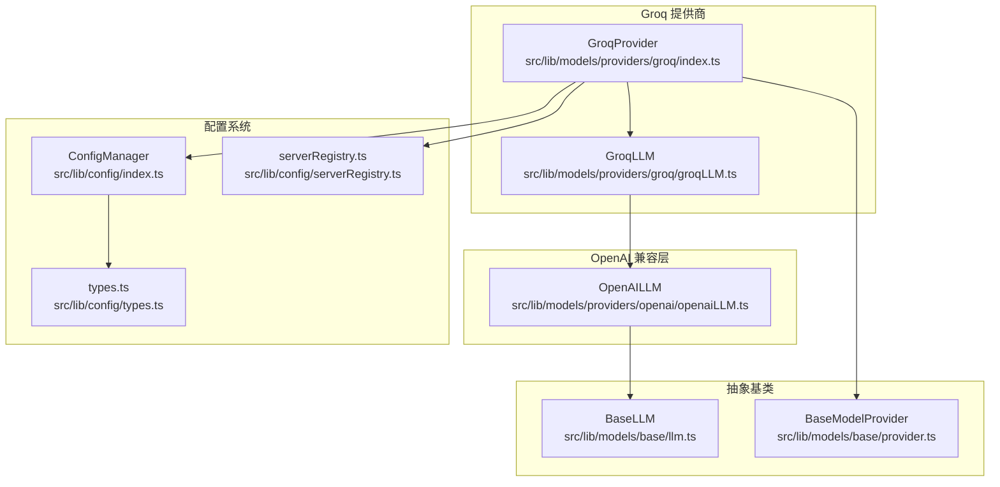
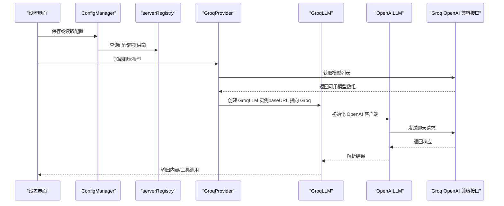
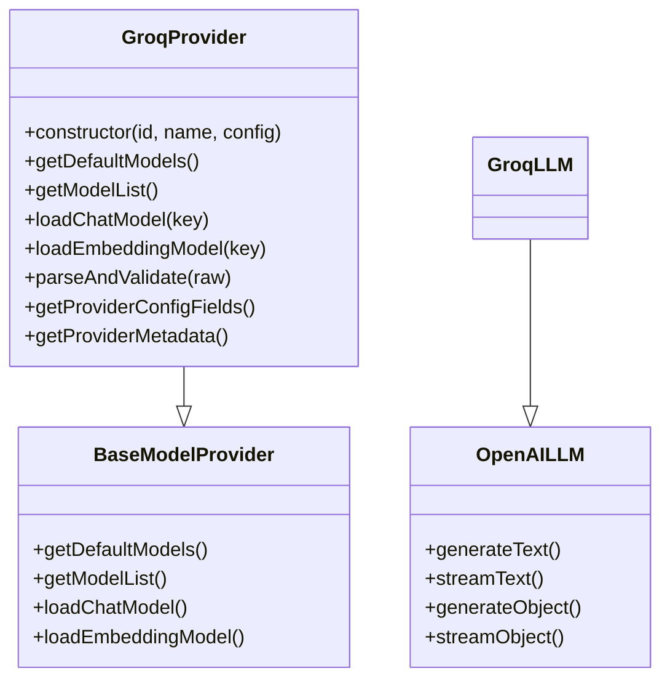
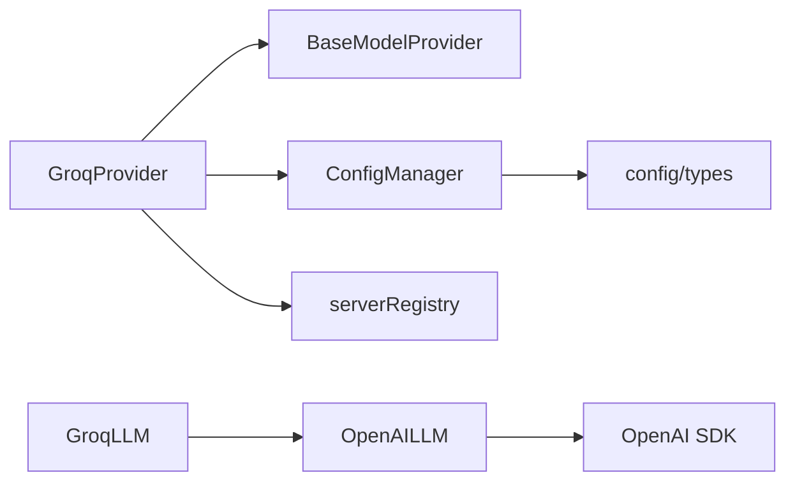

# Groq 提供商配置

<cite>
**本文引用的文件**
- [groqLLM.ts](file://src/lib/models/providers/groq/groqLLM.ts)
- [index.ts](file://src/lib/models/providers/groq/index.ts)
- [openaiLLM.ts](file://src/lib/models/providers/openai/openaiLLM.ts)
- [provider.ts](file://src/lib/models/base/provider.ts)
- [llm.ts](file://src/lib/models/base/llm.ts)
- [.env.example](file://.env.example)
- [types.ts](file://src/lib/config/types.ts)
- [serverRegistry.ts](file://src/lib/config/serverRegistry.ts)
- [config/index.ts](file://src/lib/config/index.ts)
- [types.ts](file://src/lib/models/types.ts)
- [README.md](file://README.md)
</cite>

## 目录
1. [简介](#简介)
2. [项目结构](#项目结构)
3. [核心组件](#核心组件)
4. [架构总览](#架构总览)
5. [详细组件分析](#详细组件分析)
6. [依赖关系分析](#依赖关系分析)
7. [性能考虑](#性能考虑)
8. [故障排查指南](#故障排查指南)
9. [结论](#结论)
10. [附录](#附录)

## 简介
本文件面向 Groq AI 模型提供商在 Perplexica 中的配置与使用，重点涵盖：
- Groq API 密钥的配置与安全存储
- 支持的 Llama 模型系列及可用模型列表来源
- Groq 基础 URL 的自定义配置方式
- 完整配置示例（含 GROQ_API_KEY 环境变量）
- 性能优化与延迟优化建议
- 常见配置问题诊断与解决

## 项目结构
Groq 集成采用“基于 OpenAI 兼容接口”的设计，通过继承 OpenAI 实现类，复用统一的 LLM 抽象层，从而以最小改动接入 Groq。

图表来源
- [index.ts](file://src/lib/models/providers/groq/index.ts#L1-L114)
- [groqLLM.ts](file://src/lib/models/providers/groq/groqLLM.ts#L1-L6)
- [openaiLLM.ts](file://src/lib/models/providers/openai/openaiLLM.ts#L1-L276)
- [provider.ts](file://src/lib/models/base/provider.ts#L1-L46)
- [llm.ts](file://src/lib/models/base/llm.ts#L1-L23)
- [config/index.ts](file://src/lib/config/index.ts#L1-L391)
- [serverRegistry.ts](file://src/lib/config/serverRegistry.ts#L1-L16)
- [types.ts](file://src/lib/config/types.ts#L1-L110)

章节来源
- [index.ts](file://src/lib/models/providers/groq/index.ts#L1-L114)
- [groqLLM.ts](file://src/lib/models/providers/groq/groqLLM.ts#L1-L6)
- [openaiLLM.ts](file://src/lib/models/providers/openai/openaiLLM.ts#L1-L276)
- [provider.ts](file://src/lib/models/base/provider.ts#L1-L46)
- [llm.ts](file://src/lib/models/base/llm.ts#L1-L23)
- [config/index.ts](file://src/lib/config/index.ts#L1-L391)
- [serverRegistry.ts](file://src/lib/config/serverRegistry.ts#L1-L16)
- [types.ts](file://src/lib/config/types.ts#L1-L110)

## 核心组件
- GroqProvider：负责从 Groq OpenAI 兼容接口拉取模型列表、校验与加载聊天模型，并声明配置字段（包括 GROQ_API_KEY）。
- GroqLLM：继承 OpenAILLM，直接复用 OpenAI 客户端能力，通过 baseURL 指向 Groq 的 OpenAI 兼容端点。
- OpenAILLM：封装 OpenAI 客户端，支持文本生成、流式输出、对象解析与流式对象解析。
- BaseModelProvider/BaseLLM：提供统一的提供商与 LLM 抽象接口，便于扩展其他提供商。
- 配置系统：ConfigManager 负责读取环境变量、持久化配置、暴露 UI 字段；serverRegistry 提供已配置提供商查询。

章节来源
- [index.ts](file://src/lib/models/providers/groq/index.ts#L26-L111)
- [groqLLM.ts](file://src/lib/models/providers/groq/groqLLM.ts#L1-L6)
- [openaiLLM.ts](file://src/lib/models/providers/openai/openaiLLM.ts#L30-L276)
- [provider.ts](file://src/lib/models/base/provider.ts#L6-L26)
- [llm.ts](file://src/lib/models/base/llm.ts#L10-L20)
- [config/index.ts](file://src/lib/config/index.ts#L175-L238)
- [serverRegistry.ts](file://src/lib/config/serverRegistry.ts#L4-L12)

## 架构总览
Groq 在本项目中通过“OpenAI 兼容接口 + 统一抽象层”实现，关键流程如下：

图表来源
- [index.ts](file://src/lib/models/providers/groq/index.ts#L31-L84)
- [openaiLLM.ts](file://src/lib/models/providers/openai/openaiLLM.ts#L36-L101)
- [config/index.ts](file://src/lib/config/index.ts#L175-L238)
- [serverRegistry.ts](file://src/lib/config/serverRegistry.ts#L8-L12)

## 详细组件分析

### GroqProvider：提供商与模型加载
- 配置字段：包含 GROQ_API_KEY 的必填字段，scope 为 server，环境变量映射为 GROQ_API_KEY。
- 模型列表：通过调用 Groq OpenAI 兼容接口的模型列表端点，动态获取可用模型并构建默认聊天模型列表。
- 模型加载：校验所选模型是否在可用列表内，若有效则返回 GroqLLM 实例，并将 baseURL 设为 Groq OpenAI 兼容端点。
- 不支持嵌入模型：抛出错误提示不支持嵌入模型。

图表来源
- [provider.ts](file://src/lib/models/base/provider.ts#L6-L26)
- [index.ts](file://src/lib/models/providers/groq/index.ts#L26-L111)
- [groqLLM.ts](file://src/lib/models/providers/groq/groqLLM.ts#L3-L5)
- [openaiLLM.ts](file://src/lib/models/providers/openai/openaiLLM.ts#L30-L276)

章节来源
- [index.ts](file://src/lib/models/providers/groq/index.ts#L9-L24)
- [index.ts](file://src/lib/models/providers/groq/index.ts#L31-L88)
- [index.ts](file://src/lib/models/providers/groq/index.ts#L90-L111)

### GroqLLM：基于 OpenAI 客户端的 Groq 实现
- 继承 OpenAILLM，无需额外实现即可使用统一的文本生成、流式输出、对象解析等能力。
- 构造时传入 apiKey、model 与 baseURL（指向 Groq OpenAI 兼容端点），由 OpenAI 客户端发起请求。

章节来源
- [groqLLM.ts](file://src/lib/models/providers/groq/groqLLM.ts#L1-L6)
- [openaiLLM.ts](file://src/lib/models/providers/openai/openaiLLM.ts#L33-L40)

### OpenAILLM：统一的 LLM 抽象与实现
- 初始化 OpenAI 客户端时可指定 baseURL，默认为 OpenAI 官方端点；Groq 场景下由 GroqProvider 注入 Groq 的兼容端点。
- 支持温度、topP、最大 token、停止序列、频率/存在惩罚等通用参数透传。
- 提供 generateText、streamText、generateObject、streamObject 四类接口，满足不同场景需求。

章节来源
- [openaiLLM.ts](file://src/lib/models/providers/openai/openaiLLM.ts#L23-L40)
- [openaiLLM.ts](file://src/lib/models/providers/openai/openaiLLM.ts#L72-L125)
- [openaiLLM.ts](file://src/lib/models/providers/openai/openaiLLM.ts#L127-L195)
- [openaiLLM.ts](file://src/lib/models/providers/openai/openaiLLM.ts#L197-L230)
- [openaiLLM.ts](file://src/lib/models/providers/openai/openaiLLM.ts#L232-L272)

### 配置系统与环境变量
- 环境变量：GROQ_API_KEY 通过 .env.example 明确列出，用于注入到 GroqProvider 的配置字段。
- ConfigManager：启动时从环境变量初始化配置，将 required 字段缺失的提供商跳过，避免未配置时报错。
- serverRegistry：提供按 ID 查询已配置提供商的能力，用于合并默认模型与用户自定义模型。

章节来源
- [.env.example](file://.env.example#L29-L30)
- [config/index.ts](file://src/lib/config/index.ts#L175-L238)
- [serverRegistry.ts](file://src/lib/config/serverRegistry.ts#L4-L12)

## 依赖关系分析
- GroqProvider 依赖 BaseModelProvider 抽象，确保新增提供商遵循统一接口。
- GroqLLM 依赖 OpenAILLM，从而获得 OpenAI 客户端能力与参数透传。
- OpenAILLM 依赖 OpenAI SDK，负责实际网络请求与响应解析。
- 配置系统贯穿于提供商初始化与运行时配置读取。

图表来源
- [index.ts](file://src/lib/models/providers/groq/index.ts#L26-L111)
- [groqLLM.ts](file://src/lib/models/providers/groq/groqLLM.ts#L1-L6)
- [openaiLLM.ts](file://src/lib/models/providers/openai/openaiLLM.ts#L1-L20)
- [provider.ts](file://src/lib/models/base/provider.ts#L1-L46)
- [config/index.ts](file://src/lib/config/index.ts#L1-L391)
- [serverRegistry.ts](file://src/lib/config/serverRegistry.ts#L1-L16)
- [types.ts](file://src/lib/config/types.ts#L1-L110)

章节来源
- [index.ts](file://src/lib/models/providers/groq/index.ts#L1-L114)
- [groqLLM.ts](file://src/lib/models/providers/groq/groqLLM.ts#L1-L6)
- [openaiLLM.ts](file://src/lib/models/providers/openai/openaiLLM.ts#L1-L276)
- [provider.ts](file://src/lib/models/base/provider.ts#L1-L46)
- [config/index.ts](file://src/lib/config/index.ts#L1-L391)
- [serverRegistry.ts](file://src/lib/config/serverRegistry.ts#L1-L16)
- [types.ts](file://src/lib/config/types.ts#L1-L110)

## 性能考虑
- 基于 OpenAI 兼容接口的实现意味着 Groq 的性能优势在本项目中通过统一的客户端与参数透传自然体现，无需额外适配。
- 以下参数可在调用侧通过 options 传递，有助于控制延迟与质量平衡：
  - 温度（temperature）
  - Top-P（topP）
  - 最大生成 token（maxTokens）
  - 停止序列（stopSequences）
  - 频率惩罚（frequencyPenalty）
  - 存在惩罚（presencePenalty）

章节来源
- [openaiLLM.ts](file://src/lib/models/providers/openai/openaiLLM.ts#L90-L101)
- [openaiLLM.ts](file://src/lib/models/providers/openai/openaiLLM.ts#L147-L158)
- [openaiLLM.ts](file://src/lib/models/providers/openai/openaiLLM.ts#L201-L213)
- [openaiLLM.ts](file://src/lib/models/providers/openai/openaiLLM.ts#L238-L252)

## 故障排查指南
- 无法加载 Groq 模型
  - 症状：选择模型时报错“无效模型”。
  - 排查：确认 GROQ_API_KEY 已正确配置且有效；确认所选模型确实存在于 Groq OpenAI 兼容接口返回的模型列表中。
  - 参考实现：GroqProvider 在加载模型前会校验模型是否在可用列表中。
- API 密钥未配置
  - 症状：启动时跳过 Groq 提供商或无法在设置界面看到 Groq。
  - 排查：检查 .env 文件中 GROQ_API_KEY 是否存在且非空；确认 ConfigManager 初始化时从环境变量读取了该字段。
- 嵌入模型不可用
  - 症状：尝试加载嵌入模型报错。
  - 排查：GroqProvider 明确声明不支持嵌入模型，需使用聊天模型。
- 端点与 baseURL
  - 症状：请求失败或超时。
  - 排查：GroqProvider 已将 baseURL 固定为 Groq OpenAI 兼容端点；若需要自定义，请在提供商实现中调整（当前实现为硬编码）。

章节来源
- [index.ts](file://src/lib/models/providers/groq/index.ts#L70-L84)
- [index.ts](file://src/lib/models/providers/groq/index.ts#L86-L88)
- [config/index.ts](file://src/lib/config/index.ts#L175-L238)
- [.env.example](file://.env.example#L29-L30)

## 结论
- Groq 在本项目中通过“OpenAI 兼容接口 + 统一抽象层”实现，具备良好的可维护性与扩展性。
- 配置上仅需设置 GROQ_API_KEY 即可启用，模型列表自动从 Groq 接口拉取。
- 性能方面可通过参数透传进行质量与延迟的权衡；当前实现未提供自定义 baseURL 的入口，如需更灵活的端点配置，可在提供商实现中增加相应逻辑。

## 附录

### 配置步骤与示例
- 设置环境变量
  - 在 .env 文件中添加 GROQ_API_KEY 并填写你的密钥。
  - 启动后，ConfigManager 会从环境变量读取该字段并初始化 Groq 提供商。
- 在设置界面配置
  - 打开应用设置，找到“模型提供商”部分，应出现 Groq 提供商的配置项（包含 GROQ_API_KEY 字段）。
  - 保存后，系统会自动拉取可用模型列表并在聊天模型中显示。

章节来源
- [.env.example](file://.env.example#L29-L30)
- [config/index.ts](file://src/lib/config/index.ts#L175-L238)
- [index.ts](file://src/lib/models/providers/groq/index.ts#L13-L24)

### 支持的模型系列与来源
- 模型列表来自 Groq OpenAI 兼容接口的模型列表端点，因此所有该端点返回的模型均可在本项目中使用。
- 由于模型列表动态获取，具体可用模型以运行时为准。

章节来源
- [index.ts](file://src/lib/models/providers/groq/index.ts#L31-L55)

### 自定义 Groq 基础 URL
- 当前实现中，GroqProvider 将 baseURL 固定为 Groq OpenAI 兼容端点；若需要自定义端点，可在提供商实现中增加配置字段并传入 OpenAI 客户端。
- 注意：修改端点可能影响兼容性，需确保目标端点与 OpenAI 兼容。

章节来源
- [index.ts](file://src/lib/models/providers/groq/index.ts#L82-L83)
- [openaiLLM.ts](file://src/lib/models/providers/openai/openaiLLM.ts#L36-L40)

### 模型性能对比与选择建议
- 本项目未内置模型性能对比数据；建议参考 Groq 官方文档与社区评测，结合自身场景（速度/质量/成本）选择合适模型。
- 在本项目中，可通过调整生成参数（温度、Top-P、最大 token 等）在质量与延迟之间取得平衡。

章节来源
- [openaiLLM.ts](file://src/lib/models/providers/openai/openaiLLM.ts#L90-L101)
- [openaiLLM.ts](file://src/lib/models/providers/openai/openaiLLM.ts#L147-L158)
- [openaiLLM.ts](file://src/lib/models/providers/openai/openaiLLM.ts#L201-L213)
- [openaiLLM.ts](file://src/lib/models/providers/openai/openaiLLM.ts#L238-L252)