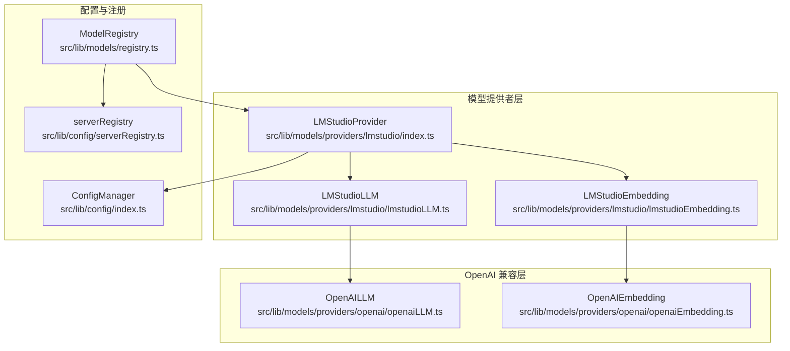
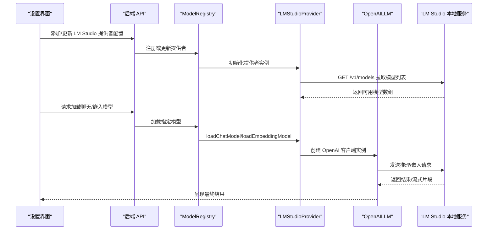
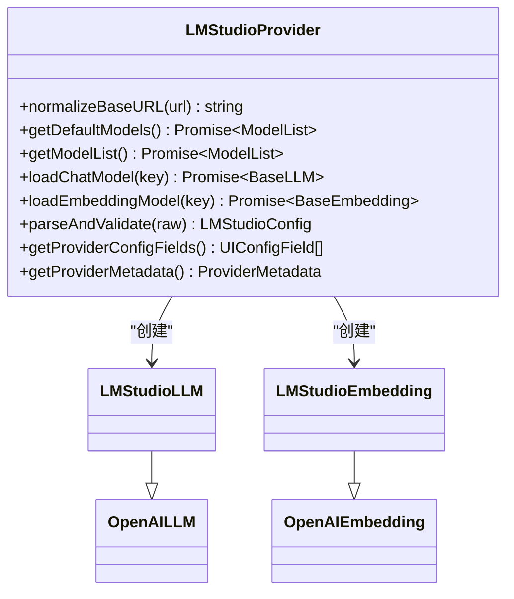
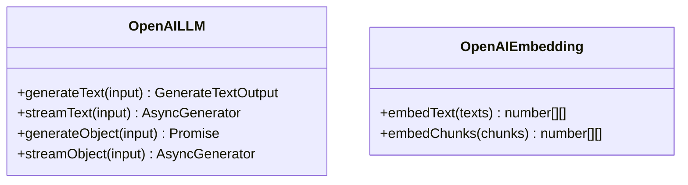
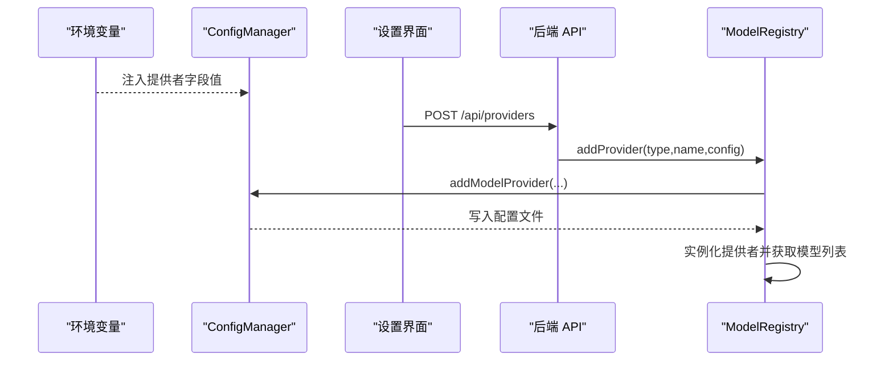
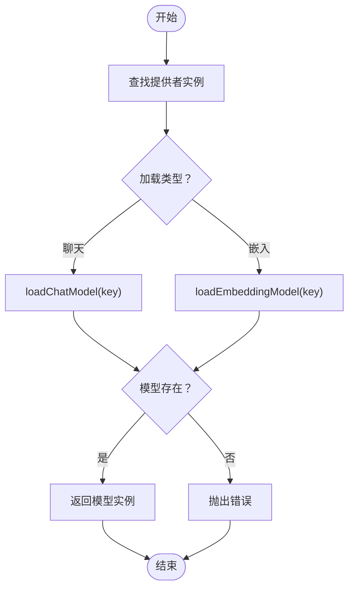
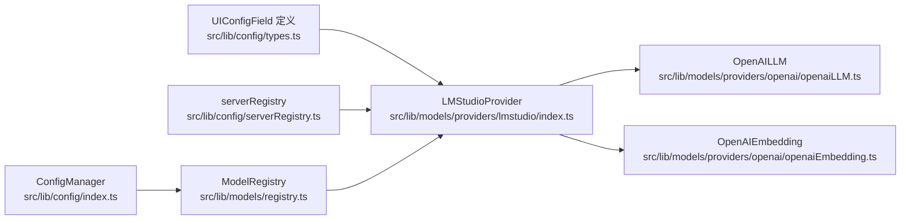

# LM Studio 本地模型配置

<cite>
**本文档引用的文件**
- [src/lib/models/providers/lmstudio/index.ts](file://src/lib/models/providers/lmstudio/index.ts)
- [src/lib/models/providers/lmstudio/lmstudioLLM.ts](file://src/lib/models/providers/lmstudio/lmstudioLLM.ts)
- [src/lib/models/providers/lmstudio/lmstudioEmbedding.ts](file://src/lib/models/providers/lmstudio/lmstudioEmbedding.ts)
- [src/lib/config/types.ts](file://src/lib/config/types.ts)
- [src/lib/config/serverRegistry.ts](file://src/lib/config/serverRegistry.ts)
- [src/lib/config/index.ts](file://src/lib/config/index.ts)
- [src/lib/models/providers/openai/openaiLLM.ts](file://src/lib/models/providers/openai/openaiLLM.ts)
- [src/lib/models/providers/openai/openaiEmbedding.ts](file://src/lib/models/providers/openai/openaiEmbedding.ts)
- [src/lib/models/registry.ts](file://src/lib/models/registry.ts)
- [src/app/api/providers/route.ts](file://src/app/api/providers/route.ts)
- [src/components/Settings/Sections/Models/AddProviderDialog.tsx](file://src/components/Settings/Sections/Models/AddProviderDialog.tsx)
- [src/components/Settings/Sections/Models/UpdateProviderDialog.tsx](file://src/components/Settings/Sections/Models/UpdateProviderDialog.tsx)
</cite>

## 目录
1. [简介](#简介)
2. [项目结构](#项目结构)
3. [核心组件](#核心组件)
4. [架构总览](#架构总览)
5. [详细组件分析](#详细组件分析)
6. [依赖关系分析](#依赖关系分析)
7. [性能考虑](#性能考虑)
8. [故障排除指南](#故障排除指南)
9. [结论](#结论)
10. [附录](#附录)

## 简介
本文件面向在 Perplexica 中集成 LM Studio 本地模型提供商的用户与运维人员，提供从基础 URL 配置、本地部署要求、模型类型与参数、服务启动与停止流程、到性能监控与常见问题诊断的完整说明。LM Studio 在本项目中通过兼容 OpenAI 协议的接口进行通信，因此其配置与调用路径与 OpenAI Provider 类似，但使用 LM Studio 的本地服务地址。

## 项目结构
LM Studio Provider 的实现位于模型提供者目录下，采用“适配器”模式：LMStudioProvider 负责配置与模型列表管理；LMStudioLLM/LMStudioEmbedding 继承自 OpenAI 兼容类，直接复用 OpenAI 的请求封装与流式处理逻辑。

图表来源
- [src/lib/models/providers/lmstudio/index.ts](file://src/lib/models/providers/lmstudio/index.ts#L1-L144)
- [src/lib/models/providers/lmstudio/lmstudioLLM.ts](file://src/lib/models/providers/lmstudio/lmstudioLLM.ts#L1-L6)
- [src/lib/models/providers/lmstudio/lmstudioEmbedding.ts](file://src/lib/models/providers/lmstudio/lmstudioEmbedding.ts#L1-L6)
- [src/lib/models/providers/openai/openaiLLM.ts](file://src/lib/models/providers/openai/openaiLLM.ts#L1-L276)
- [src/lib/models/providers/openai/openaiEmbedding.ts](file://src/lib/models/providers/openai/openaiEmbedding.ts#L1-L43)
- [src/lib/config/index.ts](file://src/lib/config/index.ts#L1-L391)
- [src/lib/config/serverRegistry.ts](file://src/lib/config/serverRegistry.ts#L1-L16)
- [src/lib/models/registry.ts](file://src/lib/models/registry.ts#L1-L222)

章节来源
- [src/lib/models/providers/lmstudio/index.ts](file://src/lib/models/providers/lmstudio/index.ts#L1-L144)
- [src/lib/config/index.ts](file://src/lib/config/index.ts#L1-L391)
- [src/lib/models/registry.ts](file://src/lib/models/registry.ts#L1-L222)

## 核心组件
- LMStudioProvider：负责读取配置、规范化基础 URL、拉取模型列表、加载聊天与嵌入模型实例，并提供 UI 配置字段与元数据。
- LMStudioLLM / LMStudioEmbedding：继承自 OpenAI 兼容类，使用 LM Studio 的本地 OpenAI 协议端点进行推理与向量化。
- OpenAILLM / OpenAIEmbedding：封装 OpenAI 客户端，统一消息格式转换、参数映射、流式响应解析等。
- ConfigManager / serverRegistry：负责持久化配置、环境变量注入、模型提供者注册与查询。
- ModelRegistry：统一管理已激活的提供者实例，负责模型加载、更新与移除。

章节来源
- [src/lib/models/providers/lmstudio/index.ts](file://src/lib/models/providers/lmstudio/index.ts#L27-L141)
- [src/lib/models/providers/lmstudio/lmstudioLLM.ts](file://src/lib/models/providers/lmstudio/lmstudioLLM.ts#L1-L6)
- [src/lib/models/providers/lmstudio/lmstudioEmbedding.ts](file://src/lib/models/providers/lmstudio/lmstudioEmbedding.ts#L1-L6)
- [src/lib/models/providers/openai/openaiLLM.ts](file://src/lib/models/providers/openai/openaiLLM.ts#L30-L276)
- [src/lib/models/providers/openai/openaiEmbedding.ts](file://src/lib/models/providers/openai/openaiEmbedding.ts#L11-L43)
- [src/lib/config/index.ts](file://src/lib/config/index.ts#L7-L391)
- [src/lib/config/serverRegistry.ts](file://src/lib/config/serverRegistry.ts#L1-L16)
- [src/lib/models/registry.ts](file://src/lib/models/registry.ts#L8-L222)

## 架构总览
LM Studio Provider 的工作流包括：配置初始化（含环境变量）、模型列表拉取、模型实例加载、以及通过 OpenAI 兼容客户端发起请求。

图表来源
- [src/app/api/providers/route.ts](file://src/app/api/providers/route.ts#L5-L77)
- [src/lib/models/registry.ts](file://src/lib/models/registry.ts#L74-L92)
- [src/lib/models/providers/lmstudio/index.ts](file://src/lib/models/providers/lmstudio/index.ts#L37-L118)
- [src/lib/models/providers/openai/openaiLLM.ts](file://src/lib/models/providers/openai/openaiLLM.ts#L72-L125)

## 详细组件分析

### LMStudioProvider 组件
- 基础 URL 规范化：自动去除尾部多余斜杠，并确保以 /v1 结尾，保证与 OpenAI 协议一致。
- 模型列表获取：访问 http(s)://host:port/v1/models，解析返回的模型数组为内部 ModelList。
- 模型加载：校验模型是否存在于合并后的模型列表（默认 + 用户自定义），成功则返回 LMStudioLLM 或 LMStudioEmbedding 实例。
- 配置字段：提供 UI 字段“Base URL”，支持通过环境变量注入，作用域为服务器侧。

图表来源
- [src/lib/models/providers/lmstudio/index.ts](file://src/lib/models/providers/lmstudio/index.ts#L27-L141)
- [src/lib/models/providers/lmstudio/lmstudioLLM.ts](file://src/lib/models/providers/lmstudio/lmstudioLLM.ts#L1-L6)
- [src/lib/models/providers/lmstudio/lmstudioEmbedding.ts](file://src/lib/models/providers/lmstudio/lmstudioEmbedding.ts#L1-L6)
- [src/lib/models/providers/openai/openaiLLM.ts](file://src/lib/models/providers/openai/openaiLLM.ts#L30-L40)
- [src/lib/models/providers/openai/openaiEmbedding.ts](file://src/lib/models/providers/openai/openaiEmbedding.ts#L11-L21)

章节来源
- [src/lib/models/providers/lmstudio/index.ts](file://src/lib/models/providers/lmstudio/index.ts#L32-L118)

### OpenAI 兼容层（推理与嵌入）
- OpenAILLM：封装 OpenAI 客户端，负责消息格式转换、工具调用、温度/采样参数映射、非流式与流式响应处理。
- OpenAIEmbedding：封装 embeddings 接口，支持文本与分块向量化。

图表来源
- [src/lib/models/providers/openai/openaiLLM.ts](file://src/lib/models/providers/openai/openaiLLM.ts#L30-L276)
- [src/lib/models/providers/openai/openaiEmbedding.ts](file://src/lib/models/providers/openai/openaiEmbedding.ts#L11-L43)

章节来源
- [src/lib/models/providers/openai/openaiLLM.ts](file://src/lib/models/providers/openai/openaiLLM.ts#L72-L272)
- [src/lib/models/providers/openai/openaiEmbedding.ts](file://src/lib/models/providers/openai/openaiEmbedding.ts#L23-L39)

### 配置与注册流程
- 环境变量注入：ConfigManager 在初始化时扫描各提供者的 UI 字段，若存在 env 属性，则优先从进程环境变量读取。
- 提供者注册：ModelRegistry 将已配置的提供者实例化并缓存，用于后续模型加载与调用。
- UI 集成：设置页面通过对话框添加/更新提供者配置，后端 API 路由负责持久化与实例重建。

图表来源
- [src/lib/config/index.ts](file://src/lib/config/index.ts#L175-L238)
- [src/lib/models/registry.ts](file://src/lib/models/registry.ts#L94-L141)
- [src/app/api/providers/route.ts](file://src/app/api/providers/route.ts#L36-L77)

章节来源
- [src/lib/config/index.ts](file://src/lib/config/index.ts#L175-L238)
- [src/lib/models/registry.ts](file://src/lib/models/registry.ts#L94-L141)
- [src/components/Settings/Sections/Models/AddProviderDialog.tsx](file://src/components/Settings/Sections/Models/AddProviderDialog.tsx#L62-L89)
- [src/components/Settings/Sections/Models/UpdateProviderDialog.tsx](file://src/components/Settings/Sections/Models/UpdateProviderDialog.tsx#L40-L74)

### 模型加载与卸载机制
- 加载：ModelRegistry 根据提供者 ID 与模型名称，委托对应 Provider 的 loadChatModel/loadEmbeddingModel，后者校验模型存在性并返回具体模型实例。
- 卸载：当前实现未提供显式的“卸载”方法；提供者移除通过 ModelRegistry.removeProvider 完成，会从内存与配置中移除该提供者。

图表来源
- [src/lib/models/registry.ts](file://src/lib/models/registry.ts#L74-L92)
- [src/lib/models/providers/lmstudio/index.ts](file://src/lib/models/providers/lmstudio/index.ts#L85-L118)

章节来源
- [src/lib/models/registry.ts](file://src/lib/models/registry.ts#L74-L92)
- [src/lib/models/providers/lmstudio/index.ts](file://src/lib/models/providers/lmstudio/index.ts#L85-L118)

## 依赖关系分析
- LMStudioProvider 依赖：
  - UI 配置字段类型定义（UIConfigField）
  - 服务器端配置读取（getConfiguredModelProviderById）
  - OpenAI 兼容推理与嵌入实现
- OpenAI 兼容层依赖：
  - OpenAI SDK 客户端
  - 消息格式转换与工具调用序列化
- 配置与注册依赖：
  - ConfigManager：持久化配置、环境变量注入
  - serverRegistry：按 ID 查询已配置提供者
  - ModelRegistry：统一管理提供者生命周期

图表来源
- [src/lib/config/types.ts](file://src/lib/config/types.ts#L46-L51)
- [src/lib/config/serverRegistry.ts](file://src/lib/config/serverRegistry.ts#L8-L12)
- [src/lib/models/providers/lmstudio/index.ts](file://src/lib/models/providers/lmstudio/index.ts#L1-L8)
- [src/lib/models/providers/openai/openaiLLM.ts](file://src/lib/models/providers/openai/openaiLLM.ts#L1-L20)
- [src/lib/models/providers/openai/openaiEmbedding.ts](file://src/lib/models/providers/openai/openaiEmbedding.ts#L1-L9)
- [src/lib/config/index.ts](file://src/lib/config/index.ts#L1-L391)
- [src/lib/models/registry.ts](file://src/lib/models/registry.ts#L1-L222)

章节来源
- [src/lib/config/types.ts](file://src/lib/config/types.ts#L46-L51)
- [src/lib/config/serverRegistry.ts](file://src/lib/config/serverRegistry.ts#L8-L12)
- [src/lib/models/providers/lmstudio/index.ts](file://src/lib/models/providers/lmstudio/index.ts#L1-L8)
- [src/lib/models/providers/openai/openaiLLM.ts](file://src/lib/models/providers/openai/openaiLLM.ts#L1-L20)
- [src/lib/models/providers/openai/openaiEmbedding.ts](file://src/lib/models/providers/openai/openaiEmbedding.ts#L1-L9)
- [src/lib/config/index.ts](file://src/lib/config/index.ts#L1-L391)
- [src/lib/models/registry.ts](file://src/lib/models/registry.ts#L1-L222)

## 性能考虑
- 连接与超时：OpenAI 客户端默认行为适用于本地服务，建议在高并发场景下关注 LM Studio 本地服务的线程池与 GPU/CPU 资源限制。
- 流式输出：OpenAILLM 支持流式响应，前端可逐步渲染，降低首字延迟；请确保网络稳定与服务端流式支持。
- 模型选择：不同模型大小与精度对资源占用差异较大，建议在设置中选择合适模型并结合温度、最大令牌数等参数优化性能。
- 缓存策略：当前实现未内置模型缓存，可在应用层面结合业务需求增加本地缓存或预热策略。

## 故障排除指南
- 无法连接到 LM Studio
  - 症状：拉取模型列表失败，提示连接错误。
  - 排查：确认基础 URL 正确且以 /v1 结尾；检查本地服务是否运行；验证防火墙与端口可达性。
  - 参考：Provider 在获取模型列表时对 TypeError 进行了专门错误提示。
- 模型加载失败
  - 症状：选择的模型不在可用列表中，抛出无效模型错误。
  - 排查：确认模型已在 LM Studio 中正确加载；检查模型名称与 key 是否一致。
- 环境变量未生效
  - 症状：设置界面显示默认值而非期望值。
  - 排查：确认环境变量名与 Provider 字段 env 对应；重启服务使配置生效。
- 提供者添加/更新失败
  - 症状：后端返回错误信息。
  - 排查：检查必填字段是否填写完整；查看后端日志定位具体错误原因。

章节来源
- [src/lib/models/providers/lmstudio/index.ts](file://src/lib/models/providers/lmstudio/index.ts#L62-L68)
- [src/lib/models/providers/lmstudio/index.ts](file://src/lib/models/providers/lmstudio/index.ts#L90-L94)
- [src/lib/config/index.ts](file://src/lib/config/index.ts#L195-L202)
- [src/app/api/providers/route.ts](file://src/app/api/providers/route.ts#L66-L76)

## 结论
LM Studio Provider 通过 OpenAI 协议与本地服务对接，具备简洁的配置入口与完善的模型加载机制。结合环境变量注入与设置界面，用户可以快速完成本地模型的接入与管理。在生产环境中，建议关注资源使用、流式性能与模型选择策略，并建立完善的监控与告警机制。

## 附录

### 基础 URL 配置与本地部署要求
- 基础 URL 规范化：自动去除尾部多余斜杠并补全 /v1 后缀，确保与 OpenAI 协议一致。
- 本地部署要求：确保 LM Studio 本地服务已启动并监听指定端口，且对外可访问（如需容器/网络暴露）。

章节来源
- [src/lib/models/providers/lmstudio/index.ts](file://src/lib/models/providers/lmstudio/index.ts#L32-L35)

### 支持的本地模型类型与配置参数
- 支持类型：聊天模型（LLM）与嵌入模型（Embedding）。
- 关键参数：Base URL（必填），作用于 OpenAI 客户端的 baseURL；模型名称作为 model 参数传入。
- 配置字段：Base URL（字符串类型，必填，占位符为 http://localhost:1234，环境变量键为 LM_STUDIO_BASE_URL）。

章节来源
- [src/lib/models/providers/lmstudio/index.ts](file://src/lib/models/providers/lmstudio/index.ts#L14-L25)
- [src/lib/models/providers/lmstudio/index.ts](file://src/lib/models/providers/lmstudio/index.ts#L120-L129)
- [src/lib/models/providers/openai/openaiLLM.ts](file://src/lib/models/providers/openai/openaiLLM.ts#L23-L28)
- [src/lib/models/providers/openai/openaiEmbedding.ts](file://src/lib/models/providers/openai/openaiEmbedding.ts#L5-L9)

### 服务启动与停止流程
- 启动：启动 LM Studio 本地服务，确保其监听端口可被后端访问。
- 停止：停止 LM Studio 本地服务，后端将无法连接到 /v1 接口。
- 重启：修改配置后，建议重启后端服务以重新加载提供者与模型列表。

章节来源
- [src/lib/models/providers/lmstudio/index.ts](file://src/lib/models/providers/lmstudio/index.ts#L37-L70)
- [src/lib/models/registry.ts](file://src/lib/models/registry.ts#L14-L35)

### 环境变量与配置示例
- 环境变量：LM_STUDIO_BASE_URL（对应 Provider 字段的 env）。
- 示例：在启动后端前设置环境变量，确保值为 http://localhost:1234 或实际主机与端口。
- 注入机制：ConfigManager 在初始化时扫描 Provider 的 UI 字段，若存在 env，则从进程环境变量读取并写入配置文件。

章节来源
- [src/lib/models/providers/lmstudio/index.ts](file://src/lib/models/providers/lmstudio/index.ts#L22-L22)
- [src/lib/config/index.ts](file://src/lib/config/index.ts#L195-L202)

### 性能监控与资源使用
- 监控建议：关注 LM Studio 本地服务的 GPU/CPU 使用率、内存占用与并发连接数；结合应用日志记录请求耗时与错误率。
- 优化建议：根据负载调整模型大小与采样参数；启用流式输出提升用户体验；合理规划模型数量与预热策略。

[本节为通用指导，无需特定文件引用]

### 常见本地部署问题诊断
- 无法访问 /v1/models：检查基础 URL 末尾是否为 /v1；确认本地服务已启动。
- 模型不可用：确认模型已在 LM Studio 中加载；核对模型 key 与名称。
- 环境变量不生效：确认环境变量名与 Provider 字段 env 一致；重启后端服务。

章节来源
- [src/lib/models/providers/lmstudio/index.ts](file://src/lib/models/providers/lmstudio/index.ts#L37-L70)
- [src/lib/models/providers/lmstudio/index.ts](file://src/lib/models/providers/lmstudio/index.ts#L85-L118)
- [src/lib/config/index.ts](file://src/lib/config/index.ts#L195-L202)