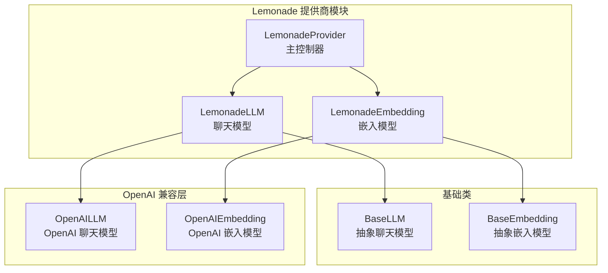
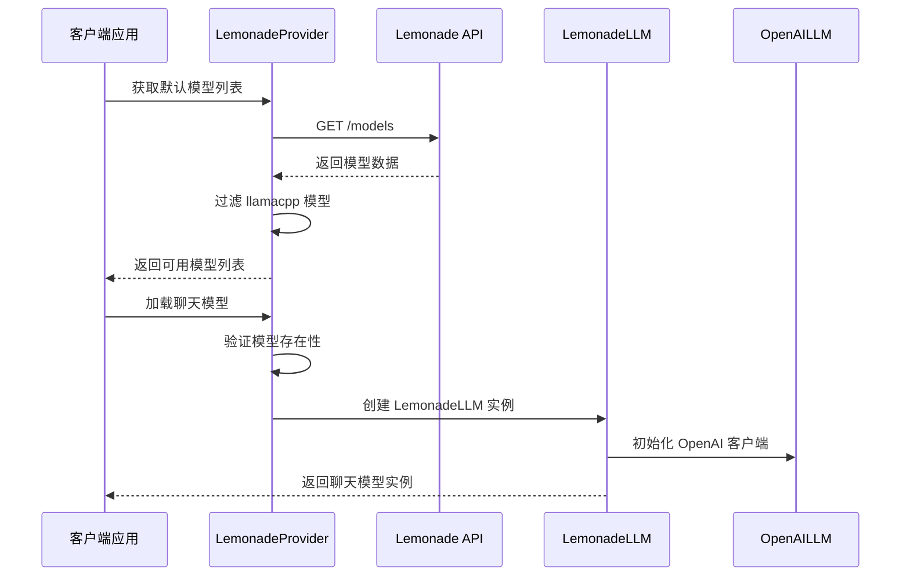
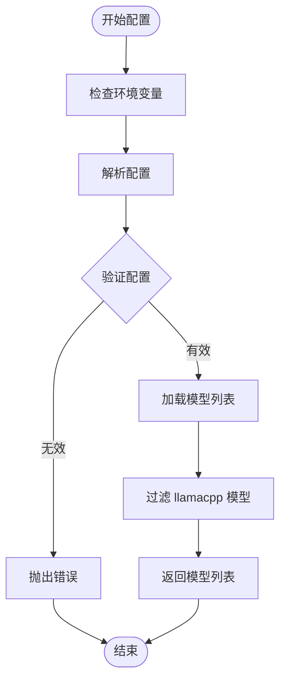
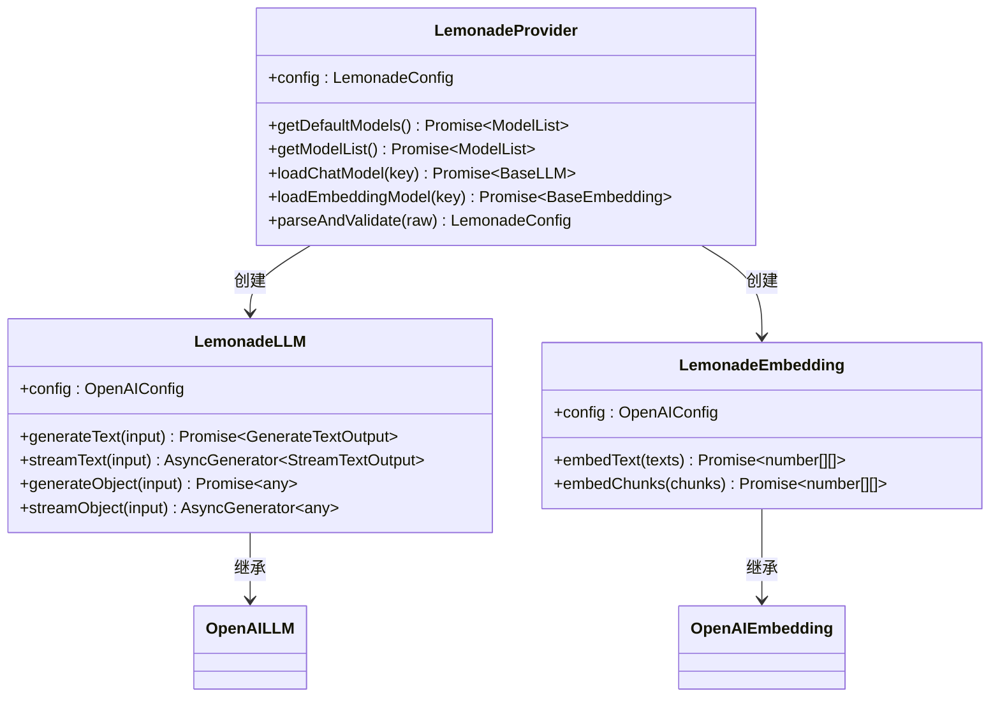
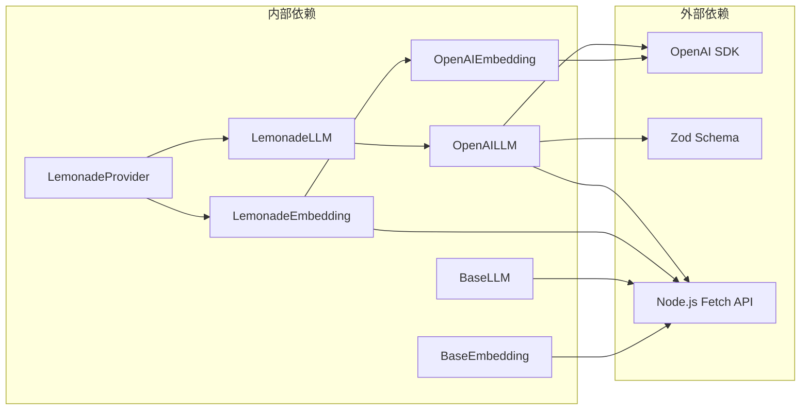

# Lemonade 本地模型配置

<cite>
**本文档引用的文件**
- [src/lib/models/providers/lemonade/index.ts](file://src/lib/models/providers/lemonade/index.ts)
- [src/lib/models/providers/lemonade/lemonadeLLM.ts](file://src/lib/models/providers/lemonade/lemonadeLLM.ts)
- [src/lib/models/providers/lemonade/lemonadeEmbedding.ts](file://src/lib/models/providers/lemonade/lemonadeEmbedding.ts)
- [.env.example](file://.env.example)
- [src/lib/models/providers/openai/openaiLLM.ts](file://src/lib/models/providers/openai/openaiLLM.ts)
- [src/lib/models/providers/openai/openaiEmbedding.ts](file://src/lib/models/providers/openai/openaiEmbedding.ts)
- [src/lib/models/base/llm.ts](file://src/lib/models/base/llm.ts)
- [src/lib/models/base/embedding.ts](file://src/lib/models/base/embedding.ts)
- [src/lib/config/types.ts](file://src/lib/config/types.ts)
- [src/lib/config/serverRegistry.ts](file://src/lib/config/serverRegistry.ts)
</cite>

## 目录
1. [简介](#简介)
2. [项目结构](#项目结构)
3. [核心组件](#核心组件)
4. [架构概览](#架构概览)
5. [详细组件分析](#详细组件分析)
6. [依赖关系分析](#依赖关系分析)
7. [性能考虑](#性能考虑)
8. [故障排除指南](#故障排除指南)
9. [结论](#结论)

## 简介

Lemonade 是一个基于本地部署的 AI 模型提供商，允许用户在本地环境中运行和管理 AI 模型。本项目通过 Lemonade 提供商实现了对本地模型的支持，使用户能够在不依赖外部 API 的情况下使用 AI 功能。

Lemonade 提供商的核心特性包括：
- 支持本地模型加载和管理
- 与 OpenAI 兼容的 API 接口
- 可配置的 Base URL 和 API 密钥
- 自动模型发现和列表管理
- 流式响应处理能力

## 项目结构

Lemonade 本地模型提供商位于项目的模型提供商目录中，采用模块化设计：

**图表来源**
- [src/lib/models/providers/lemonade/index.ts](file://src/lib/models/providers/lemonade/index.ts#L38-L151)
- [src/lib/models/providers/lemonade/lemonadeLLM.ts](file://src/lib/models/providers/lemonade/lemonadeLLM.ts#L1-L5)
- [src/lib/models/providers/lemonade/lemonadeEmbedding.ts](file://src/lib/models/providers/lemonade/lemonadeEmbedding.ts#L1-L5)

**章节来源**
- [src/lib/models/providers/lemonade/index.ts](file://src/lib/models/providers/lemonade/index.ts#L1-L154)

## 核心组件

### LemonadeProvider 类

LemonadeProvider 是 Lemonade 本地模型提供商的主要控制器，负责管理模型配置、加载和验证。

**主要功能：**
- 配置验证和解析
- 模型列表获取和过滤
- 聊天模型和嵌入模型的加载
- 错误处理和异常管理

**配置字段：**
- `baseURL`: 必需，Lemonade API 的基础 URL
- `apiKey`: 可选，Lemonade API 密钥

**章节来源**
- [src/lib/models/providers/lemonade/index.ts](file://src/lib/models/providers/lemonade/index.ts#L10-L36)
- [src/lib/models/providers/lemonade/index.ts](file://src/lib/models/providers/lemonade/index.ts#L129-L139)

### LemonadeLLM 和 LemonadeEmbedding

这两个类继承自对应的 OpenAI 实现，提供了 Lemonade 本地模型的具体实现：

**LemonadeLLM**: 继承自 OpenAILLM，提供聊天模型功能
**LemonadeEmbedding**: 继承自 OpenAIEmbedding，提供嵌入模型功能

**章节来源**
- [src/lib/models/providers/lemonade/lemonadeLLM.ts](file://src/lib/models/providers/lemonade/lemonadeLLM.ts#L1-L5)
- [src/lib/models/providers/lemonade/lemonadeEmbedding.ts](file://src/lib/models/providers/lemonade/lemonadeEmbedding.ts#L1-L5)

## 架构概览

Lemonade 本地模型提供商采用分层架构设计，实现了良好的代码组织和可扩展性：

**图表来源**
- [src/lib/models/providers/lemonade/index.ts](file://src/lib/models/providers/lemonade/index.ts#L43-L79)
- [src/lib/models/providers/lemonade/index.ts](file://src/lib/models/providers/lemonade/index.ts#L94-L110)

### 数据流图

**图表来源**
- [src/lib/models/providers/lemonade/index.ts](file://src/lib/models/providers/lemonade/index.ts#L129-L139)
- [src/lib/models/providers/lemonade/index.ts](file://src/lib/models/providers/lemonade/index.ts#L57-L69)

## 详细组件分析

### 配置系统

Lemonade 提供商使用统一的配置管理系统，支持环境变量映射和 UI 配置字段定义。

**配置字段定义：**
- Base URL 字段：必需，用于指定 Lemonade API 的基础 URL
- API Key 字段：可选，用于 API 认证

**环境变量映射：**
- `LEMONADE_BASE_URL` → `baseURL`
- `LEMONADE_API_KEY` → `apiKey`

**章节来源**
- [src/lib/models/providers/lemonade/index.ts](file://src/lib/models/providers/lemonade/index.ts#L15-L36)
- [.env.example](file://.env.example#L35-L36)

### 模型加载机制

Lemonade 提供商实现了智能的模型加载机制，支持动态模型发现和本地模型管理：

**图表来源**
- [src/lib/models/providers/lemonade/index.ts](file://src/lib/models/providers/lemonade/index.ts#L38-L127)
- [src/lib/models/providers/lemonade/lemonadeLLM.ts](file://src/lib/models/providers/lemonade/lemonadeLLM.ts#L1-L5)
- [src/lib/models/providers/lemonade/lemonadeEmbedding.ts](file://src/lib/models/providers/lemonade/lemonadeEmbedding.ts#L1-L5)

### 错误处理机制

Lemonade 提供商实现了完善的错误处理机制，确保系统的稳定性和用户体验：

**主要错误类型：**
- 网络连接错误：当无法连接到 Lemonade API 时抛出
- 配置验证错误：当配置不完整或格式不正确时抛出
- 模型加载错误：当选择的模型不存在时抛出

**章节来源**
- [src/lib/models/providers/lemonade/index.ts](file://src/lib/models/providers/lemonade/index.ts#L70-L78)
- [src/lib/models/providers/lemonade/index.ts](file://src/lib/models/providers/lemonade/index.ts#L99-L103)
- [src/lib/models/providers/lemonade/index.ts](file://src/lib/models/providers/lemonade/index.ts#L116-L120)

## 依赖关系分析

Lemonade 本地模型提供商的依赖关系清晰明确，采用了标准的面向对象设计原则：

**图表来源**
- [src/lib/models/providers/lemonade/index.ts](file://src/lib/models/providers/lemonade/index.ts#L1-L8)
- [src/lib/models/providers/openai/openaiLLM.ts](file://src/lib/models/providers/openai/openaiLLM.ts#L1-L20)

### 组件耦合度分析

Lemonade 提供商的设计具有以下特点：
- **低耦合**：通过继承和接口实现，减少了组件间的直接依赖
- **高内聚**：每个组件专注于特定的功能领域
- **可扩展性**：基于抽象基类的设计便于添加新的模型类型

**章节来源**
- [src/lib/models/base/llm.ts](file://src/lib/models/base/llm.ts#L10-L20)
- [src/lib/models/base/embedding.ts](file://src/lib/models/base/embedding.ts#L3-L7)

## 性能考虑

### 内存管理

Lemonade 提供商在内存管理方面采用了以下策略：
- **延迟加载**：模型在需要时才进行加载，减少初始内存占用
- **连接复用**：OpenAI 客户端实例在模型生命周期内复用
- **流式处理**：支持流式响应，避免大响应内容的内存峰值

### 网络优化

**请求优化策略：**
- **HTTP 复用**：通过单个客户端实例处理多个请求
- **超时控制**：合理的网络超时设置防止长时间阻塞
- **重试机制**：在网络不稳定时提供自动重试能力

### 并发处理

Lemonade 提供商支持并发模型调用：
- **异步操作**：所有模型操作都是异步的
- **流式响应**：支持实时流式响应处理
- **无阻塞 I/O**：使用现代 JavaScript 异步模式

## 故障排除指南

### 常见配置问题

**问题 1：Base URL 配置错误**
- **症状**：连接 Lemonade API 失败
- **解决方案**：检查 `.env` 文件中的 `LEMONADE_BASE_URL` 设置
- **验证方法**：确认 URL 格式正确且服务可达

**问题 2：API Key 认证失败**
- **症状**：401 未授权错误
- **解决方案**：验证 `LEMONADE_API_KEY` 是否正确设置
- **安全建议**：定期轮换 API 密钥

**问题 3：模型加载失败**
- **症状**：选择的模型无法加载
- **解决方案**：确认模型名称与可用模型列表一致
- **检查清单**：验证模型是否存在于 Lemonade 服务中

### 网络连接问题

**诊断步骤：**
1. 使用 `curl` 或 `wget` 测试 Lemonade API 可达性
2. 检查防火墙和代理设置
3. 验证 DNS 解析是否正常
4. 确认网络连接稳定性

**章节来源**
- [src/lib/models/providers/lemonade/index.ts](file://src/lib/models/providers/lemonade/index.ts#L71-L75)

### 性能监控

**监控指标：**
- **响应时间**：记录 API 请求的响应时间
- **内存使用**：监控模型实例的内存占用
- **并发请求数**：跟踪同时进行的模型调用数量
- **错误率**：统计各种错误的发生频率

**建议的监控实现：**
- 使用 Node.js 内置的性能计数器
- 集成第三方监控工具如 Prometheus
- 实现自定义日志记录系统

### 调试技巧

**开发环境调试：**
- 启用详细的日志记录
- 使用浏览器开发者工具监控网络请求
- 实施断点调试定位问题
- 创建最小化重现案例

**生产环境调试：**
- 实施结构化日志记录
- 使用分布式追踪系统
- 设置告警和通知机制
- 准备应急响应计划

## 结论

Lemonade 本地模型提供商为 Perplexica 项目提供了强大的本地 AI 模型支持。通过精心设计的架构和完善的错误处理机制，该提供商能够可靠地管理本地模型的加载和执行。

**主要优势：**
- **易于集成**：与现有系统无缝集成
- **灵活配置**：支持多种配置方式和环境变量
- **高性能**：优化的内存管理和并发处理
- **可扩展**：模块化设计便于功能扩展

**未来改进方向：**
- 添加更多的性能监控指标
- 实现更智能的模型缓存机制
- 增强错误恢复和重试策略
- 提供更详细的诊断工具

通过遵循本文档的配置指南和最佳实践，用户可以成功部署和管理 Lemonade 本地模型提供商，充分发挥其在本地 AI 应用中的潜力。