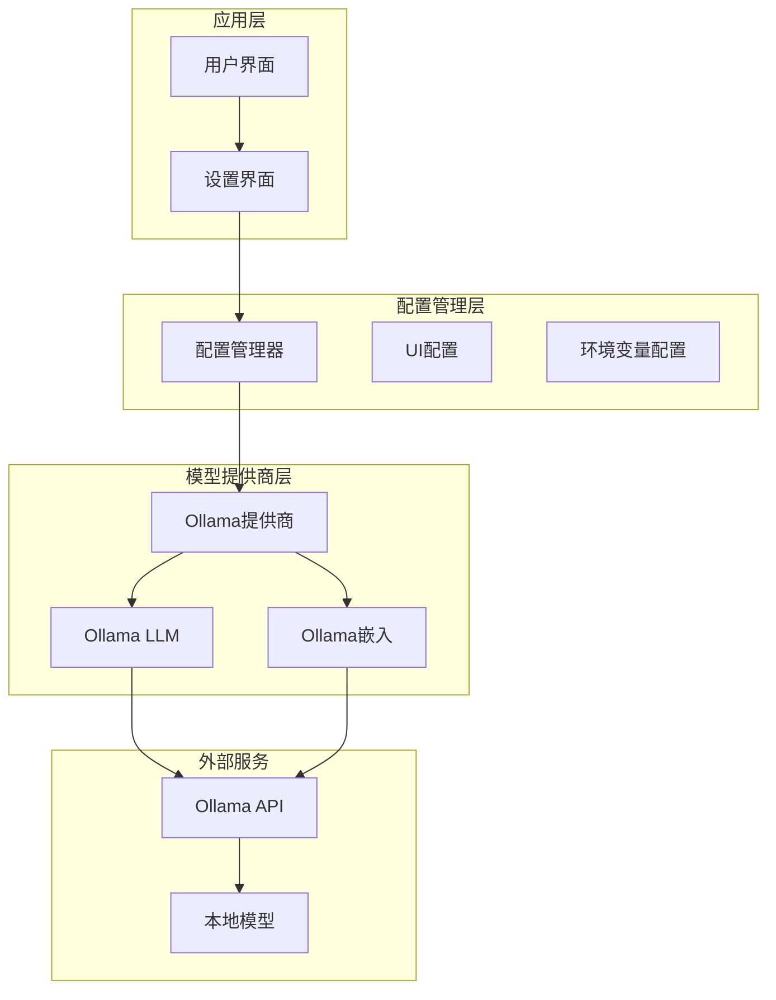
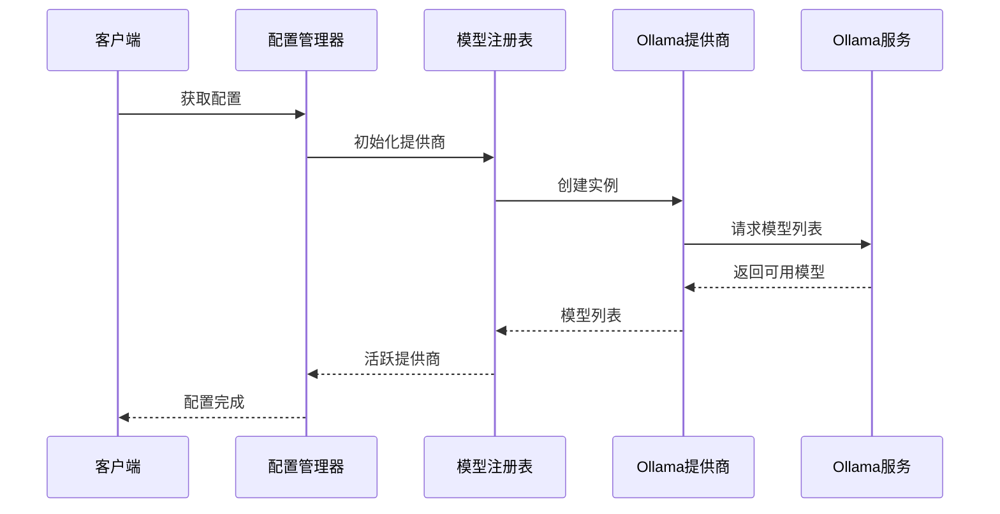
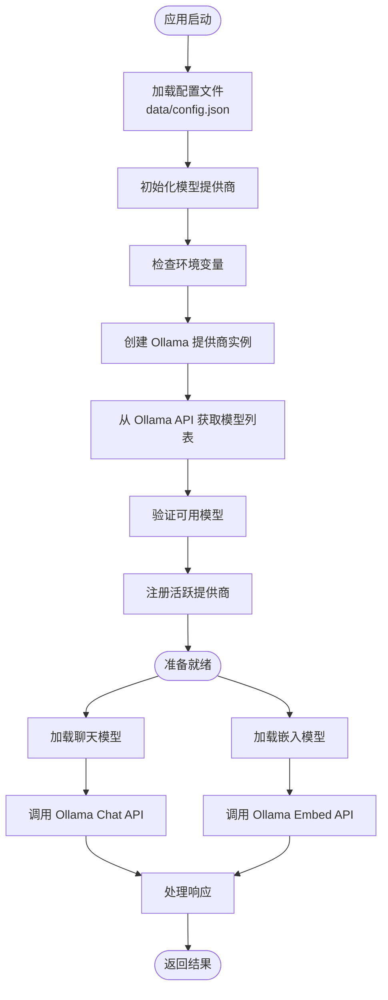
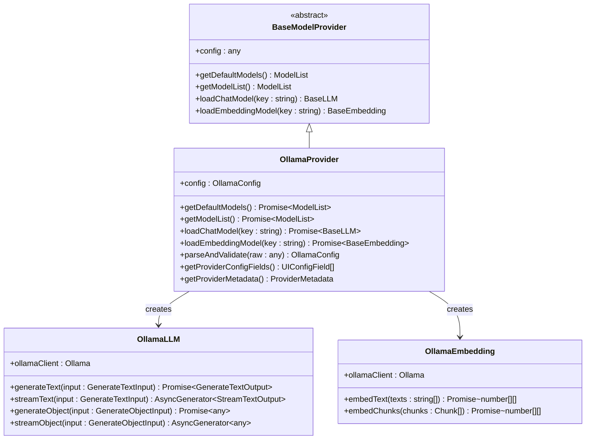
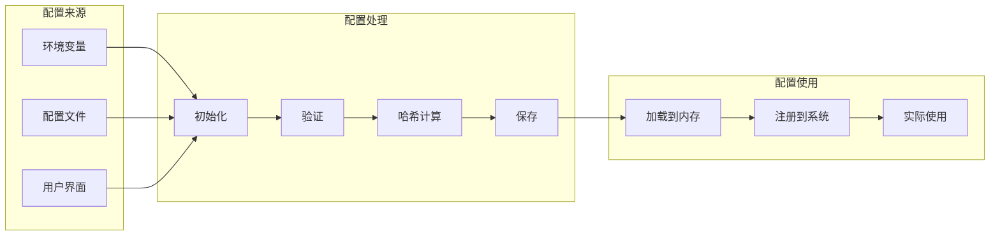
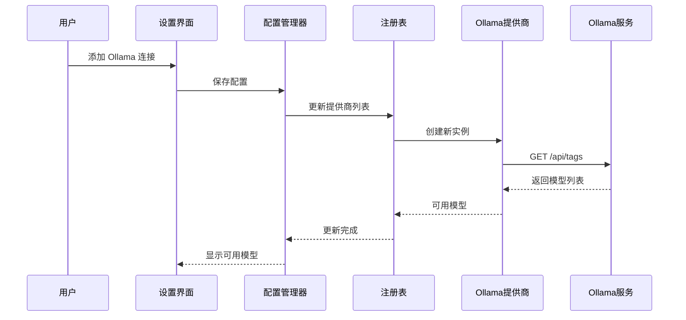
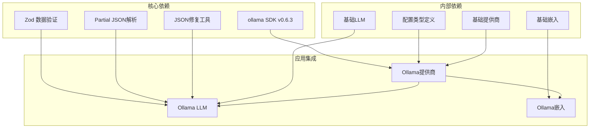
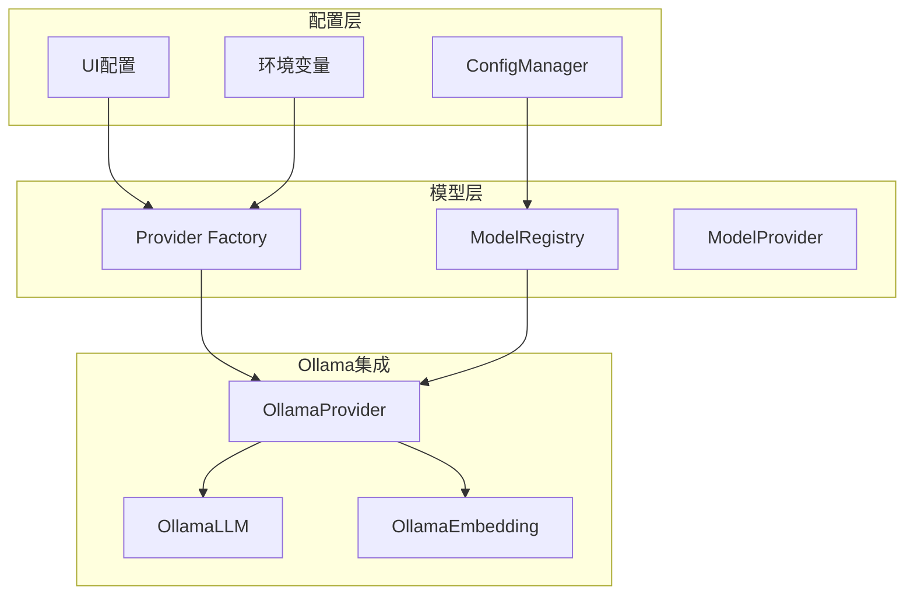
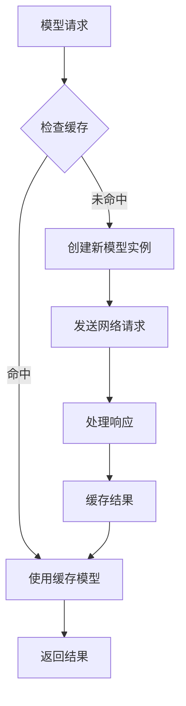

# Ollama 本地模型配置

<cite>
**本文档引用的文件**
- [src/lib/models/providers/ollama/index.ts](file://src/lib/models/providers/ollama/index.ts)
- [src/lib/models/providers/ollama/ollamaLLM.ts](file://src/lib/models/providers/ollama/ollamaLLM.ts)
- [src/lib/models/providers/ollama/ollamaEmbedding.ts](file://src/lib/models/providers/ollama/ollamaEmbedding.ts)
- [src/lib/config/types.ts](file://src/lib/config/types.ts)
- [src/lib/config/serverRegistry.ts](file://src/lib/config/serverRegistry.ts)
- [src/lib/config/index.ts](file://src/lib/config/index.ts)
- [src/lib/models/registry.ts](file://src/lib/models/registry.ts)
- [src/app/api/config/route.ts](file://src/app/api/config/route.ts)
- [.env.example](file://.env.example)
- [package.json](file://package.json)
- [README.md](file://README.md)
</cite>

## 目录
1. [简介](#简介)
2. [项目结构](#项目结构)
3. [核心组件](#核心组件)
4. [架构概览](#架构概览)
5. [详细组件分析](#详细组件分析)
6. [依赖关系分析](#依赖关系分析)
7. [性能考虑](#性能考虑)
8. [故障排除指南](#故障排除指南)
9. [结论](#结论)

## 简介

本文档为 Perplexica 应用程序中 Ollama 本地模型提供商的详细配置指南。Ollama 是一个开源的本地大语言模型运行平台，允许用户在本地计算机上运行各种开源模型，包括 Llama、Mistral、Gemma 等。

Perplexica 通过 Ollama 提供商实现了对本地模型的无缝集成，用户可以在不依赖外部 API 的情况下使用这些强大的本地模型。本文档将详细介绍 Ollama 服务的基础 URL 配置、本地部署要求、支持的模型类型、配置参数、启动停止流程以及性能优化建议。

## 项目结构

Perplexica 项目采用模块化架构设计，Ollama 支提供商位于专门的模块中：

**图表来源**
- [src/lib/models/providers/ollama/index.ts](file://src/lib/models/providers/ollama/index.ts#L1-L137)
- [src/lib/config/index.ts](file://src/lib/config/index.ts#L1-L391)

**章节来源**
- [src/lib/models/providers/ollama/index.ts](file://src/lib/models/providers/ollama/index.ts#L1-L137)
- [src/lib/config/index.ts](file://src/lib/config/index.ts#L1-L391)

## 核心组件

### Ollama 提供商配置

Ollama 提供商是 Perplexica 中处理本地模型连接的核心组件。它负责：

- **基础 URL 配置**: 管理 Ollama 服务的连接地址
- **模型发现**: 自动获取本地已安装的模型列表
- **模型加载**: 动态加载聊天和嵌入模型
- **配置验证**: 确保提供的配置有效

### 配置字段定义

Ollama 提供商支持以下关键配置字段：

| 字段名称 | 类型 | 必需 | 描述 | 默认值 |
|---------|------|------|------|--------|
| baseURL | string | 是 | Ollama 服务的基础 URL | http://localhost:11434 |
| 模型名称 | string | 是 | 要使用的具体模型名称 | 从本地模型列表选择 |

### 环境变量支持

系统支持通过环境变量进行配置：

- **OLLAMA_BASE_URL**: 主要的环境变量，用于设置 Ollama 服务地址
- **DOCKER 环境检测**: 自动检测 Docker 环境并调整默认地址

**章节来源**
- [src/lib/models/providers/ollama/index.ts](file://src/lib/models/providers/ollama/index.ts#L10-L27)
- [src/lib/config/types.ts](file://src/lib/config/types.ts#L3-L51)

## 架构概览

Perplexica 的 Ollama 集成采用了分层架构设计，确保了良好的可维护性和扩展性：

**图表来源**
- [src/lib/config/index.ts](file://src/lib/config/index.ts#L175-L238)
- [src/lib/models/registry.ts](file://src/lib/models/registry.ts#L17-L35)

### 数据流架构

**图表来源**
- [src/lib/config/index.ts](file://src/lib/config/index.ts#L175-L238)
- [src/lib/models/providers/ollama/index.ts](file://src/lib/models/providers/ollama/index.ts#L34-L78)

## 详细组件分析

### Ollama 提供商类结构

**图表来源**
- [src/lib/models/providers/ollama/index.ts](file://src/lib/models/providers/ollama/index.ts#L29-L134)
- [src/lib/models/providers/ollama/ollamaLLM.ts](file://src/lib/models/providers/ollama/ollamaLLM.ts#L31-L261)
- [src/lib/models/providers/ollama/ollamaEmbedding.ts](file://src/lib/models/providers/ollama/ollamaEmbedding.ts#L10-L41)

### 配置管理流程

**图表来源**
- [src/lib/config/index.ts](file://src/lib/config/index.ts#L175-L238)
- [src/lib/config/serverRegistry.ts](file://src/lib/config/serverRegistry.ts#L4-L12)

### 模型加载机制

**图表来源**
- [src/lib/models/providers/ollama/index.ts](file://src/lib/models/providers/ollama/index.ts#L34-L78)
- [src/lib/models/registry.ts](file://src/lib/models/registry.ts#L94-L141)

**章节来源**
- [src/lib/models/providers/ollama/index.ts](file://src/lib/models/providers/ollama/index.ts#L29-L134)
- [src/lib/models/providers/ollama/ollamaLLM.ts](file://src/lib/models/providers/ollama/ollamaLLM.ts#L31-L261)
- [src/lib/models/providers/ollama/ollamaEmbedding.ts](file://src/lib/models/providers/ollama/ollamaEmbedding.ts#L10-L41)

## 依赖关系分析

### 外部依赖

Perplexica 对 Ollama 的依赖主要体现在以下几个方面：

**图表来源**
- [package.json](file://package.json#L38-L53)
- [src/lib/models/providers/ollama/ollamaLLM.ts](file://src/lib/models/providers/ollama/ollamaLLM.ts#L1-L15)

### 内部模块依赖

**图表来源**
- [src/lib/config/index.ts](file://src/lib/config/index.ts#L1-L391)
- [src/lib/models/registry.ts](file://src/lib/models/registry.ts#L1-L222)

**章节来源**
- [package.json](file://package.json#L38-L53)
- [src/lib/config/index.ts](file://src/lib/config/index.ts#L1-L391)
- [src/lib/models/registry.ts](file://src/lib/models/registry.ts#L1-L222)

## 性能考虑

### 内存管理优化

Ollama 集成在设计时充分考虑了内存使用效率：

- **延迟初始化**: 提供商实例仅在需要时创建
- **模型缓存**: 已加载的模型实例会被缓存以避免重复创建
- **连接池管理**: Ollama 客户端连接会自动管理生命周期

### 网络请求优化

### 资源管理建议

1. **合理配置上下文大小**: 根据模型能力调整 `num_ctx` 参数
2. **温度参数调优**: 一般设置为 0.7，根据需求调整创造性
3. **并发控制**: 避免同时发起过多并发请求
4. **内存监控**: 定期检查系统内存使用情况

## 故障排除指南

### 常见连接问题

#### 1. 基础 URL 配置错误

**症状**: 应用无法连接到 Ollama 服务

**解决方案**:
- 检查 `baseURL` 配置是否正确
- 根据操作系统选择正确的地址格式
- 确认 Ollama 服务正在运行

#### 2. Docker 环境连接问题

**症状**: 在 Docker 环境中无法连接到本地 Ollama

**解决方案**:
- 使用 `host.docker.internal` 作为主机名
- 确保 Docker 网络配置正确
- 检查端口映射设置

#### 3. Linux 网络暴露问题

**症状**: 本地模型无法被其他容器或主机访问

**解决方案**:
- 在 systemd 服务中设置 `OLLAMA_HOST=0.0.0.0:11434`
- 重启 Ollama 服务使配置生效
- 检查防火墙设置

### 模型加载失败

#### 1. 模型不存在

**症状**: 选择的模型无法加载

**解决方案**:
- 使用 `ollama list` 命令确认模型存在
- 检查模型名称拼写
- 重新拉取模型

#### 2. 权限问题

**症状**: 访问受限或权限不足

**解决方案**:
- 检查 Ollama 服务权限设置
- 确认用户有足够权限访问模型文件
- 重新配置 Ollama 服务

### 性能问题诊断

#### 1. 响应缓慢

**症状**: 模型响应时间过长

**诊断步骤**:
1. 检查系统资源使用情况
2. 确认模型大小适合当前硬件
3. 调整模型参数设置

#### 2. 内存泄漏

**症状**: 应用内存持续增长

**解决方案**:
- 实施适当的模型实例管理
- 定期清理不再使用的模型实例
- 监控内存使用趋势

**章节来源**
- [README.md](file://README.md#L176-L193)
- [src/lib/models/providers/ollama/index.ts](file://src/lib/models/providers/ollama/index.ts#L57-L64)

## 结论

Perplexica 的 Ollama 本地模型集成为用户提供了强大而灵活的本地 AI 能力。通过精心设计的架构和完善的配置管理，用户可以轻松地在本地环境中运行各种开源模型。

### 关键优势

1. **零外部依赖**: 完全本地运行，保护隐私和数据安全
2. **灵活配置**: 支持多种配置方式，适应不同部署场景
3. **自动发现**: 自动识别和加载本地已安装的模型
4. **性能优化**: 采用多种优化策略确保最佳性能

### 最佳实践建议

1. **定期维护**: 定期更新本地模型和 Ollama 版本
2. **监控告警**: 建立系统监控和性能告警机制
3. **备份策略**: 定期备份配置和重要数据
4. **安全配置**: 确保 Ollama 服务的安全配置

通过遵循本文档的指导，用户可以成功部署和优化 Ollama 本地模型提供商，充分发挥 Perplexica 的本地 AI 能力。