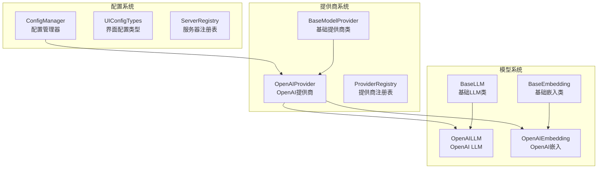
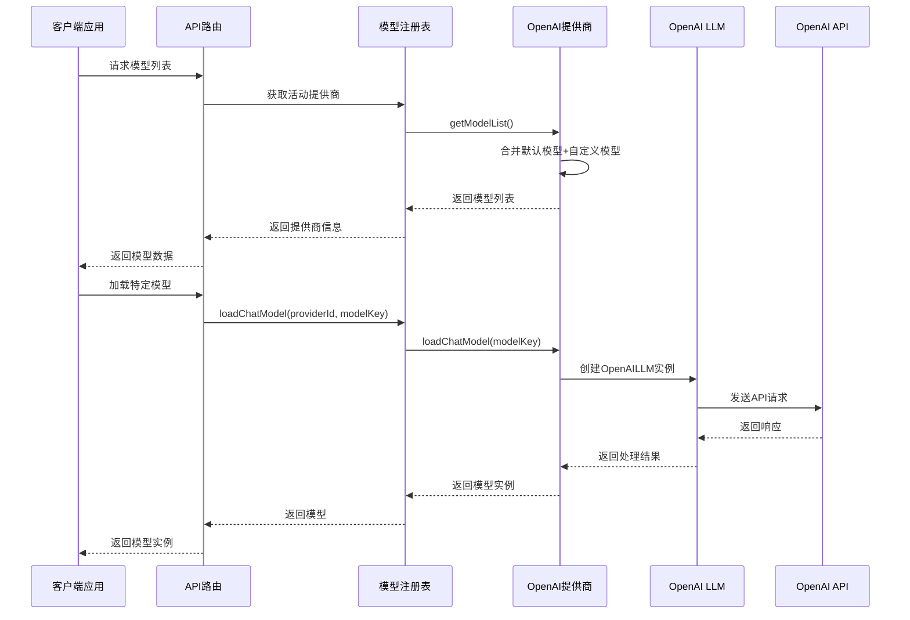
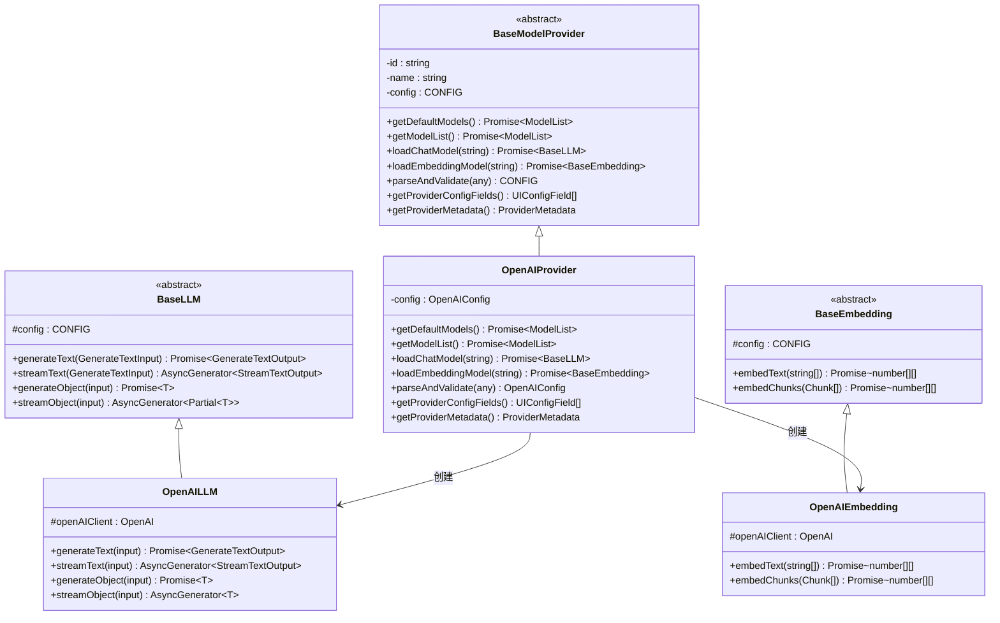
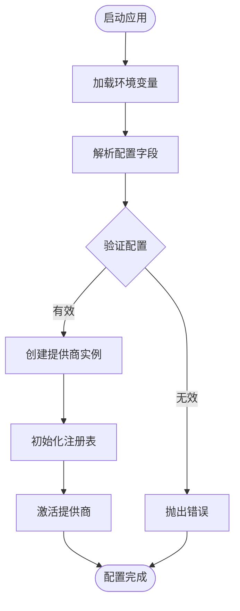
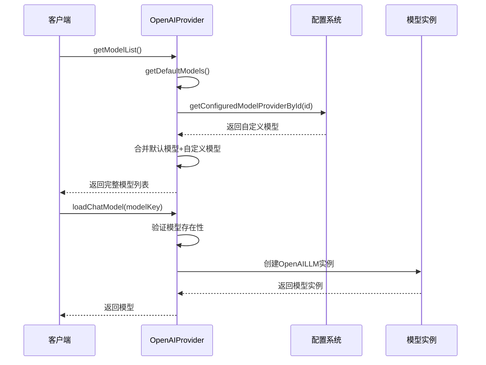
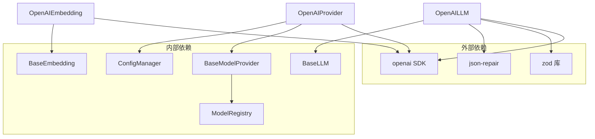
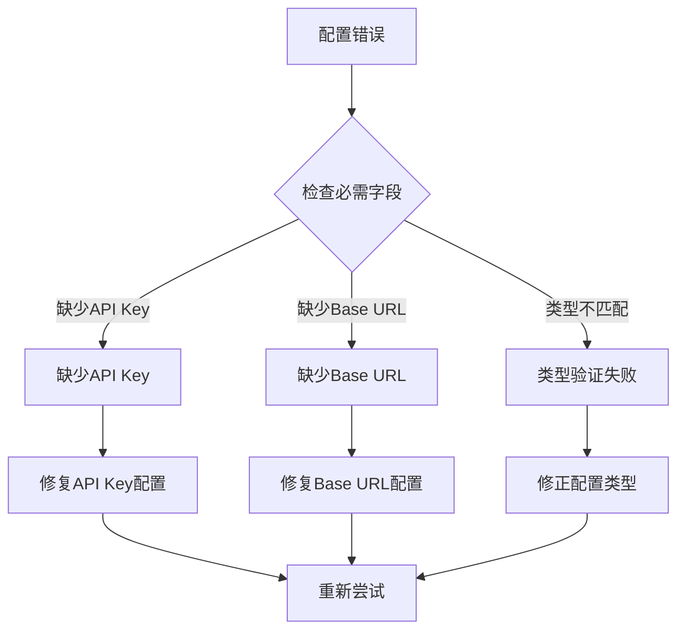

# OpenAI 提供商配置

<cite>
**本文档引用的文件**
- [src/lib/models/providers/openai/index.ts](file://src/lib/models/providers/openai/index.ts)
- [src/lib/models/providers/openai/openaiLLM.ts](file://src/lib/models/providers/openai/openaiLLM.ts)
- [src/lib/models/providers/openai/openaiEmbedding.ts](file://src/lib/models/providers/openai/openaiEmbedding.ts)
- [src/lib/config/types.ts](file://src/lib/config/types.ts)
- [src/lib/config/serverRegistry.ts](file://src/lib/config/serverRegistry.ts)
- [src/lib/config/index.ts](file://src/lib/config/index.ts)
- [src/lib/models/base/provider.ts](file://src/lib/models/base/provider.ts)
- [src/lib/models/base/llm.ts](file://src/lib/models/base/llm.ts)
- [src/lib/models/base/embedding.ts](file://src/lib/models/base/embedding.ts)
- [src/lib/models/registry.ts](file://src/lib/models/registry.ts)
- [src/lib/models/providers/index.ts](file://src/lib/models/providers/index.ts)
- [.env.example](file://.env.example)
- [src/app/api/providers/route.ts](file://src/app/api/providers/route.ts)
- [src/app/api/providers/[id]/route.ts](file://src/app/api/providers/[id]/route.ts)
- [src/app/api/providers/[id]/models/route.ts](file://src/app/api/providers/[id]/models/route.ts)
</cite>

## 目录
1. [简介](#简介)
2. [项目结构](#项目结构)
3. [核心组件](#核心组件)
4. [架构概览](#架构概览)
5. [详细组件分析](#详细组件分析)
6. [依赖关系分析](#依赖关系分析)
7. [性能考虑](#性能考虑)
8. [故障排除指南](#故障排除指南)
9. [结论](#结论)

## 简介

本文档详细介绍了 Perplexica 项目中 OpenAI 模型提供商的配置方法。OpenAI 提供商是系统支持的多种 AI 模型提供商之一，通过统一的配置接口实现 API 密钥管理和模型选择功能。

该配置系统支持以下核心功能：
- OpenAI API 密钥的安全存储和管理
- 支持的模型类型配置（GPT-4、GPT-3.5-turbo 等）
- 自定义基础 URL 和代理设置
- 动态模型列表获取和加载
- 环境变量配置和验证

## 项目结构

OpenAI 提供商配置涉及以下关键文件和模块：

**图表来源**
- [src/lib/config/index.ts](file://src/lib/config/index.ts#L1-L391)
- [src/lib/models/providers/openai/index.ts](file://src/lib/models/providers/openai/index.ts#L1-L227)
- [src/lib/models/base/provider.ts](file://src/lib/models/base/provider.ts#L1-L46)

**章节来源**
- [src/lib/config/index.ts](file://src/lib/config/index.ts#L1-L391)
- [src/lib/models/providers/openai/index.ts](file://src/lib/models/providers/openai/index.ts#L1-L227)

## 核心组件

### OpenAI 提供商配置字段

OpenAI 提供商支持两个核心配置字段：

| 字段名称 | 类型 | 必需 | 环境变量 | 默认值 | 描述 |
|---------|------|------|----------|--------|------|
| API Key | password | 是 | OPENAI_API_KEY | 无 | OpenAI API 访问密钥 |
| Base URL | string | 是 | OPENAI_BASE_URL | https://api.openai.com/v1 | OpenAI API 基础URL |

### 支持的模型类型

系统预定义了以下 OpenAI 模型：

**聊天模型 (Chat Models):**
- GPT-3.5 Turbo (gpt-3.5-turbo)
- GPT-4 (gpt-4)
- GPT-4 turbo (gpt-4-turbo)
- GPT-4 omni (gpt-4o)
- GPT-4 omni mini (gpt-4o-mini)
- GPT 4.1 系列 (gpt-4.1-nano, gpt-4.1-mini, gpt-4.1)
- GPT 5 系列 (gpt-5-nano, gpt-5, gpt-5-mini, gpt-5-pro, gpt-5.1, gpt-5.2, gpt-5.2-pro)
- o1 系列 (o1, o3, o3-mini, o4-mini)

**嵌入模型 (Embedding Models):**
- Text Embedding 3 Small (text-embedding-3-small)
- Text Embedding 3 Large (text-embedding-3-large)

**章节来源**
- [src/lib/models/providers/openai/index.ts](file://src/lib/models/providers/openai/index.ts#L15-L107)

## 架构概览

OpenAI 提供商采用分层架构设计，确保配置管理、模型加载和API调用的清晰分离：

**图表来源**
- [src/lib/models/registry.ts](file://src/lib/models/registry.ts#L37-L92)
- [src/lib/models/providers/openai/index.ts](file://src/lib/models/providers/openai/index.ts#L152-L198)

## 详细组件分析

### OpenAI 提供商类分析

OpenAI 提供商实现了完整的提供商接口，支持动态模型管理和配置验证：

**图表来源**
- [src/lib/models/base/provider.ts](file://src/lib/models/base/provider.ts#L6-L26)
- [src/lib/models/providers/openai/index.ts](file://src/lib/models/providers/openai/index.ts#L133-L224)
- [src/lib/models/base/llm.ts](file://src/lib/models/base/llm.ts#L10-L20)
- [src/lib/models/providers/openai/openaiLLM.ts](file://src/lib/models/providers/openai/openaiLLM.ts#L30-L40)
- [src/lib/models/base/embedding.ts](file://src/lib/models/base/embedding.ts#L3-L7)
- [src/lib/models/providers/openai/openaiEmbedding.ts](file://src/lib/models/providers/openai/openaiEmbedding.ts#L11-L21)

### 配置管理流程

配置管理系统通过环境变量驱动，确保安全性和灵活性：

**图表来源**
- [src/lib/config/index.ts](file://src/lib/config/index.ts#L175-L238)
- [src/lib/models/providers/openai/index.ts](file://src/lib/models/providers/openai/index.ts#L200-L212)

**章节来源**
- [src/lib/models/providers/openai/index.ts](file://src/lib/models/providers/openai/index.ts#L133-L224)
- [src/lib/models/base/provider.ts](file://src/lib/models/base/provider.ts#L6-L26)

### 模型加载机制

OpenAI 提供商支持动态模型加载，包括默认模型和用户自定义模型的合并：

**图表来源**
- [src/lib/models/providers/openai/index.ts](file://src/lib/models/providers/openai/index.ts#L152-L198)
- [src/lib/config/serverRegistry.ts](file://src/lib/config/serverRegistry.ts#L8-L12)

**章节来源**
- [src/lib/models/providers/openai/index.ts](file://src/lib/models/providers/openai/index.ts#L152-L198)
- [src/lib/config/serverRegistry.ts](file://src/lib/config/serverRegistry.ts#L1-L16)

## 依赖关系分析

OpenAI 提供商的依赖关系体现了清晰的分层设计：

**图表来源**
- [src/lib/models/providers/openai/openaiLLM.ts](file://src/lib/models/providers/openai/openaiLLM.ts#L1-L22)
- [src/lib/models/providers/openai/index.ts](file://src/lib/models/providers/openai/index.ts#L1-L8)

**章节来源**
- [src/lib/models/providers/openai/openaiLLM.ts](file://src/lib/models/providers/openai/openaiLLM.ts#L1-L22)
- [src/lib/models/providers/openai/index.ts](file://src/lib/models/providers/openai/index.ts#L1-L8)

## 性能考虑

OpenAI 提供商在设计时考虑了以下性能因素：

### 连接池管理
- OpenAI SDK 内部管理连接池
- 单个提供商实例复用相同的客户端配置

### 流式处理优化
- 支持流式文本生成，减少内存占用
- 分块处理工具调用参数，提高解析效率

### 缓存策略
- 模型列表缓存在提供商实例中
- 避免重复的配置验证和API调用

## 故障排除指南

### 常见配置错误

| 错误类型 | 症状 | 解决方案 |
|---------|------|---------|
| API密钥无效 | 抛出"Invalid config provided"错误 | 检查 OPENAI_API_KEY 环境变量是否正确设置 |
| 基础URL错误 | 模型列表为空或API调用失败 | 验证 OPENAI_BASE_URL 是否指向有效的OpenAI端点 |
| 模型不存在 | "Invalid Model Selected"错误 | 确认模型键名在支持列表中 |

### API 调用错误

**认证失败 (401/403):**
- 检查 API 密钥的有效性
- 验证账户状态和配额限制
- 确认 API 密钥具有相应权限

**请求超时 (408):**
- 检查网络连接稳定性
- 考虑增加超时时间设置
- 验证代理配置（如果使用）

**速率限制 (429):**
- 实现重试逻辑和退避策略
- 检查当前API使用量
- 考虑升级到付费计划

### 配置验证错误

当配置验证失败时，系统会抛出具体的错误信息：

**图表来源**
- [src/lib/models/providers/openai/index.ts](file://src/lib/models/providers/openai/index.ts#L200-L212)

**章节来源**
- [src/lib/models/providers/openai/index.ts](file://src/lib/models/providers/openai/index.ts#L200-L212)

## 结论

OpenAI 提供商配置系统提供了完整、安全且灵活的模型管理解决方案。通过环境变量驱动的配置方式，确保了API密钥的安全存储；通过统一的提供商接口，实现了与其他模型提供商的一致性体验。

关键优势包括：
- **安全性**: API密钥通过环境变量管理，避免硬编码
- **可扩展性**: 支持动态模型添加和删除
- **兼容性**: 与OpenAI标准API完全兼容
- **可观测性**: 完整的错误处理和日志记录

该配置系统为开发者提供了清晰的扩展点，便于集成新的OpenAI模型或自定义API端点。