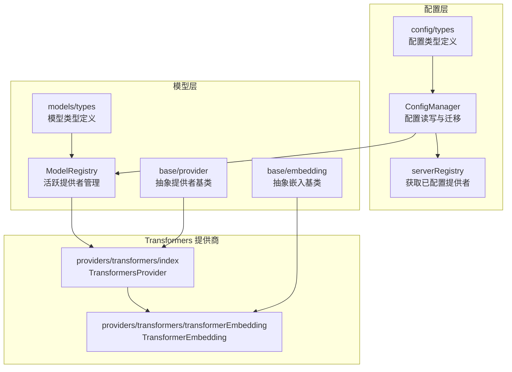
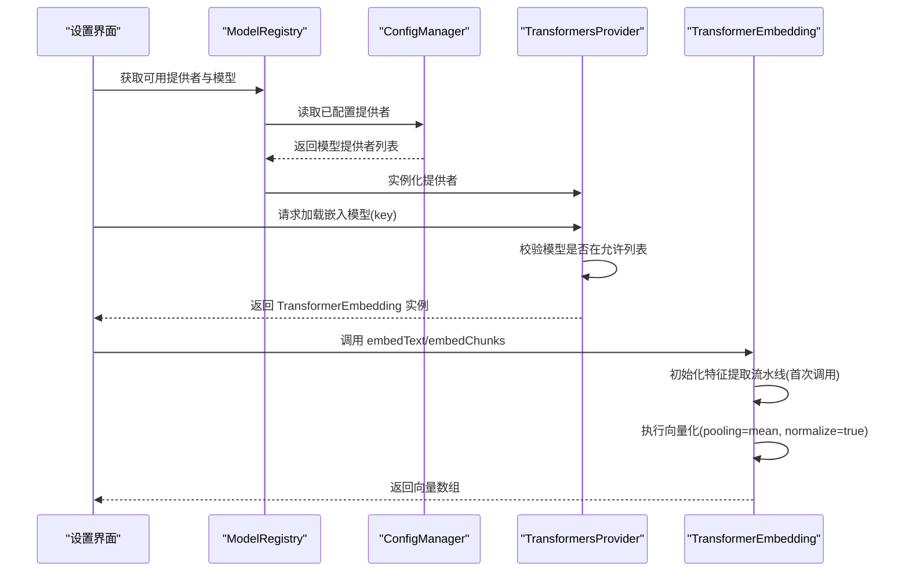
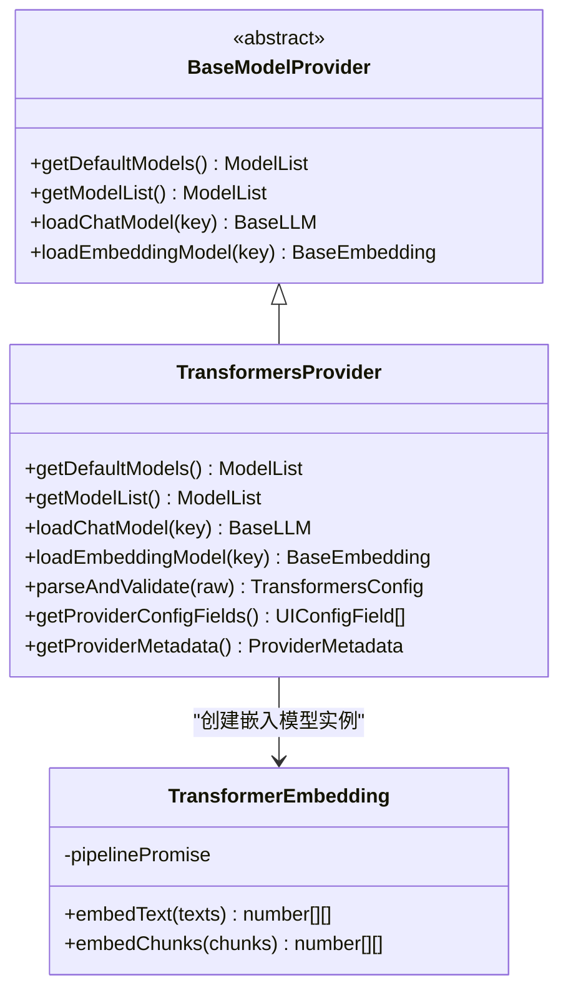
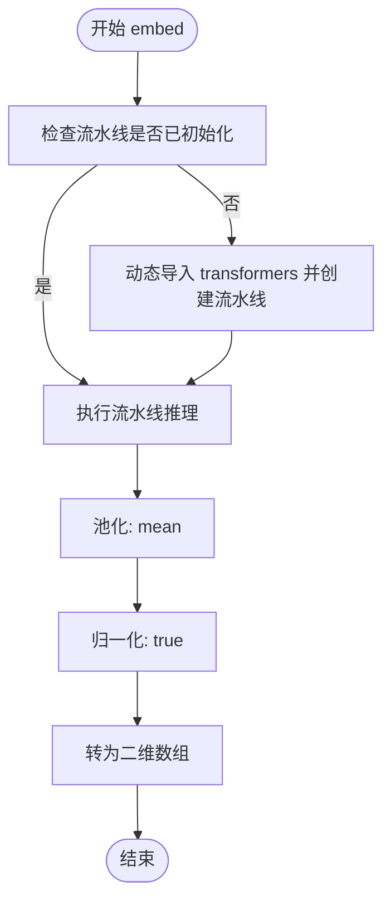
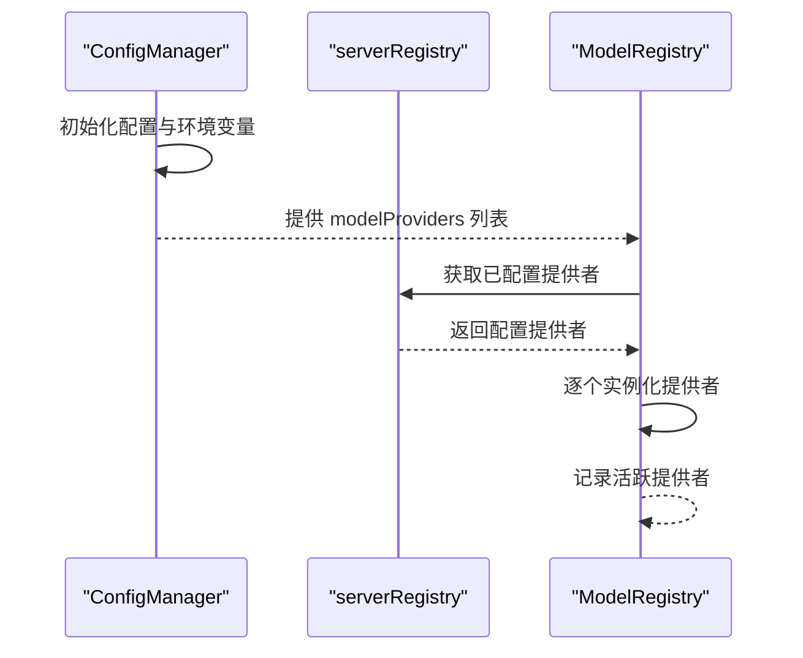
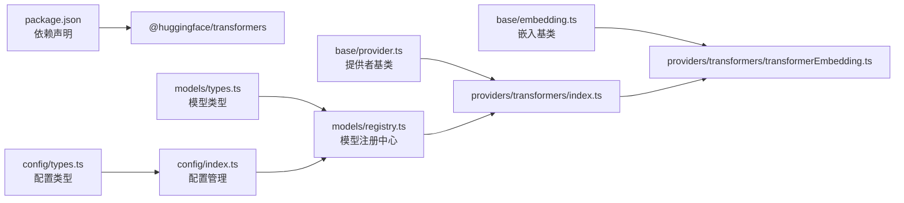

# Transformers 本地模型配置

<cite>
**本文档引用的文件**
- [src/lib/models/providers/transformers/index.ts](file://src/lib/models/providers/transformers/index.ts)
- [src/lib/models/providers/transformers/transformerEmbedding.ts](file://src/lib/models/providers/transformers/transformerEmbedding.ts)
- [src/lib/models/base/provider.ts](file://src/lib/models/base/provider.ts)
- [src/lib/models/base/embedding.ts](file://src/lib/models/base/embedding.ts)
- [src/lib/config/types.ts](file://src/lib/config/types.ts)
- [src/lib/config/index.ts](file://src/lib/config/index.ts)
- [src/lib/config/serverRegistry.ts](file://src/lib/config/serverRegistry.ts)
- [src/lib/models/types.ts](file://src/lib/models/types.ts)
- [src/lib/models/registry.ts](file://src/lib/models/registry.ts)
- [src/lib/models/providers/index.ts](file://src/lib/models/providers/index.ts)
- [package.json](file://package.json)
- [.env.example](file://.env.example)
- [src/components/Settings/Sections/Models/ModelSelect.tsx](file://src/components/Settings/Sections/Models/ModelSelect.tsx)
</cite>

## 目录
1. [简介](#简介)
2. [项目结构](#项目结构)
3. [核心组件](#核心组件)
4. [架构总览](#架构总览)
5. [详细组件分析](#详细组件分析)
6. [依赖关系分析](#依赖关系分析)
7. [性能考虑](#性能考虑)
8. [故障排除指南](#故障排除指南)
9. [结论](#结论)
10. [附录](#附录)

## 简介
本文件面向需要在本地环境中使用 Transformers 库进行嵌入向量计算的用户与开发者，系统性说明 Perplexica 中 Transformers 本地模型提供商的配置方式、加载机制、支持的模型类型、缓存与下载行为、以及性能优化与常见问题排查方法。当前实现仅支持嵌入模型（Embedding），不支持聊天模型（Chat）。

## 项目结构
Transformers 提供商位于模型抽象层之下，通过统一的 Provider 接口对外暴露能力，并由配置系统与模型注册中心协调初始化与使用。

**图表来源**
- [src/lib/config/index.ts](file://src/lib/config/index.ts#L1-L391)
- [src/lib/config/serverRegistry.ts](file://src/lib/config/serverRegistry.ts#L1-L16)
- [src/lib/models/registry.ts](file://src/lib/models/registry.ts#L1-L221)
- [src/lib/models/base/provider.ts](file://src/lib/models/base/provider.ts#L1-L46)
- [src/lib/models/base/embedding.ts](file://src/lib/models/base/embedding.ts#L1-L10)
- [src/lib/models/providers/transformers/index.ts](file://src/lib/models/providers/transformers/index.ts#L1-L89)
- [src/lib/models/providers/transformers/transformerEmbedding.ts](file://src/lib/models/providers/transformers/transformerEmbedding.ts#L1-L42)
- [src/lib/config/types.ts](file://src/lib/config/types.ts#L1-L110)
- [src/lib/models/types.ts](file://src/lib/models/types.ts#L1-L104)

**章节来源**
- [src/lib/config/index.ts](file://src/lib/config/index.ts#L1-L391)
- [src/lib/models/registry.ts](file://src/lib/models/registry.ts#L1-L221)
- [src/lib/models/providers/transformers/index.ts](file://src/lib/models/providers/transformers/index.ts#L1-L89)

## 核心组件
- TransformersProvider：实现嵌入模型加载，不支持聊天模型；内置默认嵌入模型列表；从配置中合并用户自定义嵌入模型。
- TransformerEmbedding：基于 @huggingface/transformers 的特征提取流水线，延迟初始化并复用流水线实例，支持文本与分块向量化输出。
- 配置系统：负责持久化配置、环境变量注入、提供者初始化与迁移。
- 模型注册中心：维护活跃提供者集合，按需获取模型列表与实例。

**章节来源**
- [src/lib/models/providers/transformers/index.ts](file://src/lib/models/providers/transformers/index.ts#L28-L86)
- [src/lib/models/providers/transformers/transformerEmbedding.ts](file://src/lib/models/providers/transformers/transformerEmbedding.ts#L9-L39)
- [src/lib/config/index.ts](file://src/lib/config/index.ts#L175-L238)
- [src/lib/models/registry.ts](file://src/lib/models/registry.ts#L17-L35)

## 架构总览
下图展示了从配置到模型实例的调用链路，以及 Transformers 嵌入模型的加载与向量化流程。

**图表来源**
- [src/lib/models/registry.ts](file://src/lib/models/registry.ts#L17-L35)
- [src/lib/config/index.ts](file://src/lib/config/index.ts#L240-L272)
- [src/lib/models/providers/transformers/index.ts](file://src/lib/models/providers/transformers/index.ts#L40-L70)
- [src/lib/models/providers/transformers/transformerEmbedding.ts](file://src/lib/models/providers/transformers/transformerEmbedding.ts#L24-L38)

## 详细组件分析

### TransformersProvider 分析
- 默认嵌入模型：包含多个预设的 Hugging Face 模型键名，便于开箱即用。
- 模型列表合并：将默认嵌入模型与用户配置中的嵌入模型合并，形成最终可选列表。
- 加载策略：仅支持嵌入模型加载；聊天模型加载抛出错误提示。
- 配置解析：当前返回空对象，表示无需额外配置字段。

**图表来源**
- [src/lib/models/base/provider.ts](file://src/lib/models/base/provider.ts#L6-L26)
- [src/lib/models/providers/transformers/index.ts](file://src/lib/models/providers/transformers/index.ts#L28-L86)
- [src/lib/models/providers/transformers/transformerEmbedding.ts](file://src/lib/models/providers/transformers/transformerEmbedding.ts#L9-L39)

**章节来源**
- [src/lib/models/providers/transformers/index.ts](file://src/lib/models/providers/transformers/index.ts#L11-L70)

### TransformerEmbedding 分析
- 延迟初始化：首次调用时动态导入 @huggingface/transformers 并创建特征提取流水线，后续复用以避免重复初始化成本。
- 向量化参数：使用均值池化与向量归一化，确保输出向量具有单位范数，适合相似度检索场景。
- 输入适配：同时支持字符串数组与分块内容数组两种输入形式。

**图表来源**
- [src/lib/models/providers/transformers/transformerEmbedding.ts](file://src/lib/models/providers/transformers/transformerEmbedding.ts#L24-L38)

**章节来源**
- [src/lib/models/providers/transformers/transformerEmbedding.ts](file://src/lib/models/providers/transformers/transformerEmbedding.ts#L16-L38)

### 配置系统与模型注册中心
- 配置文件：默认保存于数据目录下的 config.json，支持版本化与迁移占位。
- 环境变量注入：根据提供者 UI 字段定义，优先从环境变量读取，其次使用默认值。
- 模型注册：遍历已配置提供者，尝试实例化并加入活跃提供者集合；失败时记录错误但不影响其他提供者。

**图表来源**
- [src/lib/config/index.ts](file://src/lib/config/index.ts#L175-L238)
- [src/lib/config/serverRegistry.ts](file://src/lib/config/serverRegistry.ts#L4-L12)
- [src/lib/models/registry.ts](file://src/lib/models/registry.ts#L17-L35)

**章节来源**
- [src/lib/config/index.ts](file://src/lib/config/index.ts#L135-L238)
- [src/lib/models/registry.ts](file://src/lib/models/registry.ts#L17-L35)

## 依赖关系分析
- 外部依赖：@huggingface/transformers 用于本地模型加载与推理。
- 内部依赖：配置类型、模型类型、提供者基类、嵌入基类共同构成抽象层，TransformersProvider 与 TransformerEmbedding 为其具体实现。

**图表来源**
- [package.json](file://package.json#L17)
- [src/lib/config/types.ts](file://src/lib/config/types.ts#L53-L76)
- [src/lib/models/types.ts](file://src/lib/models/types.ts#L4-L24)
- [src/lib/models/base/provider.ts](file://src/lib/models/base/provider.ts#L6-L26)
- [src/lib/models/base/embedding.ts](file://src/lib/models/base/embedding.ts#L3-L7)
- [src/lib/config/index.ts](file://src/lib/config/index.ts#L1-L391)
- [src/lib/models/registry.ts](file://src/lib/models/registry.ts#L1-L221)
- [src/lib/models/providers/transformers/index.ts](file://src/lib/models/providers/transformers/index.ts#L1-L89)
- [src/lib/models/providers/transformers/transformerEmbedding.ts](file://src/lib/models/providers/transformers/transformerEmbedding.ts#L1-L42)

**章节来源**
- [package.json](file://package.json#L13-L53)
- [src/lib/models/providers/index.ts](file://src/lib/models/providers/index.ts#L12-L21)

## 性能考虑
- 流水线复用：TransformerEmbedding 采用单例流水线模式，避免重复初始化带来的冷启动开销。
- dtype 选择：初始化时指定 fp32 类型，兼顾精度与兼容性；如对内存敏感且可接受精度损失，可在下游评估阶段调整 dtype。
- 池化与归一化：mean 池化与 L2 归一化有助于提升检索稳定性与一致性。
- 批处理：对大量文本进行向量化时，建议分批处理以控制内存峰值；当前实现对输入数组进行一次性推理，必要时可在外层进行切片调用。
- 缓存与下载：@huggingface/transformers 会在首次使用时下载模型权重至本地缓存目录；建议在部署前预先触发一次加载以完成缓存预热。

[本节为通用性能建议，不直接分析特定文件，故无“章节来源”]

## 故障排除指南
- 无法加载聊天模型
  - 现象：调用聊天模型加载会抛出错误。
  - 原因：TransformersProvider 当前不支持聊天模型。
  - 解决：仅使用嵌入模型加载路径。
  
  **章节来源**
  - [src/lib/models/providers/transformers/index.ts](file://src/lib/models/providers/transformers/index.ts#L53-L55)

- 选择的嵌入模型不在允许列表
  - 现象：加载嵌入模型时报错，提示无效模型。
  - 原因：所选模型未包含在默认或配置的嵌入模型列表中。
  - 解决：确认模型键名存在于默认列表或已通过配置添加到 embeddingModels。
  
  **章节来源**
  - [src/lib/models/providers/transformers/index.ts](file://src/lib/models/providers/transformers/index.ts#L57-L70)

- 首次加载缓慢
  - 现象：首次调用 embedText/embedChunks 时耗时较长。
  - 原因：需要动态导入库并下载/解压模型权重。
  - 解决：在应用启动阶段预热加载，或在 CI/CD 中提前触发一次推理以完成缓存预热。
  
  **章节来源**
  - [src/lib/models/providers/transformers/transformerEmbedding.ts](file://src/lib/models/providers/transformers/transformerEmbedding.ts#L24-L33)

- 配置未生效
  - 现象：更新配置后模型未变化。
  - 原因：配置变更后需重启服务或重新初始化注册中心。
  - 解决：确认配置文件已保存，且 ModelRegistry 已重新构建活跃提供者列表。
  
  **章节来源**
  - [src/lib/config/index.ts](file://src/lib/config/index.ts#L274-L317)
  - [src/lib/models/registry.ts](file://src/lib/models/registry.ts#L17-L35)

## 结论
Perplexica 对 Transformers 的本地嵌入模型支持以最小实现覆盖了典型检索场景：提供默认模型清单、延迟初始化流水线、统一的配置与注册机制。当前不支持聊天模型，若需扩展聊天能力，可在现有 Provider 抽象上增加相应实现与配置项。

[本节为总结性内容，不直接分析特定文件，故无“章节来源”]

## 附录

### 支持的 Hugging Face 模型类型与配置参数
- 模型类型：嵌入（Embedding）
- 默认模型键名（示例）：
  - Xenova/all-MiniLM-L6-v2
  - mixedbread-ai/mxbai-embed-large-v1
  - Xenova/nomic-embed-text-v1
- 关键配置参数：
  - 模型键名：用于定位本地缓存或在线下载的模型标识。
  - dtype：推理数据类型（当前实现固定为 fp32）。
  - 池化与归一化：mean 池化与 L2 归一化用于稳定向量质量。

**章节来源**
- [src/lib/models/providers/transformers/index.ts](file://src/lib/models/providers/transformers/index.ts#L11-L24)
- [src/lib/models/providers/transformers/transformerEmbedding.ts](file://src/lib/models/providers/transformers/transformerEmbedding.ts#L28-L37)

### 本地模型缓存与下载机制
- 下载触发：首次使用某模型键名时，@huggingface/transformers 会自动下载对应权重。
- 缓存位置：默认位于用户主目录下的 Hugging Face 缓存目录（具体路径取决于平台与环境变量）。
- 预热建议：在部署或容器启动阶段执行一次推理，确保权重已缓存，减少首次请求延迟。

**章节来源**
- [src/lib/models/providers/transformers/transformerEmbedding.ts](file://src/lib/models/providers/transformers/transformerEmbedding.ts#L27-L31)

### 配置示例与最佳实践
- 配置入口：通过设置界面或直接编辑数据目录下的配置文件，添加/修改模型提供者与模型列表。
- 环境变量：可通过环境变量注入提供者配置字段（如某些提供者需要密钥或基础地址），当前 Transformers 提供商无需额外字段。
- 最佳实践：
  - 将常用模型键名加入 embeddingModels，避免每次运行都依赖默认列表。
  - 在生产环境启用预热加载，确保关键模型已在内存中。
  - 控制批大小与并发，避免内存峰值过高。

**章节来源**
- [src/lib/config/index.ts](file://src/lib/config/index.ts#L175-L238)
- [src/lib/config/serverRegistry.ts](file://src/lib/config/serverRegistry.ts#L4-L12)
- [src/components/Settings/Sections/Models/ModelSelect.tsx](file://src/components/Settings/Sections/Models/ModelSelect.tsx#L22-L56)

### 版本管理与迁移
- 配置版本：当前版本号在初始化时设定，支持未来迁移逻辑扩展。
- 迁移策略：预留迁移函数，可在新增字段或结构变更时逐步演进。

**章节来源**
- [src/lib/config/index.ts](file://src/lib/config/index.ts#L12-L173)