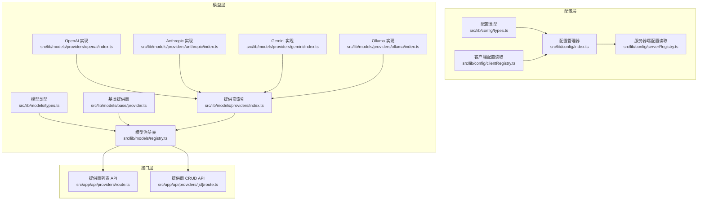
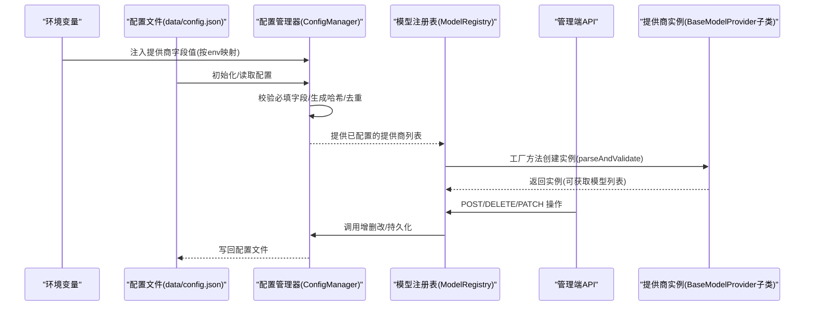
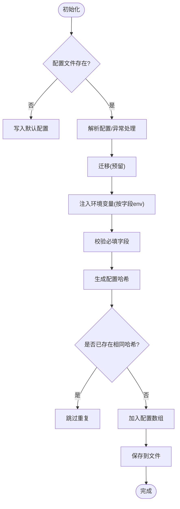
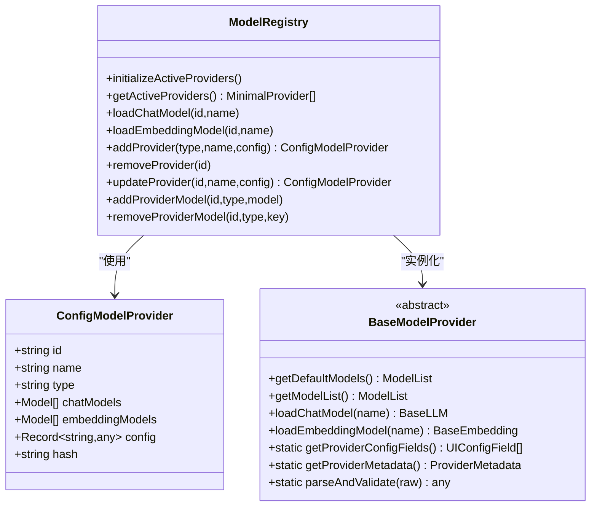
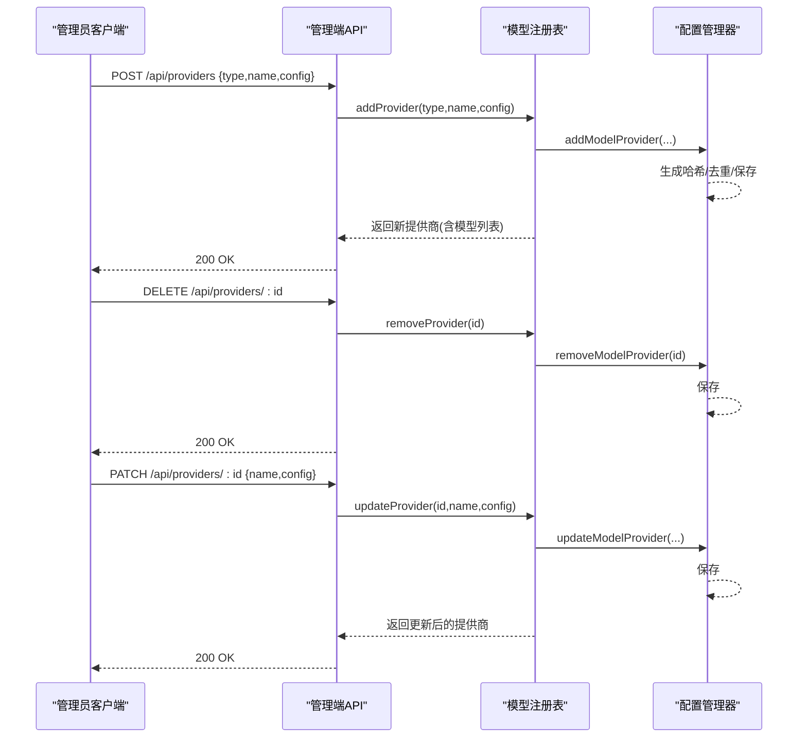
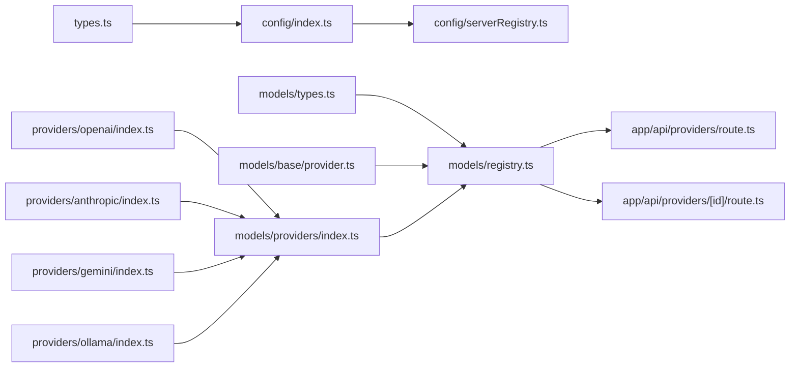

# 模型提供商配置

<cite>
**本文引用的文件**
- [src/lib/config/types.ts](file://src/lib/config/types.ts)
- [src/lib/config/index.ts](file://src/lib/config/index.ts)
- [src/lib/config/clientRegistry.ts](file://src/lib/config/clientRegistry.ts)
- [src/lib/config/serverRegistry.ts](file://src/lib/config/serverRegistry.ts)
- [src/lib/models/types.ts](file://src/lib/models/types.ts)
- [src/lib/models/registry.ts](file://src/lib/models/registry.ts)
- [src/lib/models/providers/index.ts](file://src/lib/models/providers/index.ts)
- [src/lib/models/base/provider.ts](file://src/lib/models/base/provider.ts)
- [src/lib/models/providers/openai/index.ts](file://src/lib/models/providers/openai/index.ts)
- [src/lib/models/providers/anthropic/index.ts](file://src/lib/models/providers/anthropic/index.ts)
- [src/lib/models/providers/gemini/index.ts](file://src/lib/models/providers/gemini/index.ts)
- [src/lib/models/providers/ollama/index.ts](file://src/lib/models/providers/ollama/index.ts)
- [src/app/api/providers/route.ts](file://src/app/api/providers/route.ts)
- [src/app/api/providers/[id]/route.ts](file://src/app/api/providers/[id]/route.ts)
</cite>

## 目录
1. [简介](#简介)
2. [项目结构](#项目结构)
3. [核心组件](#核心组件)
4. [架构总览](#架构总览)
5. [详细组件分析](#详细组件分析)
6. [依赖分析](#依赖分析)
7. [性能考虑](#性能考虑)
8. [故障排查指南](#故障排查指南)
9. [结论](#结论)
10. [附录：各提供商配置示例与最佳实践](#附录各提供商配置示例与最佳实践)

## 简介
本文件面向 Perplexica 的“模型提供商配置系统”，系统性阐述如何配置与管理各类 AI 模型提供商（如 OpenAI、Anthropic、Google Gemini、Groq、Ollama、LM Studio 等）。内容涵盖：
- 配置数据结构与字段定义（含必填/可选、环境变量映射）
- 动态加载机制与配置验证流程
- 客户端与服务器端配置的作用域与权限控制
- 哈希校验与重复配置检测
- 添加、删除、更新提供商的完整流程与 API 接口
- 各提供商的配置示例与最佳实践

## 项目结构
围绕“配置系统”的关键目录与文件如下：
- 配置类型与管理：src/lib/config
- 模型注册表与提供商实例化：src/lib/models
- 提供商实现集合：src/lib/models/providers/*
- 管理端 API：src/app/api/providers/*

图表来源
- [src/lib/config/types.ts](file://src/lib/config/types.ts#L1-L110)
- [src/lib/config/index.ts](file://src/lib/config/index.ts#L1-L391)
- [src/lib/config/clientRegistry.ts](file://src/lib/config/clientRegistry.ts#L1-L30)
- [src/lib/config/serverRegistry.ts](file://src/lib/config/serverRegistry.ts#L1-L16)
- [src/lib/models/types.ts](file://src/lib/models/types.ts#L1-L104)
- [src/lib/models/registry.ts](file://src/lib/models/registry.ts#L1-L222)
- [src/lib/models/base/provider.ts](file://src/lib/models/base/provider.ts#L1-L46)
- [src/lib/models/providers/index.ts](file://src/lib/models/providers/index.ts#L1-L36)
- [src/lib/models/providers/openai/index.ts](file://src/lib/models/providers/openai/index.ts#L1-L227)
- [src/lib/models/providers/anthropic/index.ts](file://src/lib/models/providers/anthropic/index.ts#L1-L116)
- [src/lib/models/providers/gemini/index.ts](file://src/lib/models/providers/gemini/index.ts#L1-L145)
- [src/lib/models/providers/ollama/index.ts](file://src/lib/models/providers/ollama/index.ts#L1-L137)
- [src/app/api/providers/route.ts](file://src/app/api/providers/route.ts#L1-L78)
- [src/app/api/providers/[id]/route.ts](file://src/app/api/providers/[id]/route.ts#L1-L95)

章节来源
- [src/lib/config/types.ts](file://src/lib/config/types.ts#L1-L110)
- [src/lib/config/index.ts](file://src/lib/config/index.ts#L1-L391)
- [src/lib/models/registry.ts](file://src/lib/models/registry.ts#L1-L222)

## 核心组件
- 配置类型与字段定义：定义了 UI 字段类型、配置对象结构、环境变量映射、UI 分组等。
- 配置管理器：负责配置文件初始化、从环境变量注入、持久化保存、增删改查与迁移。
- 模型注册表：负责按配置动态实例化提供商、拉取模型列表、加载具体模型。
- 基类提供商：定义统一接口与工厂方法，约束各提供商实现。
- 提供商实现：每个提供商定义自身配置字段、默认模型、模型加载与校验逻辑。
- 管理端 API：提供提供商的增删改查接口，受管理员鉴权保护。

章节来源
- [src/lib/config/types.ts](file://src/lib/config/types.ts#L3-L109)
- [src/lib/config/index.ts](file://src/lib/config/index.ts#L7-L391)
- [src/lib/models/registry.ts](file://src/lib/models/registry.ts#L8-L222)
- [src/lib/models/base/provider.ts](file://src/lib/models/base/provider.ts#L6-L46)
- [src/lib/models/providers/index.ts](file://src/lib/models/providers/index.ts#L1-L36)

## 架构总览
下图展示“配置系统”在运行时的关键交互：配置管理器从环境变量与本地文件读取并注入；模型注册表根据配置动态创建提供商实例；API 层通过注册表执行增删改查操作。

图表来源
- [src/lib/config/index.ts](file://src/lib/config/index.ts#L175-L238)
- [src/lib/models/registry.ts](file://src/lib/models/registry.ts#L17-L35)
- [src/lib/models/base/provider.ts](file://src/lib/models/base/provider.ts#L35-L43)
- [src/app/api/providers/route.ts](file://src/app/api/providers/route.ts#L36-L77)
- [src/app/api/providers/[id]/route.ts](file://src/app/api/providers/[id]/route.ts#L5-L94)

## 详细组件分析

### 配置数据结构与字段定义
- UI 字段类型：支持字符串、密码、选择、文本域、开关五种类型，具备名称、键、是否必填、描述、占位符、默认值、作用域（客户端/服务器）以及环境变量映射。
- 配置对象 Config：包含版本号、设置完成标记、偏好、个性化、模型提供商数组、搜索相关配置等。
- 模型提供商 ConfigModelProvider：包含唯一 id、名称、类型、聊天/嵌入模型列表、原始配置对象、哈希值。
- 环境映射 EnvMap：用于将配置字段映射到环境变量名。
- UI 分组 UIConfigSections：将配置分为偏好、个性化、模型提供商、搜索四组，便于前端渲染。

章节来源
- [src/lib/config/types.ts](file://src/lib/config/types.ts#L3-L109)

### 配置管理器（ConfigManager）
- 初始化：若配置文件不存在则写入默认配置；存在则解析并迁移；随后从环境变量注入提供商字段。
- 环境变量注入：遍历“提供商 UI 配置分组”，按字段 env 读取对应环境变量或默认值，构建 ConfigModelProvider；对必填字段进行校验；生成配置哈希并去重后加入配置数组。
- 持久化：所有变更均写回 data/config.json。
- 增删改查：提供 add/remove/update 方法；支持为提供商添加/移除模型。
- 读取：支持点语法读取与更新。

图表来源
- [src/lib/config/index.ts](file://src/lib/config/index.ts#L123-L238)

章节来源
- [src/lib/config/index.ts](file://src/lib/config/index.ts#L7-L391)

### 模型注册表（ModelRegistry）
- 初始化：从配置中读取已配置提供商，尝试实例化，捕获错误并记录。
- 获取可用提供商：并发请求各提供商的模型列表，若失败则返回错误占位模型。
- 加载模型：按提供商 id 与模型 key 加载聊天/嵌入模型。
- 动态增删改：调用配置管理器执行持久化，同时创建/替换提供商实例并刷新可用模型列表。

图表来源
- [src/lib/models/registry.ts](file://src/lib/models/registry.ts#L8-L222)
- [src/lib/models/base/provider.ts](file://src/lib/models/base/provider.ts#L6-L46)
- [src/lib/models/types.ts](file://src/lib/models/types.ts#L4-L24)

章节来源
- [src/lib/models/registry.ts](file://src/lib/models/registry.ts#L1-L222)
- [src/lib/models/base/provider.ts](file://src/lib/models/base/provider.ts#L1-L46)
- [src/lib/models/types.ts](file://src/lib/models/types.ts#L1-L104)

### 基类提供商（BaseModelProvider）
- 统一接口：定义默认模型、模型列表、加载聊天/嵌入模型能力。
- 工厂方法：createProviderInstance 负责调用 parseAndValidate 对原始配置进行校验与转换，再构造实例。
- 抽象约束：各提供商需实现元信息与字段定义静态方法。

章节来源
- [src/lib/models/base/provider.ts](file://src/lib/models/base/provider.ts#L6-L46)

### 提供商实现（以 OpenAI、Anthropic、Gemini、Ollama 为例）
- OpenAI
  - 配置字段：apiKey（必填）、baseURL（必填，默认官方地址）。
  - 默认模型：根据 baseURL 是否为官方地址决定返回预设聊天/嵌入模型。
  - 加载模型：校验模型是否存在，否则抛出错误。
  - 环境变量映射：OPENAI_API_KEY、OPENAI_BASE_URL。
- Anthropic
  - 配置字段：apiKey（必填）。
  - 默认模型：通过官方模型列表接口获取，仅聊天模型。
  - 加载模型：校验模型是否存在，否则抛出错误。
  - 环境变量映射：ANTHROPIC_API_KEY。
- Gemini
  - 配置字段：apiKey（必填）。
  - 默认模型：根据 supportedGenerationMethods 判断聊天/嵌入模型。
  - 加载模型：校验模型是否存在，否则抛出错误。
  - 环境变量映射：GEMINI_API_KEY。
- Ollama
  - 配置字段：baseURL（必填），默认根据是否在容器内自动提示。
  - 默认模型：从本地 Ollama API 拉取标签列表。
  - 加载模型：校验模型是否存在，否则抛出错误。
  - 环境变量映射：OLLAMA_BASE_URL。

章节来源
- [src/lib/models/providers/openai/index.ts](file://src/lib/models/providers/openai/index.ts#L10-L227)
- [src/lib/models/providers/anthropic/index.ts](file://src/lib/models/providers/anthropic/index.ts#L9-L116)
- [src/lib/models/providers/gemini/index.ts](file://src/lib/models/providers/gemini/index.ts#L10-L145)
- [src/lib/models/providers/ollama/index.ts](file://src/lib/models/providers/ollama/index.ts#L10-L137)

### 管理端 API（提供商）
- GET /api/providers：返回可用提供商列表（过滤掉模型加载失败的提供商）。
- POST /api/providers：新增提供商（需要管理员鉴权），参数包含 type、name、config。
- DELETE /api/providers/[id]：删除指定提供商（需要管理员鉴权）。
- PATCH /api/providers/[id]：更新指定提供商（需要管理员鉴权），参数包含 name、config。

图表来源
- [src/app/api/providers/route.ts](file://src/app/api/providers/route.ts#L5-L77)
- [src/app/api/providers/[id]/route.ts](file://src/app/api/providers/[id]/route.ts#L5-L94)
- [src/lib/models/registry.ts](file://src/lib/models/registry.ts#L94-L199)
- [src/lib/config/index.ts](file://src/lib/config/index.ts#L274-L317)

章节来源
- [src/app/api/providers/route.ts](file://src/app/api/providers/route.ts#L1-L78)
- [src/app/api/providers/[id]/route.ts](file://src/app/api/providers/[id]/route.ts#L1-L95)
- [src/lib/models/registry.ts](file://src/lib/models/registry.ts#L94-L199)
- [src/lib/config/index.ts](file://src/lib/config/index.ts#L274-L317)

## 依赖分析
- 配置层依赖：配置类型定义 -> 配置管理器 -> 服务器端配置读取。
- 模型层依赖：模型类型 -> 注册表 -> 基类提供商 -> 具体提供商实现。
- 接口层依赖：API -> 注册表 -> 配置管理器。
- 提供商索引：集中导出各提供商构造器，注册表通过索引查找并实例化。

图表来源
- [src/lib/config/types.ts](file://src/lib/config/types.ts#L1-L110)
- [src/lib/config/index.ts](file://src/lib/config/index.ts#L1-L391)
- [src/lib/config/serverRegistry.ts](file://src/lib/config/serverRegistry.ts#L1-L16)
- [src/lib/models/types.ts](file://src/lib/models/types.ts#L1-L104)
- [src/lib/models/registry.ts](file://src/lib/models/registry.ts#L1-L222)
- [src/lib/models/base/provider.ts](file://src/lib/models/base/provider.ts#L1-L46)
- [src/lib/models/providers/index.ts](file://src/lib/models/providers/index.ts#L1-L36)
- [src/lib/models/providers/openai/index.ts](file://src/lib/models/providers/openai/index.ts#L1-L227)
- [src/lib/models/providers/anthropic/index.ts](file://src/lib/models/providers/anthropic/index.ts#L1-L116)
- [src/lib/models/providers/gemini/index.ts](file://src/lib/models/providers/gemini/index.ts#L1-L145)
- [src/lib/models/providers/ollama/index.ts](file://src/lib/models/providers/ollama/index.ts#L1-L137)
- [src/app/api/providers/route.ts](file://src/app/api/providers/route.ts#L1-L78)
- [src/app/api/providers/[id]/route.ts](file://src/app/api/providers/[id]/route.ts#L1-L95)

章节来源
- [src/lib/models/providers/index.ts](file://src/lib/models/providers/index.ts#L1-L36)
- [src/lib/models/registry.ts](file://src/lib/models/registry.ts#L1-L222)

## 性能考虑
- 并发获取模型列表：注册表在获取可用提供商时使用并发请求，提升整体响应速度。
- 错误降级：当某提供商模型列表获取失败时，返回错误占位模型，避免阻塞其他提供商。
- 哈希去重：通过配置哈希避免重复添加相同配置的提供商，减少无效实例化。
- 文件 I/O：配置写入采用一次性序列化写回，避免频繁小块写入。

章节来源
- [src/lib/models/registry.ts](file://src/lib/models/registry.ts#L37-L72)
- [src/lib/config/index.ts](file://src/lib/config/index.ts#L212-L224)

## 故障排查指南
- 配置文件损坏
  - 现象：解析失败，控制台报错并覆盖为默认配置。
  - 处理：检查 data/config.json 格式，必要时删除后重启以自动生成默认配置。
- 环境变量未设置
  - 现象：缺少必填字段导致未被注入或未被配置。
  - 处理：确保按提供商要求设置对应环境变量（如 OPENAI_API_KEY、OPENAI_BASE_URL 等）。
- 提供商实例化失败
  - 现象：初始化日志输出错误，可用提供商列表中可能包含错误占位模型。
  - 处理：检查网络连通性、API 密钥有效性、baseURL 正确性。
- API 返回 500
  - 现象：新增/更新/删除提供商时服务端异常。
  - 处理：查看服务端日志定位具体错误，确认管理员鉴权与请求体格式正确。

章节来源
- [src/lib/config/index.ts](file://src/lib/config/index.ts#L143-L167)
- [src/lib/models/registry.ts](file://src/lib/models/registry.ts#L17-L35)
- [src/app/api/providers/route.ts](file://src/app/api/providers/route.ts#L23-L33)
- [src/app/api/providers/[id]/route.ts](file://src/app/api/providers/[id]/route.ts#L36-L46)

## 结论
Perplexica 的模型提供商配置系统通过“配置类型 + 配置管理器 + 模型注册表 + 基类提供商 + 具体实现 + 管理端 API”的分层设计，实现了：
- 明确的字段定义与环境变量映射
- 动态加载与配置验证
- 哈希去重与容错降级
- 受限权限的管理端接口
该体系为扩展新的提供商提供了清晰的模板与一致的交互方式。

## 附录：各提供商配置示例与最佳实践
- OpenAI
  - 必填字段：apiKey、baseURL
  - 环境变量：OPENAI_API_KEY、OPENAI_BASE_URL
  - 最佳实践：优先使用官方 baseURL；在私有部署场景自定义 base URL 时确保路径正确。
  - 参考实现：[src/lib/models/providers/openai/index.ts](file://src/lib/models/providers/openai/index.ts#L109-L131)
- Anthropic
  - 必填字段：apiKey
  - 环境变量：ANTHROPIC_API_KEY
  - 最佳实践：确保 API 版本头与内容类型正确；注意部分模型不支持嵌入。
  - 参考实现：[src/lib/models/providers/anthropic/index.ts](file://src/lib/models/providers/anthropic/index.ts#L13-L24)
- Google Gemini
  - 必填字段：apiKey
  - 环境变量：GEMINI_API_KEY
  - 最佳实践：根据模型支持的能力区分聊天与嵌入模型；注意不同区域的 API 基础地址差异。
  - 参考实现：[src/lib/models/providers/gemini/index.ts](file://src/lib/models/providers/gemini/index.ts#L14-L25)
- Ollama
  - 必填字段：baseURL
  - 环境变量：OLLAMA_BASE_URL
  - 最佳实践：容器内访问宿主机时使用 host.docker.internal；确保本地 Ollama 服务正常运行。
  - 参考实现：[src/lib/models/providers/ollama/index.ts](file://src/lib/models/providers/ollama/index.ts#L14-L27)
- Groq/LM Studio
  - Groq：参考 OpenAI 配置字段与默认模型策略，注意 baseURL 与模型名称。
  - LM Studio：通常使用本地 baseURL（如 http://localhost:1234/v1），与 Ollama 类似但端口不同。
  - 参考实现：Groq 与 LM Studio 的实现位于 providers 目录中，可参照上述模式扩展。

章节来源
- [src/lib/models/providers/openai/index.ts](file://src/lib/models/providers/openai/index.ts#L109-L131)
- [src/lib/models/providers/anthropic/index.ts](file://src/lib/models/providers/anthropic/index.ts#L13-L24)
- [src/lib/models/providers/gemini/index.ts](file://src/lib/models/providers/gemini/index.ts#L14-L25)
- [src/lib/models/providers/ollama/index.ts](file://src/lib/models/providers/ollama/index.ts#L14-L27)
- [src/lib/models/providers/index.ts](file://src/lib/models/providers/index.ts#L1-L36)