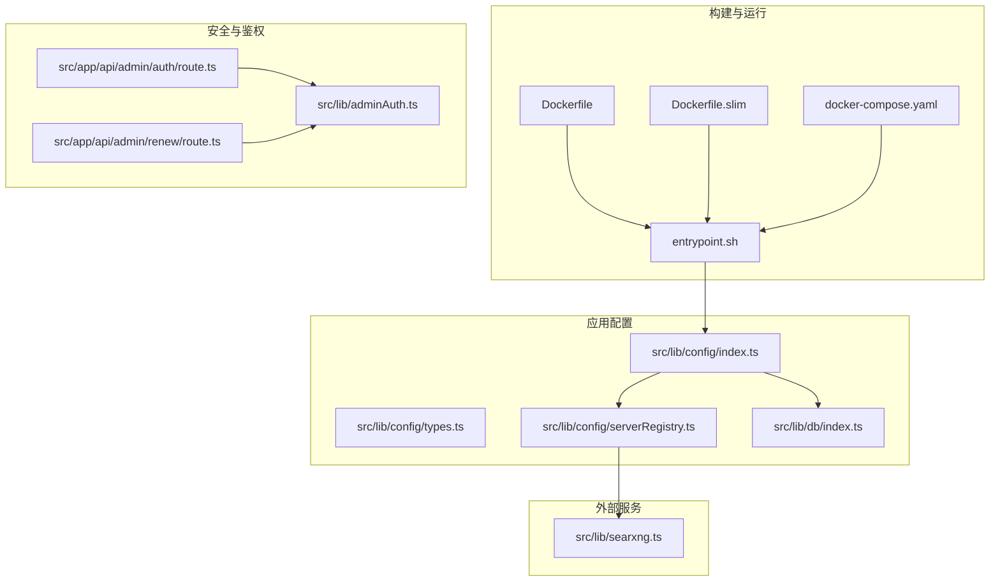
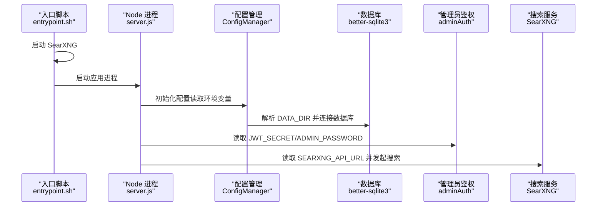
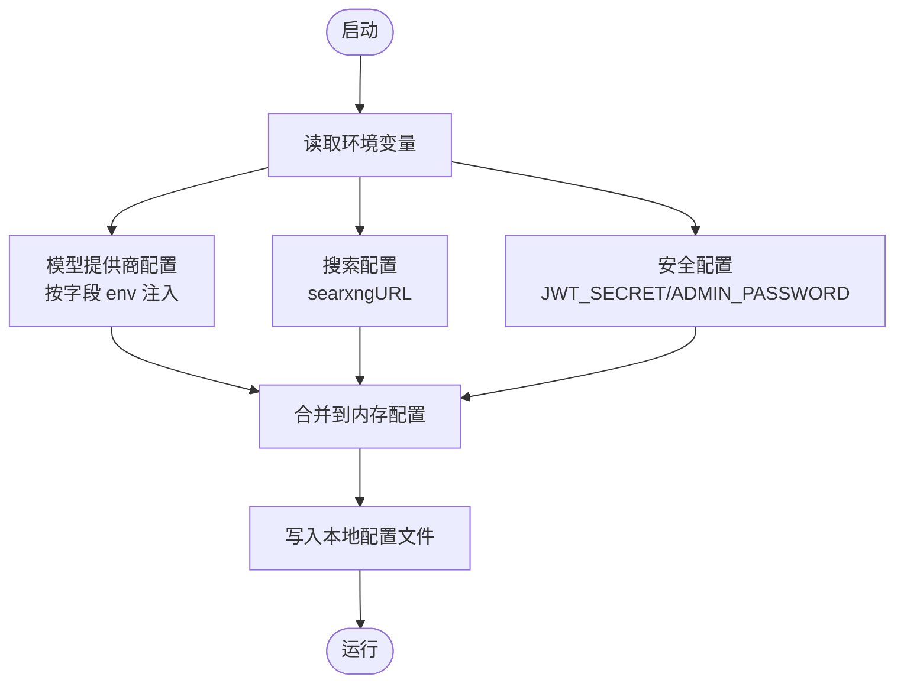
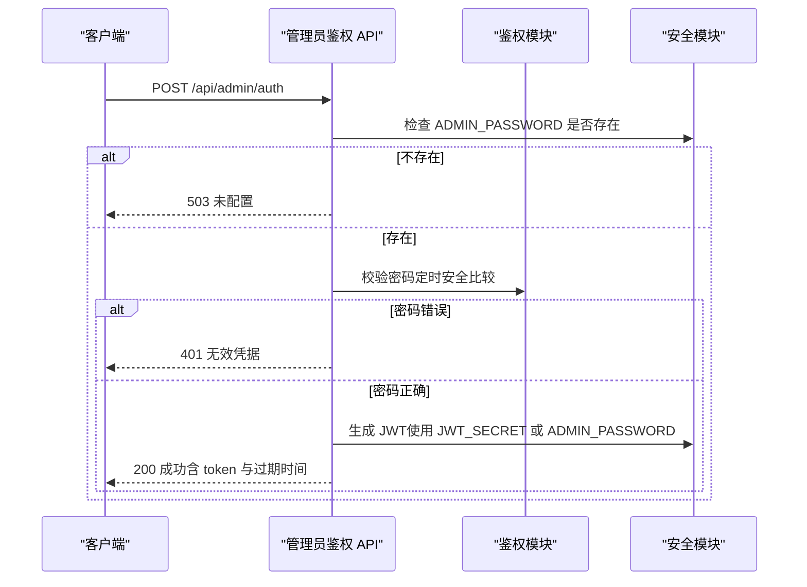
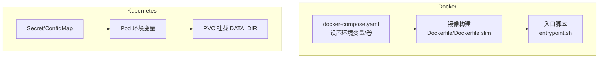
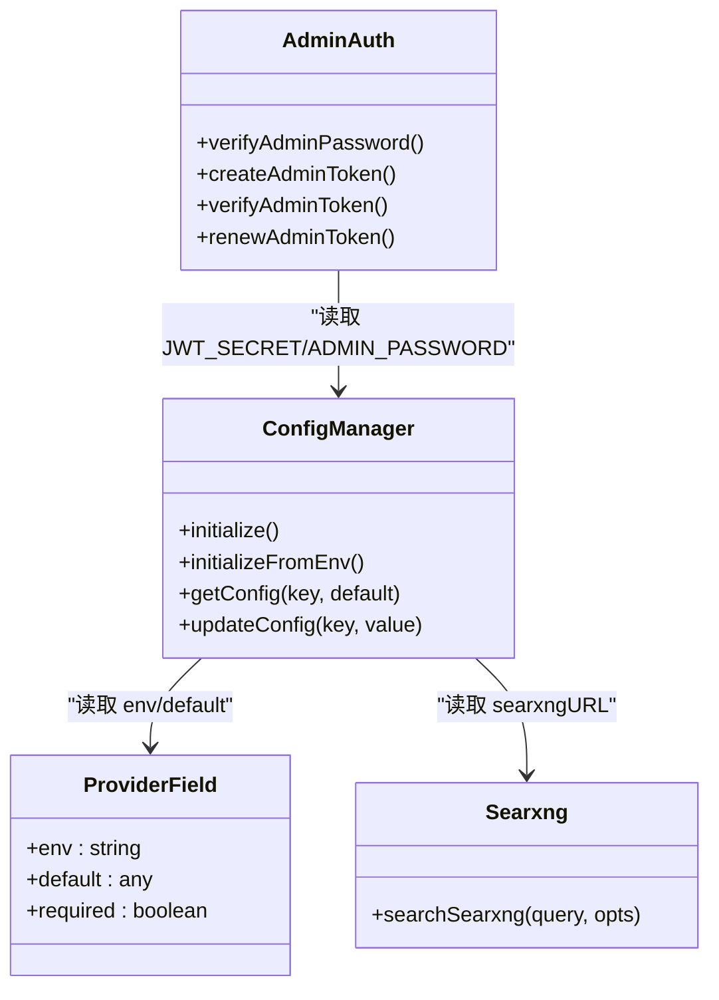

# 环境变量配置

<cite>
**本文引用的文件**
- [.env.example](file://.env.example)
- [package.json](file://package.json)
- [Dockerfile](file://Dockerfile)
- [docker-compose.yaml](file://docker-compose.yaml)
- [entrypoint.sh](file://entrypoint.sh)
- [src/lib/config/index.ts](file://src/lib/config/index.ts)
- [src/lib/config/types.ts](file://src/lib/config/types.ts)
- [src/lib/config/serverRegistry.ts](file://src/lib/config/serverRegistry.ts)
- [src/lib/db/index.ts](file://src/lib/db/index.ts)
- [src/lib/adminAuth.ts](file://src/lib/adminAuth.ts)
- [src/app/api/admin/auth/route.ts](file://src/app/api/admin/auth/route.ts)
- [src/app/api/admin/renew/route.ts](file://src/app/api/admin/renew/route.ts)
- [src/lib/searxng.ts](file://src/lib/searxng.ts)
- [Dockerfile.slim](file://Dockerfile.slim)
</cite>

## 目录
1. [简介](#简介)
2. [项目结构](#项目结构)
3. [核心组件](#核心组件)
4. [架构总览](#架构总览)
5. [详细组件分析](#详细组件分析)
6. [依赖关系分析](#依赖关系分析)
7. [性能考量](#性能考量)
8. [故障排查指南](#故障排查指南)
9. [结论](#结论)
10. [附录](#附录)

## 简介
本文件系统性梳理 Perplexica 的环境变量配置，覆盖全部必要与可选配置项，解释其作用、默认行为与推荐设置；提供敏感信息（如管理员密码、API 密钥）的安全存储与管理建议；给出开发、测试、生产三类部署场景的配置示例；阐明环境变量优先级与覆盖机制，以及与本地配置文件的关系；并总结在 Docker 与 Kubernetes 中的正确设置方式。

## 项目结构
围绕环境变量的关键文件与模块如下：
- 示例与模板：.env.example
- 构建与运行：Dockerfile、Dockerfile.slim、docker-compose.yaml、entrypoint.sh
- 应用配置与读取：src/lib/config/*、src/lib/db/index.ts
- 安全与鉴权：src/lib/adminAuth.ts、src/app/api/admin/auth/route.ts、src/app/api/admin/renew/route.ts
- 搜索集成：src/lib/searxng.ts

**图示来源**
- [Dockerfile](file://Dockerfile#L1-L75)
- [Dockerfile.slim](file://Dockerfile.slim#L1-L35)
- [docker-compose.yaml](file://docker-compose.yaml#L1-L25)
- [entrypoint.sh](file://entrypoint.sh#L1-L32)
- [src/lib/config/index.ts](file://src/lib/config/index.ts#L1-L64)
- [src/lib/config/types.ts](file://src/lib/config/types.ts#L1-L110)
- [src/lib/config/serverRegistry.ts](file://src/lib/config/serverRegistry.ts#L1-L16)
- [src/lib/db/index.ts](file://src/lib/db/index.ts#L1-L12)
- [src/lib/adminAuth.ts](file://src/lib/adminAuth.ts#L1-L196)
- [src/app/api/admin/auth/route.ts](file://src/app/api/admin/auth/route.ts#L1-L102)
- [src/app/api/admin/renew/route.ts](file://src/app/api/admin/renew/route.ts#L1-L60)
- [src/lib/searxng.ts](file://src/lib/searxng.ts#L1-L53)

**章节来源**
- [Dockerfile](file://Dockerfile#L1-L75)
- [Dockerfile.slim](file://Dockerfile.slim#L1-L35)
- [docker-compose.yaml](file://docker-compose.yaml#L1-L25)
- [entrypoint.sh](file://entrypoint.sh#L1-L32)
- [src/lib/config/index.ts](file://src/lib/config/index.ts#L1-L64)
- [src/lib/config/types.ts](file://src/lib/config/types.ts#L1-L110)
- [src/lib/config/serverRegistry.ts](file://src/lib/config/serverRegistry.ts#L1-L16)
- [src/lib/db/index.ts](file://src/lib/db/index.ts#L1-L12)
- [src/lib/adminAuth.ts](file://src/lib/adminAuth.ts#L1-L196)
- [src/app/api/admin/auth/route.ts](file://src/app/api/admin/auth/route.ts#L1-L102)
- [src/app/api/admin/renew/route.ts](file://src/app/api/admin/renew/route.ts#L1-L60)
- [src/lib/searxng.ts](file://src/lib/searxng.ts#L1-L53)

## 核心组件
- 环境变量读取与配置初始化：ConfigManager 从环境变量加载模型提供商与搜索配置，并持久化到本地 JSON 文件。
- 安全与鉴权：管理员密码与 JWT Secret 的来源与校验逻辑。
- 数据存储：基于 DATA_DIR 的 SQLite 数据库路径解析。
- 搜索集成：通过 SearXNG URL 与服务注册器进行搜索调用。

**章节来源**
- [src/lib/config/index.ts](file://src/lib/config/index.ts#L119-L238)
- [src/lib/config/types.ts](file://src/lib/config/types.ts#L63-L96)
- [src/lib/adminAuth.ts](file://src/lib/adminAuth.ts#L37-L45)
- [src/lib/db/index.ts](file://src/lib/db/index.ts#L6-L12)
- [src/lib/searxng.ts](file://src/lib/searxng.ts#L25-L26)

## 架构总览
下图展示环境变量在启动流程中的关键位置与流向：

**图示来源**
- [entrypoint.sh](file://entrypoint.sh#L4-L32)
- [src/lib/config/index.ts](file://src/lib/config/index.ts#L175-L238)
- [src/lib/db/index.ts](file://src/lib/db/index.ts#L6-L12)
- [src/lib/adminAuth.ts](file://src/lib/adminAuth.ts#L37-L45)
- [src/lib/searxng.ts](file://src/lib/searxng.ts#L25-L26)

## 详细组件分析

### 环境变量清单与说明
以下为 Perplexica 使用到的环境变量及其职责、默认值与推荐设置。字段含义：
- 变量名：环境变量键名
- 类型：字符串或密码
- 必需：是否必须设置
- 默认值：未设置时的默认行为或占位
- 作用：该变量对系统功能的影响
- 推荐设置：生产与开发场景的建议值
- 安全要点：密钥与敏感信息的管理建议

- ADMIN_PASSWORD
  - 类型：密码
  - 必需：是（用于管理员鉴权）
  - 默认值：未设置
  - 作用：管理员登录凭据，用于访问敏感设置与后台接口
  - 推荐设置：生产环境使用高强度随机字符串，长度≥16；开发/测试可自定义但不得提交至版本库
  - 安全要点：严禁硬编码；使用密钥管理工具或平台机密；限制文件权限（如仅属主可读）

- JWT_SECRET
  - 类型：密码
  - 必需：是（用于签发与校验管理员 JWT）
  - 默认值：若未设置则回退到 ADMIN_PASSWORD
  - 作用：JWT 签名密钥，确保管理员令牌安全
  - 推荐设置：生产环境使用高强度随机字符串；避免与 ADMIN_PASSWORD 相同以降低风险
  - 安全要点：定期轮换；严格保密；仅在受控环境中暴露

- OPENAI_API_KEY
  - 类型：密码
  - 必需：按需（OpenAI 提供商启用时）
  - 默认值：未设置
  - 作用：OpenAI 模型调用的鉴权密钥
  - 推荐设置：生产环境使用专用密钥；限制访问范围与配额
  - 安全要点：最小权限原则；监控用量；及时轮换

- OPENAI_BASE_URL
  - 类型：字符串
  - 必需：按需（OpenAI 提供商启用时）
  - 默认值：https://api.openai.com/v1
  - 作用：OpenAI API 基础地址
  - 推荐设置：保持官方域名；自建兼容网关时按实际填写
  - 安全要点：仅在可信网络内使用；避免泄露

- ANTHROPIC_API_KEY
  - 类型：密码
  - 必需：按需（Anthropic 提供商启用时）
  - 默认值：未设置
  - 作用：Anthropic Claude 模型调用的鉴权密钥
  - 推荐设置：生产环境使用专用密钥；限制访问范围
  - 安全要点：最小权限；监控用量；轮换策略

- GEMINI_API_KEY
  - 类型：密码
  - 必需：按需（Google Gemini 提供商启用时）
  - 默认值：未设置
  - 作用：Google Gemini 模型调用的鉴权密钥
  - 推荐设置：生产环境使用专用密钥；限制访问范围
  - 安全要点：最小权限；监控用量；轮换策略

- DEEPSEEK_API_KEY
  - 类型：密码
  - 必需：按需（DeepSeek 提供商启用时）
  - 默认值：未设置
  - 作用：DeepSeek 模型调用的鉴权密钥
  - 推荐设置：生产环境使用专用密钥；限制访问范围
  - 安全要点：最小权限；监控用量；轮换策略

- GROQ_API_KEY
  - 类型：密码
  - 必需：按需（Groq 提供商启用时）
  - 默认值：未设置
  - 作用：Groq 模型调用的鉴权密钥
  - 推荐设置：生产环境使用专用密钥；限制访问范围
  - 安全要点：最小权限；监控用量；轮换策略

- AIML_API_KEY
  - 类型：密码
  - 必需：按需（AIML 提供商启用时）
  - 默认值：未设置
  - 作用：AIML 模型调用的鉴权密钥
  - 推荐设置：生产环境使用专用密钥；限制访问范围
  - 安全要点：最小权限；监控用量；轮换策略

- LEMONADE_API_KEY
  - 类型：密码
  - 必需：按需（Lemonade 提供商启用时）
  - 默认值：未设置
  - 作用：Lemonade 模型调用的鉴权密钥
  - 推荐设置：生产环境使用专用密钥；限制访问范围
  - 安全要点：最小权限；监控用量；轮换策略

- SEARXNG_API_URL
  - 类型：字符串
  - 必需：是（搜索功能启用时）
  - 默认值：Dockerfile 中预设为 http://localhost:8080
  - 作用：SearXNG 搜索服务的访问地址
  - 推荐设置：容器编排时确保可达；生产环境使用稳定域名与反向代理
  - 安全要点：仅在可信网络内暴露；限制访问来源

- DATA_DIR
  - 类型：字符串
  - 必需：否
  - 默认值：process.cwd()
  - 作用：数据目录根路径，决定数据库与配置文件存放位置
  - 推荐设置：生产环境指向持久化卷；开发环境可使用默认
  - 安全要点：确保进程用户对该目录有读写权限

- 其他
  - 说明：项目中未发现其他直接使用的环境变量。部分配置（如提供商字段）支持通过 env 映射从环境变量注入，但未在示例中强制要求。

**章节来源**
- [.env.example](file://.env.example#L1-L59)
- [src/lib/config/index.ts](file://src/lib/config/index.ts#L175-L238)
- [src/lib/config/types.ts](file://src/lib/config/types.ts#L3-L10)
- [src/lib/adminAuth.ts](file://src/lib/adminAuth.ts#L37-L45)
- [Dockerfile](file://Dockerfile#L72-L72)
- [src/lib/db/index.ts](file://src/lib/db/index.ts#L6-L12)

### 环境变量优先级与覆盖机制
- 优先级顺序（从高到低）：
  1) 运行时环境变量（容器/主机）
  2) 配置文件（本地 JSON）——由 ConfigManager 初始化时从环境变量填充
- 覆盖规则：
  - 模型提供商配置：当 UI 字段声明 env 时，ConfigManager 会优先从环境变量读取；若缺失则回退到字段默认值；最终保存到本地配置文件。
  - 搜索配置：search.searxngURL 由环境变量或默认值填充。
  - 安全相关：JWT_SECRET 优先于 ADMIN_PASSWORD；两者均需设置。
- 与配置文件的关系：
  - 首次启动时，ConfigManager 会根据环境变量生成初始配置并写入 data/config.json。
  - 之后的更新通过管理端口写入，不会自动覆盖环境变量。

**图示来源**
- [src/lib/config/index.ts](file://src/lib/config/index.ts#L175-L238)
- [src/lib/config/types.ts](file://src/lib/config/types.ts#L46-L51)
- [src/lib/adminAuth.ts](file://src/lib/adminAuth.ts#L37-L45)

**章节来源**
- [src/lib/config/index.ts](file://src/lib/config/index.ts#L175-L238)
- [src/lib/config/types.ts](file://src/lib/config/types.ts#L46-L51)
- [src/lib/adminAuth.ts](file://src/lib/adminAuth.ts#L37-L45)

### 不同部署环境的配置示例

- 开发环境
  - 关键点：快速启动，可使用默认 SearXNG 地址；敏感信息可临时简化。
  - 示例要点：
    - 设置 ADMIN_PASSWORD 与至少一个提供商的 API Key（如 OPENAI_API_KEY）
    - SEARXNG_API_URL 可保持默认（Dockerfile 预设）
    - DATA_DIR 可使用默认或指向本地目录

- 测试环境
  - 关键点：隔离与可重复性，模拟生产网络与权限。
  - 示例要点：
    - 使用独立的 JWT_SECRET
    - 为各提供商配置受限的测试密钥
    - 将 SEARXNG_API_URL 指向测试集群内的 SearXNG 服务
    - 将 DATA_DIR 指向持久化卷挂载点

- 生产环境
  - 关键点：安全、高可用、可观测。
  - 示例要点：
    - ADMIN_PASSWORD 与 JWT_SECRET 均使用高强度随机字符串，不相同
    - 所有提供商密钥使用最小权限与限额
    - SEARXNG_API_URL 指向稳定域名并通过反向代理访问
    - DATA_DIR 指向持久化卷，确保备份与快照策略
    - 严格控制 .env/.env.* 文件权限（如 600），不在镜像中携带

**章节来源**
- [.env.example](file://.env.example#L52-L59)
- [Dockerfile](file://Dockerfile#L72-L72)
- [docker-compose.yaml](file://docker-compose.yaml#L1-L25)

### 敏感信息的安全存储与管理
- 存储建议
  - 使用平台机密管理（如云厂商密钥管理服务、HashiCorp Vault、Kubernetes Secrets）
  - 避免将 .env 文件纳入版本控制；使用 .gitignore 屏蔽
  - 限制文件权限：chmod 600；仅属主可读
- 分发与轮换
  - 采用最小权限原则；按服务与环境拆分密钥
  - 制定密钥轮换计划；更新后滚动重启
- 日志与审计
  - 避免在日志中输出密钥；开启审计与告警

**章节来源**
- [.env.example](file://.env.example#L52-L59)
- [src/lib/adminAuth.ts](file://src/lib/adminAuth.ts#L51-L74)

### 环境变量验证与错误处理
- 管理员鉴权
  - 缺失 ADMIN_PASSWORD：返回 503“未配置”
  - 密码错误：返回 401“无效凭据”，并记录失败尝试
  - 限流：超过阈值返回 429，包含重试等待时间
  - JWT 验证：支持续期接口，续期失败返回 401
- 配置读取
  - ConfigManager 初始化时会将环境变量映射到配置对象；若解析异常会回退到默认配置并覆盖本地文件
- 数据库路径
  - 若 DATA_DIR 未设置，默认使用工作目录；确保容器/主机对该路径有写权限

**图示来源**
- [src/app/api/admin/auth/route.ts](file://src/app/api/admin/auth/route.ts#L35-L94)
- [src/lib/adminAuth.ts](file://src/lib/adminAuth.ts#L51-L74)
- [src/lib/adminAuth.ts](file://src/lib/adminAuth.ts#L134-L149)

**章节来源**
- [src/app/api/admin/auth/route.ts](file://src/app/api/admin/auth/route.ts#L35-L94)
- [src/lib/adminAuth.ts](file://src/lib/adminAuth.ts#L51-L74)
- [src/lib/adminAuth.ts](file://src/lib/adminAuth.ts#L134-L149)
- [src/lib/config/index.ts](file://src/lib/config/index.ts#L143-L164)

### 在 Docker 与 Kubernetes 中的设置

- Docker（单容器/Compose）
  - 通过环境变量传入密钥与地址；DATA_DIR 可映射卷持久化
  - 示例要点：
    - 在 docker-compose.yaml 中为服务设置环境变量
    - 将 data 卷挂载到容器内的 /home/perplexica/data
    - 如需自定义 SearXNG，请在 Compose 中映射 settings.yml 并设置 SEARXNG_API_URL
  - 注意：Dockerfile 中预设了 SEARXNG_API_URL 为 http://localhost:8080，entrypoint.sh 会先启动 SearXNG 再启动应用。

- Kubernetes
  - 使用 Secret 管理敏感变量，ConfigMap 管理非敏感配置
  - Pod 环境变量引用 Secret/ConfigMap；DATA_DIR 通过 PersistentVolumeClaim 挂载
  - 为 SearXNG 服务单独部署 StatefulSet/Deployment，并通过 Service 暴露

**图示来源**
- [docker-compose.yaml](file://docker-compose.yaml#L1-L25)
- [Dockerfile](file://Dockerfile#L1-L75)
- [Dockerfile.slim](file://Dockerfile.slim#L1-L35)
- [entrypoint.sh](file://entrypoint.sh#L1-L32)

**章节来源**
- [docker-compose.yaml](file://docker-compose.yaml#L1-L25)
- [Dockerfile](file://Dockerfile#L1-L75)
- [Dockerfile.slim](file://Dockerfile.slim#L1-L35)
- [entrypoint.sh](file://entrypoint.sh#L1-L32)

## 依赖关系分析
- 环境变量到配置的映射
  - UI 字段声明 env 时，ConfigManager 会在初始化阶段从 process.env 读取并填充配置对象
  - 搜索配置通过 search.searxngURL 注入
- 安全模块依赖
  - JWT_SECRET 与 ADMIN_PASSWORD 共同决定管理员鉴权能力
- 外部服务依赖
  - SEARXNG_API_URL 决定搜索调用的目标地址

**图示来源**
- [src/lib/config/index.ts](file://src/lib/config/index.ts#L175-L238)
- [src/lib/config/types.ts](file://src/lib/config/types.ts#L3-L10)
- [src/lib/adminAuth.ts](file://src/lib/adminAuth.ts#L37-L45)
- [src/lib/searxng.ts](file://src/lib/searxng.ts#L25-L26)

**章节来源**
- [src/lib/config/index.ts](file://src/lib/config/index.ts#L175-L238)
- [src/lib/config/types.ts](file://src/lib/config/types.ts#L3-L10)
- [src/lib/adminAuth.ts](file://src/lib/adminAuth.ts#L37-L45)
- [src/lib/searxng.ts](file://src/lib/searxng.ts#L25-L26)

## 性能考量
- 环境变量读取开销极小，主要影响启动阶段配置初始化
- 建议在容器启动前完成环境变量注入，避免频繁变更导致重启
- 对于大量提供商配置，建议按需启用，减少初始化扫描成本

## 故障排查指南
- 管理员登录失败
  - 检查 ADMIN_PASSWORD 是否设置；确认未触发限流（查看响应中的 retryAfter）
  - 确认 JWT_SECRET 是否与 ADMIN_PASSWORD 一致（或单独设置）
- 搜索结果为空或超时
  - 检查 SEARXNG_API_URL 是否可达；确认 SearXNG 已随入口脚本启动
- 数据库无法写入
  - 检查 DATA_DIR 权限与磁盘空间；确认容器内用户对该目录有写权限

**章节来源**
- [src/app/api/admin/auth/route.ts](file://src/app/api/admin/auth/route.ts#L35-L94)
- [src/lib/adminAuth.ts](file://src/lib/adminAuth.ts#L51-L74)
- [entrypoint.sh](file://entrypoint.sh#L4-L32)
- [src/lib/db/index.ts](file://src/lib/db/index.ts#L6-L12)

## 结论
Perplexica 的环境变量体系以“显式声明 + 运行时注入”为核心，结合本地配置文件实现持久化。管理员鉴权与搜索、数据库等关键功能均依赖环境变量进行配置。建议在生产环境严格遵循最小权限与密钥轮换策略，并通过容器编排平台的安全特性（Secrets/PVC）落实配置与数据治理。

## 附录
- 参考示例文件：.env.example
- 构建与运行：Dockerfile、Dockerfile.slim、docker-compose.yaml、entrypoint.sh
- 配置与类型：src/lib/config/index.ts、src/lib/config/types.ts、src/lib/config/serverRegistry.ts
- 数据库：src/lib/db/index.ts
- 安全与鉴权：src/lib/adminAuth.ts、src/app/api/admin/auth/route.ts、src/app/api/admin/renew/route.ts
- 搜索：src/lib/searxng.ts