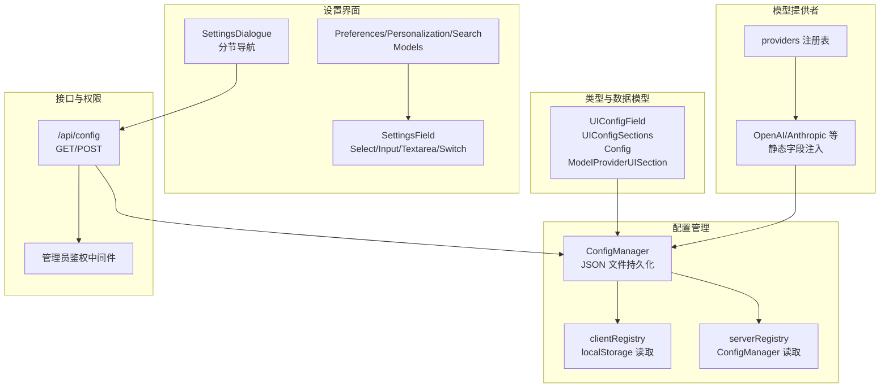
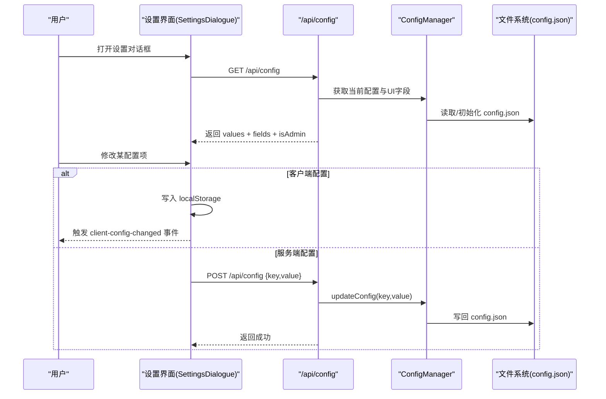
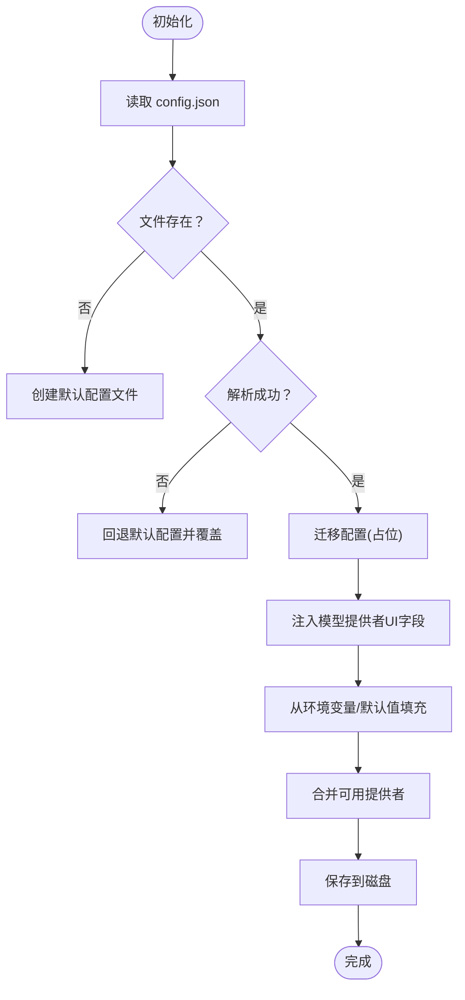
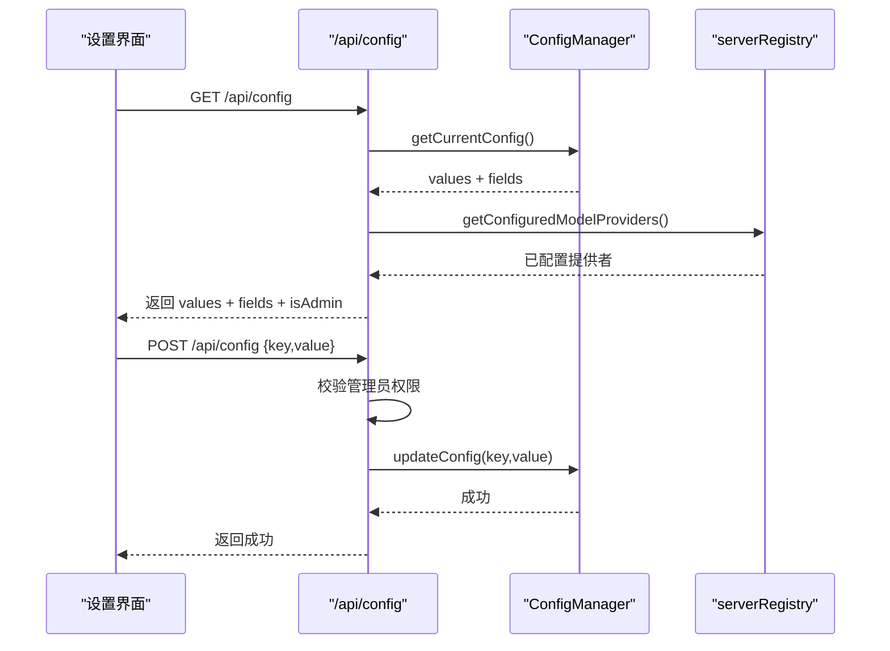
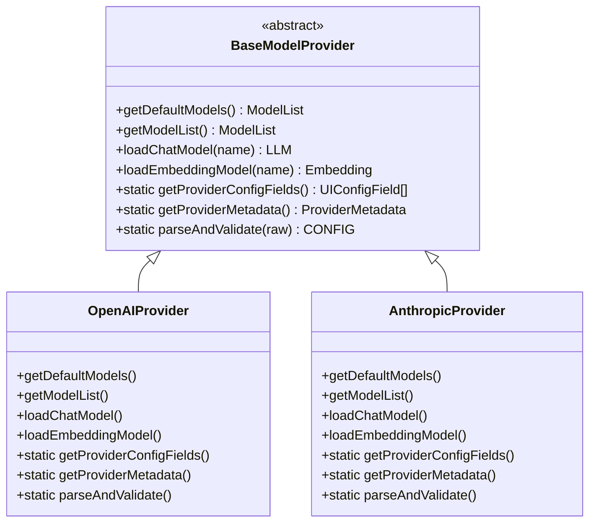
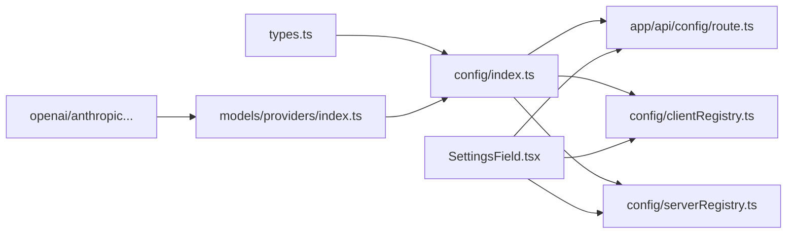

# 用户界面配置

<cite>
**本文引用的文件**
- [src/lib/config/types.ts](file://src/lib/config/types.ts)
- [src/lib/config/index.ts](file://src/lib/config/index.ts)
- [src/lib/config/clientRegistry.ts](file://src/lib/config/clientRegistry.ts)
- [src/lib/config/serverRegistry.ts](file://src/lib/config/serverRegistry.ts)
- [src/app/api/config/route.ts](file://src/app/api/config/route.ts)
- [src/components/Settings/SettingsDialogue.tsx](file://src/components/Settings/SettingsDialogue.tsx)
- [src/components/Settings/Sections/Preferences.tsx](file://src/components/Settings/Sections/Preferences.tsx)
- [src/components/Settings/Sections/Personalization.tsx](file://src/components/Settings/Sections/Personalization.tsx)
- [src/components/Settings/Sections/Search.tsx](file://src/components/Settings/Sections/Search.tsx)
- [src/components/Settings/Sections/Models/Section.tsx](file://src/components/Settings/Sections/Models/Section.tsx)
- [src/components/Settings/SettingsField.tsx](file://src/components/Settings/SettingsField.tsx)
- [src/components/theme/Switcher.tsx](file://src/components/theme/Switcher.tsx)
- [src/lib/models/providers/index.ts](file://src/lib/models/providers/index.ts)
- [src/lib/models/providers/openai/index.ts](file://src/lib/models/providers/openai/index.ts)
- [src/lib/models/providers/anthropic/index.ts](file://src/lib/models/providers/anthropic/index.ts)
- [src/lib/models/base/provider.ts](file://src/lib/models/base/provider.ts)
</cite>

## 目录
1. [简介](#简介)
2. [项目结构](#项目结构)
3. [核心组件](#核心组件)
4. [架构总览](#架构总览)
5. [详细组件分析](#详细组件分析)
6. [依赖关系分析](#依赖关系分析)
7. [性能考量](#性能考量)
8. [故障排查指南](#故障排查指南)
9. [结论](#结论)
10. [附录](#附录)

## 简介
本文件系统性阐述 Perplexica 的用户界面配置系统，重点围绕 UIConfigSections 的设计与实现，覆盖偏好设置、个性化配置、搜索设置与模型提供商配置的结构与交互。文档详细说明配置项的数据类型、验证规则与默认值；解释客户端与服务器端配置的作用域与权限控制；给出主题切换、测量单位、天气小部件等具体配置项的实现细节；说明配置项的动态生成与模型提供商配置的集成方式；并提供配置界面的扩展点与自定义配置项的添加方法，以及配置的序列化/反序列化与前端组件绑定机制、配置变更的通知与响应流程。

## 项目结构
配置系统由“类型定义”“配置管理器”“客户端/服务端注册表”“API 路由”“设置界面与字段组件”“模型提供者 UI 配置注入”等模块组成。整体采用“类型驱动 + 动态注入 + 权限隔离”的架构：类型定义统一约束配置字段与结构；配置管理器负责持久化、初始化与迁移；客户端/服务端注册表分别读取本地存储与已配置值；API 路由在管理员权限下提供读写能力；设置界面通过字段描述动态渲染并绑定事件；模型提供者通过静态方法注入其 UI 配置字段。

图表来源
- [src/lib/config/types.ts](file://src/lib/config/types.ts#L3-L96)
- [src/lib/config/index.ts](file://src/lib/config/index.ts#L7-L391)
- [src/lib/config/clientRegistry.ts](file://src/lib/config/clientRegistry.ts#L3-L29)
- [src/lib/config/serverRegistry.ts](file://src/lib/config/serverRegistry.ts#L4-L15)
- [src/app/api/config/route.ts](file://src/app/api/config/route.ts#L12-L64)
- [src/components/Settings/SettingsDialogue.tsx](file://src/components/Settings/SettingsDialogue.tsx#L26-L63)
- [src/components/Settings/SettingsField.tsx](file://src/components/Settings/SettingsField.tsx#L325-L379)
- [src/lib/models/providers/index.ts](file://src/lib/models/providers/index.ts#L23-L35)
- [src/lib/models/providers/openai/index.ts](file://src/lib/models/providers/openai/index.ts#L109-L131)
- [src/lib/models/providers/anthropic/index.ts](file://src/lib/models/providers/anthropic/index.ts#L13-L24)

章节来源
- [src/lib/config/types.ts](file://src/lib/config/types.ts#L1-L110)
- [src/lib/config/index.ts](file://src/lib/config/index.ts#L1-L391)
- [src/lib/config/clientRegistry.ts](file://src/lib/config/clientRegistry.ts#L1-L30)
- [src/lib/config/serverRegistry.ts](file://src/lib/config/serverRegistry.ts#L1-L16)
- [src/app/api/config/route.ts](file://src/app/api/config/route.ts#L1-L111)
- [src/components/Settings/SettingsDialogue.tsx](file://src/components/Settings/SettingsDialogue.tsx#L1-L294)
- [src/components/Settings/SettingsField.tsx](file://src/components/Settings/SettingsField.tsx#L1-L379)
- [src/lib/models/providers/index.ts](file://src/lib/models/providers/index.ts#L1-L36)
- [src/lib/models/providers/openai/index.ts](file://src/lib/models/providers/openai/index.ts#L1-L227)
- [src/lib/models/providers/anthropic/index.ts](file://src/lib/models/providers/anthropic/index.ts#L1-L116)

## 核心组件
- UIConfigSections：定义四个配置分区的字段集合，分别为 preferences、personalization、modelProviders、search。
- UIConfigField 及其变体：统一描述字段的名称、键、类型、占位符、默认值、选项、必填、作用域与环境变量映射。
- Config：顶层配置对象，包含版本、安装完成标记、各分区的键值对、模型提供商列表与搜索设置。
- ConfigManager：负责配置文件的初始化、读取、迁移、保存、按路径读取/更新、模型提供商增删改查、从环境变量注入模型提供商配置。
- 客户端注册表 clientRegistry：从 localStorage 读取客户端配置，用于主题、测量单位、媒体搜索开关、天气/新闻小部件等。
- 服务端注册表 serverRegistry：从 ConfigManager 读取已配置的模型提供商与搜索设置。
- /api/config：提供配置读取（区分管理员可见字段与值）与更新（仅管理员）。
- 设置界面与字段组件：根据 UIConfigSections 动态渲染字段，处理保存逻辑（客户端写 localStorage，服务端通过 /api/config POST）。
- 模型提供者 UI 注入：通过 providers 注册表与各提供者静态方法注入 UI 配置字段，ConfigManager 在初始化时合并。

章节来源
- [src/lib/config/types.ts](file://src/lib/config/types.ts#L3-L96)
- [src/lib/config/index.ts](file://src/lib/config/index.ts#L7-L391)
- [src/lib/config/clientRegistry.ts](file://src/lib/config/clientRegistry.ts#L3-L29)
- [src/lib/config/serverRegistry.ts](file://src/lib/config/serverRegistry.ts#L4-L15)
- [src/app/api/config/route.ts](file://src/app/api/config/route.ts#L12-L64)
- [src/components/Settings/SettingsDialogue.tsx](file://src/components/Settings/SettingsDialogue.tsx#L26-L63)
- [src/components/Settings/SettingsField.tsx](file://src/components/Settings/SettingsField.tsx#L325-L379)
- [src/lib/models/providers/index.ts](file://src/lib/models/providers/index.ts#L23-L35)

## 架构总览
配置系统采用“类型驱动 + 动态注入 + 权限隔离”的分层架构：
- 类型层：统一字段与分区结构，确保前后端一致。
- 管理层：ConfigManager 负责持久化与初始化，支持从环境变量注入模型提供商配置，并在必要时自动配置可用提供者。
- 接口层：/api/config 提供读取与更新，管理员模式下返回完整字段与值，非管理员模式下隐藏服务端敏感字段与值。
- 界面层：SettingsDialogue 按分区渲染，SettingsField 根据字段类型渲染对应输入控件，保存时区分客户端/服务端。
- 扩展层：模型提供者通过静态方法注入 UI 字段，ConfigManager 自动合并并校验必填项。

图表来源
- [src/components/Settings/SettingsDialogue.tsx](file://src/components/Settings/SettingsDialogue.tsx#L90-L122)
- [src/components/Settings/SettingsField.tsx](file://src/components/Settings/SettingsField.tsx#L35-L68)
- [src/app/api/config/route.ts](file://src/app/api/config/route.ts#L12-L64)
- [src/lib/config/index.ts](file://src/lib/config/index.ts#L240-L272)

章节来源
- [src/components/Settings/SettingsDialogue.tsx](file://src/components/Settings/SettingsDialogue.tsx#L1-L294)
- [src/components/Settings/SettingsField.tsx](file://src/components/Settings/SettingsField.tsx#L1-L379)
- [src/app/api/config/route.ts](file://src/app/api/config/route.ts#L1-L111)
- [src/lib/config/index.ts](file://src/lib/config/index.ts#L1-L391)

## 详细组件分析

### UIConfigSections 设计与实现
- 结构组成
  - preferences：客户端作用域，包含主题、测量单位、自动媒体搜索、天气/新闻小部件开关等。
  - personalization：客户端作用域，系统指令文本区域。
  - modelProviders：动态注入，由各模型提供者通过静态方法返回 UI 字段。
  - search：服务端作用域，包含 SearXNG URL 等。
- 数据类型与默认值
  - select：如主题、测量单位，带 options 与 default。
  - switch：如自动媒体搜索、天气/新闻小部件，布尔默认值。
  - textarea：如系统指令，支持多行文本与占位符。
  - string/password：如 SearXNG URL、提供者 API Key，支持占位符与默认值。
- 验证规则
  - required 字段在模型提供商注入时会记录为必填，ConfigManager 初始化时会检查环境变量或默认值，未满足则不自动配置该提供者。
- 作用域与权限
  - scope: 'client'：仅影响本地体验，通过 localStorage 存储与 clientRegistry 读取。
  - scope: 'server'：影响服务端行为，需管理员权限并通过 /api/config 更新。

章节来源
- [src/lib/config/types.ts](file://src/lib/config/types.ts#L3-L96)
- [src/lib/config/index.ts](file://src/lib/config/index.ts#L23-L117)

### 配置管理器 ConfigManager
- 初始化与持久化
  - 默认配置包含版本、安装完成标记、空的各分区与搜索默认值。
  - 首次运行创建 config.json；解析失败则回退默认配置并覆盖原文件。
  - 支持迁移函数占位，便于后续版本演进。
- 环境变量注入
  - 从模型提供者注册表获取 UI 字段，遍历字段：
    - 若存在对应环境变量则优先使用；
    - 否则使用字段默认值；
    - 必填字段缺失则跳过自动配置该提供者；
    - 已配置且哈希一致则去重。
  - 搜索分区同样从环境变量注入 SearXNG URL。
- 读取与更新
  - getConfig 支持点号路径访问，updateConfig 支持嵌套路径写入。
  - 模型提供商增删改查与模型条目增删均持久化。
- 完成设置标记
  - markSetupComplete 仅在首次调用时写入，避免重复写入。

图表来源
- [src/lib/config/index.ts](file://src/lib/config/index.ts#L123-L238)

章节来源
- [src/lib/config/index.ts](file://src/lib/config/index.ts#L7-L391)

### 客户端与服务端配置的作用域与权限控制
- 客户端配置
  - 通过 clientRegistry 从 localStorage 读取，如主题、测量单位、媒体搜索开关、系统指令、天气/新闻小部件开关。
  - SettingsField 在客户端场景直接写 localStorage，并触发 client-config-changed 事件，便于组件订阅与响应。
- 服务端配置
  - 通过 serverRegistry 从 ConfigManager 读取，如已配置的模型提供商与搜索设置。
  - /api/config 在 GET 中区分管理员与普通用户：非管理员模式下隐藏服务端字段定义与敏感值，仅暴露提供者类型元数据。
  - POST 仅管理员可调用，校验必填参数后写入 ConfigManager 并持久化。

图表来源
- [src/app/api/config/route.ts](file://src/app/api/config/route.ts#L12-L64)
- [src/lib/config/serverRegistry.ts](file://src/lib/config/serverRegistry.ts#L4-L15)
- [src/components/Settings/SettingsField.tsx](file://src/components/Settings/SettingsField.tsx#L35-L68)

章节来源
- [src/lib/config/clientRegistry.ts](file://src/lib/config/clientRegistry.ts#L3-L29)
- [src/lib/config/serverRegistry.ts](file://src/lib/config/serverRegistry.ts#L1-L16)
- [src/app/api/config/route.ts](file://src/app/api/config/route.ts#L12-L111)
- [src/components/Settings/SettingsField.tsx](file://src/components/Settings/SettingsField.tsx#L15-L68)

### 主题切换、测量单位、天气小部件等具体配置项
- 主题切换
  - 客户端字段：select，options 包含 Light/Dark；默认 Dark。
  - 实现：SettingsField 在客户端保存时同步更新 next-themes 的主题；clientRegistry 提供 getTheme。
- 测量单位
  - 客户端字段：select，options 包含 Metric/Imperial；默认 Metric。
  - 实现：clientRegistry 提供 getMeasurementUnit，兼容旧键 measurementUnit。
- 天气/新闻小部件
  - 客户端字段：switch，默认开启。
  - 实现：clientRegistry 提供 getShowWeatherWidget/getShowNewsWidget；SettingsField 保存时触发 client-config-changed 事件。

章节来源
- [src/lib/config/index.ts](file://src/lib/config/index.ts#L24-L90)
- [src/lib/config/clientRegistry.ts](file://src/lib/config/clientRegistry.ts#L7-L29)
- [src/components/Settings/SettingsField.tsx](file://src/components/Settings/SettingsField.tsx#L35-L68)

### 搜索设置（SearXNG URL）
- 字段：string，必填性取决于部署需求；默认为空字符串；环境变量映射为 SEARXNG_API_URL。
- 注入：ConfigManager 初始化时从环境变量或默认值填充；服务端注册表提供 getSearxngURL。
- 使用：在搜索相关功能中读取该 URL 作为后端代理地址。

章节来源
- [src/lib/config/index.ts](file://src/lib/config/index.ts#L104-L116)
- [src/lib/config/serverRegistry.ts](file://src/lib/config/serverRegistry.ts#L14-L15)

### 模型提供商配置的动态生成与集成
- 注入机制
  - providers 注册表导出各提供者构造器，ConfigManager 通过 getModelProvidersUIConfigSection 动态收集各提供者的 UI 字段与元数据。
  - 各提供者通过静态方法 getProviderConfigFields 返回 UIConfigField 数组，getProviderMetadata 返回名称与键。
- 配置合并
  - ConfigManager 初始化时：
    - 为每个提供者生成唯一 id、类型、空模型列表与空配置；
    - 从环境变量或字段默认值填充配置；
    - 标记必填字段，若任一必填缺失则跳过自动配置；
    - 对配置进行哈希，避免重复添加。
- 运行期模型列表
  - /api/config 在 GET 时结合活跃提供者列表，将实际可用模型合并到返回值中，确保前端展示最新状态。

图表来源
- [src/lib/models/base/provider.ts](file://src/lib/models/base/provider.ts#L6-L46)
- [src/lib/models/providers/openai/index.ts](file://src/lib/models/providers/openai/index.ts#L133-L227)
- [src/lib/models/providers/anthropic/index.ts](file://src/lib/models/providers/anthropic/index.ts#L26-L116)

章节来源
- [src/lib/models/providers/index.ts](file://src/lib/models/providers/index.ts#L23-L35)
- [src/lib/models/providers/openai/index.ts](file://src/lib/models/providers/openai/index.ts#L109-L131)
- [src/lib/models/providers/anthropic/index.ts](file://src/lib/models/providers/anthropic/index.ts#L13-L24)
- [src/lib/models/base/provider.ts](file://src/lib/models/base/provider.ts#L1-L46)
- [src/lib/config/index.ts](file://src/lib/config/index.ts#L175-L238)

### 配置界面的扩展点与自定义配置项添加方法
- 添加新的 UIConfigField
  - 在 UIConfigSections 中为目标分区新增字段定义（name/key/type/required/description/default/options/env/scope）。
  - 如为服务端敏感配置，务必设置 scope: 'server' 并提供 env 映射。
- 为模型提供者添加配置项
  - 在对应提供者的静态 getProviderConfigFields 中返回新字段数组。
  - ConfigManager 将自动从环境变量或默认值注入，并在必要时校验必填。
- 为设置界面添加新分区
  - 在 SettingsDialogue 的 sections 中新增一项，指定组件与 requiresAdmin。
  - 在对应的 Section 组件中使用 SettingsField 渲染字段，并传入 dataAdd 以标识分区键。

章节来源
- [src/lib/config/types.ts](file://src/lib/config/types.ts#L3-L96)
- [src/lib/config/index.ts](file://src/lib/config/index.ts#L23-L117)
- [src/components/Settings/SettingsDialogue.tsx](file://src/components/Settings/SettingsDialogue.tsx#L26-L63)
- [src/components/Settings/SettingsField.tsx](file://src/components/Settings/SettingsField.tsx#L325-L379)

### 配置的序列化与反序列化、与前端组件的绑定机制
- 序列化/反序列化
  - ConfigManager 使用 JSON.stringify/parse 持久化与读取 config.json。
  - getCurrentConfig 返回深拷贝副本，避免外部修改影响内部状态。
- 前端绑定
  - 客户端字段：SettingsField 读取 localStorage 或服务端值作为初始值；保存时写 localStorage 并触发 client-config-changed。
  - 服务端字段：SettingsField 发起 /api/config POST，成功后刷新界面状态。
  - 主题切换：SettingsField 在客户端保存时同步 next-themes 主题；ThemeSwitcher 也提供独立的主题选择器。

章节来源
- [src/lib/config/index.ts](file://src/lib/config/index.ts#L128-L133)
- [src/lib/config/index.ts](file://src/lib/config/index.ts#L383-L385)
- [src/components/Settings/SettingsField.tsx](file://src/components/Settings/SettingsField.tsx#L35-L68)
- [src/components/theme/Switcher.tsx](file://src/components/theme/Switcher.tsx#L15-L17)

### 配置变更的通知与响应机制
- 事件通知
  - SettingsField 在客户端保存后触发 window 上的 client-config-changed 事件，便于订阅该事件的组件执行响应逻辑（如刷新主题、更新本地缓存）。
- 管理员权限与可见性
  - /api/config 在非管理员模式下隐藏服务端字段定义与敏感值，仅暴露提供者类型元数据，确保安全。

章节来源
- [src/components/Settings/SettingsField.tsx](file://src/components/Settings/SettingsField.tsx#L15-L19)
- [src/app/api/config/route.ts](file://src/app/api/config/route.ts#L33-L50)

## 依赖关系分析
- 类型依赖
  - UIConfigField/Sections/Config/ModelProviderUISection 定义了配置的统一结构。
- 管理器依赖
  - ConfigManager 依赖 types、hashObj（用于提供者配置哈希）、模型提供者 UI 注入函数。
- 接口依赖
  - /api/config 依赖 ConfigManager、模型注册表、管理员鉴权中间件。
- 界面依赖
  - SettingsDialogue 依赖各分区组件与 SettingsField；SettingsField 依赖 next-themes 与 UI 控件库。
- 提供者依赖
  - providers 注册表与各提供者类通过 BaseModelProvider 抽象统一注入 UI 字段。

图表来源
- [src/lib/config/types.ts](file://src/lib/config/types.ts#L3-L96)
- [src/lib/config/index.ts](file://src/lib/config/index.ts#L1-L391)
- [src/app/api/config/route.ts](file://src/app/api/config/route.ts#L1-L111)
- [src/lib/config/clientRegistry.ts](file://src/lib/config/clientRegistry.ts#L1-L30)
- [src/lib/config/serverRegistry.ts](file://src/lib/config/serverRegistry.ts#L1-L16)
- [src/lib/models/providers/index.ts](file://src/lib/models/providers/index.ts#L1-L36)
- [src/lib/models/providers/openai/index.ts](file://src/lib/models/providers/openai/index.ts#L1-L227)
- [src/lib/models/providers/anthropic/index.ts](file://src/lib/models/providers/anthropic/index.ts#L1-L116)
- [src/components/Settings/SettingsField.tsx](file://src/components/Settings/SettingsField.tsx#L1-L379)

章节来源
- [src/lib/config/types.ts](file://src/lib/config/types.ts#L1-L110)
- [src/lib/config/index.ts](file://src/lib/config/index.ts#L1-L391)
- [src/app/api/config/route.ts](file://src/app/api/config/route.ts#L1-L111)
- [src/lib/models/providers/index.ts](file://src/lib/models/providers/index.ts#L1-L36)

## 性能考量
- 配置文件读写
  - 仅在初始化与变更时进行文件读写，避免频繁 IO。
- 深拷贝与不可变更新
  - getCurrentConfig 返回深拷贝，减少意外共享导致的重绘与副作用。
- 模型提供者哈希
  - 使用哈希避免重复添加相同配置的提供者，降低存储与渲染压力。
- 界面渲染
  - 分区式渲染与懒加载，仅在打开设置时拉取配置，减少首屏负担。

## 故障排查指南
- 配置文件损坏
  - 解析失败时会回退默认配置并覆盖原文件，检查日志输出并确认 config.json 是否被重写。
- 环境变量未生效
  - 确认环境变量名与字段 env 映射一致；服务端字段必须提供环境变量或默认值。
- 管理员权限不足
  - 更新服务端配置需管理员令牌；检查 /api/config POST 返回 403。
- 客户端配置未生效
  - 确认字段 scope 为 client；检查 localStorage 是否正确写入；监听 client-config-changed 事件是否被消费。
- 模型提供者未出现
  - 检查必填字段是否齐全；确认环境变量或默认值已注入；核对哈希是否重复导致被去重。

章节来源
- [src/lib/config/index.ts](file://src/lib/config/index.ts#L143-L167)
- [src/app/api/config/route.ts](file://src/app/api/config/route.ts#L66-L110)
- [src/components/Settings/SettingsField.tsx](file://src/components/Settings/SettingsField.tsx#L35-L68)

## 结论
Perplexica 的用户界面配置系统以类型驱动为核心，通过 ConfigManager 实现配置的持久化、注入与权限隔离，配合 SettingsDialogue 与 SettingsField 提供直观的动态配置界面。客户端与服务端配置严格分离，既保证用户体验的即时反馈，又确保敏感信息的安全可控。模型提供者通过静态方法无缝注入 UI 字段，形成可扩展的生态。建议在新增配置项时遵循现有类型与作用域约定，并在必要时提供环境变量映射与默认值，以提升部署一致性与可维护性。

## 附录
- 常用键与默认值速览
  - 主题：theme → 默认 dark
  - 测量单位：measureUnit → 默认 Metric
  - 自动媒体搜索：autoMediaSearch → 默认 true
  - 天气小部件：showWeatherWidget → 默认 true
  - 新闻小部件：showNewsWidget → 默认 true
  - 系统指令：systemInstructions → 文本区域
  - SearXNG URL：search.searxngURL → 默认空字符串，环境变量 SEARXNG_API_URL
- 管理员权限
  - 仅管理员可更新服务端配置；非管理员模式下隐藏服务端字段定义与敏感值。