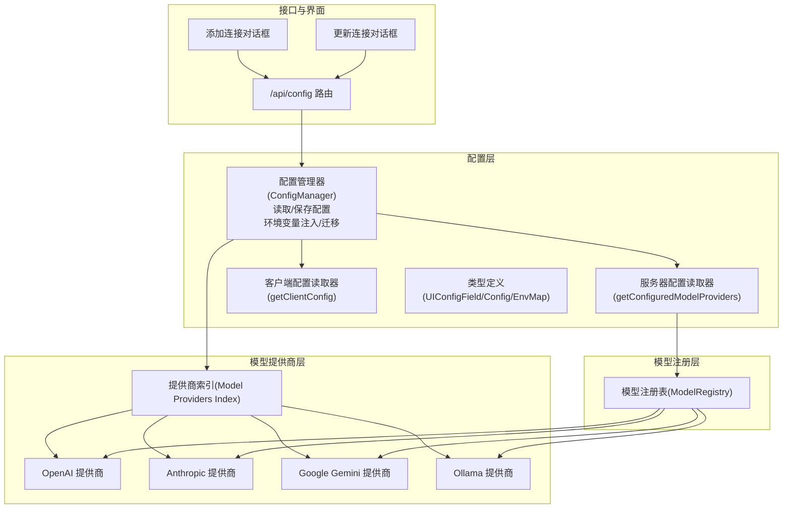
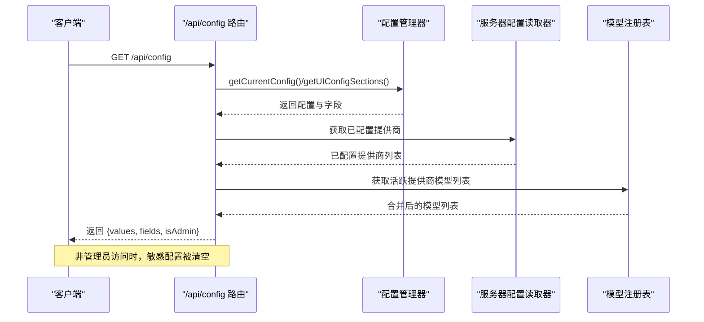
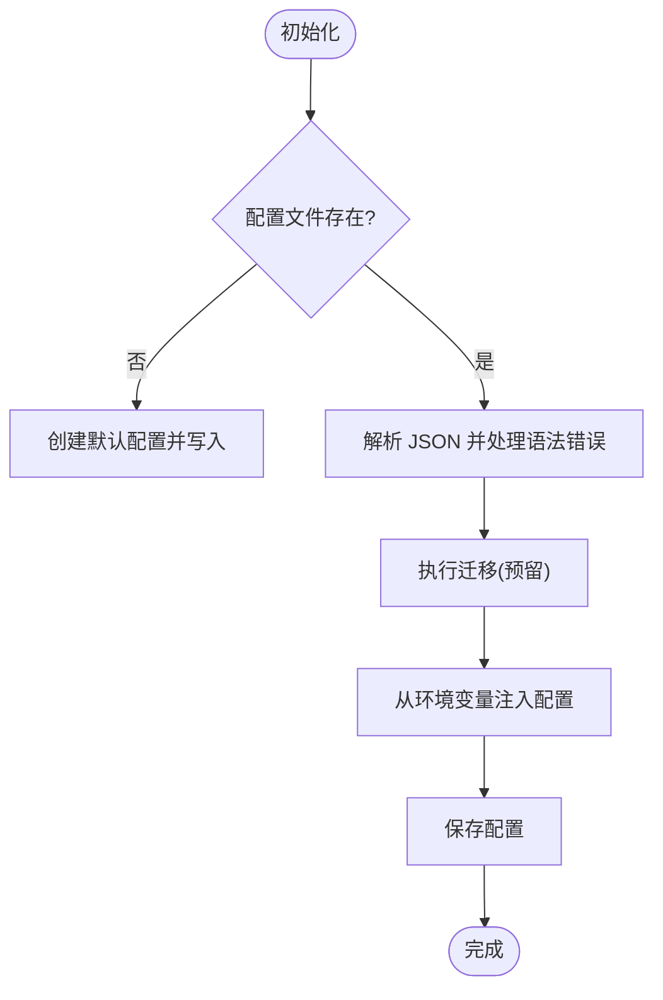
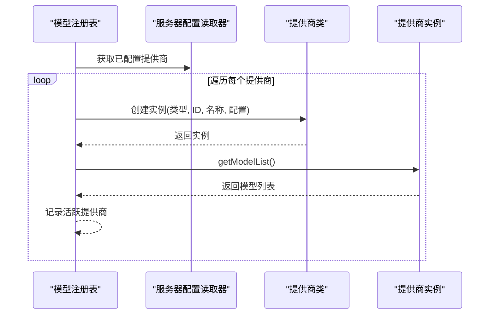
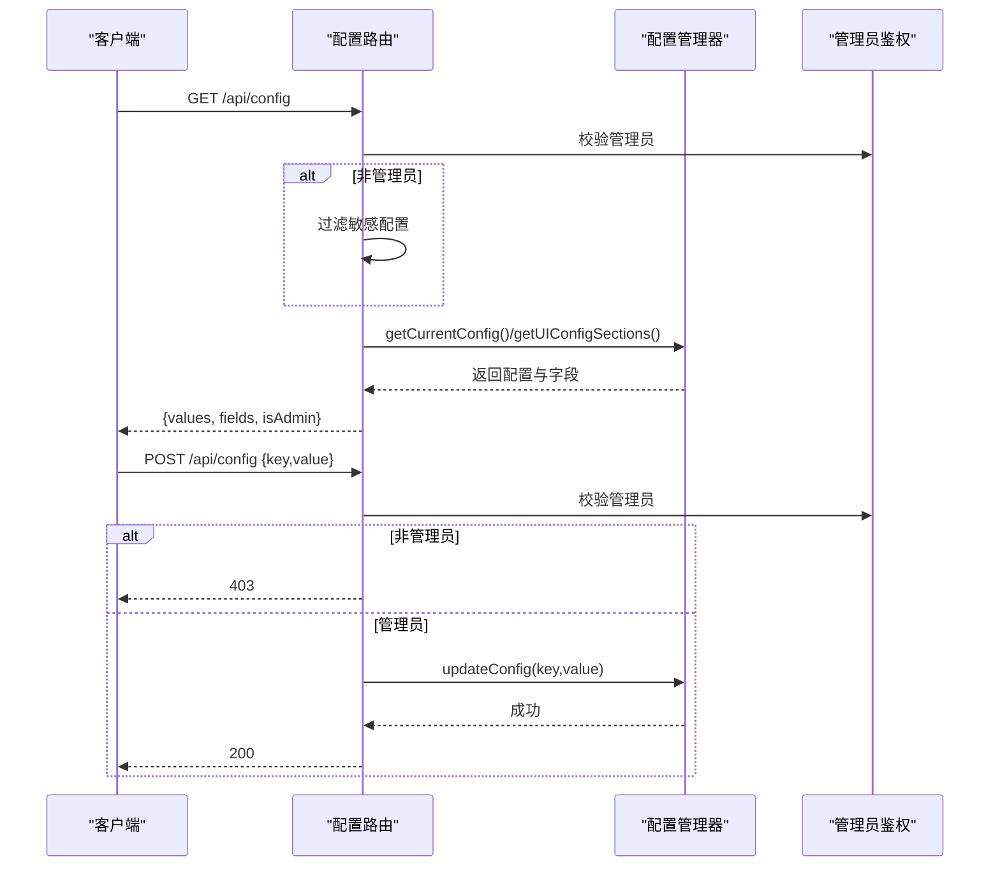
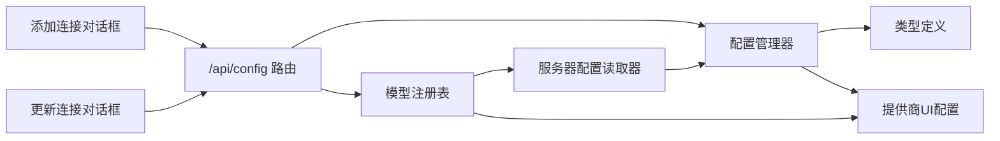

# 配置管理

<cite>
**本文引用的文件**
- [src/lib/config/index.ts](file://src/lib/config/index.ts)
- [src/lib/config/serverRegistry.ts](file://src/lib/config/serverRegistry.ts)
- [src/lib/config/clientRegistry.ts](file://src/lib/config/clientRegistry.ts)
- [src/lib/config/types.ts](file://src/lib/config/types.ts)
- [src/lib/models/providers/index.ts](file://src/lib/models/providers/index.ts)
- [src/lib/models/providers/openai/index.ts](file://src/lib/models/providers/openai/index.ts)
- [src/lib/models/providers/anthropic/index.ts](file://src/lib/models/providers/anthropic/index.ts)
- [src/lib/models/providers/gemini/index.ts](file://src/lib/models/providers/gemini/index.ts)
- [src/lib/models/providers/ollama/index.ts](file://src/lib/models/providers/ollama/index.ts)
- [src/lib/models/registry.ts](file://src/lib/models/registry.ts)
- [src/app/api/config/route.ts](file://src/app/api/config/route.ts)
- [src/components/Settings/Sections/Models/AddProviderDialog.tsx](file://src/components/Settings/Sections/Models/AddProviderDialog.tsx)
- [src/components/Settings/Sections/Models/UpdateProviderDialog.tsx](file://src/components/Settings/Sections/Models/UpdateProviderDialog.tsx)
- [.env.example](file://.env.example)
- [data/config.json](file://data/config.json)
</cite>

## 目录
1. [简介](#简介)
2. [项目结构](#项目结构)
3. [核心组件](#核心组件)
4. [架构总览](#架构总览)
5. [详细组件分析](#详细组件分析)
6. [依赖关系分析](#依赖关系分析)
7. [性能考量](#性能考量)
8. [故障排除指南](#故障排除指南)
9. [结论](#结论)
10. [附录](#附录)

## 简介
本文件系统性阐述 Perplexica 的配置管理系统：从服务器端与客户端配置的分层设计，到模型提供商的可插拔配置与校验机制；从环境变量映射与优先级策略，到配置持久化与动态更新流程；并提供 OpenAI、Anthropic、Google Gemini、Ollama 等主流 AI 服务的配置要点、环境变量清单与示例，以及安全与故障排除建议。

## 项目结构
配置系统围绕“配置管理器 + 提供商注册表 + 模型注册表 + UI 配置字段”组织，形成“读取/写入配置 → 注册可用提供商 → 动态加载模型”的闭环。

图表来源
- [src/lib/config/index.ts](file://src/lib/config/index.ts#L1-L391)
- [src/lib/config/serverRegistry.ts](file://src/lib/config/serverRegistry.ts#L1-L16)
- [src/lib/config/clientRegistry.ts](file://src/lib/config/clientRegistry.ts#L1-L30)
- [src/lib/config/types.ts](file://src/lib/config/types.ts#L1-L110)
- [src/lib/models/providers/index.ts](file://src/lib/models/providers/index.ts#L1-L36)
- [src/lib/models/providers/openai/index.ts](file://src/lib/models/providers/openai/index.ts#L1-L227)
- [src/lib/models/providers/anthropic/index.ts](file://src/lib/models/providers/anthropic/index.ts#L1-L116)
- [src/lib/models/providers/gemini/index.ts](file://src/lib/models/providers/gemini/index.ts#L1-L145)
- [src/lib/models/providers/ollama/index.ts](file://src/lib/models/providers/ollama/index.ts#L1-L137)
- [src/lib/models/registry.ts](file://src/lib/models/registry.ts#L1-L222)
- [src/app/api/config/route.ts](file://src/app/api/config/route.ts#L1-L111)
- [src/components/Settings/Sections/Models/AddProviderDialog.tsx](file://src/components/Settings/Sections/Models/AddProviderDialog.tsx#L1-L213)
- [src/components/Settings/Sections/Models/UpdateProviderDialog.tsx](file://src/components/Settings/Sections/Models/UpdateProviderDialog.tsx#L1-L185)

章节来源
- [src/lib/config/index.ts](file://src/lib/config/index.ts#L1-L391)
- [src/lib/config/types.ts](file://src/lib/config/types.ts#L1-L110)
- [src/lib/models/providers/index.ts](file://src/lib/models/providers/index.ts#L1-L36)

## 核心组件
- 配置管理器(ConfigManager)
  - 负责配置文件初始化、读取、保存、迁移与更新；支持按点号键路径读取与更新；支持添加/删除/更新模型提供商及其模型列表；暴露 UI 配置字段集合。
- 服务器配置读取器(serverRegistry)
  - 从配置中读取已配置的模型提供商与搜索服务地址。
- 客户端配置读取器(clientRegistry)
  - 从浏览器本地存储读取用户偏好与个性化设置。
- 类型定义(types)
  - 统一描述 UI 配置字段、配置对象、提供商配置项与 UI 分组结构。
- 模型提供商注册表(providers/index)
  - 汇总各提供商类，导出 UI 配置字段与元数据。
- 模型注册表(ModelRegistry)
  - 将已配置提供商实例化为可调用的模型提供者，并动态拉取模型列表。

章节来源
- [src/lib/config/index.ts](file://src/lib/config/index.ts#L7-L386)
- [src/lib/config/serverRegistry.ts](file://src/lib/config/serverRegistry.ts#L1-L16)
- [src/lib/config/clientRegistry.ts](file://src/lib/config/clientRegistry.ts#L1-L30)
- [src/lib/config/types.ts](file://src/lib/config/types.ts#L3-L110)
- [src/lib/models/providers/index.ts](file://src/lib/models/providers/index.ts#L1-L36)
- [src/lib/models/registry.ts](file://src/lib/models/registry.ts#L1-L222)

## 架构总览
配置系统采用“分层 + 可插拔”的架构：
- 服务器启动时，配置管理器从数据目录读取或创建配置文件，并从环境变量注入提供商与搜索配置；随后将配置持久化。
- UI 通过 /api/config 获取当前配置与 UI 字段定义；非管理员访问时，敏感配置被过滤。
- 添加/更新提供商通过管理接口完成，配置变更后立即生效，模型注册表异步刷新可用模型列表。

图表来源
- [src/app/api/config/route.ts](file://src/app/api/config/route.ts#L12-L64)
- [src/lib/config/index.ts](file://src/lib/config/index.ts#L240-L385)
- [src/lib/config/serverRegistry.ts](file://src/lib/config/serverRegistry.ts#L4-L15)
- [src/lib/models/registry.ts](file://src/lib/models/registry.ts#L37-L72)

## 详细组件分析

### 配置管理器(ConfigManager)
- 初始化与迁移
  - 若配置文件不存在则创建默认配置；若存在则解析并进行迁移（预留扩展点）。
- 环境变量注入
  - 从环境变量读取各提供商字段与搜索配置，自动补全未在 UI 中填写的字段；仅当字段必填且有对应环境变量时才视为已配置。
- 配置读取与更新
  - 支持点号路径读取与更新；更新后立即持久化。
- 模型提供商管理
  - 支持添加/删除/更新提供商；支持为提供商添加/删除聊天与嵌入模型；内部以哈希去重避免重复配置。
- 设置完成标记
  - 标记安装向导完成状态，便于引导流程控制。

图表来源
- [src/lib/config/index.ts](file://src/lib/config/index.ts#L135-L238)

章节来源
- [src/lib/config/index.ts](file://src/lib/config/index.ts#L119-L386)

### 服务器配置读取器(serverRegistry)
- 提供根据 ID 获取指定提供商的能力。
- 提供获取 SearXNG 地址的方法。

章节来源
- [src/lib/config/serverRegistry.ts](file://src/lib/config/serverRegistry.ts#L1-L16)

### 客户端配置读取器(clientRegistry)
- 从浏览器本地存储读取主题、测量单位、媒体搜索开关、天气/新闻小部件显示等偏好。
- 对部分字段提供兼容与默认值处理。

章节来源
- [src/lib/config/clientRegistry.ts](file://src/lib/config/clientRegistry.ts#L1-L30)

### 类型定义(types)
- UI 配置字段类型：字符串、选择、密码、文本域、开关。
- 配置对象结构：版本、安装完成标志、偏好、个性化、模型提供商数组、搜索配置。
- 提供商 UI 分组：名称、键、字段列表。
- 环境变量映射：用于将环境变量映射到配置字段。

章节来源
- [src/lib/config/types.ts](file://src/lib/config/types.ts#L3-L110)

### 模型提供商注册表(providers/index)
- 汇总所有提供商类，统一导出 UI 配置字段与元数据，供配置管理器在启动时注入默认配置。

章节来源
- [src/lib/models/providers/index.ts](file://src/lib/models/providers/index.ts#L1-L36)

### 模型注册表(ModelRegistry)
- 初始化阶段：遍历已配置提供商，尝试实例化并获取模型列表；失败时记录错误并返回占位信息。
- 动态操作：支持添加/更新/移除提供商；更新后重新实例化并刷新模型列表；支持按提供商 ID 加载聊天/嵌入模型。

图表来源
- [src/lib/models/registry.ts](file://src/lib/models/registry.ts#L17-L72)

章节来源
- [src/lib/models/registry.ts](file://src/lib/models/registry.ts#L1-L222)

### /api/config 路由
- GET：返回当前配置与 UI 字段；非管理员访问时清空敏感配置值，仅保留结构供前端展示。
- POST：管理员鉴权后更新指定配置键值；记录日志并返回结果。

图表来源
- [src/app/api/config/route.ts](file://src/app/api/config/route.ts#L12-L110)

章节来源
- [src/app/api/config/route.ts](file://src/app/api/config/route.ts#L1-L111)

### 添加/更新提供商对话框
- 添加连接：选择提供商类型，填写连接名称与字段，提交后调用管理接口添加提供商并刷新列表。
- 更新连接：基于已有字段与默认值初始化表单，提交后调用管理接口更新提供商。

章节来源
- [src/components/Settings/Sections/Models/AddProviderDialog.tsx](file://src/components/Settings/Sections/Models/AddProviderDialog.tsx#L1-L213)
- [src/components/Settings/Sections/Models/UpdateProviderDialog.tsx](file://src/components/Settings/Sections/Models/UpdateProviderDialog.tsx#L1-L185)

## 依赖关系分析
- 配置管理器依赖：
  - 类型定义：用于约束配置结构与 UI 字段。
  - 服务器工具：用于对配置对象进行哈希计算，避免重复配置。
  - 模型提供商 UI 配置：用于从提供商类收集字段与元数据。
- 服务器配置读取器依赖：
  - 配置管理器：通过其公共方法读取配置。
- 模型注册表依赖：
  - 服务器配置读取器：获取已配置提供商。
  - 提供商映射：根据类型创建实例。
- 路由依赖：
  - 配置管理器：读取与更新配置。
  - 模型注册表：动态获取模型列表。
- UI 对话框依赖：
  - 管理接口(adminFetch)：POST/PUT/PATCH 管理端点。

图表来源
- [src/lib/config/index.ts](file://src/lib/config/index.ts#L1-L391)
- [src/lib/config/serverRegistry.ts](file://src/lib/config/serverRegistry.ts#L1-L16)
- [src/lib/models/registry.ts](file://src/lib/models/registry.ts#L1-L222)
- [src/app/api/config/route.ts](file://src/app/api/config/route.ts#L1-L111)
- [src/components/Settings/Sections/Models/AddProviderDialog.tsx](file://src/components/Settings/Sections/Models/AddProviderDialog.tsx#L1-L213)
- [src/components/Settings/Sections/Models/UpdateProviderDialog.tsx](file://src/components/Settings/Sections/Models/UpdateProviderDialog.tsx#L1-L185)

章节来源
- [src/lib/config/index.ts](file://src/lib/config/index.ts#L1-L391)
- [src/lib/models/registry.ts](file://src/lib/models/registry.ts#L1-L222)
- [src/app/api/config/route.ts](file://src/app/api/config/route.ts#L1-L111)

## 性能考量
- 配置读取与保存
  - 采用同步文件写入，建议在高并发场景下避免频繁更新；批量更新优于多次细粒度更新。
- 模型列表获取
  - 某些提供商需远程查询模型列表，建议缓存结果并在配置变更后按需刷新。
- 初始化成本
  - 启动时会为每个已配置提供商创建实例并获取模型列表，建议控制提供商数量与模型列表规模。

[本节为通用指导，不直接分析具体文件]

## 故障排除指南
- 配置文件损坏
  - 现象：启动时报 JSON 解析错误。
  - 处理：配置管理器会捕获语法错误并回退到默认配置并覆盖原文件；检查数据目录权限与文件完整性。
- 环境变量未生效
  - 现象：添加提供商时提示未配置必要字段。
  - 处理：确认环境变量名与提供商字段映射一致；必要字段必须同时具备环境变量与默认值才会被视为已配置。
- 非管理员无法看到敏感配置
  - 现象：GET /api/config 返回的敏感配置为空。
  - 处理：这是预期行为；如需修改，请先完成管理员认证。
- 更新配置无效
  - 现象：POST /api/config 返回成功但未生效。
  - 处理：确认已通过管理员鉴权；检查配置键路径是否正确；重启服务以确保持久化生效。
- 模型加载失败
  - 现象：选择模型时报错或模型列表为空。
  - 处理：检查提供商配置（如 API Key、Base URL）是否正确；确认网络可达性；查看模型注册表日志输出。

章节来源
- [src/lib/config/index.ts](file://src/lib/config/index.ts#L144-L167)
- [src/app/api/config/route.ts](file://src/app/api/config/route.ts#L33-L50)
- [src/lib/models/registry.ts](file://src/lib/models/registry.ts#L29-L34)

## 结论
Perplexica 的配置管理以“可插拔提供商 + 环境变量注入 + 本地持久化”为核心，实现了灵活、安全且可扩展的配置体系。通过清晰的分层与严格的管理员鉴权，既能满足多厂商模型接入，又能保障敏感信息的安全。建议在生产环境中配合密钥轮换与最小权限原则，持续优化模型列表缓存与配置更新策略。

[本节为总结，不直接分析具体文件]

## 附录

### 配置优先级与覆盖机制
- 优先级顺序（从高到低）
  1) 环境变量：用于注入提供商字段与搜索配置，自动补全未在 UI 填写的字段。
  2) UI 配置：用户在设置界面填写的配置项。
  3) 默认值：字段定义中的默认值。
- 覆盖规则
  - 环境变量仅在字段为必填且存在时才视为已配置；否则回退到默认值。
  - UI 配置覆盖默认值；POST 更新配置覆盖 UI 配置。
  - 非管理员访问时，敏感配置值会被清空，仅保留结构。

章节来源
- [src/lib/config/index.ts](file://src/lib/config/index.ts#L175-L238)
- [src/app/api/config/route.ts](file://src/app/api/config/route.ts#L33-L50)

### 配置热重载与动态更新
- 热重载
  - 配置文件变更后，下次读取将反映最新内容；建议在更新后触发相关模块的重新初始化。
- 动态更新
  - 添加/更新提供商后，模型注册表会异步刷新模型列表；更新配置后立即持久化，重启后生效。

章节来源
- [src/lib/config/index.ts](file://src/lib/config/index.ts#L254-L272)
- [src/lib/models/registry.ts](file://src/lib/models/registry.ts#L94-L199)

### 环境变量与配置示例
- 管理员认证
  - ADMIN_PASSWORD：管理员访问设置页的密码。
- AI 模型提供商
  - OPENAI_API_KEY、OPENAI_BASE_URL
  - ANTHROPIC_API_KEY
  - GEMINI_API_KEY
  - DEEPSEEK_API_KEY、GROQ_API_KEY、AIML_API_KEY、LEMONADE_API_KEY
- 搜索配置
  - SEARXNG_API_URL：SearXNG 实例地址。
- 数据存储
  - DATA_DIR：数据目录路径，默认为工作目录。

章节来源
- [.env.example](file://.env.example#L1-L59)

### 模型提供商配置要点与字段
- OpenAI
  - 必填字段：apiKey、baseURL
  - 默认模型：根据 base URL 判断返回不同默认聊天与嵌入模型列表。
- Anthropic
  - 必填字段：apiKey
  - 默认模型：通过远程 API 获取可用模型列表。
- Google Gemini
  - 必填字段：apiKey
  - 默认模型：根据支持能力区分聊天与嵌入模型。
- Ollama
  - 必填字段：baseURL
  - 默认模型：通过本地 API 获取已安装模型列表。
- Transformers/Groq/Lemonade/LMStudio
  - 通过提供商索引统一注册，字段与校验逻辑遵循各自提供商类。

章节来源
- [src/lib/models/providers/openai/index.ts](file://src/lib/models/providers/openai/index.ts#L109-L131)
- [src/lib/models/providers/anthropic/index.ts](file://src/lib/models/providers/anthropic/index.ts#L13-L24)
- [src/lib/models/providers/gemini/index.ts](file://src/lib/models/providers/gemini/index.ts#L14-L25)
- [src/lib/models/providers/ollama/index.ts](file://src/lib/models/providers/ollama/index.ts#L14-L27)
- [src/lib/models/providers/index.ts](file://src/lib/models/providers/index.ts#L1-L36)

### 客户端配置字段
- 主题：light/dark
- 测量单位：Metric/Imperial
- 自动媒体搜索：开关
- 显示天气/新闻小部件：开关
- 系统指令：文本域（个性化）

章节来源
- [src/lib/config/index.ts](file://src/lib/config/index.ts#L23-L117)
- [src/lib/config/clientRegistry.ts](file://src/lib/config/clientRegistry.ts#L7-L29)

### 配置持久化与数据文件
- 数据文件位置
  - 默认位于数据目录下的 config.json；可通过 DATA_DIR 环境变量自定义。
- 初始内容
  - 包含版本、安装完成标志、偏好、个性化、模型提供商列表、搜索配置等。

章节来源
- [src/lib/config/index.ts](file://src/lib/config/index.ts#L8-L11)
- [data/config.json](file://data/config.json#L1-L41)