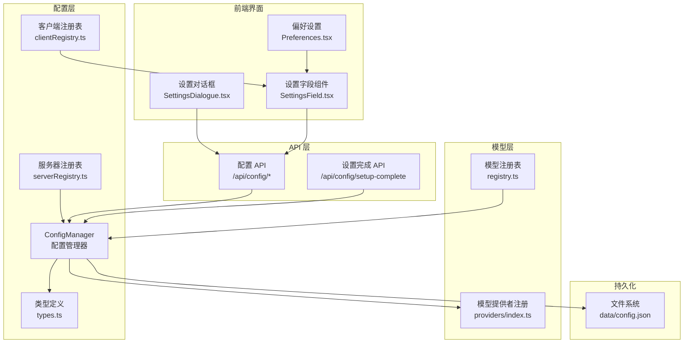
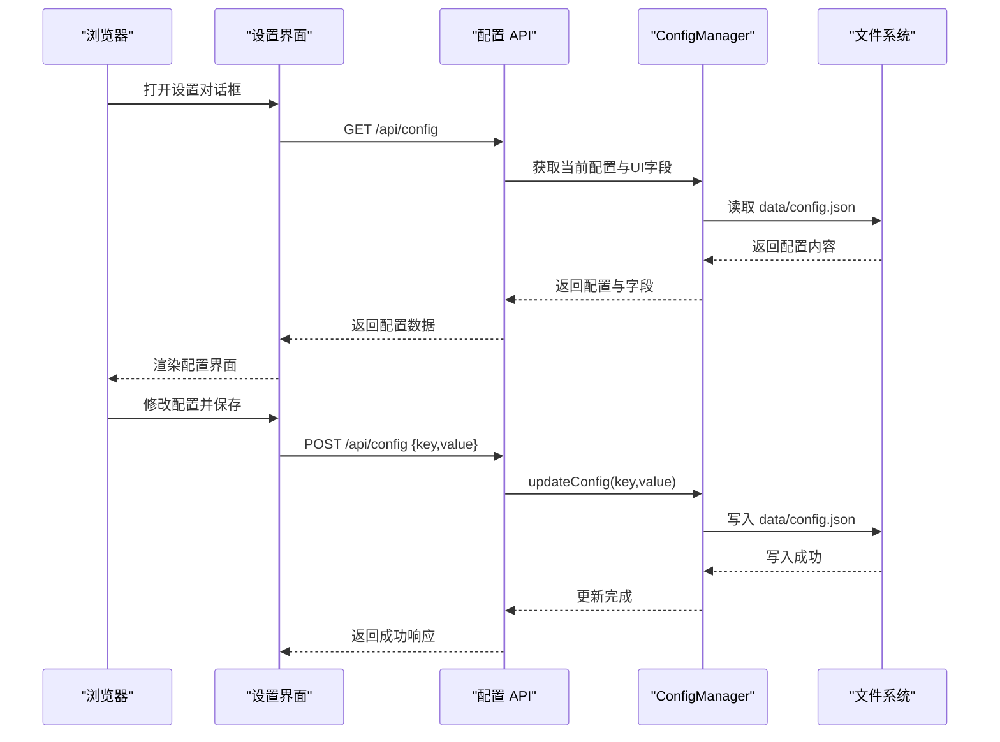
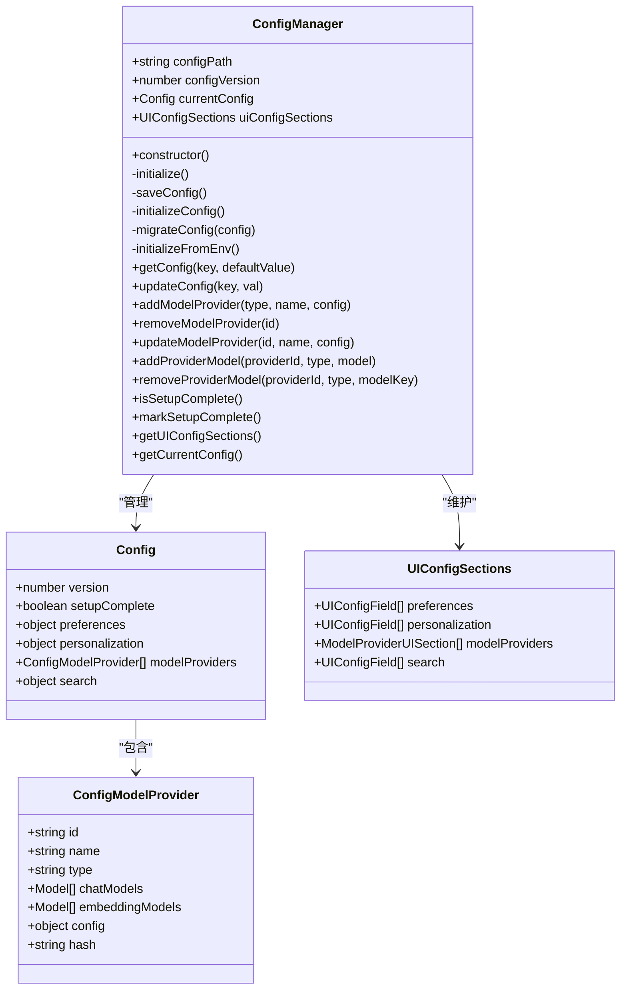
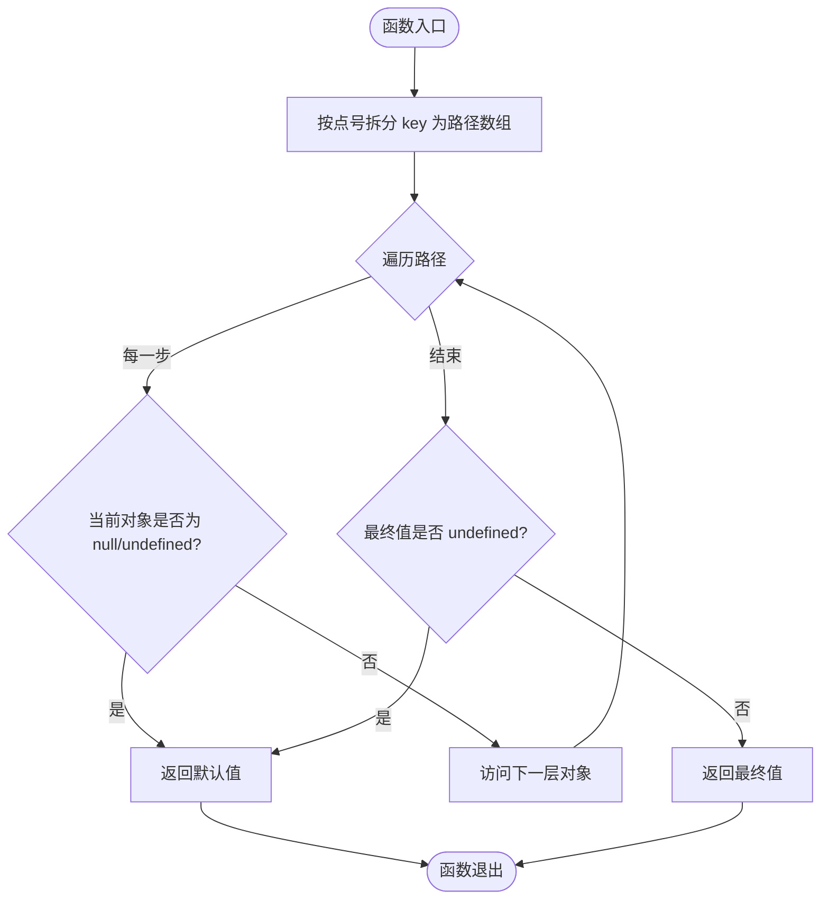
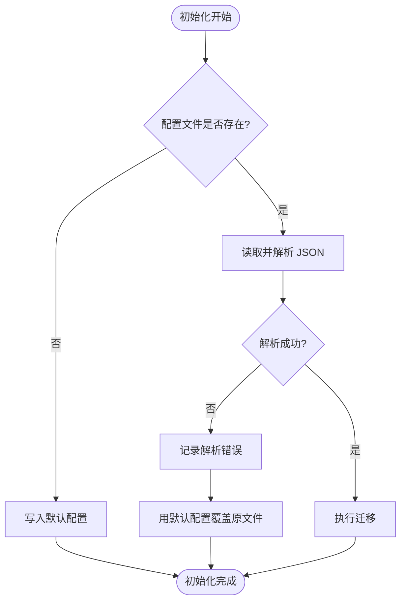
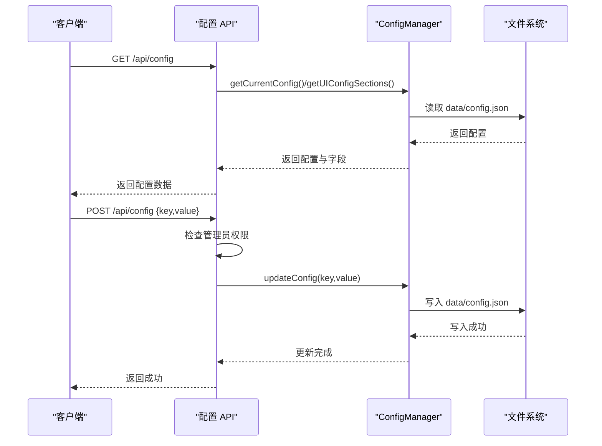
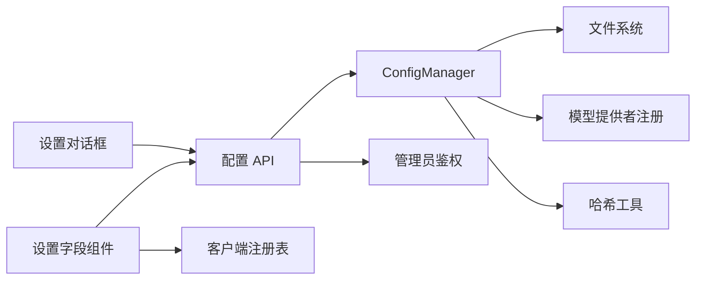

# 配置系统架构

<cite>
**本文档引用的文件**
- [src/lib/config/index.ts](file://src/lib/config/index.ts)
- [src/lib/config/types.ts](file://src/lib/config/types.ts)
- [src/lib/config/clientRegistry.ts](file://src/lib/config/clientRegistry.ts)
- [src/lib/config/serverRegistry.ts](file://src/lib/config/serverRegistry.ts)
- [src/app/api/config/route.ts](file://src/app/api/config/route.ts)
- [src/app/api/config/setup-complete/route.ts](file://src/app/api/config/setup-complete/route.ts)
- [src/lib/serverUtils.ts](file://src/lib/serverUtils.ts)
- [src/lib/models/providers/index.ts](file://src/lib/models/providers/index.ts)
- [src/lib/models/registry.ts](file://src/lib/models/registry.ts)
- [src/components/Settings/SettingsField.tsx](file://src/components/Settings/SettingsField.tsx)
- [src/components/Settings/SettingsDialogue.tsx](file://src/components/Settings/SettingsDialogue.tsx)
- [src/components/Settings/Sections/Preferences.tsx](file://src/components/Settings/Sections/Preferences.tsx)
- [data/config.json](file://data/config.json)
</cite>

## 目录
1. [简介](#简介)
2. [项目结构](#项目结构)
3. [核心组件](#核心组件)
4. [架构总览](#架构总览)
5. [详细组件分析](#详细组件分析)
6. [依赖关系分析](#依赖关系分析)
7. [性能考虑](#性能考虑)
8. [故障排除指南](#故障排除指南)
9. [结论](#结论)

## 简介
本文件面向开发者，系统性阐述 Perplexica 的配置系统架构与实现细节。重点围绕 ConfigManager 类的设计与实现，覆盖配置文件的初始化、读取、保存与迁移机制；解释配置的层级结构与嵌套访问模式（getConfig 与 updateConfig）；说明持久化存储（JSON 文件）与数据完整性保障；介绍版本管理与迁移策略；给出扩展点与自定义配置项的添加方法；并涵盖配置缓存、并发访问控制与错误处理的实现要点。目标是帮助开发者全面理解配置系统的整体架构与内部工作机制。

## 项目结构
配置系统主要由以下模块组成：
- 配置管理器：负责配置的初始化、读取、保存、迁移与模型提供者管理
- 类型定义：统一描述配置结构、UI 字段类型与模型提供者类型
- 客户端配置注册表：封装浏览器本地存储（localStorage）的读写
- 服务器端配置注册表：通过 ConfigManager 提供受保护的配置访问
- API 层：提供配置读取与更新的 HTTP 接口，并进行管理员鉴权
- 模型提供者注册：动态注入模型提供者的 UI 配置字段与环境变量映射
- 设置界面：前端设置对话框与字段组件，支持客户端与服务端配置的编辑

图表来源
- [src/lib/config/index.ts](file://src/lib/config/index.ts#L1-L391)
- [src/lib/config/types.ts](file://src/lib/config/types.ts#L1-L110)
- [src/lib/config/clientRegistry.ts](file://src/lib/config/clientRegistry.ts#L1-L30)
- [src/lib/config/serverRegistry.ts](file://src/lib/config/serverRegistry.ts#L1-L16)
- [src/app/api/config/route.ts](file://src/app/api/config/route.ts#L1-L111)
- [src/app/api/config/setup-complete/route.ts](file://src/app/api/config/setup-complete/route.ts#L1-L24)
- [src/lib/models/providers/index.ts](file://src/lib/models/providers/index.ts#L1-L36)
- [src/lib/models/registry.ts](file://src/lib/models/registry.ts#L1-L221)
- [src/components/Settings/SettingsDialogue.tsx](file://src/components/Settings/SettingsDialogue.tsx#L78-L313)
- [src/components/Settings/SettingsField.tsx](file://src/components/Settings/SettingsField.tsx#L1-L379)
- [src/components/Settings/Sections/Preferences.tsx](file://src/components/Settings/Sections/Preferences.tsx#L1-L29)
- [data/config.json](file://data/config.json#L1-L41)

章节来源
- [src/lib/config/index.ts](file://src/lib/config/index.ts#L1-L391)
- [src/lib/config/types.ts](file://src/lib/config/types.ts#L1-L110)
- [src/lib/config/clientRegistry.ts](file://src/lib/config/clientRegistry.ts#L1-L30)
- [src/lib/config/serverRegistry.ts](file://src/lib/config/serverRegistry.ts#L1-L16)
- [src/app/api/config/route.ts](file://src/app/api/config/route.ts#L1-L111)
- [src/app/api/config/setup-complete/route.ts](file://src/app/api/config/setup-complete/route.ts#L1-L24)
- [src/lib/models/providers/index.ts](file://src/lib/models/providers/index.ts#L1-L36)
- [src/lib/models/registry.ts](file://src/lib/models/registry.ts#L1-L221)
- [src/components/Settings/SettingsDialogue.tsx](file://src/components/Settings/SettingsDialogue.tsx#L78-L313)
- [src/components/Settings/SettingsField.tsx](file://src/components/Settings/SettingsField.tsx#L1-L379)
- [src/components/Settings/Sections/Preferences.tsx](file://src/components/Settings/Sections/Preferences.tsx#L1-L29)
- [data/config.json](file://data/config.json#L1-L41)

## 核心组件
- ConfigManager：配置系统的核心类，负责配置文件的初始化、读取、保存、迁移、模型提供者管理以及 UI 配置字段的构建与注入。
- 类型定义：统一的配置结构、UI 字段类型、模型提供者类型与 UI 配置分组类型，确保前后端一致的数据契约。
- 客户端注册表：封装 localStorage 的读取与默认值处理，用于客户端范围的用户偏好配置。
- 服务器注册表：通过 ConfigManager 提供受保护的配置访问接口，便于服务端逻辑安全地读取配置。
- API 层：提供配置读取（GET）与更新（POST）接口，结合管理员鉴权控制敏感配置的修改。
- 模型提供者注册：动态收集各模型提供者的 UI 配置字段与环境变量映射，自动注入到配置 UI 中。
- 设置界面：前端设置对话框与字段组件，支持客户端与服务端配置的编辑与保存。

章节来源
- [src/lib/config/index.ts](file://src/lib/config/index.ts#L7-L386)
- [src/lib/config/types.ts](file://src/lib/config/types.ts#L3-L110)
- [src/lib/config/clientRegistry.ts](file://src/lib/config/clientRegistry.ts#L1-L30)
- [src/lib/config/serverRegistry.ts](file://src/lib/config/serverRegistry.ts#L1-L16)
- [src/app/api/config/route.ts](file://src/app/api/config/route.ts#L1-L111)
- [src/lib/models/providers/index.ts](file://src/lib/models/providers/index.ts#L23-L36)

## 架构总览
配置系统采用“单实例管理 + 分层职责”的设计：
- 单实例：全局唯一的 ConfigManager 实例在应用启动时初始化，负责配置的生命周期管理。
- 初始化流程：优先检查配置文件是否存在，不存在则生成默认配置；存在则解析并执行迁移；随后从环境变量注入模型提供者与搜索配置。
- 读取与更新：提供 getConfig 支持点号路径访问；updateConfig 支持点号路径更新并自动保存。
- 持久化：配置以 JSON 文件形式存储于 data 目录，默认路径为 DATA_DIR 或工作目录下的 data/config.json。
- 安全控制：服务端配置（如搜索与模型提供者敏感信息）在非管理员模式下会被过滤或清空，避免泄露。
- 扩展性：通过模型提供者注册机制，可动态扩展新的提供者类型及其 UI 配置字段。

图表来源
- [src/app/api/config/route.ts](file://src/app/api/config/route.ts#L12-L64)
- [src/lib/config/index.ts](file://src/lib/config/index.ts#L240-L272)
- [data/config.json](file://data/config.json#L1-L41)

章节来源
- [src/lib/config/index.ts](file://src/lib/config/index.ts#L119-L168)
- [src/app/api/config/route.ts](file://src/app/api/config/route.ts#L12-L64)

## 详细组件分析

### ConfigManager 类设计与实现
ConfigManager 是配置系统的核心，承担以下职责：
- 配置文件初始化：检查 data/config.json 是否存在，不存在则生成默认配置；存在则解析并执行迁移。
- 环境变量注入：根据已注册的模型提供者 UI 字段，从环境变量中读取配置值并自动注入到配置中，同时计算哈希去重。
- 配置读取与更新：支持点号路径的嵌套访问与更新，自动保存到 JSON 文件。
- 模型提供者管理：提供添加、删除、更新模型提供者以及增删模型的能力。
- 设置完成标记：提供 setupComplete 标记，用于引导流程控制。
- UI 配置字段：维护 UI 配置分组（preferences、personalization、modelProviders、search），用于前端渲染。

关键实现要点：
- 路径与版本：配置文件路径由 DATA_DIR 或工作目录决定，版本号用于后续迁移策略。
- 默认配置：包含 version、setupComplete、preferences、personalization、modelProviders、search 等字段。
- 初始化顺序：先初始化配置文件，再从环境变量注入，最后执行迁移。
- 错误处理：解析 JSON 失败时输出错误日志并回退到默认配置，覆盖原文件。
- 迁移占位：当前迁移函数为空，预留未来版本升级时的迁移逻辑。

图表来源
- [src/lib/config/index.ts](file://src/lib/config/index.ts#L7-L386)
- [src/lib/config/types.ts](file://src/lib/config/types.ts#L63-L96)

章节来源
- [src/lib/config/index.ts](file://src/lib/config/index.ts#L7-L386)
- [src/lib/config/types.ts](file://src/lib/config/types.ts#L63-L96)

### 配置层级结构与嵌套访问模式
配置采用分层结构，顶层包含版本号、设置完成标志、偏好设置、个性化设置、模型提供者列表与搜索配置。每个子对象可进一步嵌套，支持通过点号路径进行访问与更新。

- getConfig(key, defaultValue)：将 key 按点号拆分为路径数组，逐层访问对象属性，若中间任一节点为 null 或 undefined，则返回默认值；若最终值未定义也返回默认值。
- updateConfig(key, val)：同样按点号拆分路径，逐层定位目标父对象，若某级不存在则创建空对象，最终设置叶子键值并立即保存到文件。

图表来源
- [src/lib/config/index.ts](file://src/lib/config/index.ts#L240-L252)

章节来源
- [src/lib/config/index.ts](file://src/lib/config/index.ts#L240-L252)

### 配置持久化存储机制与数据完整性
- 存储位置：默认位于 data/config.json，可通过 DATA_DIR 环境变量指定数据目录。
- 文件格式：JSON 格式，使用缩进格式化以便人工阅读与版本控制。
- 数据完整性：
  - 初始化阶段：若文件不存在，写入默认配置；若解析失败（语法错误），记录错误并用默认配置覆盖原文件，确保配置可用。
  - 更新阶段：每次 updateConfig 后立即同步写入文件，避免内存与磁盘不一致。
  - 迁移阶段：解析后调用迁移函数，预留未来版本升级时的迁移逻辑。

图表来源
- [src/lib/config/index.ts](file://src/lib/config/index.ts#L135-L168)
- [data/config.json](file://data/config.json#L1-L41)

章节来源
- [src/lib/config/index.ts](file://src/lib/config/index.ts#L135-L168)
- [data/config.json](file://data/config.json#L1-L41)

### 版本管理与迁移策略
- 版本号：配置对象包含 version 字段，当前为 1。
- 迁移策略：当前迁移函数为空，预留未来版本升级时的迁移逻辑。建议在迁移函数中：
  - 检查当前版本与目标版本
  - 对旧字段进行重命名、类型转换或删除
  - 保持向后兼容
  - 在迁移完成后更新版本号并保存

章节来源
- [src/lib/config/index.ts](file://src/lib/config/index.ts#L12-L166)

### 扩展点与自定义配置项添加方法
- 添加新的 UI 字段类型：在类型定义中扩展 UIConfigField 联合类型，新增字段类型并在 ConfigManager 的 UI 配置分组中添加相应字段。
- 注册模型提供者：在 providers/index.ts 中注册新的提供者构造函数，并在该提供者的静态方法中返回配置字段与元数据。ConfigManager 会自动收集这些字段并注入到 UI 配置中。
- 环境变量映射：在提供者字段定义中设置 env 字段，ConfigManager 将从环境变量读取对应值并注入到配置中。
- 服务端配置过滤：在 API 层，非管理员模式下会过滤掉服务端敏感配置（如搜索配置与模型提供者敏感字段），前端仅显示结构而不显示具体值。

章节来源
- [src/lib/config/types.ts](file://src/lib/config/types.ts#L3-L51)
- [src/lib/config/types.ts](file://src/lib/config/types.ts#L85-L89)
- [src/lib/models/providers/index.ts](file://src/lib/models/providers/index.ts#L23-L36)
- [src/lib/config/index.ts](file://src/lib/config/index.ts#L175-L238)
- [src/app/api/config/route.ts](file://src/app/api/config/route.ts#L33-L50)

### 配置缓存、并发访问控制与错误处理
- 缓存：ConfigManager 在内存中维护 currentConfig，避免频繁读取磁盘；每次更新后立即保存到磁盘，确保一致性。
- 并发访问：当前实现未显式加锁，但在单进程 Node.js 环境中，文件写入是同步操作，避免了竞态条件。若需多进程或多实例部署，建议引入文件锁或集中式配置中心。
- 错误处理：
  - 初始化解析失败：捕获语法错误，记录错误并用默认配置覆盖原文件。
  - 更新失败：任何异常都会被上层 API 捕获并返回 500 错误。
  - 权限不足：非管理员更新配置时返回 403。
  - 前端保存失败：SettingsField 组件在保存失败时显示错误提示并保持本地状态不变。

章节来源
- [src/lib/config/index.ts](file://src/lib/config/index.ts#L143-L164)
- [src/app/api/config/route.ts](file://src/app/api/config/route.ts#L66-L110)
- [src/components/Settings/SettingsField.tsx](file://src/components/Settings/SettingsField.tsx#L110-L140)

### API 工作流与权限控制
- GET /api/config：返回当前配置与 UI 字段；非管理员模式下过滤服务端敏感配置。
- POST /api/config：管理员鉴权后允许更新配置；校验 key 与 value 必填；调用 ConfigManager.updateConfig 并保存。
- POST /api/config/setup-complete：标记设置完成。

图表来源
- [src/app/api/config/route.ts](file://src/app/api/config/route.ts#L12-L110)
- [src/lib/config/index.ts](file://src/lib/config/index.ts#L240-L272)
- [data/config.json](file://data/config.json#L1-L41)

章节来源
- [src/app/api/config/route.ts](file://src/app/api/config/route.ts#L12-L110)
- [src/app/api/config/setup-complete/route.ts](file://src/app/api/config/setup-complete/route.ts#L4-L23)

### 前端设置界面与客户端配置
- 客户端配置：通过 SettingsField 组件与 SettingsDialogue 组件实现，支持选择、输入、文本域、开关等 UI 字段类型。
- 客户端存储：客户端配置直接写入 localStorage，无需网络请求；支持主题切换、测量单位、媒体搜索、天气与新闻小部件等偏好。
- 事件通知：客户端配置变更时触发自定义事件，通知其他组件更新 UI。

章节来源
- [src/components/Settings/SettingsField.tsx](file://src/components/Settings/SettingsField.tsx#L15-L19)
- [src/components/Settings/SettingsField.tsx](file://src/components/Settings/SettingsField.tsx#L110-L140)
- [src/components/Settings/SettingsDialogue.tsx](file://src/components/Settings/SettingsDialogue.tsx#L90-L121)
- [src/components/Settings/Sections/Preferences.tsx](file://src/components/Settings/Sections/Preferences.tsx#L1-L29)
- [src/lib/config/clientRegistry.ts](file://src/lib/config/clientRegistry.ts#L1-L30)

## 依赖关系分析
- ConfigManager 依赖：
  - 文件系统：用于读写 data/config.json
  - 模型提供者注册：动态注入 UI 配置字段与环境变量映射
  - 哈希工具：对提供者配置进行哈希以去重
- API 层依赖：
  - ConfigManager：提供配置读取与更新能力
  - 管理员鉴权：限制敏感配置的修改权限
- 前端依赖：
  - ConfigManager：通过 API 获取配置
  - SettingsField：负责字段渲染与保存
  - clientRegistry：客户端配置读取

图表来源
- [src/lib/config/index.ts](file://src/lib/config/index.ts#L1-L391)
- [src/app/api/config/route.ts](file://src/app/api/config/route.ts#L1-L111)
- [src/lib/config/clientRegistry.ts](file://src/lib/config/clientRegistry.ts#L1-L30)
- [src/lib/serverUtils.ts](file://src/lib/serverUtils.ts#L3-L7)
- [src/lib/models/providers/index.ts](file://src/lib/models/providers/index.ts#L1-L36)

章节来源
- [src/lib/config/index.ts](file://src/lib/config/index.ts#L1-L391)
- [src/app/api/config/route.ts](file://src/app/api/config/route.ts#L1-L111)
- [src/lib/config/clientRegistry.ts](file://src/lib/config/clientRegistry.ts#L1-L30)
- [src/lib/serverUtils.ts](file://src/lib/serverUtils.ts#L3-L7)
- [src/lib/models/providers/index.ts](file://src/lib/models/providers/index.ts#L1-L36)

## 性能考虑
- 内存与磁盘一致性：ConfigManager 在内存中维护配置，每次更新后同步写入，避免多次磁盘 IO。
- JSON 解析成本：初始化阶段一次性解析，后续读取直接从内存访问，降低解析开销。
- 前端本地存储：客户端配置使用 localStorage，避免网络请求，提升交互响应速度。
- 迁移成本：当前迁移为空，未来迁移应尽量幂等且避免大对象深拷贝。

## 故障排除指南
- 配置文件损坏：
  - 现象：解析 JSON 抛出语法错误
  - 处理：系统会记录错误并用默认配置覆盖原文件
  - 建议：检查 data/config.json 格式，必要时手动修复或删除后重启应用
- 权限不足：
  - 现象：更新配置返回 403
  - 处理：确认管理员身份与鉴权令牌
- 保存失败：
  - 现象：前端显示保存失败提示
  - 处理：检查网络连接与 API 可用性，查看浏览器控制台错误
- 模型提供者不可用：
  - 现象：模型注册失败或模型列表为空
  - 处理：检查提供者配置与 API 密钥，确认网络连通性

章节来源
- [src/lib/config/index.ts](file://src/lib/config/index.ts#L143-L164)
- [src/app/api/config/route.ts](file://src/app/api/config/route.ts#L66-L110)
- [src/components/Settings/SettingsField.tsx](file://src/components/Settings/SettingsField.tsx#L110-L140)

## 结论
Perplexica 的配置系统以 ConfigManager 为核心，实现了配置文件的初始化、读取、保存与迁移；通过点号路径支持灵活的嵌套访问与更新；采用 JSON 文件持久化并具备基本的数据完整性保障；通过管理员鉴权与 UI 分组实现安全可控的配置管理；并通过模型提供者注册机制实现良好的扩展性。当前版本在迁移与并发控制方面留有改进空间，建议在未来版本中完善迁移策略与多实例部署下的并发控制方案。