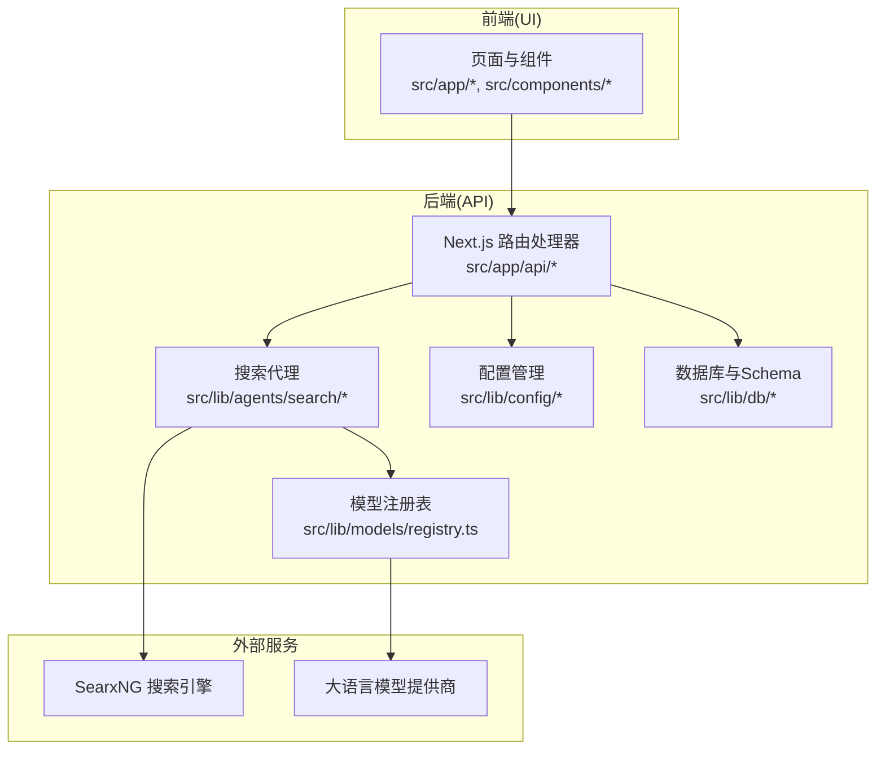
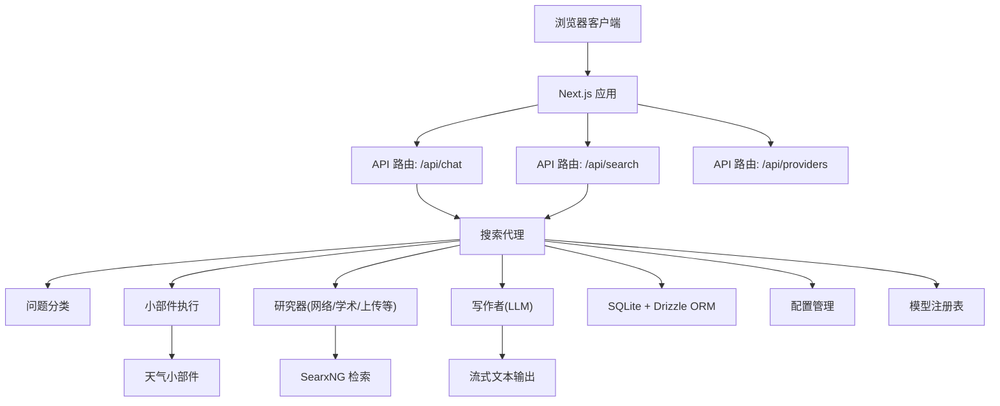
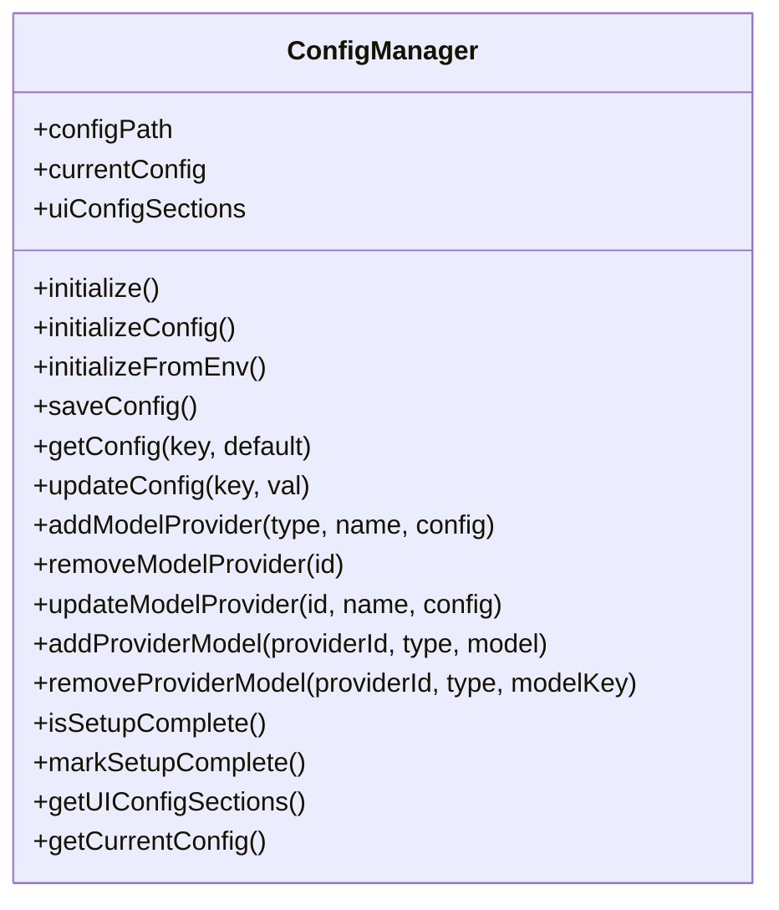
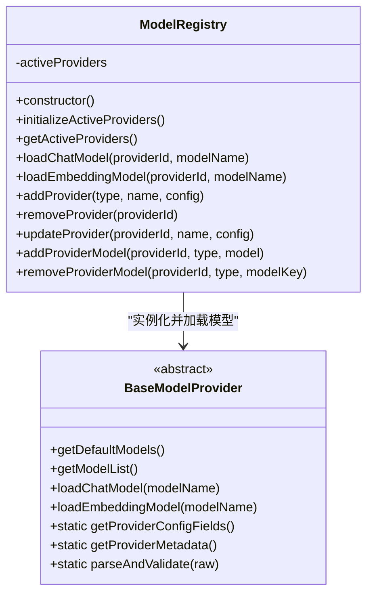
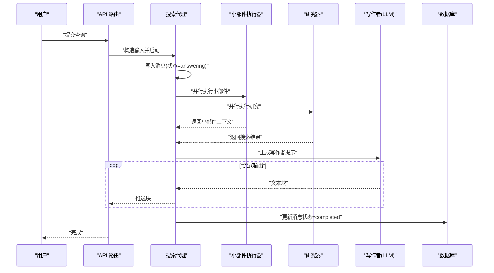
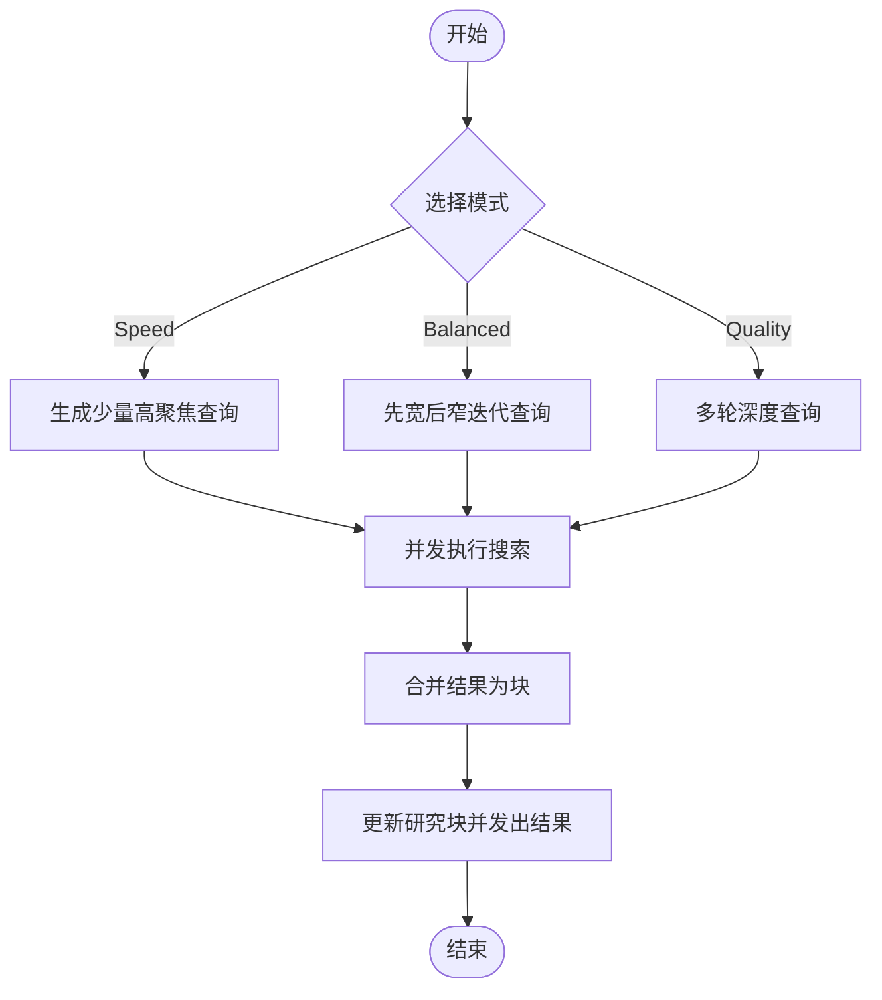
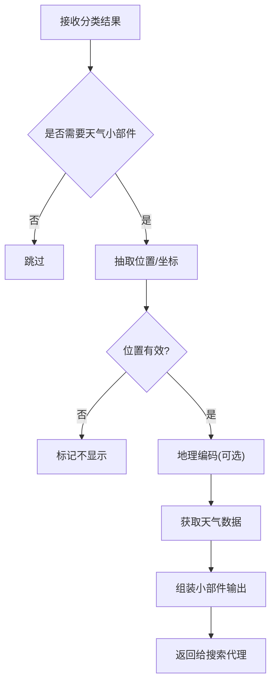
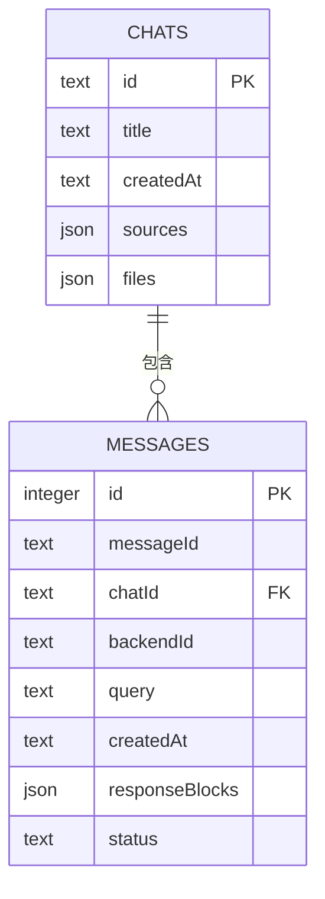
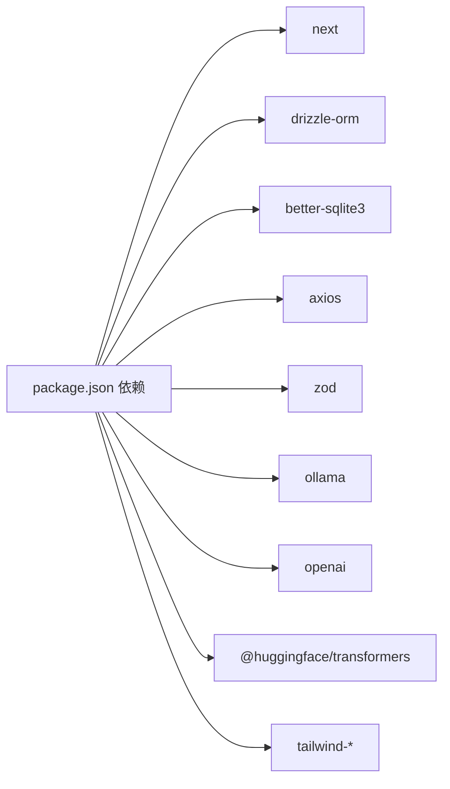

# 项目概述

<cite>
**本文引用的文件**
- [README.md](file://README.md)
- [CONTRIBUTING.md](file://CONTRIBUTING.md)
- [package.json](file://package.json)
- [data/config.json](file://data/config.json)
- [src/lib/config/index.ts](file://src/lib/config/index.ts)
- [src/lib/db/schema.ts](file://src/lib/db/schema.ts)
- [src/lib/models/registry.ts](file://src/lib/models/registry.ts)
- [src/lib/models/base/provider.ts](file://src/lib/models/base/provider.ts)
- [src/lib/agents/search/index.ts](file://src/lib/agents/search/index.ts)
- [src/lib/agents/search/researcher/actions/webSearch.ts](file://src/lib/agents/search/researcher/actions/webSearch.ts)
- [src/lib/agents/search/widgets/weatherWidget.ts](file://src/lib/agents/search/widgets/weatherWidget.ts)
- [src/lib/searxng.ts](file://src/lib/searxng.ts)
- [src/app/layout.tsx](file://src/app/layout.tsx)
- [next.config.mjs](file://next.config.mjs)
- [docs/architecture/README.md](file://docs/architecture/README.md)
</cite>

## 目录
1. [引言](#引言)
2. [项目结构](#项目结构)
3. [核心组件](#核心组件)
4. [架构总览](#架构总览)
5. [详细组件分析](#详细组件分析)
6. [依赖关系分析](#依赖关系分析)
7. [性能考量](#性能考量)
8. [故障排查指南](#故障排查指南)
9. [结论](#结论)
10. [附录](#附录)

## 引言
Perplexica 是一款以隐私为中心的 AI 答疑引擎，可在本地硬件上完全离线运行。它将海量互联网知识与本地 LLM（如 Ollama）及云端提供商（OpenAI、Anthropic Claude、Google Gemini、Groq 等）相结合，提供带来源引用的精准答案，同时确保用户的搜索行为完全私密。项目支持多种智能搜索模式、多模态输入输出、实时流式响应，并通过 SearxNG 提供隐私保护的网络检索。

本概述面向初学者与进阶开发者，既提供易懂的功能介绍，也深入到技术架构与实现细节，帮助读者快速理解并参与贡献。

## 项目结构
项目采用 Next.js 应用目录结构（App Router），前端使用 TypeScript/React，后端逻辑集中在 src/lib 下，API 路由位于 src/app/api。数据库采用 SQLite，ORM 使用 Drizzle，配置持久化于 data/config.json。核心模块包括：配置管理、模型注册表、搜索代理、研究工具链、小部件系统、SearxNG 集成、会话与消息存储等。

图表来源
- [src/app/layout.tsx](file://src/app/layout.tsx#L27-L59)
- [src/lib/agents/search/index.ts](file://src/lib/agents/search/index.ts#L12-L186)
- [src/lib/config/index.ts](file://src/lib/config/index.ts#L7-L390)
- [src/lib/db/schema.ts](file://src/lib/db/schema.ts#L6-L38)
- [src/lib/models/registry.ts](file://src/lib/models/registry.ts#L8-L221)
- [src/lib/searxng.ts](file://src/lib/searxng.ts#L21-L53)

章节来源
- [CONTRIBUTING.md](file://CONTRIBUTING.md#L7-L24)
- [docs/architecture/README.md](file://docs/architecture/README.md#L1-L39)

## 核心组件
- 配置管理器：负责读取/写入 data/config.json，支持环境变量注入、迁移与 UI 配置项生成；提供增删改查模型提供商与模型列表的能力。
- 模型注册表：统一加载与管理不同提供商的聊天/嵌入模型，支持动态添加、更新与移除。
- 搜索代理：串联“分类—并行执行小部件—研究—写作”流程，支持流式输出与消息持久化。
- 研究动作：如网络搜索（Web Search），按速度/平衡/质量三种模式生成查询策略并聚合结果。
- 小部件：如天气小部件，根据对话上下文自动抽取位置信息并调用外部 API 获取数据。
- SearxNG 集成：封装搜索请求参数与结果解析，支持多源检索与建议词返回。
- 数据库 Schema：定义消息与会话表结构，支持 JSON 字段存储块化响应与文件/来源元数据。

章节来源
- [src/lib/config/index.ts](file://src/lib/config/index.ts#L7-L390)
- [src/lib/models/registry.ts](file://src/lib/models/registry.ts#L8-L221)
- [src/lib/agents/search/index.ts](file://src/lib/agents/search/index.ts#L12-L186)
- [src/lib/agents/search/researcher/actions/webSearch.ts](file://src/lib/agents/search/researcher/actions/webSearch.ts#L59-L182)
- [src/lib/agents/search/widgets/weatherWidget.ts](file://src/lib/agents/search/widgets/weatherWidget.ts#L53-L203)
- [src/lib/searxng.ts](file://src/lib/searxng.ts#L21-L53)
- [src/lib/db/schema.ts](file://src/lib/db/schema.ts#L6-L38)

## 架构总览
Perplexica 的整体架构围绕“隐私优先 + 本地运行 + 多源检索 + 流式回答”的目标设计。前端基于 Next.js，后端通过 API 路由处理请求；搜索代理负责编排研究与小部件执行；模型注册表抽象不同提供商的接口；数据库持久化会话与消息；SearxNG 提供隐私检索能力。

图表来源
- [docs/architecture/README.md](file://docs/architecture/README.md#L13-L38)
- [src/lib/agents/search/index.ts](file://src/lib/agents/search/index.ts#L12-L186)
- [src/lib/searxng.ts](file://src/lib/searxng.ts#L21-L53)
- [src/lib/db/schema.ts](file://src/lib/db/schema.ts#L6-L38)
- [src/lib/config/index.ts](file://src/lib/config/index.ts#L7-L390)
- [src/lib/models/registry.ts](file://src/lib/models/registry.ts#L8-L221)

## 详细组件分析

### 组件一：配置管理器（ConfigManager）
职责与特性
- 初始化与迁移：首次运行创建默认配置文件；解析现有配置并进行迁移。
- 环境变量注入：从环境变量读取提供商配置字段，自动填充 UI 配置项。
- 动态增删改：支持添加/删除/更新模型提供商及其模型列表；计算哈希去重。
- 客户端/服务端作用域：区分 UI 展示与服务端运行所需的配置键。

图表来源
- [src/lib/config/index.ts](file://src/lib/config/index.ts#L7-L390)

章节来源
- [src/lib/config/index.ts](file://src/lib/config/index.ts#L7-L390)
- [data/config.json](file://data/config.json#L1-L41)

### 组件二：模型注册表（ModelRegistry）
职责与特性
- 统一加载：根据已配置的提供商类型实例化对应 Provider，并获取可用模型列表。
- 并发获取：异步并发拉取各提供商模型清单，提升初始化效率。
- 生命周期管理：支持动态添加/更新/移除提供商与模型，保证运行时可扩展性。

图表来源
- [src/lib/models/registry.ts](file://src/lib/models/registry.ts#L8-L221)
- [src/lib/models/base/provider.ts](file://src/lib/models/base/provider.ts#L6-L45)

章节来源
- [src/lib/models/registry.ts](file://src/lib/models/registry.ts#L8-L221)
- [src/lib/models/base/provider.ts](file://src/lib/models/base/provider.ts#L6-L45)

### 组件三：搜索代理（SearchAgent）
职责与特性
- 会话与持久化：在消息表中记录每次问答状态与分块内容，支持后续重放。
- 并行执行：问题分类后，小部件与研究器并行执行，提高响应速度。
- 写作者：将搜索结果与小部件上下文拼接为最终提示，驱动 LLM 生成流式回答。
- 结束与归档：完成回答后更新消息状态与块集合，便于历史回溯。

图表来源
- [src/lib/agents/search/index.ts](file://src/lib/agents/search/index.ts#L12-L186)

章节来源
- [src/lib/agents/search/index.ts](file://src/lib/agents/search/index.ts#L12-L186)

### 组件四：网络搜索动作（Web Search Action）
职责与特性
- 模式化查询：根据速度/平衡/质量三种模式生成关键词查询队列。
- 并发检索：对每个查询并发发起 SearxNG 请求，聚合结果为块。
- 进度反馈：在研究块中记录子步骤，向会话广播中间结果。

图表来源
- [src/lib/agents/search/researcher/actions/webSearch.ts](file://src/lib/agents/search/researcher/actions/webSearch.ts#L59-L182)
- [src/lib/searxng.ts](file://src/lib/searxng.ts#L21-L53)

章节来源
- [src/lib/agents/search/researcher/actions/webSearch.ts](file://src/lib/agents/search/researcher/actions/webSearch.ts#L59-L182)
- [src/lib/searxng.ts](file://src/lib/searxng.ts#L21-L53)

### 组件五：天气小部件（Weather Widget）
职责与特性
- 上下文抽取：从对话历史与用户输入中抽取地点或坐标。
- 地理编码与天气：调用 OpenStreetMap 与 Open-Meteo 获取天气数据。
- 结构化输出：返回小部件类型、LLM 上下文与可视化数据。

图表来源
- [src/lib/agents/search/widgets/weatherWidget.ts](file://src/lib/agents/search/widgets/weatherWidget.ts#L53-L203)

章节来源
- [src/lib/agents/search/widgets/weatherWidget.ts](file://src/lib/agents/search/widgets/weatherWidget.ts#L53-L203)

### 组件六：数据库 Schema（Chats/Messages）
职责与特性
- 消息表：保存消息 ID、所属会话、后端会话 ID、原始查询、时间戳、状态、块化响应与状态。
- 会话表：保存会话标题、创建时间、来源列表与文件列表（JSON 字段）。

图表来源
- [src/lib/db/schema.ts](file://src/lib/db/schema.ts#L6-L38)

章节来源
- [src/lib/db/schema.ts](file://src/lib/db/schema.ts#L6-L38)

## 依赖关系分析
- 技术栈选择
  - 前端：Next.js（App Router）、React、TailwindCSS、TypeScript
  - 后端：Node.js（Next.js 运行时）、Drizzle ORM + better-sqlite3
  - 搜索：SearxNG（可选 Exa/Tavily 集成）
  - 模型：OpenAI、Anthropic、Google Gemini、Groq、Ollama、Transformers 等
- 关键依赖
  - next、react、react-dom、@radix-ui/react-tooltip、@phosphor-icons/react、tailwind-merge、zod、axios、drizzle-orm、better-sqlite3、ollama、openai、@huggingface/transformers 等
- 构建与部署
  - 支持 Docker 一键部署，Next.js 输出为 standalone，优化生产体积与运行时性能

图表来源
- [package.json](file://package.json#L13-L53)
- [next.config.mjs](file://next.config.mjs#L4-L24)

章节来源
- [package.json](file://package.json#L13-L53)
- [next.config.mjs](file://next.config.mjs#L4-L24)

## 性能考量
- 并行执行：搜索代理对小部件与研究器采用并发策略，缩短首字节时间。
- 流式输出：写作者以流式方式推送文本块，改善感知延迟。
- 数据库批处理：消息状态与块集合一次性更新，减少往返次数。
- 依赖裁剪：Next.js standalone 输出与 optional 依赖（如 @napi-rs/canvas）按需打包，降低容器体积。
- 模型并发：模型注册表并发拉取模型列表，缩短初始化时间。

## 故障排查指南
- 本地 OpenAI 兼容服务未配置
  - 确认服务监听在 0.0.0.0，API URL 与模型名称正确，API Key 不为空。
- Ollama 连接错误
  - Windows/Mac 使用 host.docker.internal:11434；Linux 需将 Ollama 暴露至网络并检查防火墙。
- Lemonade 连接错误
  - 确认 Lemonade 服务运行且监听 0.0.0.0:8000，必要时调整端口并放通防火墙。
- SearxNG 设置
  - 确保启用 JSON 格式与 Wolfram Alpha 引擎；若使用自建实例，设置 SEARXNG_API_URL。

章节来源
- [README.md](file://README.md#L166-L213)

## 结论
Perplexica 以“隐私优先 + 本地运行 + 多源检索 + 流式回答”为核心理念，结合 Next.js 前端与 Drizzle/SQLite 后端，构建了可扩展、可维护的搜索增强型聊天系统。其模块化设计（配置、模型、搜索代理、研究动作、小部件）使功能演进与集成更加灵活；同时通过 Docker 化部署与环境变量注入，降低了安装与运维门槛。未来将持续引入更多搜索来源、小部件与认证机制，进一步完善生态与用户体验。

## 附录
- 安装与部署
  - 推荐使用 Docker 快速部署；非容器方式需先准备 SearxNG 并允许 JSON 格式与 Wolfram Alpha。
- 开发与贡献
  - 使用 npm run dev 启动开发服务器；遵循代码格式化与测试实践；参考贡献指南定位修改范围。
- 社区与支持
  - 提供 GitHub Issues 与 Discord 社区支持；欢迎通过赞助与捐赠支持项目持续发展。

章节来源
- [README.md](file://README.md#L77-L164)
- [CONTRIBUTING.md](file://CONTRIBUTING.md#L60-L82)